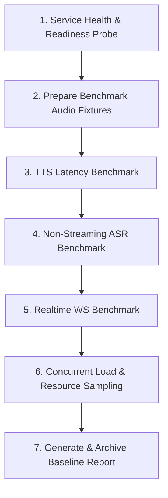

# SpeechRail Performance Benchmarking & Resource Profiling Skill

This skill guides agents through executing standard performance benchmarks, measuring end-to-end latency, real-time factor (RTF), concurrent throughput, and accurately monitoring Apple Silicon physical memory/Metal footprint using macOS native tools on SpeechRail.

---

## 1. Core Benchmarking Principles

1. **Real Hardware & Native Metrics**:
   - On macOS Apple Silicon, **never rely on `ps aux` RSS** for model memory, as it omits MLX/Metal unified memory allocations.
   - **Always use `footprint -p <pid> -f bytes`** to capture `phys_footprint` and `phys_footprint_peak`.
2. **Warm-up Before Measuring**:
   - Run at least 1 warm-up inference iteration across ASR and TTS to fault-in model weights and compile Metal kernels before sampling baseline metrics.
3. **No Network Downloads**:
   - Benchmarking must run entirely against local pre-loaded models (`asr_ready=true`, `tts_ready=true`).
4. **Standard Audio Durations**:
   - Standard test suite evaluates across 4 audio lengths: **3s (short)**, **10s (medium)**, **30s (long)**, and **60s (extra long)**.
   - Fixtures are synthesized by local TTS, so the *actual* duration follows the text's natural speaking rate (e.g. ~3s / ~8s / ~16s / ~35s, not a strict 3/10/30/60s). Always compute RTF against the `ffprobe`-measured duration, never the nominal label.
5. **API-key Authentication**:
   - When the service is bound to a non-loopback address with `SPEECHRAIL_API_KEY` enabled, `/v1/audio/*` and `/v1/realtime` require the key. `/health`, `/readyz`, `/v1/models` are open.
   - Export `SPEECHRAIL_API_KEY` in the environment; the bundled scripts (`bench_asr.py`, `bench_tts.py`, `bench_realtime.py`, `sample_resources.py`, `prepare_fixtures.py`) honor it via `auth_headers()` / `os.environ`. Subprocesses spawned by `run_all_benchmarks.py` inherit it automatically.
   - Without the key the ASR/TTS/Realtime steps return **401 Unauthorized** — do not try to bypass by disabling auth.

---

## 2. Standard Benchmark Workflow



### Step 1: Verify Service Readiness

Ensure the SpeechRail service is active and backends are ready:
```bash
curl -s http://127.0.0.1:8201/health | jq .
curl -s http://127.0.0.1:8201/readyz | jq .
```
*Criteria:* `/health` returns `asr_ready: true`, `tts_ready: true`; `/readyz` returns 200.

### Step 2: Generate Standard Test Audio Fixtures

Generate consistent benchmark WAV (16kHz Mono) and PCM fixtures dynamically via TTS:
```bash
python3 -c "
import urllib.request, json, wave, subprocess

texts = {
    'audio_3s': '你好，这是本地语音识别与合成。',
    'audio_10s': '你好，这是本地语音识别与合成服务的性能基准测试。SpeechRail 能够快速高效地输出高品质语音。',
    'audio_30s': 'SpeechRail 是一个本地优先的语音识别与合成服务。它为各种本地智能体和对话应用提供稳定可靠的 ASR 与 TTS 接口。在单人使用场景下，它具备极低的延迟与极致的资源控制能力。',
    'audio_60s': 'SpeechRail 是一个本地优先的语音识别与合成服务。它为各种本地智能体和对话应用提供稳定可靠的 ASR 与 TTS 接口。在单人使用场景下，它具备极低的延迟与极致的资源控制能力。通过模块化设计与细粒度显存治理，SpeechRail 可以在 macOS 苹果芯片设备上长时间稳定运行，无需担心内存泄漏或显存溢出。无论长音频转写还是极速流式交互，都能游刃有余。'
}

for name, text in texts.items():
    req = urllib.request.Request(
        'http://127.0.0.1:8201/v1/audio/speech',
        data=json.dumps({'model':'speechrail/qwen3-tts','input':text,'voice':'default','response_format':'pcm'}).encode(),
        headers={'Content-Type':'application/json'}
    )
    with urllib.request.urlopen(req) as resp:
        pcm_data = resp.read()
    
    wav24 = f'/tmp/{name}_24k.wav'
    with wave.open(wav24, 'wb') as wf:
        wf.setnchannels(1); wf.setsampwidth(2); wf.setframerate(24000)
        wf.writeframes(pcm_data)
    
    wav16 = f'/tmp/{name}.wav'
    pcm16 = f'/tmp/{name}_16k.pcm'
    subprocess.run(['ffmpeg', '-y', '-i', wav24, '-ar', '16000', '-ac', '1', wav16], check=True, capture_output=True)
    subprocess.run(['ffmpeg', '-y', '-i', wav16, '-f', 's16le', '-ac', '1', '-ar', '16000', pcm16], check=True, capture_output=True)
    print(f'Generated {name}: {wav16}')
"
```

### Step 3: Run Speech Synthesis (TTS) Benchmark

Evaluate short sentence (20 chars) and long sentence (50 chars) latency & RTF:
```bash
# 1. Short sentence (20 chars)
python3 examples/perf/bench_tts.py --text "你好, 这是本地语音合成服务的性能测试。" --repeat 3

# 2. Long sentence (50 chars)
python3 examples/perf/bench_tts.py --text "你好，这是本地语音识别与合成服务的性能基准测试。SpeechRail 能够快速高效地输出高品质语音。" --repeat 3
```

### Step 4: Run REST ASR Benchmark

Evaluate single-request latency across audio durations and multi-worker concurrent throughput:
```bash
# 1. Single request latency (3s, 10s, 30s, 60s)
python3 examples/perf/bench_asr.py --audio /tmp/audio_3s.wav /tmp/audio_10s.wav /tmp/audio_30s.wav /tmp/audio_60s.wav --n 3

# 2. Concurrent throughput (4 workers, 8 requests)
python3 examples/perf/bench_asr.py --audio /tmp/audio_10s.wav --workers 4 --n 8
```

### Step 5: Run OpenAI Realtime WebSocket Benchmark

Measure session handshake setup, ASR commit latency, and TTS first audio delta (TTFA):
```bash
# Note: Use Python environment with 'openai' SDK installed
/Users/hrygo/.qwenpaw/venv/bin/python examples/perf/bench_realtime.py /tmp/audio_10s_16k.pcm --sessions 3
```

### Step 6: Sample Process Footprint & CPU Under Load

Execute end-to-end continuous resource monitoring during load:
```bash
python3 examples/perf/sample_resources.py --audio /tmp/audio_30s.wav --mode all --n 5 --warmup
```

## 3. Bundled Benchmark Scripts

This skill bundles turnkey execution scripts located in `scripts/`:

| 脚本文件 | 用途 | 运行命令示例 |
|---|---|---|
| **`scripts/prepare_fixtures.py`** | 自动通过本地 TTS 合成 3s、10s、30s、60s 标准 16kHz WAV 和 PCM 样本 | `python3 .agents/skills/speechrail-perf-benchmark/scripts/prepare_fixtures.py` |
| **`scripts/run_all_benchmarks.py`** | 一键全自动串行执行全部 7 项标准性能与资源压测流水线 | `python3 .agents/skills/speechrail-perf-benchmark/scripts/run_all_benchmarks.py` |

---

## 4. Reporting & Baseline Maintenance

When completing a benchmark run:
1. **Archive Full Report**: Write the comprehensive baseline document to `docs/archive/performance/YYYY-MM-DD-v<version>-performance-benchmark.md`.
2. **Update README.md**: Sync key metric highlights (Memory footprint, ASR RTF, TTS TTFA, Concurrency) into the **⚡ 性能基线与资源实测** section of `README.md`.
3. **Verify Git Diff**: Ensure only markdown baseline docs and README are staged before committing.

### Memory Attribution Debugging

A surprising elevation in a worker's resident footprint (e.g. an ASR batch worker jumping from ~2.5 GB to ~4.7 GB across versions) is **NOT** automatically caused by `/metrics` observation buffers. Follow this fixed order before writing any cause into a report:

1. **Check `SPEECHRAIL_DTYPE`** — the ASR worker inherits it (`float16` vs `int8`). Make sure a `float16` load was not mis-attributed; check the worker `--dtype` in `ps`.
2. **Check metal cache clearing** — `_clear_metal_cache()` in `qwen3_worker.py` must prefer the non-deprecated `mx.clear_cache()` over the legacy `mx.metal.clear_cache()`. The legacy branch exists but has been a no-op since mlx 0.32, so previously the Metal cache was *not* actually freed on trim, leaving ~2.2 GB unnecessarily resident. This was the true v1.6.2 regression, fixed in 1.6.3.
3. **Check streaming-worker dtype inheritance** — `Qwen3StreamingBackendConfig.command()` must forward `dtype` / `cache_limit_mb` / `memory_limit_mb`; otherwise a streaming worker silently runs `float16` with an unbounded Metal cache and balloons to ~5 GB instead of staying `int8` at ~2.6 GB.
4. **Only then** consider `/metrics` buffers or other instrumentation as a secondary contributor.

Write the report with the measured `ps`/`footprint` numbers and the exact root cause; never say an unverified buffer is the cause. Mark findings as measured vs inferred.
