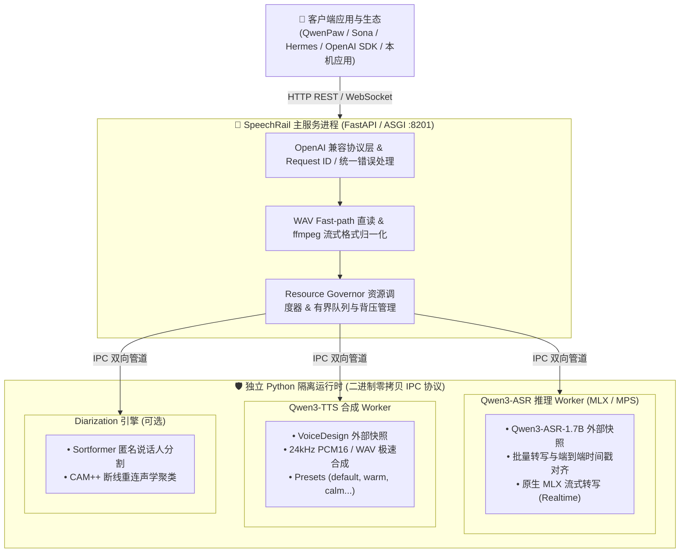

# SpeechRail 🚂

<p align="center">
  <strong>面向本机应用的高性能、隐私优先、OpenAI 契约兼容的独立语音识别 (ASR) 与合成 (TTS) 运行时服务</strong>
</p>

<p align="center">
  
  
  
  
  
</p>

---

## 📖 目录

- [✨ 核心特性](#-核心特性)
- [🏗️ 架构概览](#️-架构概览)
- [💻 硬件与环境要求](#-硬件与环境要求)
- [⚡ 3分钟快速上手](#-3分钟快速上手)
- [🔌 客户端与 SDK 接入](#-客户端与-sdk-接入)
- [📡 API 规范与端点](#-api-规范与端点)
- [⚙️ 配置说明](#️-配置说明)
- [🛠️ macOS 服务常驻与运维](#️-macos-服务常驻与运维)
- [🔒 安全与隐私边界](#-安全与隐私边界)
- [📚 文档导航](#-文档导航)
- [📄 开源许可](#-开源许可)

---

## ✨ 核心特性

- 🔒 **本地优先与绝对隐私（Local-First & Offline）**：零云端外呼，严格使用仓库外本地模型快照；服务运行期间严禁自动联网下载模型；音频与转写文本仅在内存有界处理，不留存源音频。
- ⚡ **Apple Silicon 深度优化（MLX & MPS）**：针对 Mac 芯片统一内存架构深度调优，非流式与流式 ASR 统一采用原生 `mlx-qwen3-asr` 与 MPS (`float16`/`int8`)，具备 WAV 零开销 Fast-path 直读与动态 Token 预算，低延迟、低显存占用。
- 🔌 **开箱即用的 OpenAI 协议兼容**：
  - 文件转写：`/v1/audio/transcriptions`（支持 OpenAI 官方 SDK、`whisper-1` 别名）。
  - 语音合成：`/v1/audio/speech`（支持 `tts-1` 别名，输出 24 kHz 高品质音频）。
  - 双向流式：`/v1/realtime`（标准 OpenAI Realtime WebSocket 协议，支持 `client.realtime.connect`）。
- ⏱️ **端到端时间戳对齐**：原生输出句子级与词级对齐时间戳，支持 `verbose_json`、`srt`、`vtt` 及 `timestamp_granularities`，无需额挂载外置 forced-aligner。
- 👥 **实时声纹分割（Speaker Diarization）**：集成 Sortformer 与 CAM++，支持流式对话场景下的匿名说话人分离与重连声学聚类。
- 🛡️ **进程隔离与资源守卫（Resource Governor）**：主服务（FastAPI）与推理后端（Worker）通过二进制零拷贝 IPC 协议进行进程级隔离；内置配额管控与背压机制，单机多任务不争抢、不崩溃。

---

## 🏗️ 架构概览



---

## 💻 硬件与环境要求

| 组件 | 最低要求 | 推荐配置 | 备注 |
|---|---|---|---|
| **操作系统** | macOS 14 (Sonoma) | macOS 15 (Sequoia)+ | 针对 Apple Silicon 统一内存优化 |
| **处理器** | Apple Silicon M1/M2/M3/M4 | M 系列 Pro / Max / Ultra | 默认使用 `mps` / `float16` |
| **统一内存** | 16 GB | 24 GB ~ 32 GB+ | ASR(~3GB) + TTS(~3GB) + 主进程预留显存约 8~12GB |
| **系统依赖** | Python 3.12, `ffmpeg`, `uv` | 最新版 `brew` 工具链 | `ffmpeg` 必须在系统 `PATH` 中 |
| **存储空间** | 15 GB 可用空间 | 30 GB+ 高速 SSD | 用于存放外部模型快照与隔离虚拟环境 |

---

## ⚡ 3分钟快速上手

### 1. 克隆仓库并安装主环境依赖

```bash
git clone https://github.com/hrygo/SpeechRail.git
cd SpeechRail
uv sync --extra dev
```

### 2. 准备配置 `.env`

从示例配置复制并设置权限（禁止提交真实模型路径与密钥）：

```bash
cp configs/speechrail.example.env .env
chmod 600 .env
```

编辑 `.env` 中的核心路径（模型 Snapshot 存放在项目外部）：

```env
SPEECHRAIL_HOST=127.0.0.1
SPEECHRAIL_PORT=8201
SPEECHRAIL_DEVICE=mps
SPEECHRAIL_DTYPE=float16

# ASR 运行时（Qwen3-ASR-1.7B 权重目录与专用 Python）
SPEECHRAIL_QWEN3_MODEL_DIR=/absolute/path/to/Qwen3-ASR-1.7B
SPEECHRAIL_QWEN3_PYTHON=/absolute/path/to/qwen3-asr-venv/bin/python

# TTS 运行时（可选，VoiceDesign 权重目录与专用 Python）
SPEECHRAIL_QWEN3_TTS_MODEL_DIR=/absolute/path/to/Qwen3-TTS
SPEECHRAIL_QWEN3_TTS_PYTHON=/absolute/path/to/qwen3-tts-venv/bin/python
```

### 3. 启动服务与健康检查

```bash
# 前台启动
uv run speechrail serve
```

在另一终端验证服务就绪：

```bash
curl http://127.0.0.1:8201/health
curl http://127.0.0.1:8201/readyz
curl http://127.0.0.1:8201/v1/models
```

---

## 🔌 客户端与 SDK 接入

### 1. cURL 示例

#### 🎙️ 音频文件转写（带时间戳与词对齐）
```bash
curl -X POST http://127.0.0.1:8201/v1/audio/transcriptions \
  -F "file=@meeting.wav" \
  -F "model=whisper-1" \
  -F "language=zh" \
  -F "response_format=verbose_json" \
  -F "timestamp_granularities[]=segment" \
  -F "timestamp_granularities[]=word"
```

#### 🔊 文本转语音 (TTS)
```bash
curl -X POST http://127.0.0.1:8201/v1/audio/speech \
  -H "Content-Type: application/json" \
  -d '{
    "model": "tts-1",
    "input": "欢迎使用 SpeechRail 语音运行时服务。",
    "voice": "warm",
    "response_format": "wav"
  }' \
  --output speech.wav
```

---

### 2. 官方 OpenAI Python SDK 接入

由于完全遵循 OpenAI API 规范，只需指定 `base_url` 即可无缝接入：

```python
from openai import OpenAI

client = OpenAI(
    base_url="http://127.0.0.1:8201/v1",
    api_key="not-needed-for-loopback"
)

# 1. ASR 文件转写
with open("sample.wav", "rb") as audio_file:
    transcript = client.audio.transcriptions.create(
        model="whisper-1",
        file=audio_file,
        response_format="verbose_json",
        timestamp_granularities=["segment", "word"]
    )
    print("转写文本:", transcript.text)
    print("分段详情:", transcript.segments)

# 2. TTS 语音合成
response = client.audio.speech.create(
    model="tts-1",
    voice="calm",
    input="SpeechRail 为您的本地应用提供强大的语音动力。"
)
response.stream_to_file("output.mp3")
```

---

### 3. 生态集成

- **QwenPaw**：在设置中选择 `whisper_api` 提供商，Base URL 设置为 `http://127.0.0.1:8201/v1`，模型使用 `speechrail/qwen3-asr-1.7b` 或 `whisper-1`。
- **Sona (Voice-Realtime)**：通过 `/v1/realtime` WebSocket 端点对接流式会议转写与声纹分离。
- **Hermes Agent**：使用专用 STT 模块直连 SpeechRail REST 接口。

---

## 📡 API 规范与端点

| 方法 | 路径 | 描述 | 支持格式 / 参数 |
|---|---|---|---|
| `GET` | `/health` | 进程存活检查与组件诊断 | 返回各 Worker 进程存活状态与配置信息 |
| `GET` | `/readyz` | 推理就绪状态检查 | 确认 ASR/TTS 引擎已预热并可接受流量 (HTTP 200) |
| `GET` | `/v1/models` | 模型清单与别名路由 | 列出 Canonical 模型名与 `whisper-1` 等兼容别名 |
| `GET` | `/v1/voices` | 注册的 TTS 音色列表 | 返回 `default`, `warm`, `bright`, `calm` 及可用性 |
| `POST` | `/v1/audio/transcriptions` | OpenAI 兼容文件转写 | `json`, `verbose_json`, `text`, `srt`, `vtt` |
| `POST` | `/v1/audio/speech` | OpenAI 兼容语音合成 | `mp3`, `wav`, `pcm` (24kHz 16-bit Mono) |
| `POST/GET/DELETE` | `/v1/jobs` | 异步任务 Spool 管理 | 提交长任务元数据、查询状态与取消任务 |
| `WS` | `/v1/realtime` | OpenAI Realtime WebSocket | 实时音频流式转写、合成与说话人分割 |

完整接口协议与错误码定义请参阅 [OpenAPI 契约文件](contracts/openapi.yaml) 与 [Realtime 契约](contracts/realtime-openai.md)。

---

## ⚙️ 配置说明

所有配置均通过环境变量或 `.env` 进行注入，主要配置组如下：

| 配置项 | 默认值 | 说明 |
|---|---|---|
| `SPEECHRAIL_HOST` / `PORT` | `127.0.0.1:8201` | 服务绑定地址与端口 |
| `SPEECHRAIL_DEVICE` / `DTYPE` | `mps` / `float16` | 推理硬件与数据类型（支持 `mps/float16` 或 `cpu/float32`） |
| `SPEECHRAIL_QWEN3_MODEL_DIR` | *(必填)* | 仓库外 Qwen3-ASR-1.7B 权重绝对路径 |
| `SPEECHRAIL_QWEN3_PYTHON` | *(必填)* | 隔离的 ASR Worker Python 虚拟环境路径 |
| `SPEECHRAIL_QWEN3_TTS_MODEL_DIR` | *(可选)* | 仓库外 Qwen3-TTS 权重绝对路径 |
| `SPEECHRAIL_QWEN3_TTS_PYTHON` | *(可选)* | 隔离的 TTS Worker Python 虚拟环境路径 |
| `SPEECHRAIL_REALTIME_ASR_BACKEND` | `disabled` | 流式后端：`disabled` 或 `native` (复用 MLX 运行时) |
| `SPEECHRAIL_DIARIZATION_MODEL_PATH` | *(可选)* | Sortformer 声纹分割模型 `.nemo` 路径 |
| `SPEECHRAIL_MAX_QUEUE_SIZE` | `8` | 最大并发等待队列数 |
| `SPEECHRAIL_MAX_UPLOAD_BYTES` | `536870912` (512MB) | 单次文件上传最大体积限制 |
| `SPEECHRAIL_REQUEST_TIMEOUT_SECONDS` | `120` | 单次推理 Worker 超时硬截断（秒） |

完整配置字段请参考 [`configs/speechrail.example.env`](file:///Users/hrygo/Documents/SpeechRail/configs/speechrail.example.env)。

---

## 🛠️ macOS 服务常驻与运维

SpeechRail 内建了专为 macOS `launchd` 设计的用户级服务管理工具（无需 root 权限）：

```bash
# 1. 安装 LaunchAgent 配置文件（写入 ~/Library/LaunchAgents/com.speechrail.plist）
uv run speechrail service install

# 2. 启用并启动常驻后台服务
uv run speechrail service enable

# 3. 查看服务状态与 PID
uv run speechrail service status

# 4. 重启服务
uv run speechrail service restart

# 5. 停止服务 / 卸载服务
uv run speechrail service disable
uv run speechrail service uninstall
```

详细运维操作、多机器 Wheel 打包迁移及故障回滚方案请参阅 [📖 运维操作手册](docs/operations/operations-runbook.md)。

---

## 🔒 安全与隐私边界

1. **零外网依赖与离线执行**：模型权重完全本地化读取，服务请求路径强制开启 `HF_HUB_OFFLINE=1` 与 `TRANSFORMERS_OFFLINE=1`。
2. **音频数据即用即弃**：源音频仅在内存中处理，解码后立即转入推理流，不写入任何磁盘临时文件，日志中绝不打印原始转写正文与音频片段。
3. **网络访问控制**：默认仅监听 `127.0.0.1` Loopback 地址；若需局域网暴露，必须显式配置 `SPEECHRAIL_API_KEY`，并通过请求头 `Authorization: Bearer <key>` 鉴权。

---

## 📚 文档导航

- 🚀 **[用户与集成指南](docs/users/README.md)**：各客户端集成方案、SDK 示例与常见使用答疑。
- 🛠️ **[开发者与贡献指南](docs/developers/README.md)**：代码规范、单元测试、契约测试与本地调试。
- 📦 **[运维与部署手册](docs/operations/README.md)**：LaunchAgent、Wheel 发布打包、版本回滚与故障诊断。
- 🏛️ **[系统架构与设计](docs/architecture/README.md)**：系统边界、调度模型与协议状态机。
- 📜 **[架构决策记录 (ADR)](docs/decisions/README.md)**：收录项目重大设计决策历史。

---

## 📄 开源许可

本项目基于 [MIT License](LICENSE) 开源发布。
