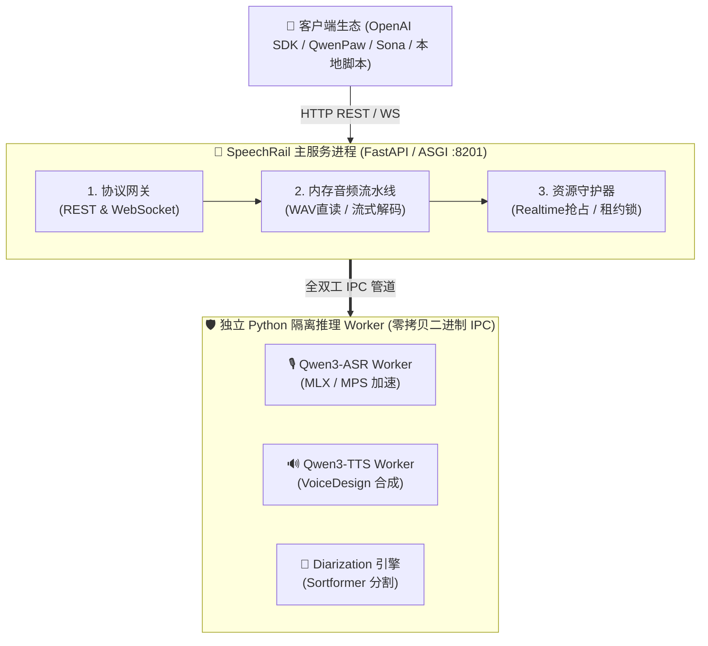

# SpeechRail 🚂

<p align="center">
  <strong>本地常驻的高性能、隐私优先、兼容 OpenAI 协议的独立语音识别 (ASR) 与合成 (TTS) 服务</strong>
</p>

<p align="center">
  <a href="https://github.com/hrygo/SpeechRail/actions/workflows/ci.yml"></a>
  <a href="https://github.com/hrygo/SpeechRail/releases"></a>
  
  
  
  
  
  
  
  <a href="LICENSE"></a>
</p>

SpeechRail 是一套**本地优先**的语音识别与合成服务，为 QwenPaw、`sona`、Hermes Agent 及任何 OpenAI 兼容客户端提供稳定、低延迟、隐私安全的 ASR/TTS 接口。

---

## 📖 目录

- [✨ 核心特性](#-核心特性)
- [🚀 快速开始](#-快速开始)
- [🏗️ 架构概览](#-架构概览)
- [💻 硬件与环境要求](#-硬件与环境要求)
- [🧩 支持的模型规格](#-支持的模型规格)
- [🎯 精度语义与权重文件格式](#-精度语义与权重文件格式)
- [⚡ 性能基线与资源实测](#-性能基线与资源实测)
- [🔌 客户端与 SDK 接入](#-客户端与-sdk-接入)
- [📡 API 规范与端点](#-api-规范与端点)
- [⚙️ 核心配置项说明](#-核心配置项说明)
- [🛠️ macOS 服务常驻与运维](#-macos-服务常驻与运维)
- [🔒 安全与隐私边界](#-安全与隐私边界)
- [📚 文档导航](#-文档导航)
- [🤝 参与贡献](#-参与贡献)
- [📄 开源许可](#-开源许可)

---

## ✨ 核心特性

- 🔒 **完全离线与无状态隐私**：纯离线运行，绝不静默联网；直接加载本地模型权重，音频与文本仅在内存中有界流转、即用即弃，服务端不落盘存储源音频。
- ⚡ **Apple Silicon 深度优化（MLX & MPS）**：针对 Mac 统一内存调优，非流式与流式 ASR 统一采用原生 `mlx-qwen3-asr` 与 MPS 加速（`float16`/`int8`），具备 WAV 零开销 Fast-path 直读与动态 Token 预算。
- 🔌 **开箱即用的 OpenAI 协议兼容**：
  - **文件转写**：`POST /v1/audio/transcriptions`（支持 OpenAI SDK 与 `whisper-1` 等标准别名）。
  - **语音合成**：`POST /v1/audio/speech`（支持 `tts-1` 别名，输出 24 kHz 高品质音频）。
  - **双向流式**：`WS /v1/realtime`（标准 OpenAI Realtime 协议，支持 `client.realtime.connect`；多 WebSocket 会话按 `session_id` 路由共享单个 streaming worker）。
- ⏱️ **端到端高精度时间戳**：原生输出句子级与词级对齐时间戳，支持 `verbose_json`、`srt`、`vtt` 及 `timestamp_granularities`，无需外置对齐器。
- 👥 **实时声纹分割（Speaker Diarization）**：可选集成 Sortformer 与 CAM++，支持匿名说话人分离与重连声学聚类。
- 🛡️ **进程隔离与资源守护（Resource Governor）**：主服务（FastAPI）与推理后端通过二进制零拷贝 IPC 协议进程级隔离；内置配额管控与背压机制，多任务并发不争抢、不崩溃。

---

## 🚀 快速开始

### 1. 克隆仓库并安装服务依赖

```bash
git clone https://github.com/hrygo/SpeechRail.git
cd SpeechRail
uv sync --extra dev
```

### 2. 准备模型权重与 Worker 虚拟环境

> 💡 **模型加载原则**：SpeechRail 遵循离线设计，请先将模型权重下载到本地磁盘（ModelScope 或 HuggingFace），并准备独立的 Python 虚拟环境。

```bash
# 下载 Qwen3-ASR 模型至本地目录（示例路径占位）
# /Users/yourname/models/Qwen3-ASR-1.7B

# 为 ASR Worker 创建独立环境并安装推理依赖
uv venv .venv-asr --python 3.12
.venv-asr/bin/pip install torch torchaudio mlx-qwen3-asr soundfile
```

### 3. 配置 `.env`

```bash
cp configs/speechrail.example.env .env
chmod 600 .env
```

编辑 `.env` 中的核心路径（填入您的真实模型目录与 Worker Python 路径）：

```env
SPEECHRAIL_HOST=127.0.0.1
SPEECHRAIL_PORT=8201
SPEECHRAIL_DEVICE=mps
# 精度：默认 float16 兼容标准权重；若需降低 ~50% 显存：非预量化快照可设为 int8（ASR 内存量化），
# 或直接使用预量化 "-8bit" MLX 快照（ASR/TTS 自动解析为 int8 直接加载，避免加载期二次量化峰值）。
SPEECHRAIL_DTYPE=float16

# ASR 推理配置（必填：Qwen3-ASR 本地目录与 Worker Python）
SPEECHRAIL_QWEN3_MODEL_DIR=/Users/yourname/models/Qwen3-ASR-1.7B
SPEECHRAIL_QWEN3_PYTHON=/Users/yourname/SpeechRail/.venv-asr/bin/python

# TTS 合成配置（可选：VoiceDesign 本地目录与 Worker Python）
SPEECHRAIL_QWEN3_TTS_MODEL_DIR=/Users/yourname/models/Qwen3-TTS
SPEECHRAIL_QWEN3_TTS_PYTHON=/Users/yourname/SpeechRail/.venv-tts/bin/python
```

### 4. 启动服务与就绪验证

```bash
# 前台启动服务
uv run speechrail serve
```

在另一终端验证服务与模型就绪状态：

```bash
curl http://127.0.0.1:8201/health    # 进程/组件健康 + 版本
curl http://127.0.0.1:8201/readyz    # 推理引擎就绪（200 即 Worker 加载完成）
curl http://127.0.0.1:8201/v1/models # 可用模型及别名清单
```

---

## 🏗️ 架构概览

SpeechRail 采用**主控调度与推理运行时强隔离**的微内核设计：主服务负责协议路由与资源管控，推理引擎在独立 Python 进程中执行，通过私有零拷贝二进制 IPC 通信。



> 📖 了解 3-Tier 音频流水线、租约锁机制与状态机的完整设计，请参阅 **[🏛️ 系统总体架构设计文档](docs/architecture/architecture.md)**。

---

## 💻 硬件与环境要求

| 组件 | 最低要求 | 推荐配置 | 备注 |
|---|---|---|---|
| **操作系统** | macOS 14 (Sonoma) | macOS 15 (Sequoia)+ | 针对 Apple Silicon 统一内存架构优化 |
| **芯片型号** | Apple Silicon M1/M2/M3/M4 | M 系列 Pro / Max / Ultra | 默认使用 `mps` / `float16` |
| **统一内存** | 8 GB (0.6B INT8) / 16 GB (1.7B) | 24 GB ~ 32 GB+ | 详见模型选型与内存对照 |
| **系统依赖** | Python 3.12, `ffmpeg`, `uv` | 最新版 `brew` 工具链 | `ffmpeg` 必须可在系统 `PATH` 中找到 |
| **存储空间** | 15 GB 可用空间 | 30 GB+ 高速 SSD | 用于存放本地模型权重与隔离虚拟环境 |

## 🧩 支持的模型规格

SpeechRail 支持通过指定本地权重目录加载不同规格的 Qwen3 语音模型：

| 模型类型 | 规格版本 | 内存占用 (MPS/MLX) | 推荐场景 | 说明 |
|---|---|---|---|---|
| **Qwen3-ASR** | **1.7B** *(默认推荐)* | ~3.0 GB (bf16→fp16) / ~1.5 GB (int8) | 会议长音频、高精度中英文/多语种识别 | 标点与时间戳综合效果最优，默认主力；支持预量化 `-8bit` MLX 快照（自动解析为 int8 直接加载，避免二次量化峰值） |
| **Qwen3-ASR** | **0.6B** *(极速/轻量)* | ~1.0 GB (bf16→fp16) / ~600 MB (int8) | 8GB 内存设备、端侧极速流式转写、高并发 | 延迟极低、显存极小，兼容相同 Worker 协议 |
| **Qwen3-TTS** | **VoiceDesign** (约 1.7B) | ~3.0 GB (bf16) / ~1.9 GB (int8 预量化) | 本地助手播报、多音色对话合成 | 内置 `default`, `warm`, `calm`, `bright` 预设音色；支持预量化 `-8bit` MLX 快照（`speech_tokenizer` codec 恒为 FP32、embedding/norm 为 BF16） |

---

## 🎯 精度语义与权重文件格式

SpeechRail 的精度需区分三个层面：**存储精度**（`.safetensors` 实际张量 dtype）、**计算精度**（推理时 `mx.Array` dtype）、**量化格式**（`-8bit` 快照的 int8 编码）。`SPEECHRAIL_DTYPE` 只指定**非预量化快照**的计算精度，与 `-8bit` 预量化快照的权重文件精度**无关**。

**各快照的权重文件精度（实测 `.safetensors` header，MLX+HF 2026-09-03）：**

| 快照 | `config.json` | 权重文件张量精度 | 运行时 |
|---|---|---|---|
| Qwen3-ASR `-bf16` | 无 `torch_dtype`、无量化键 | 全部 **BF16** | Session 默认 cast 为 **fp16** |
| Qwen3-ASR `-8bit` | `quantization`/`quantization_config` = `{bits:8, group_size:64, mode:"affine"}` | 主干(decoder+`embed_tokens`) **int8 packed U32** + BF16 `scales`/`biases`；`audio_tower` 编码器/norm **BF16** | W8A16；197 个 U32 量化权重 |
| Qwen3-TTS `-bf16` | 无量化键 | talker 主干 **BF16** + `speech_tokenizer/` **FP32** | mlx-audio 不 cast，按 bf16/fp32 运行 |
| Qwen3-TTS `-8bit` | `quantization`/`quantization_config`（同上） | talker+code-predictor 主干 **int8 packed U32** + BF16 `scales`/`biases`；`speech_tokenizer/` **FP32** | 250 个 U32 量化权重；codec 解码器**恒为 FP32、永不量化** |

**要点：**
- **`-8bit` 的 "int8" 是 W8A16 的权重侧**：int8（group_size=64，affine）以 **U32**（4 int8/uint32）存储，`scales`/`biases` 为 BF16，激活侧以 fp16/bf16 参与计算。
- **已量化快照绝不二次量化**：`-8bit` 权重本身即 int8，loaders 直接重建 `QuantizedLinear` 并原样加载；再次 `nn.quantize` 只会造成瞬时内存峰值。
- **避开大体积 16-bit 权重**：`-bf16`（权重文件约 4.1 GB）是大体积 16-bit；要选紧凑路径请用**预量化 `-8bit` 快照**（权重文件约 2.3 GB）。`SPEECHRAIL_DTYPE=float16` 默认加载 16-bit；将模型目录指向 `-8bit` 快照即自动解析为 int8。

> 量化检测键、U32 布局与底层的完整机制请参阅 **[ASR/TTS 优化与最佳实践](docs/architecture/asr-tts-best-practices-and-optimization-spec.md)**。

---

## ⚡ 性能基线与资源实测

> 实测环境：Apple M5 Max (18 核 / 128GB)，macOS 26.6.2，MLX (MPS)，Qwen3-ASR/TTS `-8bit` 双快照（v1.6.6）。

**常驻与峰值（v1.6.6 实测 footprint）：**

| 组件 | 常驻 (Idle) | 压测峰值 (Peak) |
|---|---|---|
| 主服务 (FastAPI，含 Sortformer 常驻) | 1.06 GB | 1.59 GB |
| ASR Worker (batch) | 4.34 GB | 6.41 GB |
| Qwen3 TTS Worker | 3.56 GB | 4.27 GB |
| **总物理常驻** | **8.97 GB** | **9.87 GB** |

**延迟与吞吐：**

- **非流式 ASR**：超长音频 (32.0s) **3.22s**（RTF 0.10x）；8s 音频 **0.88s**。
- **并发吞吐**（4 workers / 8 请求）：**1.14 req/s**，P95 **3.67s**，成功率 **8/8**。
- **TTS**：长句 (50 字) **6.24s**（RTF 0.74x）。
- **Realtime**：TTS 首包 **105-142ms**，ASR commit **0.79-1.03s**，连续 3 会话 100% 完成。
- **🆕 流式分人（1.6.6）**：批量双音色精确分离（`spk_01`/`spk_02`）；流式 commit 下发词级 `.segment` + `speaker`。

> 完整测量与复现步骤见 **[📊 v1.6.6 性能基线完整报告](docs/archive/performance/2026-09-04-v1.6.6-performance-benchmark.md)**（含与 v1.6.5 对照及运行条件说明）。历史基线：[v1.6.5](docs/archive/performance/2026-09-03-v1.6.5-performance-benchmark.md) · [v1.6.3](docs/archive/performance/2026-09-03-v1.6.3-performance-benchmark.md) · [v1.6.2](docs/archive/performance/2026-09-03-v1.6.2-performance-benchmark.md) · [v1.6.0](docs/archive/performance/2026-09-03-v1.6.0-performance-benchmark.md) · [v1.5.2](docs/archive/performance/2026-09-03-v1.5.2-performance-benchmark.md)。

---

## 🔌 客户端与 SDK 接入

### 1. cURL 命令行调用

#### 🎙️ 音频文件转写（包含句子与词级时间戳）

```bash
curl -X POST http://127.0.0.1:8201/v1/audio/transcriptions \
  -F "file=@meeting.wav" \
  -F "model=whisper-1" \
  -F "language=zh" \
  -F "response_format=verbose_json" \
  -F "timestamp_granularities[]=segment" \
  -F "timestamp_granularities[]=word"
```

#### 🔊 文本转语音 (TTS)

```bash
curl -X POST http://127.0.0.1:8201/v1/audio/speech \
  -H "Content-Type: application/json" \
  -d '{
    "model": "tts-1",
    "input": "欢迎使用 SpeechRail 本地语音服务。",
    "voice": "warm",
    "response_format": "wav"
  }' \
  --output speech.wav
```

### 2. 官方 OpenAI Python SDK 接入

无需修改业务代码，直接将 `base_url` 指向本地端口：

```python
from openai import OpenAI

client = OpenAI(
    base_url="http://127.0.0.1:8201/v1",
    api_key="not-needed"  # 本地 loopback 无需认证
)

# 1. ASR 文件转写
with open("meeting.wav", "rb") as audio_file:
    transcript = client.audio.transcriptions.create(
        model="whisper-1",
        file=audio_file,
        response_format="verbose_json",
        timestamp_granularities=["segment", "word"]
    )
    print("转写文本:", transcript.text)

# 2. TTS 语音合成
response = client.audio.speech.create(
    model="tts-1",
    voice="calm",
    input="SpeechRail 为您的本地应用提供强大的低延迟语音动力。"
)
response.stream_to_file("output.mp3")
```

### 3. 应用与生态集成

- **QwenPaw**：选择 `whisper_api` 提供商，Base URL 设为 `http://127.0.0.1:8201/v1`，模型使用 `speechrail/qwen3-asr-1.7b` 或 `whisper-1`。
- **Sona (实时会议)**：通过 `/v1/realtime` WebSocket 端点直连流式会议转写与说话人分离。
- **Hermes Agent**：使用标准 STT 模块直连 SpeechRail REST 接口。

---

## 📡 API 规范与端点

| 方法 | 路径 | 描述 | 支持格式 / 参数 |
|---|---|---|---|
| `GET` | `/health` | 服务存活与组件健康状态 | 进程状态与组件健康指标 |
| `GET` | `/readyz` | 推理引擎就绪状态检查 | ASR/TTS Worker 均已完成加载 (HTTP 200) |
| `GET` | `/metrics` | 运行指标导出 | Prometheus 文本默认；`Accept: application/json` 返回 JSON |
| `GET` | `/v1/models` | 模型清单与别名路由 | Canonical 模型名与 `whisper-1`、`tts-1` 等兼容别名 |
| `GET` | `/v1/voices` | 可用音色列表 | `default`, `warm`, `bright`, `calm` 等预设音色 |
| `POST` | `/v1/audio/transcriptions` | OpenAI 兼容文件转写 | `json`, `verbose_json`, `text`, `srt`, `vtt` |
| `POST` | `/v1/audio/speech` | OpenAI 兼容语音合成 | `mp3`(默认), `opus`, `aac`, `flac`, `wav`, `pcm` |
| `POST/GET/DELETE` | `/v1/jobs` | 异步转写任务管理 | 提交长任务排队、状态轮询与任务取消 |
| `WS` | `/v1/realtime` | OpenAI Realtime WebSocket | 实时双向流式转写、合成与说话人分离 |

完整接口协议与错误定义请参阅 [OpenAPI 契约文件](contracts/openapi.yaml) 与 [Realtime 协议文档](contracts/realtime-openai.md)。

---

## ⚙️ 核心配置项说明

所有配置均通过环境变量或 `.env` 注入，关键配置如下：

| 配置项 | 默认值 | 说明 |
|---|---|---|
| `SPEECHRAIL_HOST` / `PORT` | `127.0.0.1:8201` | 服务绑定地址与端口 |
| `SPEECHRAIL_DEVICE` | `mps` | 推理硬件（`mps` 用于 Apple Silicon GPU/NPU 加速，或 `cpu`） |
| `SPEECHRAIL_DTYPE` | `float16` | 推理精度。**`int8` 仅作用于非预量化快照的 ASR Worker**（显存减半且吞吐更优）；TTS Worker 不做运行时权重量化，恒为 `float16`（mps）/ `float32`（cpu）。若快照为预量化 `-8bit` MLX 权重，则 ASR/TTS 一律按其真实权重自动解析为 `int8` 直接加载（无需也**不应**再二次量化） |
| `SPEECHRAIL_QWEN3_MODEL_DIR` | *(必填)* | 本地 Qwen3-ASR 权重目录绝对路径（推荐 `-8bit` 快照） |
| `SPEECHRAIL_QWEN3_PYTHON` | *(必填)* | ASR Worker 独立的 Python 解释器绝对路径 |
| `SPEECHRAIL_QWEN3_TTS_MODEL_DIR` | *(可选)* | 本地 Qwen3-TTS 权重目录绝对路径 |
| `SPEECHRAIL_QWEN3_TTS_PYTHON` | *(可选)* | TTS Worker 独立的 Python 解释器绝对路径 |
| `SPEECHRAIL_REALTIME_ASR_BACKEND` | `disabled` | 流式后端：`disabled` 或 `native`（原生 MLX 运行时） |
| `SPEECHRAIL_REALTIME_MAX_SESSIONS` | `3` | 并发 realtime 会话数上限（`1-8`）；共享一个 streaming worker，超出返回 `backend_busy`。示例 env 设为 `2` |
| `SPEECHRAIL_DIARIZATION_MODEL_PATH` | *(可选)* | Sortformer 声纹分割模型 `.nemo` 本地路径 |
| `SPEECHRAIL_MAX_QUEUE_SIZE` | `8` | 最大等待并发任务队列数 |
| `SPEECHRAIL_MAX_UPLOAD_BYTES` | `536870912` (512MB) | 单次文件上传最大体积限制 |
| `SPEECHRAIL_MAX_AUDIO_SECONDS` | `3600` | 音频解码后强制时长上限（超限返回 `400 audio_too_long`） |
| `SPEECHRAIL_REQUEST_TIMEOUT_SECONDS` | `120` | 单次推理 Worker 超时硬截断（秒） |

完整配置字段请参考 [`configs/speechrail.example.env`](configs/speechrail.example.env)。

---

## 🛠️ macOS 服务常驻与运维

SpeechRail 内建了专为 macOS `launchd` 设计的用户级后台服务管理命令（无需 root 权限）：

```bash
# 1. 安装 LaunchAgent 配置（生成 ~/Library/LaunchAgents/com.speechrail.plist）
uv run speechrail service install

# 2. 启用并启动后台常驻服务
uv run speechrail service enable

# 3. 查看服务运行状态与 PID
uv run speechrail service status

# 4. 重启服务（重新加载模型权重）
uv run speechrail service restart

# 5. 停止服务 / 卸载服务
uv run speechrail service disable
uv run speechrail service uninstall
```

详细运维操作、Wheel 打包与故障回滚指南请参阅 [📖 运维操作手册](docs/operations/operations-runbook.md)。

---

## 🔒 安全与隐私边界

1. **绝对离线与零网络外链**：模型权重完全从本地加载，推理期间强制配置 `HF_HUB_OFFLINE=1`，绝无隐式联网请求。
2. **内存流转与即用即弃**：源音频仅在内存中流式解码与推理，不落盘产生临时文件，日志中严禁打印原始音频与转写文本。
3. **本地绑定与可控鉴权**：默认仅监听 `127.0.0.1` 本地回环接口；如需局域网暴露，需显式设置 `SPEECHRAIL_API_KEY` 并通过 `Authorization: Bearer <key>` 鉴权。

---

## 📚 文档导航

<div align="center">

| 角色门户 | 关注主题 | 文档入口 |
|:---|:---|:---|
| 🎯 **产品经理 / 业务决策** | 业务价值、应用场景、功能矩阵、规划路线 | [📖 产品全景概述](docs/product/overview.md) · [📋 产品范围](docs/architecture/product-scope.md) |
| 🏛️ **系统架构师** | 架构拓扑、进程隔离、零拷贝 IPC、状态机、ADR | [🏛️ 总体架构设计](docs/architecture/architecture.md) · [⚖️ 对标审计](docs/architecture/openai-conformance-audit.md) · [📜 ADR](docs/decisions/README.md) |
| 🔌 **API 用户 / 客户端集成** | REST / WebSocket 契约、SDK 接入、音色库、错误码 | [🔌 客户端接入指南](docs/users/integrations.md) · [📡 API 契约手册](docs/users/api-contract.md) · [⚡ Realtime 契约](contracts/realtime-openai.md) |
| 🛠️ **开发者 / 贡献者** | 快速启动、代码分层、测试金字塔、Worker 扩展 | [🛠️ 开发者指南](docs/developers/development-guide.md) · [🧪 测试验收](docs/developers/testing-acceptance.md) |
| 📦 **运维工程师 / SRE** | LaunchAgent 常驻、Wheel 发布、排障决策树、监控 | [📖 运维操作手册](docs/operations/operations-runbook.md) · [🚀 运行时部署](docs/operations/runtime-deployment.md) · [🔒 安全监控](docs/operations/security-observability.md) |

</div>

👉 查阅完整文档体系请访问 [📚 文档中心 (Docs Portal)](docs/README.md)。

---

## 🤝 参与贡献

欢迎任何形式的开源贡献！请参阅：

- 📖 **[贡献指南 (Contributing Guide)](CONTRIBUTING.md)**：开发环境搭建、编码规范与 PR 提交流程。
- 🛡️ **[行为准则 (Code of Conduct)](CODE_OF_CONDUCT.md)**：友好与包容的社区规范。
- 🔒 **[安全策略 (Security Policy)](SECURITY.md)**：漏洞披露与反馈途径。

---

## 🌟 Star History

[](https://star-history.com/#hrygo/SpeechRail&Date)

---

## 📄 开源许可

本项目基于 [MIT License](LICENSE) 开源发布。欢迎自由使用、修改与集成。
