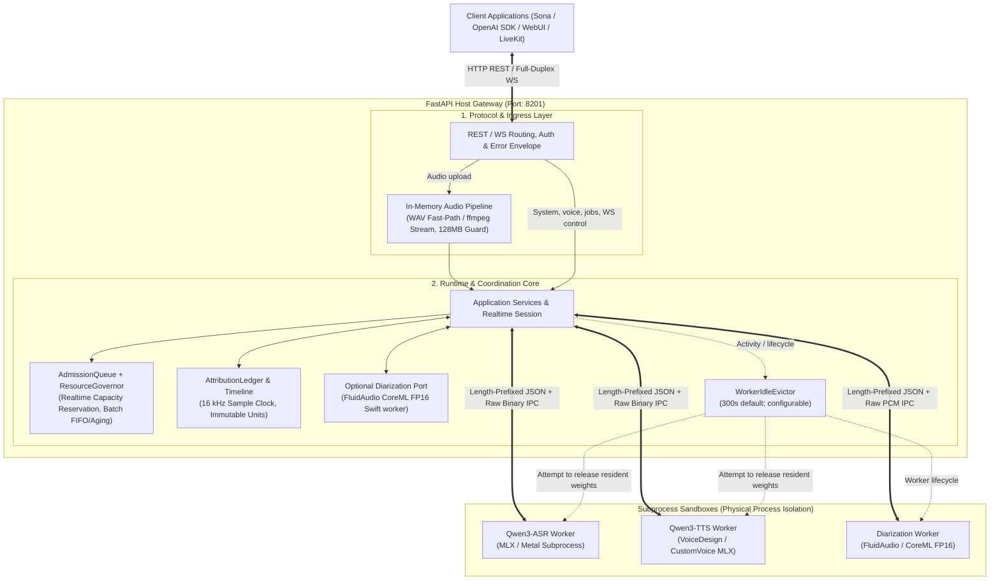

# SpeechRail 🎙️

<p align="center">
  <strong>Production-Ready Local ASR / TTS Speech Infrastructure for Apple Silicon Mac</strong><br>
  <em>Dual-Process Physical Isolation · Automatic Idle Eviction · Fully Offline Zero-Latency · 100% Private · 1:1 OpenAI Compatible</em>
</p>

<p align="center">
  <a href="https://github.com/hrygo/SpeechRail/releases"></a>
  
  
  
  
  <a href="LICENSE"></a>
</p>

<p align="center">
  <strong>English</strong> | <a href="README.zh-CN.md">简体中文</a>
</p>

<p align="center">
  🤝 <strong>Built for <a href="https://github.com/hrygo/sona">Sona</a></strong><br>
  <em>Private, local, real-time ASR/TTS with optional OpenAI-compatible anonymous speaker diarization for Sona.</em>
</p>

---

## 💡 Why SpeechRail?

When adding speech capabilities to personal desktop agents, local meeting transcription assistants, podcast editors, or various AI tools, developers often face a difficult trade-off:
- **Calling Commercial Cloud APIs (e.g., OpenAI Whisper / TTS)**: Every minute of audio is uploaded to the cloud, posing privacy and compliance risks; public network jitter adds hundreds of milliseconds of latency; high-frequency requests incur continuous and steep API bills.
- **Local Apps Loading Models Individually**: Each desktop app packaging its own model triggers memory explosion; VRAM leaks or runtime exceptions can easily crash the host application.

**The SpeechRail Solution**: A **high-performance local speech daemon running silently in the macOS background**, listening on a single port, providing plug-and-play speech capabilities for all local and LAN clients/agents:

- 🔒 **Zero Data Egress & Strict Privacy**: Binds to loopback (`127.0.0.1`) by default, with controlled LAN exposure support. Audio is processed purely in-memory without disk caching. Fully local inference with zero telemetry or cloud leakage.
- 🔌 **1:1 Seamless OpenAI Compatibility**: Full drop-in replacement for `whisper-1` (transcription), `tts-1` (speech synthesis), and `/v1/realtime` (low-latency full-duplex streaming ASR/TTS). Switch your client by updating just one `base_url`.
- 🛡️ **Process Isolation**: The HTTP gateway, MLX ASR/TTS workers, and the native CoreML diarization worker run in separate OS processes over private framed IPC. A worker crash does not bring down the gateway.
- 🍃 **Configurable Idle Eviction**: After the default **300 seconds** without activity, resident model weights are released according to the configured lifecycle. The resulting physical footprint depends on the profile, runtime, and allocator; it is not a fixed standby-memory guarantee.
- 👥 **Optional Multi-Speaker Diarization**: `gpt-4o-transcribe-diarize` returns OpenAI-style `diarized_json` with session-scoped anonymous labels. It runs the pinned FluidAudio CoreML FP16 Sortformer worker; Realtime uses the opt-in `session.speechrail.diarization.enabled` extension.
- 🎚️ **Dynamic Three-Tier Profiles**: Deeply tuned for Apple Silicon Macs from 8GB to 128GB (Light / Balanced / Quality) with seamless zero-downtime hot switching.
- 🎙️ **9 High-Quality Built-In Voices Across Profiles**: Natively integrates Qwen3-TTS speech synthesis, featuring rich acoustic personas for Chinese, English, Cantonese, Japanese, Korean, and more.

---

## ⚖️ Core Comparison (Why SpeechRail?)

| Core Feature | **SpeechRail 🎙️ (Local Resident Infrastructure)** | **Commercial Cloud APIs (e.g., OpenAI)** |
|---|---|---|
| **Data Privacy** | 🔒 **100% local private inference, zero data egress** (Default keyless loopback, optional LAN auth, never touches the cloud) | ❌ Audio must be uploaded to the cloud, risking compliance and privacy leaks |
| **Long-Term Cost** | 💰 **$0 (Install once, unlimited free requests across local apps and LAN)** | 💸 Pay-per-minute / pay-per-token pricing; expensive for frequent use |
| **Network Dependency** | ⚡ **Purely offline local computation, 0 public network latency, works offline** | ⚠️ Relies on stable Internet and cross-border connectivity; vulnerable to jitter |
| **System-Wide Reuse & Memory**| 🍃 **Single shared daemon for all apps, configurable idle weight eviction; footprint is benchmark-dependent** | Unified cloud gateway, no local model footprint |
| **System Robustness** | 🛡️ **Gateway & inference worker physically isolated; automatic worker recovery** | Bound by external cloud provider SLA and connectivity |
| **OpenAI Compatibility** | ✅ **Native 1:1 compatibility (`whisper-1` / `tts-1` / `/v1/realtime`)** | ✅ Official standard specification |

---

## ⚡ Quick Start (5 Minutes)

### Hardware and System Requirements

- **Hardware Architecture**: Mac with **Apple Silicon M-Series chip** (Intel x86_64 Macs are not supported).
- **Operating System**: macOS 14.0 (Sonoma) or later.
- **Python Runtime**: **Python 3.12** required (deployment scripts automatically provision an isolated official runtime and self-heal; no manual setup needed).
- **Fresh Mac Zero-Setup Guide**: For a fully automated setup SOP on fresh/blank MacBooks, see [`speechrail-zero-setup`](.agents/skills/speechrail-zero-setup/SKILL.md).

---

### Method 1: Recommended Managed Setup

Use the automated deployment engine, which detects physical RAM, fetches verified quantized models from the ModelScope mirror, builds the MLX worker in an isolated sandbox, and registers a startup `LaunchAgent` service:

```bash
# 1. Clone the repository
git clone https://github.com/hrygo/SpeechRail.git
cd SpeechRail

# 2. One-click bootstrap installer (ideal for fresh/blank Macs, sets up environment & dependencies):
./.agents/skills/speechrail-zero-setup/scripts/bootstrap_mac.sh

# (Or run directly with any python3; the self-healing engine will fetch Python 3.12 and seamlessly re-execute):
# python3 .agents/skills/speechrail-zero-setup/scripts/zero_setup.py
```

After installation:
1. The service runs silently in the background as a macOS `LaunchAgent` (listening on port `8201`).
2. A double-clickable `SpeechRail 设置.command` script is generated in App Home for easy graphical profile switching anytime.
3. Optionally, the bundled `video-podcast` skill can be installed at `~/.agents/skills/video-podcast` by passing `--install-video-podcast-skill`.

---

### Method 2: Explicit Custom Environment (Explicit Env)

For advanced developers wishing to use existing local model weights or custom virtual environments:

```bash
# 1. Configure private environment variables
cp configs/speechrail.example.env .env
chmod 600 .env

# 2. In .env, set the absolute paths to external models and the worker Python interpreter
# SPEECHRAIL_QWEN3_MODEL_DIR=/Users/yourname/models/Qwen3-ASR-1.7B
# SPEECHRAIL_QWEN3_PYTHON=/Users/yourname/venvs/worker/bin/python

# 3. Start the foreground service
uv run speechrail serve
```

In another terminal, verify the readiness probe (returns HTTP 200 when fully ready):
```bash
curl -i http://127.0.0.1:8201/readyz
```

---

## 🔐 Authentication & Network Security Policy

SpeechRail follows a **zero-friction locally, hardened externally** security design:

- **Local Loopback (Default)**: Bound to `127.0.0.1`, requiring no API key. Local clients connect directly; pass any placeholder key in the OpenAI SDK (e.g., `api_key="local"`).
- **LAN / Remote Exposure**: When bound to `0.0.0.0` or a specific network interface IP, **`SPEECHRAIL_API_KEY` must be explicitly configured** (service fails to start otherwise). All API requests must include `Authorization: Bearer <key>` in headers. Passing keys via URL query parameters is forbidden to prevent logging leaks.

*Note: `/health`, `/readyz`, `/v1/models`, and `/v1/voices` are system health and discovery probe endpoints, and remain open without authentication.*

---

## 💻 Client Ecosystem Integration

Any application supporting a custom OpenAI base URL (`OPENAI_BASE_URL`) can use SpeechRail as its underlying speech engine.

### 1. Python (OpenAI SDK)

The diarization example requires a configured local CoreML bundle; the macOS wheel already contains its native worker (see [Optional Speaker Diarization](#3-optional-speaker-diarization)).

```python
from openai import OpenAI

# Point to local SpeechRail port; use any placeholder key in keyless local mode
client = OpenAI(
    base_url="http://127.0.0.1:8201/v1",
    api_key="local",
)

# 🎙️ Speech-to-Text (ASR)
with open("speech.wav", "rb") as audio_file:
    transcript = client.audio.transcriptions.create(
        model="whisper-1",  # Automatically routed to local Qwen3-ASR
        file=audio_file,
        response_format="verbose_json",
        timestamp_granularities=["segment", "word"],
    )
    print("Transcript:", transcript.text)

# 👥 Multi-Speaker Meeting Transcription & Diarization
with open("meeting.wav", "rb") as audio_file:
    meeting = client.audio.transcriptions.create(
        model="gpt-4o-transcribe-diarize",  # Dispatches the local CoreML diarization worker
        file=audio_file,
        response_format="diarized_json",  # Returns segmented transcript with speaker labels
    )
    for seg in meeting.segments:
        print(f"[{seg.speaker}] {seg.text}")

# 🔊 Text-to-Speech (TTS)
speech = client.audio.speech.create(
    model="tts-1",  # Supports tts-1 / tts-1-hd
    voice="serena",  # Built-in serena (default), vivian, uncle_fu, etc. (9 voices)
    input="Hello! I am SpeechRail, your high-performance local speech assistant running on Apple Silicon.",
    response_format="wav",  # Supports wav / mp3 / opus / aac / flac / pcm
)
speech.stream_to_file("output.wav")
```

---

### 2. TypeScript / Node.js (OpenAI SDK)

```typescript
import fs from "node:fs";
import OpenAI from "openai";

const openai = new OpenAI({
  baseURL: "http://127.0.0.1:8201/v1",
  apiKey: "local",
});

async function main() {
  // 1. Text-to-Speech (TTS)
  const response = await openai.audio.speech.create({
    model: "tts-1",
    voice: "serena",
    input: "SpeechRail is fully ready and delivering high-speed local speech synthesis.",
  });
  const buffer = Buffer.from(await response.arrayBuffer());
  await fs.promises.writeFile("speech.mp3", buffer);

  // 2. Speech-to-Text (ASR)
  const transcription = await openai.audio.transcriptions.create({
    file: fs.createReadStream("speech.mp3"),
    model: "whisper-1",
  });
  console.log("Transcript:", transcription.text);

  // 3. Native speaker diarization: no SpeechRail-specific SDK is needed.
  const meeting = await openai.audio.transcriptions.create({
    file: fs.createReadStream("meeting.wav"),
    model: "gpt-4o-transcribe-diarize",
    response_format: "diarized_json",
    chunking_strategy: { type: "server_vad" },
  });
  console.log("Diarized transcript:", meeting);
}

main();
```

---

### 3. cURL CLI Direct Calls

Use terminal commands directly without installing any SDKs:

```bash
# Speech-to-Text (ASR)
curl http://127.0.0.1:8201/v1/audio/transcriptions \
  -H "Authorization: Bearer local" \
  -F "file=@meeting.wav" \
  -F "model=whisper-1" \
  -F "response_format=json"

# Text-to-Speech (TTS)
curl http://127.0.0.1:8201/v1/audio/speech \
  -H "Authorization: Bearer local" \
  -H "Content-Type: application/json" \
  -d '{
    "model": "tts-1",
    "input": "SpeechRail is fully ready and delivering high-speed local speech synthesis.",
    "voice": "serena",
    "response_format": "wav"
  }' \
  --output output.wav
```

---

### 4. Supported Agents & Desktop AI Clients Table

| Client / Agent Platform | Base URL / Endpoint | API Key | Protocol | Recommended Models & Capabilities |
|---|---|---|---|---|
| **[Sona](https://github.com/hrygo/sona)** | `ws://127.0.0.1:8201/v1/realtime` | `local` | WebSocket | Full-duplex streaming ASR + VAD + Diarization + Streaming TTS |
| **[Open-WebUI](https://github.com/open-webui/open-webui)** | `http://127.0.0.1:8201/v1` | `local` | REST | `whisper-1` (Dictation) / `tts-1` (Real-time voice calls) |
| **[LiveKit](https://github.com/livekit/agents) / [Pipecat](https://github.com/pipecat-ai/pipecat)** | `ws://.../v1/realtime` or `/v1` | `local` | WS / REST | Real-time full-duplex multimodal Voice Agent pipelines |
| **[Cherry Studio](https://github.com/Kang-k/Cherry-Studio)** | `http://127.0.0.1:8201/v1` | `local` | REST | `whisper-1` (Voice input) / `tts-1` (Text readout) |
| **[OpenClaw](https://github.com/openclaw/openclaw)** | `http://127.0.0.1:8201/v1` | `local` | REST | `whisper-1` (Voice commands) / `tts-1` (Status announcement) |
| **[Dify](https://github.com/langgenius/dify) / FastGPT** | `http://127.0.0.1:8201/v1` | `local` | REST | `whisper-1` / `tts-1` (Agentic knowledge base workflows) |

*Note: The table above shows local default keyless examples. For LAN access, replace `127.0.0.1` with the host Mac's local IP, and `local` with your configured `SPEECHRAIL_API_KEY`.*

---

## 🎛️ Three Model Profiles & 9 Built-in Voices

SpeechRail exposes a unified API contract while internally adapting across Apple Silicon Macs through lightweight profile tiers. All tiers strictly employ **8-bit (q8)** high-precision quantized weights:

### 1. Hardware Profile Matrix

| Profile | ASR Model Weight | TTS Model Weight & Variant | Min Recommended RAM | Peak Active Footprint | Steady Footprint | Idle Standby |
|---|---|---|---|---|---|---|
| 🟢 **`light`** | Qwen3-ASR 0.6B (q8) | Qwen3-TTS 0.6B CustomVoice (q8) | 8GB Base Macs (Air / Mini) | **~4.4 GB** | **~4.1 GB** | **Runtime-dependent** (configured eviction) |
| 🟡 **`balanced`** | Qwen3-ASR 1.7B (q8) | Qwen3-TTS 0.6B CustomVoice (q8) | 16GB / 24GB Mainstream Macs (Pro / Max) | **~6.0 GB** | **~5.5 GB** | **Runtime-dependent** (configured eviction) |
| 🟣 **`quality`** | Qwen3-ASR 1.7B (q8) | Qwen3-TTS 1.7B VoiceDesign (q8) | 32GB+ Flagship Macs (Max / Ultra) | **~6.9 GB** | **~6.6 GB** | **Runtime-dependent** (configured eviction) |

- **Strict 8-bit Quantization**: All profile models strictly maintain 8-bit quantization precision, rejecting lower-bit quantization artifacts and pronunciation degradation.
- **Efficient Weight Sharing**: `balanced` and `quality` share the same 1.7B ASR model; `balanced` and `light` share the same 0.6B CustomVoice TTS model.
- **Configurable Idle Eviction**: The default idle timeout is **300 seconds**. It can be changed with `SPEECHRAIL_WORKER_IDLE_TIMEOUT_SECONDS` or disabled with `0`; measured post-eviction footprint remains runtime- and profile-dependent.
- **VoiceDesign Boundary**: Only the `quality` tier supports creating novel custom voices via natural language prompts (VoiceDesign). In `balanced`/`light`, custom voices are declared as `available=false`, restoring automatically when switched back to `quality`.
- **Quality-Gated Voice Cloning**: On the `quality` tier, clone a custom voice from a reference audio clip + read script (`POST /v1/voices/clone`), pre-flight validate the reference without persisting (`POST /v1/voices/clone/validate`), and run bounded quality probes on any registered voice (`POST /v1/voices/{voice_id}/quality-runs`). All three share the `voice_quality_v1` report contract. See the [Voice-Clone Quality Gates & Contract](docs/architecture/voice-clone-quality-gates-and-contract.md).

### 2. 9 Cross-Profile Built-in Voices

SpeechRail preconfigures 9 acoustically fine-tuned voice personas consistent across all profiles (compatible with OpenAI official aliases such as `alloy` -> `serena`, `echo` -> `eric`, `fable` -> `uncle_fu`, etc.).

Note: **The underlying generation mechanism differs by profile**—`balanced` / `light` are powered by **CustomVoice (0.6B)**, whereas `quality` is powered by **VoiceDesign (1.7B)**. Users can choose between "absolute vocal consistency" and "expressive emotional range" based on their application needs:

#### ⚖️ VoiceDesign vs. CustomVoice: Core Differences & Selection Guide

| Dimension | 🟡 / 🟢 `balanced` / `light` (CustomVoice) | 🟣 `quality` (VoiceDesign) | Recommendation & Use Cases |
|---|---|---|---|
| **Underlying Implementation** | Fixed Speaker Embedding weights (physical constants) | Driven by natural language instruction and acoustic prompt fitting | CustomVoice: structural embedding; VoiceDesign: algorithmic synthesis |
| **Vocal Consistency (Identity)** | 🔒 **Extremely High (~100% identity consistency)**<br>Identical timbre across long texts and varying contexts | 🎨 **Good (100% deterministic reproducibility for identical input)**<br>Minor intonation/prosody variance across drastically different texts | Long audiobooks, news broadcasts, serious customer support: choose **CustomVoice**;<br>Natural prosody variation and emotion: choose **VoiceDesign** |
| **Emotional Expressiveness** | Measured, stable, standardized, minimal pitch fluctuation | Expressive, vibrant, with natural breathing and dramatic range | Story narration, game NPCs, virtual companions: choose **VoiceDesign** |
| **Custom Extensibility** | Limited to 9 predefined roles, no free creation | 🌟 **Create any custom voice persona using natural language prompts** | Choose **`quality`** when creating or exploring unique personas |
| **RAM & Throughput** | Ultra-lightweight (~4.4–6.0 GB peak), fast inference | 1.7B high precision (~6.9 GB peak), higher compute demand | Recommended for 8GB/16GB Macs; 32GB+ flagship Macs enjoy quality tier |

> For comprehensive benchmark data and acoustic embedding evaluation, see [VoiceDesign Capabilities and Stability Boundaries](docs/architecture/voicedesign-capability-and-stability.md).

#### 🎙️ 9 Official Cross-Profile Built-In Voice Personas

| Voice ID (`voice`) | Persona Name | Voice Profile & Characteristics | Best For |
|---|---|---|---|
| `serena` | Gentle Chinese Female (Default) | Warm and soft young Chinese female voice; natural and friendly | Personal desktop assistant, daily chat, short video voiceover |
| `vivian` | Bright Chinese Female | Crisp and clear young Chinese female voice; energetic and articulated | News bulletins, long-form reading, tech explainers |
| `uncle_fu` | Resonant Chinese Male | Mature, calm, and grounded Chinese male voice; deep and composed | Audiobooks, business lectures, documentary narration |
| `dylan` | Beijing Youth Male | Clear and natural young male voice with subtle Beijing accent; straightforward | Fitness, gaming interactions, live commerce |
| `eric` | Dynamic Chengdu Male | Lively young Chinese male voice with slight rasp and natural Sichuan accent | Emotional companion, fun interactions, vlogs |
| `ryan` | Dynamic English Male | Energetic and rhythmic English male voice; articulate and driving | English presentations, brand commercials, announcements |
| `aiden` | Sunny American Male | Bright, natural American English young male voice; clear mid-range, friendly | International meetings, ESL tutoring, casual dialogue |
| `ono_anna` | Playful Japanese Female | Light and nimble young Japanese female voice; cheerful and upbeat | Anime, VTubers, Japanese language reading |
| `sohee` | Warm Korean Female | Warm and gentle Korean female voice; emotionally rich and natural | Drama commentary, Korean learning, storytelling |

### 3. Optional Speaker Diarization

For meeting minutes, multi-party interviews, and duplex discussions, SpeechRail provides optional speaker segmentation and session-scoped anonymous labels when the local CoreML profile is ready:

| Core Component | Model Architecture | Responsibility & Capabilities | Active RAM | Client Entry Point |
|---|---|---|---|---|
| **Temporal Segmentation Engine** | **FluidAudio CoreML FP16 Sortformer** (`SortformerNvidiaLow_v2.1.mlmodelc`) | Native Swift worker, direct compiled-bundle load, maximum four anonymous speakers | **564 MB peak RSS in D1** | `model="gpt-4o-transcribe-diarize"` with `response_format="diarized_json"` |

- **Runtime and scope**: Production has one diarization runtime: FluidAudio CoreML FP16 in a private Swift worker. It directly loads the pinned compiled bundle and does not download, compile, change precision, use NeMo/CAM++, or fall back at request time.
- **Measured footprint**: D1 on an M5 Max processed the fixed 90-second streaming input in 7.077 seconds (RTFx 12.716) with 564 MB peak RSS. This smoke does not establish DER/JER, long-session behavior, or a universal memory promise.
- **Realtime extension**: `session.speechrail.diarization.enabled=true` enables the namespaced extension. It emits immutable transcript text and `speechrail.diarization.updated` attribution updates, then terminates with `speechrail.diarization.done` after `speechrail.diarization.finish`.
- **Configuration**: Set `SPEECHRAIL_DIARIZATION_COREML_MODEL_PATH` and `SPEECHRAIL_QWEN3_ALIGNER_MODEL_DIR` (`Qwen3-ForcedAligner-0.6B`). The macOS wheel supplies `SpeechRailDiarizationWorker`; `SPEECHRAIL_DIARIZATION_WORKER_PATH` is only an optional diagnostic override. The existing private ASR worker directly aligns fixed completed text; it does not transcribe it again. With the diarization paths unset, normal ASR/TTS requests run unchanged and no diarization worker starts.
- **Offline E2E Evaluation Suite**: Includes `tools/evaluate_diarization_e2e.py` supporting DER calculation via Kuhn-Munkres optimal permutation matching, collar/overlap tolerance, and speaker-attributed character error rate (SACER) with unknown penalties.

---

## 📊 Real Performance Benchmarks (Apple M5 Max)

> **v1.13.0 benchmarked on 2026-09-08**: all three managed profiles completed the `quality → balanced → light → quality` loop. Cold start, ASR/TTS warm N=5, current OpenAI Realtime (3 consecutive sessions per profile), server-VAD smoke, and complete physical-footprint samples passed. Independent CER/WER, VAD FAR/FRR, MOS/ABX, speaker diarization/embedding, and long soak remain `unset`.
>
> The complete, privacy-preserving report is [v1.13.0 Performance and Quality Benchmark](docs/archive/performance/2026-09-08-v1.13.0-performance-benchmark.md). ASR reuses the v1.11.0 fixtures and is directionally comparable; TTS uses a different fixed text set, while Realtime now verifies the current nested audio wire profile, so those values are reported in-profile only.

| Benchmark Metric | 🟢 Light Profile (v1.13.0) | 🟡 Balanced Profile (v1.13.0) | 🟣 Quality Profile (v1.13.0) | Test Methodology & Scenario |
|---|---|---|---|---|
| **ASR 10s warm RTF p50** | **0.016** | **0.028** | **0.027** | Actual 9.36s fixture, warm N=5; lower is faster |
| **TTS short warm RTF p50** | **0.233** | **0.246** | **0.299** | Actual PCM duration, warm N=5; texts are v1.13-specific |
| **Peak Total Physical RAM** | **5.39 GB。** | **6.30 GB。** | **7.51 GB。** | Same-tick macOS `phys_footprint`; all ticks complete |
| **Warm Idle Physical RAM** | **4.09 GB。** | **5.48 GB。** | **6.74 GB。** | After model fault-in |
| **Realtime ASR commit p50** | **238.2 ms** | **348.6 ms** | **373.6 ms** | 16kHz PCM16, current nested profile, three consecutive sessions; terminal success 3/3 |
| **Realtime TTS first delta p50** | **25.0 ms** | **26.1 ms** | **38.4 ms** | `response.output_audio.delta`, three consecutive sessions |

> `balanced` and `light` use `CustomVoice`; `quality` uses `VoiceDesign`. Shared-worker conflicts intentionally return `backend_busy` rather than being counted as concurrent batch throughput.

---

## 🏛️ Physical Isolation Architecture & Design Philosophy



#### Core Architectural Principles & Invariants

1. **Subprocess Physical Isolation (Minimized Blast Radius)**: Qwen3-ASR and Qwen3-TTS execute in dedicated child processes. The host uses a private length-prefixed protocol with JSON metadata and optional raw-binary payloads; raw PCM avoids Base64 on this hop, but the protocol is not zero-copy. Worker failures are isolated from the FastAPI process and surface through the standard error envelope with a `request_id`.
2. **Strict In-Memory Zero-Disk Pipeline**: Audio processing operates entirely in memory through a 3-tier pipeline: Tier 1 WAV fast-path (zero-copy header slicing), Tier 2 streaming in-memory `ffmpeg` pipe (for compressed containers), and Tier 3 128MB hard OOM guardrail. Raw audio, intermediate PCM, embeddings, and transcripts are never written to disk or transmitted across the network.
3. **Coordinated Idle Eviction**: `WorkerIdleEvictor` manages the external workers according to configured idle and standby timeouts. Measured standby footprint remains a benchmark result, not an architecture promise.
4. **Session-Scoped Diarization**: Batch diarization yields anonymous labels. The namespaced Realtime extension uses the 16 kHz session timeline and later attribution updates do not rewrite transcript text.
5. **Single-Node Shared Concurrency**: `ResourceGovernor` reserves capacity for realtime work and keeps batch work FIFO with aging. It does not preempt work already admitted to a worker; mode conflicts return stable busy errors instead of spawning duplicate model processes.
6. **Strict Separation of Concerns**: SpeechRail exclusively provides local inference runtimes, protocol translation, resource boundaries, and session-scoped anonymous speaker labelling (`speaker_0`, `speaker_1`). Calling applications (such as [Sona](https://github.com/hrygo/sona)) retain complete ownership of audio I/O hardware, meeting databases, persistent storage, human-in-the-loop speaker renaming, and LLM business orchestration.

---

## 🛠️ Daemon Service Management (LaunchAgent)

SpeechRail follows the macOS standard user LaunchAgent daemon mechanism, managed via native commands:

```bash
# Check service status and PID
uv run speechrail service status

# Restart daemon service
uv run speechrail service restart

# Stop or uninstall daemon service
uv run speechrail service stop
uv run speechrail service uninstall
```

---

## ❓ Frequently Asked Questions (FAQ)

<details>
<summary><strong>Q1: My system runs Python 3.13 or 3.9. Will there be version conflicts?</strong></summary>

**Not at all.** The installer and bootstrap tools include automated environment isolation and self-healing. They do not modify your global Python installation. Instead, `uv` provisions an isolated CPython 3.12 runtime inside a sandbox, completely separated from your system Python.
</details>

<details>
<summary><strong>Q2: Why are Intel (x86_64) Macs not supported?</strong></summary>

SpeechRail's performance relies heavily on Apple MLX optimizations for **Apple Silicon Unified Memory Architecture (UMA) and Metal GPU**. Intel Macs lack unified memory, and MLX does not provide pre-compiled wheels for macOS x86_64. If you are on an Intel Mac, consider lightweight alternatives such as `whisper.cpp` or connect across LAN to a SpeechRail instance running on an Apple Silicon Mac.
</details>

<details>
<summary><strong>Q3: Why is no API key required for local calls?</strong></summary>

To deliver an out-of-the-box zero-friction experience for local desktop development, SpeechRail defaults to listening strictly on loopback (`127.0.0.1`), allowing keyless access. If you expose the listening address to the network (e.g., `0.0.0.0`), the service mandates `SPEECHRAIL_API_KEY` and refuses to start without one.
</details>

<details>
<summary><strong>Q4: Do I need to re-download all models when switching profiles?</strong></summary>

No. Model weights are cached persistently in the managed directory. When switching between `light`, `balanced`, and `quality`, previously downloaded weights are reused immediately within seconds.
</details>

<details>
<summary><strong>Q5: How do I enable Speaker Diarization, and how much RAM does it consume?</strong></summary>

Diarization is an optional native capability. Install the macOS wheel, then set absolute paths for `SPEECHRAIL_DIARIZATION_COREML_MODEL_PATH` (the pinned `SortformerNvidiaLow_v2.1.mlmodelc` bundle) and `SPEECHRAIL_QWEN3_ALIGNER_MODEL_DIR` (`Qwen3-ForcedAligner-0.6B`). The wheel contains the Swift worker; `SPEECHRAIL_DIARIZATION_WORKER_PATH` is only an optional override. It never downloads or compiles models on a request path; the existing ASR worker uses the aligner only to timestamp fixed completed text and never performs a second ASR decode.
- **Memory**: D1 measured 564 MB peak RSS on an M5 Max for one fixed 90-second input. Other machines and inputs require their own measurement.
- **API**: File transcription uses the OpenAI diarization model and `diarized_json`. Realtime opt-in is `session.speechrail.diarization.enabled=true`; the extension only carries anonymous, session-scoped labels.
</details>

<details>
<summary><strong>Q6: How is the Silero VAD model for /v1/realtime installed?</strong></summary>

The realtime voice-activity detector uses `realtime_vad_engine` (`auto` by default): it resolves to the Silero ONNX model when `SPEECHRAIL_REALTIME_VAD_MODEL_PATH` is configured, and otherwise falls back to a zero-dependency legacy engine. The managed `speechrail setup` downloads the pinned `silero_vad.onnx` (about 2.3 MB, MIT, from `snakers4/silero-vad`) automatically when the network is reachable, so no manual step is normally required. If the download is unreachable, setup logs a warning and keeps the legacy engine — you can later place the model manually and set `SPEECHRAIL_REALTIME_VAD_MODEL_PATH` in `.env` (see `configs/speechrail.example.env`).
- **RAM Usage**: **0 MB** when not configured; roughly a few MB of resident weights when the Silero engine is active.
- **Auto Eviction**: Not evicted — the VAD runs in-process and its ~2.3 MB footprint is negligible next to the ASR/TTS workers.
</details>

---

## 📚 Complete Documentation Center

| Role | Recommended Guides |
|---|---|
| 🚀 **Quick Start / Setup** | [Blank Mac Zero-Setup Guide (`speechrail-zero-setup`)](.agents/skills/speechrail-zero-setup/SKILL.md) · [Operations Runbook](docs/operations/operations-runbook.md) |
| 🔌 **API Developers** | [User & Client Integration Guide](docs/users/README.md) · [OpenAI Compatibility Contract](docs/users/api-contract.md) · [OpenAPI Specification](contracts/openapi.yaml) |
| 🛠️ **System Operators** | [Operations Center](docs/operations/README.md) · [Managed Runtime Deployment](docs/operations/runtime-deployment.md) · [Acceptance Report](docs/operations/speaker-diarization-e2e-acceptance-2026-09-06.md) · [Security & Observability](docs/operations/security-observability.md) |
| 🧪 **Code Contributors** | [Developer Center](docs/developers/README.md) · [Testing & Acceptance Suite](docs/developers/testing-acceptance.md) |
| 📐 **Architecture Review** | [System Architecture Overview](docs/architecture/README.md) · [Speaker Diarization E2E](docs/architecture/speaker-diarization-e2e-design.md) · [Voice-Clone Quality Gates & Contract](docs/architecture/voice-clone-quality-gates-and-contract.md) · [Current Boundaries & Trade-offs](docs/architecture/current-boundaries.md) · [Architecture Decision Records (ADRs)](docs/decisions/README.md) |

---

## 🤝 Contributing & License

- Review [Contributing Guidelines (CONTRIBUTING.md)](CONTRIBUTING.md) before submitting code.
- Report security issues according to our [Security Policy (SECURITY.md)](SECURITY.md).
- Community interactions should adhere to the [Code of Conduct (CODE_OF_CONDUCT.md)](CODE_OF_CONDUCT.md).

SpeechRail is open-source software licensed under the permissive [MIT License](LICENSE). Free for personal use and commercial integrations.
