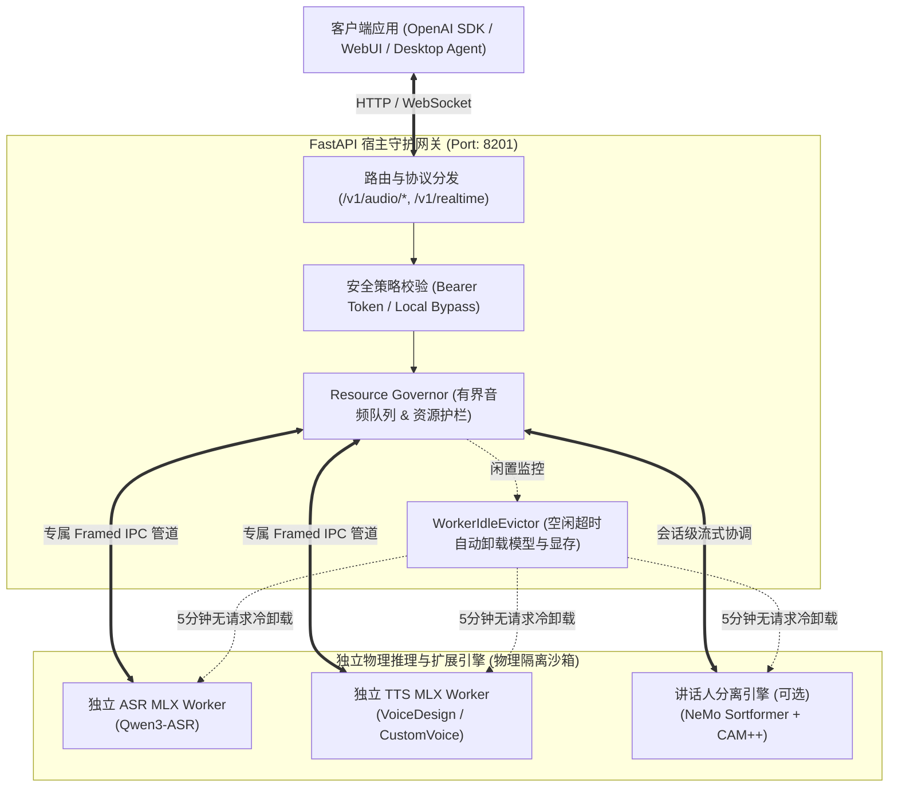

# SpeechRail 🚂

<p align="center">
  <strong>专为 Apple Silicon Mac 打造的工业级本地 ASR / TTS 语音基础设施</strong><br>
  <em>双进程物理隔离 · 空闲自动卸载 · 零网络延迟 · 100% 数据私密 · 原生兼容 OpenAI 协议</em>
</p>

<p align="center">
  <a href="https://github.com/hrygo/SpeechRail/releases"></a>
  
  
  
  
  <a href="LICENSE"></a>
</p>

---

## 💡 为什么需要 SpeechRail？

当你为个人桌面 Agent、本地会议转录助手、播客剪辑或各种 AI 工具添加语音能力时，通常面临两难：
- **调用商业云端 API（如 OpenAI Whisper / TTS）**：每分钟音频都在上传云端，面临隐私泄露隐患；公网抖动带来数百毫秒额外延迟；高频调用产生持续且高昂的账单。
- **本地应用重复加载模型**：不同桌面应用各自加载模型导致内存爆炸，显存泄漏与异常容易直接拖垮宿主进程。

**SpeechRail 的解法**：作为一个**在 macOS 后台静默常驻的高性能本地语音 Daemon**，单端口监听，全机所有客户端与 Agent 即插即用：

- 🔒 **数据零离机与强隐私**：音频仅在本地 loopback（`127.0.0.1`）流转，不写盘暂存，无任何外部数据回传。
- 🔌 **OpenAI 协议 1:1 无缝替换**：完整实现 `whisper-1`（文件转录）、`tts-1`（语音合成）与 `/v1/realtime`（低延迟双工流式 ASR/TTS），客户端改一行 `base_url` 即可接入。
- 🛡️ **双物理进程隔离架构**：HTTP 网关与重型 MLX 推理引擎运行在不同物理进程中，通过高效 IPC 管道通信。Worker 崩溃绝不拖垮网关。
- 🍃 **智能两阶段空闲卸载 (Idle Eviction)**：推理完毕后，默认 **5 分钟无请求自动卸载模型权重并释放显存**，常驻待机内存仅约 **50 MB**，绝不霸占 Mac 宝贵内存。
- 👥 **原生多讲话人分离 (Speaker Diarization)**：集成 NeMo Sortformer 与 CAM++ 声纹模型，自动区分并标注不同发言人（如 `speaker_0`, `speaker_1`），轻松驾驭多人会议与访谈。
- 🎚️ **动态三档资源匹配**：针对 8GB 到 128GB 的 Apple Silicon 芯片深度调优（Light / Balanced / Quality），一键无感热切换。
- 🎙️ **9 种跨档高质量内置音色**：原生集成 Qwen3-TTS 语音能力，涵盖中文、英语、粤语、日语、韩语等丰富声学角色。

---

## ⚖️ 核心方案对比 (Why SpeechRail?)

| 核心特性 | **SpeechRail 🚂 (本地常驻基础设施)** | **商业公有云 API (如 OpenAI)** |
|---|---|---|
| **数据隐私** | 🔒 **100% 本地环回流转，零数据离机** | ❌ 音频必须上传云端，面临合规与泄露风险 |
| **长期调用成本** | 💰 **$0（一次安装，全机无限量免费调用）** | 💸 按音频时长/Token 持续计费，高频使用昂贵 |
| **网络环境依赖** | ⚡ **纯离线运行，0 公网传输延迟，断网可用** | ⚠️ 依赖稳定外网与跨境链路，受网络抖动影响 |
| **全机复用与内存管理**| 🍃 **单常驻 Daemon 供全机共享，空闲自动卸载权重 (~50MB)** | 统一云端网关，无本地模型负载 |
| **系统健壮性** | 🛡️ **网关与推理 Worker 物理进程隔离，异常自动拉起** | 依赖外部云服务商 SLA 与网络状态 |
| **OpenAI 协议兼容** | ✅ **原生 1:1 兼容 (`whisper-1` / `tts-1` / `/v1/realtime`)** | ✅ 官方标准协议规范 |

---

## ⚡ 5 分钟极速上手 (Quick Start)

### 硬件与系统要求

- **硬件架构**：配备 **Apple Silicon M 系列芯片** 的 Mac（暂不支持 Intel x86_64 Mac）。
- **操作系统**：macOS 14.0 (Sonoma) 及以上。
- **Python 环境**：锁定 **Python 3.12**（部署脚本会自动拉取隔离的官方运行时并自愈切换，无需手动安装配置）。
- **全新 Mac 零配置指南**：针对全新/空白 MacBook 的自动化安装 SOP 详见 [`speechrail-zero-setup`](.agents/skills/speechrail-zero-setup/SKILL.md)。

---

### 方式 1：推荐一键受管安装 (Managed Setup)

使用全自动部署引擎，自动检测本机物理内存，从 ModelScope 镜像拉取校验完备的量化模型，在独立隔离沙箱构建 MLX Worker 并配置开机自启常驻服务：

```bash
# 1. 克隆代码仓库
git clone https://github.com/hrygo/SpeechRail.git
cd SpeechRail

# 2. 一键引导安装 (适用于全新/空白 Mac，自动搞定环境与依赖)：
./.agents/skills/speechrail-zero-setup/scripts/bootstrap_mac.sh

# （亦可直接使用任意 python3 启动安装引擎，内置自愈机制会自动准备 Python 3.12 并平滑重执行）：
# python3 .agents/skills/speechrail-zero-setup/scripts/zero_setup.py
```

安装完成后：
1. 服务将作为 macOS `LaunchAgent` 在后台默默常驻（监听端口 `8201`）。
2. 在 App Home 自动生成了可双击打开的 `SpeechRail 设置.command`，方便随时图形化切换档位。

---

### 方式 2：显式自定义环境运行 (Explicit Env)

若您是高阶开发者，需要接入本地已有的自定义模型权重或自建虚拟环境：

```bash
# 1. 配置私有环境变量
cp configs/speechrail.example.env .env
chmod 600 .env

# 2. 在 .env 中填入外部模型的绝对路径与独立 Worker 的 Python 解释器
# SPEECHRAIL_QWEN3_MODEL_DIR=/Users/yourname/models/Qwen3-ASR-1.7B
# SPEECHRAIL_QWEN3_PYTHON=/Users/yourname/venvs/worker/bin/python

# 3. 启动前台服务
uv run speechrail serve
```

在另一个终端验证就绪探针（返回 HTTP 200 即为完全就绪）：
```bash
curl -i http://127.0.0.1:8201/readyz
```

---

## 🔐 认证与网络安全策略 (Security)

SpeechRail 遵循**本地零摩擦、对外硬防护**的安全设计：

- **本地回环（默认）**：绑定 `127.0.0.1`，无需配置密钥。客户端免密直连，OpenAI SDK 传入任意占位 key（如 `api_key="local"`）即可。
- **局域网 / 远程暴露**：绑定 `0.0.0.0` 或指定网卡 IP 时，**必须显式配置 `SPEECHRAIL_API_KEY`**（未配置时启动直接报错拦截）。所有业务请求必须在 Header 中携带 `Authorization: Bearer <key>`，禁止在 URL Query 中传 key 以防止日志泄露。

*注：`/health`、`/readyz`、`/v1/models`、`/v1/voices` 为系统健康与发现探针端点，始终免鉴权开放。*

---

## 💻 客户端全生态即插即用

任何支持自定义 OpenAI 接口地址（`OPENAI_BASE_URL`）的应用，都可以将 SpeechRail 作为底层语音引擎。

### 1. Python (OpenAI SDK)

```python
from openai import OpenAI

# 指向本地 SpeechRail 端口，免密模式传入任意占位 key 即可
client = OpenAI(
    base_url="http://127.0.0.1:8201/v1",
    api_key="local",
)

# 🎙️ 语音转文字 (ASR)
with open("speech.wav", "rb") as audio_file:
    transcript = client.audio.transcriptions.create(
        model="whisper-1",  # 自动调度本地 Qwen3-ASR
        file=audio_file,
        response_format="verbose_json",
        timestamp_granularities=["segment", "word"],
    )
    print("转录文本:", transcript.text)

# 👥 多人会议转录与发言人区分 (Speaker Diarization)
with open("meeting.wav", "rb") as audio_file:
    meeting = client.audio.transcriptions.create(
        model="gpt-4o-transcribe-diarize",  # 调度本地 NeMo Sortformer 讲话人分离引擎
        file=audio_file,
        response_format="diarized_json",  # 返回带 speaker 标签的分段转写
    )
    for seg in meeting.segments:
        print(f"[{seg.speaker}] {seg.text}")

# 🔊 文字转语音 (TTS)
speech = client.audio.speech.create(
    model="tts-1",  # 支持 tts-1 / tts-1-hd
    voice="serena",  # 内置 serena (默认), vivian, uncle_fu 等 9 种优质音色
    input="你好，我是运行在你的 Mac 本地的高性能语音助手 SpeechRail。",
    response_format="wav",  # 支持 wav / mp3 / opus / aac / flac / pcm
)
speech.stream_to_file("output.wav")
```

---

### 2. TypeScript / Node.js (OpenAI SDK)

```typescript
import fs from "node:fs";
import OpenAI from "openai";

const openai = new OpenAI({
  baseURL: "http://127.0.0.1:8201/v1",
  apiKey: "local",
});

async function main() {
  // 1. 语音合成 (TTS)
  const response = await openai.audio.speech.create({
    model: "tts-1",
    voice: "serena",
    input: "SpeechRail 已完全就绪，正在本地极速为您提供语音服务。",
  });
  const buffer = Buffer.from(await response.arrayBuffer());
  await fs.promises.writeFile("speech.mp3", buffer);

  // 2. 语音转写 (ASR)
  const transcription = await openai.audio.transcriptions.create({
    file: fs.createReadStream("speech.mp3"),
    model: "whisper-1",
  });
  console.log("转写结果:", transcription.text);
}

main();
```

---

### 3. cURL 命令行直接调用

无需安装任何 SDK，直接使用终端命令：

```bash
# 语音转文字 (ASR)
curl http://127.0.0.1:8201/v1/audio/transcriptions \
  -H "Authorization: Bearer local" \
  -F "file=@meeting.wav" \
  -F "model=whisper-1" \
  -F "response_format=json"

# 文字转语音 (TTS)
curl http://127.0.0.1:8201/v1/audio/speech \
  -H "Authorization: Bearer local" \
  -H "Content-Type: application/json" \
  -d '{
    "model": "tts-1",
    "input": "SpeechRail 已完全就绪，正在本地为您提供极速语音合成服务。",
    "voice": "serena",
    "response_format": "wav"
  }' \
  --output output.wav
```

---

### 4. 主流桌面 AI 客户端接入表

| 客户端软件 | Base URL (接口地址) | API Key | ASR 模型 | TTS 模型 |
|---|---|---|---|---|
| **Cherry Studio** | `http://127.0.0.1:8201/v1` | `local` | `whisper-1` | `tts-1` |
| **NextChat** | `http://127.0.0.1:8201/v1` | `local` | `whisper-1` | `tts-1` |
| **Chatbox** | `http://127.0.0.1:8201/v1` | `local` | `whisper-1` | `tts-1` |
| **Dify / FastGPT** | `http://127.0.0.1:8201/v1` | `local` | `whisper-1` | `tts-1` |
| **Sona / QwenPaw / Hermes** | `http://127.0.0.1:8201/v1` | `local` | `whisper-1` | `tts-1` |

---

## 🎛️ 三档模型预设与 9 种跨档内置音色

SpeechRail 对外暴露统一 API 契约，内部通过轻巧的分档组合适配不同配置的 Apple Silicon Mac。全档位严格采用 **8-bit (q8)** 高精度量化权重：

### 1. 硬件分档矩阵

| 预设档位 (Profile) | ASR 模型权重 | TTS 模型权重与变体 | 最低物理内存推荐 | 活跃最大占用 (Peak) | 稳定占用 (Steady) | 空闲待机 (Idle) |
|---|---|---|---|---|---|---|
| 🟢 **`light` (轻量档)** | Qwen3-ASR 0.6B (q8) | Qwen3-TTS 0.6B CustomVoice (q8) | 8GB 基础款 Mac (Air / Mini) | **~4.4 GB** | **~4.1 GB** | **~50 MB** (自动卸载) |
| 🟡 **`balanced` (平衡档)** | Qwen3-ASR 1.7B (q8) | Qwen3-TTS 0.6B CustomVoice (q8) | 16GB / 24GB 主流 Mac (Pro / Max) | **~6.0 GB** | **~5.5 GB** | **~50 MB** (自动卸载) |
| 🟣 **`quality` (高保真档)** | Qwen3-ASR 1.7B (q8) | Qwen3-TTS 1.7B VoiceDesign (q8) | 32GB+ 旗舰款 Mac (Max / Ultra) | **~6.9 GB** | **~6.6 GB** | **~50 MB** (自动卸载) |

- **全档 8-bit 高精度量化**：全档位模型严格保证 8-bit 量化精度，拒绝低位量化带来的音频失真与发音崩塌。
- **权重高效复用**：`balanced` 与 `quality` 共享同一个 1.7B ASR 模型；`balanced` 与 `light` 共享同一个 0.6B CustomVoice TTS 模型。
- **智能两阶段空闲卸载 (Idle Eviction)**：默认 5 分钟无请求时自动触发冷卸载释放显存与内存，常驻待机仅占用约 **~50 MB**，新请求秒级懒拉起。
- **音色设计边界**：仅 `quality` 档支持通过自然语言设计自定义新音色（VoiceDesign）；在 `balanced`/`light` 档下，自定义音色会自动声明为 `available=false`，切回 `quality` 自动恢复。

### 2. 9 种跨档系统内置音色

系统内置 9 种经过声学微调的优质音色（同时完美支持 OpenAI 官方音色别名如 `alloy` -> `serena`, `echo` -> `eric`, `fable` -> `uncle_fu` 等）：

| 音色 ID (`voice`) | 角色名称 | 声音画像与特点 | 最佳适用场景 |
|---|---|---|---|
| `serena` | 温柔中文女声 (默认) | 温暖柔和的年轻中文女声，音色亲切自然，语气平和 | 个人桌面助理、日常交谈、短视频配音 |
| `vivian` | 明亮中文女声 | 明亮清脆的年轻中文女声，略带锋利质感，语气轻快 | 新闻资讯、长文朗读、科技解说 |
| `uncle_fu` | 醇厚中文男声 | 成熟稳重的中文男声，音色低沉醇厚，语速平稳从容 | 有声小说、商务讲座、纪录片旁白 |
| `dylan` | 北京青年男声 | 清晰自然的年轻男声，带自然北京口音，语气轻松直接 | 运动健身、游戏互动、口播带货 |
| `eric` | 成都活力男声 | 活泼明亮的年轻中文男声，略带沙哑质感和自然四川口音 | 情感陪伴、趣味互动、生活 Vlog |
| `ryan` | 动感英语男声 | 富有活力和节奏感的英语男声，发音清晰，表达有推动力 | 英语演讲、品牌广告、正式公告 |
| `aiden` | 阳光美式男声 | 阳光自然的美式英语年轻男声，中频清晰，语气友好 | 国际会议、外语教学、日常对话 |
| `ono_anna` | 轻快日语女声 | 轻盈灵动的年轻日语女声，语气俏皮自然，节奏明快 | 动漫二次元、虚拟主播、日语伴读 |
| `sohee` | 温暖韩语女声 | 温暖柔和的韩语女声，情感丰富，表达自然亲切 | 影视解说、韩语学习、情感电台 |

### 3. 可选讲话人分离模型 (Speaker Diarization)

针对会议纪要、多人访谈和双工讨论等场景，SpeechRail 原生集成了高性能多讲话人时序切分与角色分离能力：

| 核心组件 | 底层模型架构 | 职责与能力边界 | 活跃推理开销 (Active RAM) | 客户端调用入口 |
|---|---|---|---|---|
| **时序切分引擎** | **NVIDIA NeMo Sortformer** (`diar_streaming_sortformer_4spk-v2`) | 在线/离线流式切分不同发言人时间边界，支持最多 4 人重叠语音分离 | **+约 0.5 GB** (500 MB) | `model="gpt-4o-transcribe-diarize"` 或 `response_format="diarized_json"` |
| **声纹特征提取 (可选)** | **3D-Speaker CAM++** (`3dspeaker_speech_campplus_sv_zh-cn_16k-common`) | 提取 16kHz PCM 声纹特征向量，跨会话短时重聚类，确保发言人归一 | **极轻量** (~数十 MB) | 会话内断线重连或长会议平滑映射 |

- **活跃内存开销**：启用并在处理多人会议转录时，额外常驻约 **+0.5 GB** 物理内存（未配置模型时零额外开销）。
- **统一空闲卸载**：深度接入 `EvictableWorker` 机制，**连续 5 分钟无调用自动触发冷卸载释放全部权重与显存**，常驻待机内存回落至 **~50 MB**。
- **严格匿名隐私**：仅输出会话生命周期内的匿名标签（如 `speaker_0`, `speaker_1`），**不持久化真实人名、不留存声纹库、不进行跨会议身份追踪**。
- **按需可选安装**：执行 `uv sync --extra diarization` 安装可选依赖并在配置中启用即可。

---

## 📊 真实性能基准实测 (Apple M5 Max)

以下数据来源于 Apple M5 Max (128GB Unified Memory) 上的串行真实基准测试（引自 [v1.7.0 性能基准实测报告](docs/archive/performance/2026-09-05-v1.7.0-performance-benchmark.md)），真实可复现：

| 评测指标 | 🟢 Light 档实测 | 🟡 Balanced 档实测 | 🟣 Quality 档实测 | 评测口径与场景 |
|---|---|---|---|---|
| **ASR 中文 RTF (p50)** | **0.0174** (超实时 57 倍) | **0.0250** (超实时 40 倍) | **0.0243** (超实时 41 倍) | 独立 macOS 系统语音 fixture，N=5 p50 |
| **ASR 英文 RTF (p50)** | **0.0216** (超实时 46 倍) | **0.0313** (超实时 32 倍) | **0.0302** (超实时 33 倍) | 13 词独立英文样本，N=5 p50 |
| **TTS 生成 RTF (p50)** | **0.2394** (超实时 4.1 倍) | **0.2405** (超实时 4.1 倍) | **0.2731** (超实时 3.6 倍) | 统一中文文本、`serena` 音色，N=5 p50 |
| **最大同时物理占用** | **~4.4 GB** (4462 MB) | **~6.0 GB** (6085 MB) | **~6.9 GB** (6943 MB) | 同一 tick `phys_footprint` 较大值 |
| **稳定物理占用** | **~4.1 GB** (4142 MB) | **~5.5 GB** (5562 MB) | **~6.6 GB** (6599 MB) | 持续工作稳定态物理内存 |
| **空闲卸载待机内存** | **~50 MB** | **~50 MB** | **~50 MB** | 5 分钟无请求自动卸载释放 Worker |

---

## 🏛️ 物理隔离架构与设计哲学



#### 核心架构设计原则

- **故障爆炸半径最小化**：重型推理引擎在独立进程内运行。若 MLX 发生底层 C++ / Metal 偶发崩溃，宿主网关依然保持在线，并能自动重启 Worker。
- **内存零浪费与绿色休眠**：网关内置 `WorkerIdleEvictor`，工作时满血加载，闲置时自动卸载释放。
- **职责边界清晰**：SpeechRail 专注于提供纯粹、工业级的本地 ASR/TTS 协议服务，不侵入麦克风拾音、系统扬声器播放或应用业务逻辑。

---

## 🛠️ 守护进程管理 (LaunchAgent)

SpeechRail 遵循 macOS 标准的用户级守护进程机制，通过原生命令随时管控：

```bash
# 查看常驻服务当前运行状态与 PID
uv run speechrail service status

# 重启守护服务
uv run speechrail service restart

# 停止或卸载守护服务
uv run speechrail service stop
uv run speechrail service uninstall
```

---

## ❓ 常见问题 (FAQ)

<details>
<summary><strong>Q1: 我的电脑装的是 Python 3.13 或 3.9，会有版本冲突吗？</strong></summary>

**完全不会。** 安装脚本与引导工具内置了自动环境隔离与自愈逻辑。它不会修改您的系统全局 Python，而是通过 `uv` 自动拉取一套官方独立的 CPython 3.12 并在沙箱中运行，两者完全隔离、互不干扰。
</details>

<details>
<summary><strong>Q2: 为什么暂不支持 Intel (x86_64) 架构的 Mac？</strong></summary>

SpeechRail 的核心性能来自于 Apple MLX 框架对 **Apple Silicon 统一内存（Unified Memory Architecture）与 Metal GPU** 的深度调优。Intel Mac 没有统一内存架构，MLX 官方目前完全不提供 x86_64 预编译支持。若您使用 Intel Mac，建议使用轻量的 `whisper.cpp` 或通过网络接入另一台 Mac 上的 SpeechRail 服务。
</details>

<details>
<summary><strong>Q3: 为什么本机调用时不需要配置 API Key？</strong></summary>

为了给个人桌面开发提供极致的“开箱即用”体验，SpeechRail 默认仅监听本地环回接口 `127.0.0.1`，此时放行本地调用。一旦您在配置中将监听地址开放至局域网（如 `0.0.0.0`），服务会强制校验 `SPEECHRAIL_API_KEY`，未配置将直接拒绝启动。
</details>

<details>
<summary><strong>Q4: 切换模型档位时需要重新下载所有模型吗？</strong></summary>

不需要。所有模型权重在下载后都会持久化保存在受管目录中。当您在 `light`、`balanced`、`quality` 之间切换时，已下载过的档位会直接秒级复用本地缓存。
</details>

<details>
<summary><strong>Q5: 如何开启多人会议讲话人分离 (Speaker Diarization)？它占用多少内存？</strong></summary>

讲话人分离属于按需扩展能力。您只需执行 `uv sync --extra diarization` 安装配套依赖，并在 `.env` 中指定 NVIDIA NeMo Sortformer 权重文件路径（`SPEECHRAIL_DIARIZATION_MODEL_PATH`）。
- **内存占用**：未配置时为 **0 MB**；启用并处理多人转录时，宿主额外占用约 **0.5 GB** 物理内存。
- **自动卸载**：同样深度接入系统空闲驱逐器，**连续 5 分钟无调用自动释放全部权重**，完全归还内存，绝不长期霸占系统资源。
</details>

---

## 📚 完整文档中心

| 读者角色 | 推荐入口与文档说明 |
|---|---|
| 🚀 **小白 / 快速搭建** | [空白 Mac 从零搭建指南 (`speechrail-zero-setup`)](.agents/skills/speechrail-zero-setup/SKILL.md) · [运维排障手册](docs/operations/operations-runbook.md) |
| 🔌 **API 开发者** | [用户与客户端集成指南](docs/users/README.md) · [OpenAI 兼容契约详解](docs/users/api-contract.md) · [OpenAPI 规范](contracts/openapi.yaml) |
| 🛠️ **系统运维** | [运维中心](docs/operations/README.md) · [受管运行时部署说明](docs/operations/runtime-deployment.md) · [安全与可观测性](docs/operations/security-observability.md) |
| 🧪 **代码贡献者** | [开发者中心](docs/developers/README.md) · [本地测试与验收套件](docs/developers/testing-acceptance.md) |
| 📐 **架构评审** | [系统架构全景](docs/architecture/README.md) · [当前边界与权衡](docs/architecture/current-boundaries.md) · [架构决策记录 (ADRs)](docs/decisions/README.md) |

---

## 🤝 参与贡献与许可证

- 提交代码前请阅读 [贡献指南 (CONTRIBUTING.md)](CONTRIBUTING.md)。
- 漏洞报告请参阅 [安全策略 (SECURITY.md)](SECURITY.md)。
- 社区交流请遵守 [行为准则 (CODE_OF_CONDUCT.md)](CODE_OF_CONDUCT.md)。

SpeechRail 采用宽松友好的 [MIT License](LICENSE) 授权开源。您可以自由用于个人创作或商业软件集成。
