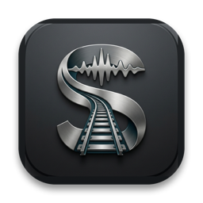
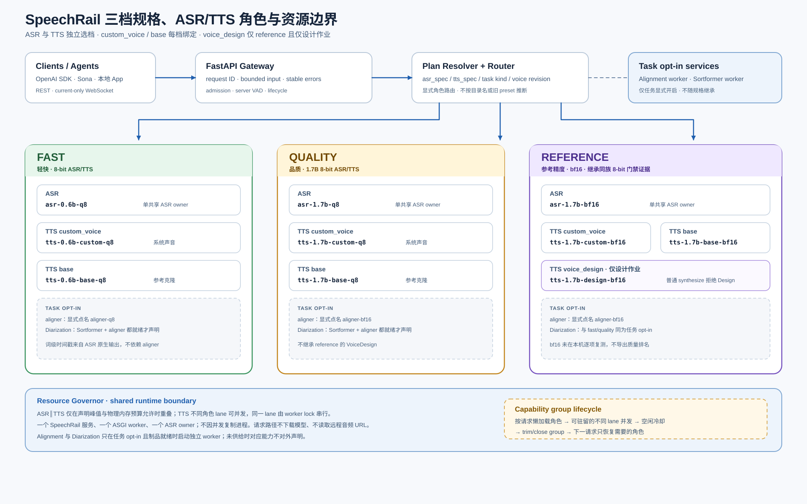

# SpeechRail

<p align="center">
  
</p>

<p align="center">
  <strong>面向 Apple Silicon macOS 的本地优先共享 ASR / TTS 基础设施</strong><br>
  <em>一个本地服务 · OpenAI 兼容 HTTP 与 WebSocket · 有界 Worker 运行时</em>
</p>

<p align="center">
  <a href="https://github.com/hrygo/SpeechRail/releases"></a>
  
  
  
  <a href="LICENSE"></a>
</p>

<p align="center">
  <a href="README.md">English</a> · <strong>简体中文</strong>
</p>

SpeechRail 是面向桌面 Agent、会议工具、内容生产流程和其他语音应用的
单用户本地语音服务。它在一个本地端点后托管共享 ASR/TTS Worker，并只暴露
经过 SpeechRail 验证的 OpenAI 兼容子集。

服务负责协议转换、模型适配、Worker 生命周期、资源准入和能力报告；调用方
负责麦克风采集、音频播放、会议数据、UI 与 LLM 编排。

## 当前能力

| 入口 | 能力 | 说明 |
|---|---|---|
| `POST /v1/audio/transcriptions` | 文件 ASR | OpenAI 兼容 multipart 输入；支持 `json`、`verbose_json`、`text`、`srt`、`vtt`，以及可选的 `diarized_json`。 |
| `POST /v1/audio/speech` | TTS | 流式输出 `mp3`、`opus`、`aac`、`flac`、`wav` 或原始 `pcm`；请从 `/v1/voices` 选择 `available=true` 的音色。 |
| `GET /v1/models`、`GET /v1/voices` | 能力发现 | 返回当前 profile、可用模型制品和可用音色。 |
| `WS /v1/realtime` | 实时 ASR/TTS | OpenAI Realtime 事件子集、服务端语音准入，以及可选的命名空间分人扩展。 |
| `/v1/jobs` | 异步任务元数据 | 可选的 owner-scoped 持久任务记录；调用方提供不透明引用，不传原始音频或转写文本。 |
| `speechrail-mcp` | Agent 接入 | 支持 `stdio` 或 `streamable-http` 的无状态 MCP 代理；它调用本地 REST 服务，不托管模型。 |

讲话人分离仅在当前 `balanced` 或 `quality` profile 的本地 CoreML 资源就绪时
可用。它只返回会话范围内的匿名标签，不识别人名，也不维护跨会话讲话人数据库。

仓库还包含 `macos/SpeechRailApp` SwiftUI macOS 控制面。它读取服务状态，
并将 profile/服务操作委托给现有 Python CLI；它不是音频运行时，不采集麦克风、
不播放音频、不加载模型，也不替代用户级 `com.speechrail` LaunchAgent。

## 范围与边界

SpeechRail 是语音运行时，不是完整的语音 Agent 应用。它不负责：

- 麦克风采集、扬声器播放、会议管理或 UI；
- LLM response、tool call 或应用级打断策略；
- 实名讲话人识别、声纹库或跨会话归属；
- 云端推理、多租户隔离、高可用或分布式队列。

Realtime 是唯一的公共 WebSocket 入口，仅实现 ASR/TTS 事件。依赖未列出的
OpenAI 能力前，请先阅读对应契约。

## 环境要求

- Apple Silicon Mac，macOS 14 或更高版本；Intel Mac 不是支持目标。
- 源码开发和 Python 服务 CLI 使用 `>=3.12,<3.13`。
- 使用 [`uv`](https://docs.astral.sh/uv/) 管理依赖和环境。
- 模型 snapshot 与 vendor runtime 存放在仓库之外。

推理请求不会下载模型、读取远程音频 URL 或静默访问云端。显式的安装和运维
命令可能会供给本地制品；执行前请阅读对应运维指南。

## 快速开始

### 受管安装

全新 Mac 可使用仓库提供的零配置指南和引导入口：

```bash
git clone https://github.com/hrygo/SpeechRail.git
cd SpeechRail
./.agents/skills/speechrail-zero-setup/scripts/bootstrap_mac.sh
```

受管流程会准备隔离运行时、校验所选本地制品，并注册用户级 `LaunchAgent`。
前置条件、profile 选择和恢复规则见
[`speechrail-zero-setup`](.agents/skills/speechrail-zero-setup/SKILL.md)。

安装后检查服务状态，不要启动第二个实例：

```bash
uv run speechrail service status
uv run speechrail diagnose --app-home "$HOME/Library/Application Support/SpeechRail"
curl http://127.0.0.1:8201/health
curl http://127.0.0.1:8201/readyz
```

### 源码开发

此路径适合确定性的契约和应用开发。即使没有真实模型 snapshot，也可以启动
HTTP 接口；在配置本地 ASR/TTS runtime 前，推理请求会返回
`503 backend_not_ready`。

```bash
git clone https://github.com/hrygo/SpeechRail.git
cd SpeechRail
uv sync --extra dev
cp configs/speechrail.example.env .env
chmod 600 .env
uv run speechrail serve
```

如需真实本地推理，请在私有 `.env` 中填写文档要求的 ASR/TTS snapshot 与解释器
路径，并在启动服务前运行 `speechrail service preflight`。snapshot、`.env`、
音频、日志和 benchmark 原始数据必须留在仓库之外。

常用只读检查：

```bash
curl http://127.0.0.1:8201/health
curl http://127.0.0.1:8201/readyz
curl http://127.0.0.1:8201/v1/models
curl http://127.0.0.1:8201/v1/voices
uv run speechrail diagnose
```

`/health` 报告进程和子系统状态；`/readyz` 报告 ASR/TTS runtime 是否可以
接受推理。就绪成功不代表模型质量或性能验收通过。

## OpenAI 兼容调用示例

标准 OpenAI Python 客户端只需修改 `base_url` 即可访问本地服务。默认 loopback
模式使用占位 key 即可。

```python
from openai import OpenAI

client = OpenAI(
    base_url="http://127.0.0.1:8201/v1",
    api_key="local",
)

with open("speech.wav", "rb") as audio:
    result = client.audio.transcriptions.create(
        model="whisper-1",
        file=audio,
        response_format="verbose_json",
    )
    print(result.text)

speech = client.audio.speech.create(
    model="tts-1",
    voice="serena",
    input="SpeechRail 正在本地运行。",
    response_format="wav",
)
speech.stream_to_file("speech-output.wav")
```

Realtime 客户端连接：

```text
ws://127.0.0.1:8201/v1/realtime
```

具体事件顺序见 [`contracts/realtime-openai.md`](contracts/realtime-openai.md)。
SDK、cURL、Sona、Open-WebUI、LiveKit/Pipecat 和 OpenClaw 示例见
[`docs/users/integrations.md`](docs/users/integrations.md)。

## 模型 profile

不同 profile 共享公共 API 形状，但对外声明的能力取决于当前 catalog selection。
当前活动的 ASR/TTS profile 权重均为 8-bit；仅 `quality` 的分人 aligner 保持 bf16。

| Profile | ASR | TTS | 分人与音色能力 |
|---|---|---|---|
| `light` | `asr-0.6b-q8` | `tts-0.6b-custom-q8` | 无 aligner、无分人；固定 CustomVoice 角色。 |
| `balanced` | `asr-1.7b-q8` | `tts-0.6b-custom-q8` | `aligner-q8`，可选匿名分人；固定 CustomVoice 角色。 |
| `quality` | `asr-1.7b-q8` | `tts-1.7b-design-q8` + `tts-1.7b-base-q8` | `aligner-bf16`，可选匿名分人、VoiceDesign 试听/设计和质量门控 Base 克隆。两个 TTS capability worker 可双常驻，不同 lane 可并发；同一 lane 仍串行。 |

Quality 将 VoiceDesign 与 Base 保持为两条独立的 TTS capability lane。切换音色
工作流不需要在两者之间频繁加载和卸载；Quality capability group 仍会在配置的
空闲冷却后 trim/close 两个 worker，并在下一次请求时惰性恢复。



上图是三档 profile 路由、模型共享、Quality 两条 TTS capability lane，以及
共享资源与生命周期边界的统一总览。

CLI 的 `setup` 会根据物理内存给出起始建议，但这不是硬件保证。使用 CLI 查看
或切换受管 selection：

```bash
uv run speechrail profile list
uv run speechrail profile status
uv run speechrail profile apply balanced
uv run speechrail profile rollback
```

请先从 `/v1/voices` 选择音色，不要假设已注册的自定义音色在所有 profile 上都
可用。质量档专属的音色接口包括 `POST /v1/voices/previews`、`POST /v1/voices`、
`POST /v1/voices/designs` 和克隆接口，详见
[`docs/users/api-contract.md`](docs/users/api-contract.md)。

## 安全与数据处理

- 默认绑定 `127.0.0.1`；loopback 开发不需要 API key。
- 任何非 loopback 暴露都必须配置 `SPEECHRAIL_API_KEY`、Bearer 鉴权和明确的
  origin 策略。不要把 key 放进 URL query。
- 普通 ASR/TTS 请求在本地处理，不发送到云端。显式的音色注册与克隆是持久化
  能力，可能在仓库之外写入受管 custom voice 数据。
- 日志、fixture 和报告不得包含凭据、Authorization header、原始音频、Base64、
  完整 prompt、完整转写、embedding、姓名或绝对模型路径。

## 文档导航

| 需求 | 推荐入口 |
|---|---|
| API 与客户端接入 | [`docs/users/README.md`](docs/users/README.md)、[`docs/users/api-contract.md`](docs/users/api-contract.md)、[`contracts/openapi.yaml`](contracts/openapi.yaml) |
| Realtime 协议 | [`contracts/realtime-openai.md`](contracts/realtime-openai.md) |
| MCP Agent 接入 | [`docs/users/mcp-agent-integration.md`](docs/users/mcp-agent-integration.md) |
| 运维与回滚 | [`docs/operations/README.md`](docs/operations/README.md)、[`docs/operations/operations-runbook.md`](docs/operations/operations-runbook.md) |
| 开发与测试 | [`docs/developers/README.md`](docs/developers/README.md)、[`docs/developers/testing-acceptance.md`](docs/developers/testing-acceptance.md) |
| macOS 控制面 | [`docs/developers/macos-app-development.md`](docs/developers/macos-app-development.md)、[`docs/developers/macos-app-release.md`](docs/developers/macos-app-release.md) |
| 架构与边界 | [`docs/architecture/README.md`](docs/architecture/README.md)、[`docs/architecture/current-boundaries.md`](docs/architecture/current-boundaries.md)、[`docs/decisions/README.md`](docs/decisions/README.md) |
| 版本历史 | [`CHANGELOG.md`](CHANGELOG.md) |

## 贡献与许可证

提交变更前请按 [`docs/developers/testing-acceptance.md`](docs/developers/testing-acceptance.md)
执行确定性测试和 lint 门禁，并阅读 [`CONTRIBUTING.md`](CONTRIBUTING.md) 与
[`AGENTS.md`](AGENTS.md) 了解仓库边界和工作约定。

SpeechRail 采用 [MIT License](LICENSE) 授权。
