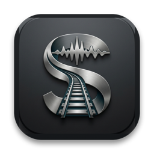
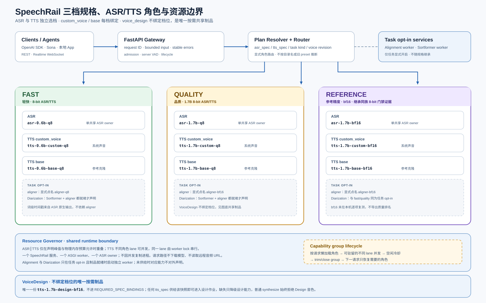

# SpeechRail

<p align="center">
  
</p>

<p align="center">
  <strong>面向 Apple Silicon macOS 的本地语音基础设施</strong><br>
  <em>一个有界运行时 · OpenAI 兼容 REST 与 Realtime · 一个 macOS 控制面</em>
</p>

<p align="center">
  <a href="https://github.com/hrygo/SpeechRail/actions/workflows/ci.yml"></a>
  <a href="https://github.com/hrygo/SpeechRail/releases"></a>
  
  
  
  <a href="LICENSE"></a>
</p>

<p align="center">
  <a href="README.md">English</a> · <strong>简体中文</strong>
</p>

<p align="center">
  <a href="#speechrail-是什么">它是什么</a> ·
  <a href="#对外能力">对外能力</a> ·
  <a href="#快速开始">快速开始</a> ·
  <a href="#模型规格">模型规格</a> ·
  <a href="#文档导航">文档导航</a> ·
  <a href="CONTRIBUTING.md">参与贡献</a>
</p>

SpeechRail 是面向单台 Apple Silicon Mac 的单用户本地语音服务，供桌面 Agent、
会议工具、内容工作流以及随附的 macOS App 共享。它把 ASR、TTS 和可选的说话人分离
worker 收在一个本地端点后面，只暴露 SpeechRail 真正实现并验证过的那部分
OpenAI 兼容接口。

**服务**负责协议转换、模型适配、worker 生命周期、资源准入和能力报告；**调用方应用**
负责麦克风采集、音频播放、会议存储、UI 和 LLM 编排。

> [!NOTE]
> `/readyz` 返回 200 和一次成功的 smoke 请求只能确认服务已就绪，不代表质量、延迟或
> 稳定性通过验收——哪些还没被证明见[边界](#边界)。

## SpeechRail 是什么

一个进程树、一套模型、一份契约。各应用不必再各自加载语音模型，也不必再各自实现
一遍 OpenAI 兼容适配层。

它适合这些场景：

- 需要本地 ASR/TTS，不希望绕云端一圈；
- 多个桌面应用共用一个 HTTP/WebSocket 服务；
- 需要范围明确、可检查、且有机器可读契约的 OpenAI 兼容接口；
- 需要可选的 Realtime ASR/TTS、会话级匿名分人，或面向 Agent 的 MCP 接入。

它**不是**语音 Agent 平台。SpeechRail 不跑 LLM、不保存对话历史、不调用工具，也不决定
何时打断播放；这些都由调用方负责。SpeechRail 只交付语音事实并渲染音频。

## 对外能力

### REST 与 WebSocket

| 入口 | 用途 | 说明 |
|---|---|---|
| `GET /health`、`/readyz`、`/metrics` | 诊断 | 进程、子系统、就绪状态与 Prometheus 指标。`server_vad` 独立于 ASR/TTS 就绪状态单独报告。 |
| `POST /v1/audio/transcriptions` | 文件 ASR | OpenAI 兼容 multipart 输入；支持 `json`、`verbose_json`、`text`、`srt`、`vtt`，以及 opt-in 的 `diarized_json`（匿名 speaker 标签）。 |
| `POST /v1/audio/speech` | TTS | 流式输出 `mp3`、`opus`、`aac`、`flac`、`wav` 或原始 `pcm`；请从 `/v1/voices` 选择 `available=true` 的音色。 |
| `GET /v1/models`、`GET /v1/voices` | 发现 | 当前 profile 与可服务音色的发现投影。 |
| `GET /v1/speechrail/capabilities` | 有效能力 | `effective_capabilities_v1`：模型、音色和参数域的一次内部一致快照。读取它不启动 worker，也不做推理。 |
| `/v1/voice-designs*`、`/v1/voices/clone*` | 音色创建与克隆 | 用一句话设计音色、试听、用参考录音克隆、验证，再发布进音色库。 |
| `/v1/speechrail/voices*`、`/v1/speechrail/pronunciation-sets*` | 音色库与发音映射 | 不可变音色 revision，支持回滚与撤销；面向合成的版本化发音映射集。 |
| `/v1/jobs*` | 持久异步任务 | owner-scoped 任务记录，用于长转写。你传不透明引用；服务不落盘原始音频或转写文本。 |
| `WS /v1/realtime` | Realtime ASR/TTS | 无状态 Speech Plane：转写 session、服务端 VAD 事实、彼此独立的词级对齐与分人 opt-in，以及显式的 `speechrail.tts.*` 渲染控制。协议规则与版本以 [Realtime 契约](contracts/realtime-openai.md)为准。 |

完整机器可读契约见
[`contracts/openapi.yaml`](contracts/openapi.yaml)，WebSocket 契约见
[`contracts/realtime-openai.md`](contracts/realtime-openai.md)。

### speechrail-mcp

`speechrail-mcp` 是无状态代理，把当前 REST 能力通过 `stdio`（默认，不监听端口）或
`streamable-http`（默认 `127.0.0.1:8202）` 暴露给 MCP 客户端。它不托管模型、不切换
profile，也不代理 Realtime——Agent 客户端直接连接 `/v1/realtime`。
`speechrail agents install --client codex` 会为 Codex 安装随附的 skill 与 MCP 配置。

### macOS App

`macos/SpeechRailApp` 是面向已安装服务的 SwiftUI 控制面。它不加载模型，也不替代用户级
`com.speechrail` LaunchAgent；它通过受约束的 XPC 委托驱动现有 Python CLI。功能分三组：

- **创作**：配音台、音色创作、音色克隆、音色库、我的作品。
- **会话**：语音助手、会议助手、实时字幕、AI 提词器。
- **引擎**：服务状态、运行监控、模型组合、预检与诊断、App 内开发者文档。

麦克风采集与播放只在会话功能启用期间存在，离开功能即释放。会话 PCM 从不落盘；
只有文字与记录保存在本机。提词器的摄像头与窗口采集留在你的直播软件里——
SpeechRail 提供的是稿件跟读，不是视频。

## 边界

这些边界是刻意划定的，而且承载了真实约束：

- **不跑 LLM、不存历史、不调工具、不管播放策略。** Realtime 只承载 ASR/TTS 子集；
  编排与 barge-in 由调用方负责。
- **不识别实名说话人。** 分人只返回会话级匿名标签；没有声纹库、没有跨会话身份、
  没有说话人注册。
- **请求路径不静默联网。** 推理不下载模型、不读取远程音频 URL、不调用云端。
  安装与准备模型是显式的运维动作。
- **一个服务、一个 ASGI worker。** 不靠复制模型进程提吞吐；冲突时按设计返回
  `backend_busy`。
- **不做云端推理、多租户和高可用。** 这是单用户本地运行时。

分人还额外要求本地 CoreML Sortformer bundle 与点名 aligner 已供给，且任务显式
opt-in。VoiceDesign 是不绑定任何档位的按需制品。

## 环境要求

- 受管运行时需要 Apple Silicon Mac、macOS 26.0 或更高版本。Intel Mac 与 Linux 不是
  受支持的运行目标；Linux 仅用于平台无关的开发检查。
- 随附 App 同样以 macOS 26.0+、`arm64` 为目标。
- 源码开发与 Python 服务 CLI 使用 `>=3.14,<3.15`。
- 使用 [`uv`](https://docs.astral.sh/uv/) 管理依赖与环境。
- 模型 snapshot 与 vendor runtime 存放在仓库之外。

音频解码/转码路径会用到 `ffmpeg`。受管安装器会在隔离运行时内附带固定版本的
`imageio-ffmpeg`，因此执行 `speechrail install` 不要求系统预装 `ffmpeg`。

## 快速开始

### 从 Release 制品安装

从 [Releases](https://github.com/hrygo/SpeechRail/releases) 下载 wheel 与
`SHA256SUMS`，先校验制品，然后只用 `uv` 安装，无需检出源码：

```bash
cd ~/Downloads
shasum -a 256 -c SHA256SUMS
uvx --python 3.14.7 --from ./speechrail-*.whl \
  speechrail install \
  --asr-spec quality \
  --tts-spec quality \
  --yes \
  --enable
```

wheel 自带 `speechrail install` 入口。它会暂存 release、准备并校验所选档位的模型
制品、执行 preflight、原子切换 `runtime/current`，并在 `--enable` 下注册、启动
`com.speechrail`。如果 wheel 版本与 installer 不一致，安装会拒绝执行，避免两者
版本漂移。重复运行可升级现有安装；请先停止正在运行的服务，因为当端口 8201 正被占用
时，installer 会拒绝替换 `runtime/current`。已校验的本地模型 snapshot 会复用，不会
重新下载。

随后可选择从同一 Release 的未签名 DMG 安装 App（可选）。DMG 只包含控制面，
不安装服务。

### 从仓库首装

如果全新的 Apple Silicon Mac 还需要安装前置依赖，可使用仓库提供的引导流程；它会安装
前置依赖、准备所选本地模型制品，并注册 `com.speechrail` LaunchAgent。该流程会执行
外部设置操作，因此必须明确传入 `--yes`：

```bash
git clone https://github.com/hrygo/SpeechRail.git
cd SpeechRail
./.agents/skills/speechrail-zero-setup/scripts/bootstrap_mac.sh \
  --yes \
  --asr-spec quality \
  --tts-spec quality
```

使用该入口前请先阅读
[首装指南](.agents/skills/speechrail-zero-setup/SKILL.md)：它说明磁盘需求、档位选择、
模型校验与恢复行为。[安装与首次使用](docs/users/installing-speechrail.md)说明各
Release 制品的用途、安装顺序和常见失败状态。

安装后检查服务状态，不要启动第二个实例：

```bash
SPEECHRAIL_APP_HOME="$HOME/Library/Application Support/SpeechRail"
SPEECHRAIL_CLI="$SPEECHRAIL_APP_HOME/runtime/current/.venv/bin/speechrail"
"$SPEECHRAIL_CLI" service status --app-home "$SPEECHRAIL_APP_HOME"
"$SPEECHRAIL_CLI" diagnose --app-home "$SPEECHRAIL_APP_HOME"
curl http://127.0.0.1:8201/health
curl http://127.0.0.1:8201/readyz
```

### 源码开发

此路径适合确定性的契约和应用开发。即使没有真实模型 snapshot，也可以提供 HTTP
接口；在配置本地 ASR/TTS runtime 前，推理请求会返回 `503 backend_not_ready`。

```bash
git clone https://github.com/hrygo/SpeechRail.git
cd SpeechRail
uv sync --extra dev
cp configs/speechrail.example.env .env
chmod 600 .env
uv run speechrail serve
```

如需真实本地推理，请在私有 `.env` 中填写文档要求的 ASR/TTS snapshot 与解释器路径，
并在启动服务前运行 `speechrail service preflight`。snapshot、`.env`、音频、日志和
benchmark 原始数据必须留在仓库之外。

常用只读检查：

```bash
curl http://127.0.0.1:8201/health
curl http://127.0.0.1:8201/readyz
curl http://127.0.0.1:8201/v1/models
curl http://127.0.0.1:8201/v1/voices
uv run speechrail diagnose
```

## OpenAI 兼容调用示例

标准 OpenAI Python 客户端只需修改 `base_url` 即可访问本地服务。loopback 访问使用
占位 key；只有在有意把服务暴露到 loopback 之外时才使用真实 Bearer key。

```python
from openai import OpenAI

client = OpenAI(
    base_url="http://127.0.0.1:8201/v1",
    api_key="local",
)

with open("speech.wav", "rb") as audio:
    result = client.audio.transcriptions.create(
        model="whisper-1",
        file=audio,
        response_format="verbose_json",
    )
    print(result.text)

speech = client.audio.speech.create(
    model="tts-1",
    voice="serena",
    input="SpeechRail 正在本地运行。",
    response_format="wav",
)
speech.stream_to_file("speech-output.wav")
```

Realtime 客户端连接 `ws://127.0.0.1:8201/v1/realtime`，并遵循
[`contracts/realtime-openai.md`](contracts/realtime-openai.md)中声明的 ASR/TTS 事件与字段。
客户端负责 LLM 编排与播放；未声明的事件、字段和兼容别名均被拒绝。SDK、cURL、Open-WebUI、
LiveKit/Pipecat 和 OpenClaw 示例见
[`docs/users/integrations.md`](docs/users/integrations.md)。

## 模型规格

ASR 与 TTS 分别选档。对外声明的能力取决于当前 catalog selection 与 readiness；
BF16 权重类型本身不代表质量更高。

| 规格 | ASR | TTS lane | 分人与音色行为 |
|---|---|---|---|
| `fast` | `asr-0.6b-q8` | `tts-0.6b-custom-q8` + `tts-0.6b-base-q8` | CustomVoice 系统声音与 Base reference clone；分人需显式供给 Sortformer + aligner。 |
| `quality` | `asr-1.7b-q8` | `tts-1.7b-custom-q8` + `tts-1.7b-base-q8` | 1.7B CustomVoice 与 Base 角色；分人需显式供给。 |
| `reference` | `asr-1.7b-bf16` | `tts-1.7b-custom-bf16` + `tts-1.7b-base-bf16` | bf16 制品继承同族 8-bit 门禁证据，未在本机单独复测；分人仍需显式供给。 |

每个规格都把系统声音路由到 `custom_voice`、把参考克隆路由到 `base`。
VoiceDesign（`tts-1.7b-design-bf16`）是不绑定任何档位的一份按需制品：该 snapshot
供给后任何 `tts_spec` 都能进入设计作业，缺失时只降级设计能力。不同 lane 可并发，
同一 lane 仍串行；能力组仍会在配置的空闲冷却后关闭 worker，并在下一个请求按需
惰性恢复所需角色。



CLI 的 `setup` 会根据物理内存给出起始建议，但这不是硬件保证。使用 CLI 查看或切换
受管 selection：

```bash
SPEECHRAIL_APP_HOME="$HOME/Library/Application Support/SpeechRail"
SPEECHRAIL_CLI="$SPEECHRAIL_APP_HOME/runtime/current/.venv/bin/speechrail"
"$SPEECHRAIL_CLI" profile list --app-home "$SPEECHRAIL_APP_HOME"
"$SPEECHRAIL_CLI" profile status --app-home "$SPEECHRAIL_APP_HOME"
"$SPEECHRAIL_CLI" profile apply \
  --asr-spec quality \
  --tts-spec quality \
  --app-home "$SPEECHRAIL_APP_HOME" \
  --yes
"$SPEECHRAIL_CLI" profile rollback --app-home "$SPEECHRAIL_APP_HOME" --yes
```

请先从 `/v1/voices` 选择音色，不要假设已注册的音色在所有规格上都可用。
VoiceDesign 与 Base 克隆的可用性由当前有效能力决定。详见
[`docs/users/api-contract.md`](docs/users/api-contract.md)。

## 安全与数据处理

- 默认绑定 `127.0.0.1`；loopback 开发不需要 API key。
- 任何非 loopback 暴露都必须配置 `SPEECHRAIL_API_KEY`、Bearer 鉴权和明确的
  origin 策略。不要把 key 放进 URL query。
- 普通 ASR/TTS 请求在本地处理，不发送到云端。显式的音色注册与克隆是持久化能力，
  可能在仓库之外写入受管 custom voice 数据。
- 日志、fixture 和报告不得包含凭据、Authorization header、原始音频、Base64、
  完整 prompt、完整转写、embedding、姓名或绝对模型路径。

## 文档导航

| 需求 | 推荐入口 |
|---|---|
| 文档总览 | [`docs/README.md`](docs/README.md) |
| 安装与首次运行 | [`docs/users/installing-speechrail.md`](docs/users/installing-speechrail.md) |
| API 与客户端接入 | [`docs/users/README.md`](docs/users/README.md)、[`docs/users/integrations.md`](docs/users/integrations.md) |
| 公共 API 契约 | [`docs/users/api-contract.md`](docs/users/api-contract.md)、[`contracts/openapi.yaml`](contracts/openapi.yaml) |
| Realtime 协议 | [`contracts/realtime-openai.md`](contracts/realtime-openai.md) |
| 有效能力快照 | [`docs/users/effective-capabilities.md`](docs/users/effective-capabilities.md) |
| MCP Agent 接入 | [`docs/users/mcp-agent-integration.md`](docs/users/mcp-agent-integration.md) |
| 运维与回滚 | [`docs/operations/README.md`](docs/operations/README.md)、[`docs/operations/operations-runbook.md`](docs/operations/operations-runbook.md) |
| 开发与测试 | [`docs/developers/README.md`](docs/developers/README.md)、[`docs/developers/testing-acceptance.md`](docs/developers/testing-acceptance.md) |
| macOS 控制面 | [`docs/developers/macos-app-development.md`](docs/developers/macos-app-development.md)、[`docs/developers/macos-app-release.md`](docs/developers/macos-app-release.md) |
| 架构与边界 | [`docs/architecture/README.md`](docs/architecture/README.md)、[`docs/architecture/current-boundaries.md`](docs/architecture/current-boundaries.md)、[`docs/decisions/README.md`](docs/decisions/README.md) |
| 版本历史 | [`CHANGELOG.md`](CHANGELOG.md) |

## 参与贡献

提交 Pull Request 前，请阅读 [`CONTRIBUTING.md`](CONTRIBUTING.md)，并运行确定性
质量门禁：

```bash
uv sync --extra dev
uv run --extra dev pytest
uv run --extra dev ruff check src tests
uv run --extra dev mypy src
npx @redocly/cli lint contracts/openapi.yaml
git diff --check
```

CI 还会构建 wheel 并测试 SwiftUI macOS 控制面。Bug 报告和功能请求请使用仓库的
issue 模板；问题与集成讨论请前往
[GitHub Discussions](https://github.com/hrygo/SpeechRail/discussions)。参与项目时也请
遵守 [`CODE_OF_CONDUCT.md`](CODE_OF_CONDUCT.md)。

## 支持与安全

使用问题和故障排查请先查看 [`SUPPORT.md`](SUPPORT.md) 或前往
[GitHub Discussions](https://github.com/hrygo/SpeechRail/discussions)。确认的 bug
请使用 [issue 模板](https://github.com/hrygo/SpeechRail/issues/new/choose)。

安全漏洞请按 [`SECURITY.md`](SECURITY.md) 中的流程报告，不要公开创建 issue。

## 许可证

SpeechRail 采用 [MIT License](LICENSE) 授权。
