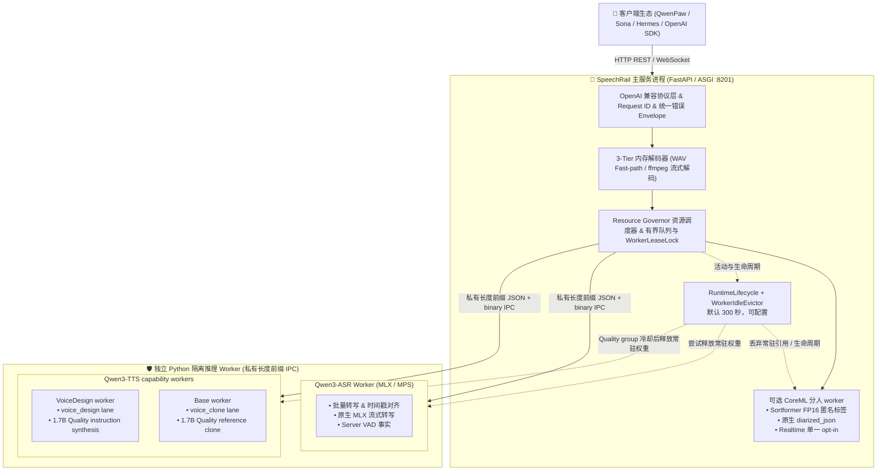

# 📚 SpeechRail 文档中心

  <strong>面向本地应用的高性能、隐私优先、OpenAI 契约兼容的语音识别 (ASR) 与合成 (TTS) 运行时服务</strong>

  
  
  
  

欢迎查阅 SpeechRail 官方技术文档。本文档中心根据不同读者角色与职责进行模块化组织，助您快速获取所需信息。

## 当前实现基线（2026-09-21）

- 当前源码 release 为 SpeechRail `3.1.0`。受管运行时只能由当前源码构建的 wheel 通过 `speechrail install` 切换，不能直接编辑源码 checkout 或 `runtime/current`。
- Realtime 已切换为 current-only 无状态 Speech Plane；调用方拥有 LLM、历史、memory、tools、播放和 barge-in，服务端只交付 ASR/VAD/匿名分人事实与显式 TTS render。
- `/health`、`/readyz` 和 `/v1/models` 只报告当前 profile、worker 和可选能力的实时状态；不得把某一台机器的一组 readiness 值写成所有安装的固定承诺。
- Realtime `server_vad` 只交付端点事实。endpointing 窗口、播放队列和 barge-in 决策由调用方负责，不是 SpeechRail 的全局业务默认值。
- 连续 diarization 的 activity stream 与 endpointing 分离：activity 负责 speaker evidence，完成后以 speaker-only revision 更新，不改写 canonical completed text。
- clone ICL 路径已加入稳定采样、请求级响度冻结、峰值保护和参考音频信号校验；当前 active clone backend 对非 `1.0` speed 明确返回 `clone_speed_unsupported`。
- Quality TTS 由 `voice_design` VoiceDesign worker 与 `voice_clone` Base worker 两条独立 capability lane 组成；两者允许双常驻，跨 lane 可并发，同一 lane 由 worker lock 串行，冷却后按 Quality group trim/close 并在下一次请求时惰性恢复。

---

## 🧭 按角色快速进入

| 角色领域 | 关注重点 | 推荐入口文档 |
|:---|:---|:---|
| 🎯 **产品经理 / 业务方** | 业务价值、应用场景、功能矩阵、边界与规划 | [📖 产品白皮书与全景概述](product/overview.md)   [📋 产品边界与职责划分](architecture/product-scope.md) |
| 🏛️ **架构师 / 技术决策** | 架构拓扑、进程隔离、Speech Plane、私有 IPC、状态机、ADR | [🏛️ 总体架构设计](architecture/architecture.md)   [🎙️ 无状态 Speech Plane 设计](superpowers/specs/2026-09-20-stateless-speech-plane-caller-orchestration-design.md)   [📜 架构决策记录 (ADR)](decisions/README.md)   [👥 分人整洁架构](superpowers/specs/2026-09-08-diarization-clean-architecture-design.md) |
| 🔌 **API 用户 / 客户端集成** | REST / WebSocket 契约、SDK 接入、MCP/Agent 集成、音色库、错误码 | [🔌 客户端与 SDK 接入指南](users/integrations.md)   [🤖 MCP 主流 Agent 集成指南](users/mcp-agent-integration.md)   [📡 公共 API 契约手册](users/api-contract.md)   [⚡ OpenAI Realtime 协议规范](../contracts/realtime-openai.md)   [👥 分人协议契约](../contracts/diarization/v1/) |
| 📦 **本机用户 / 自部署** | 发布制品说明、安装顺序、首次验证、升级与卸载 | [📦 SpeechRail 安装与首次使用](users/installing-speechrail.md) |
| 🛠️ **核心开发者 / 贡献者** | 5分钟启动、代码分层、测试金字塔、Worker 扩展 | [🛠️ 开发者开发指南](developers/development-guide.md)   [🧪 测试与质量验收规范](developers/testing-acceptance.md) |
| 📦 **运维工程师 / SRE** | LaunchAgent 常驻、Wheel 发布、排障决策树、监控 | [📖 运维操作手册 (Runbook)](operations/operations-runbook.md)   [🚀 运行时部署方案](operations/runtime-deployment.md)   [🔒 安全与可观测性](operations/security-observability.md) |

---

## 🏗️ 全局系统拓扑

上图是当前三档模型组合、profile/capability 路由、Quality 双 TTS worker 以及共享资源边界的 canonical overview。

---

## 📊 当前能力矩阵与就绪状态

| 功能模块 | 运行状态 | 协议与入口 | 核心能力特征 | 验证证据 |
|---|---|---|---|---|
| **批量语音识别 (ASR)** | 契约可用，按 runtime readiness | `POST /v1/audio/transcriptions` | 文档声明的 OpenAI multipart 子集，支持 `verbose_json`、`srt`、`vtt`；分人格式按 profile 条件启用 | 确定性契约测试；真实质量需按授权单独验收 |
| **语音合成 (TTS)** | 契约可用，按 runtime readiness | `POST /v1/audio/speech` | 24 kHz PCM16 / WAV / MP3 等文档声明格式，按能力快照选择音色 | 确定性契约测试；真实音质与性能需按授权单独验收 |
| **实时流式 (Realtime)** | 契约可用 | `WS /v1/realtime` | current-only 无状态 ASR/TTS 子集；服务端提供 VAD 事实，调用方负责 LLM、队列、播放和 barge-in，并显式提交 `speechrail.tts.*` | Python 契约/回归与 Native 纯测试；真实模型/音频质量需单独验收 |
| **说话人分离 (Diarization)** | 可选，按 profile 与资源就绪 | 文件 `diarized_json`；Realtime 显式 opt-in | 私有 CoreML Sortformer FP16 worker；仅输出匿名 session-scoped label | [能力诊断与验收](operations/capability-quality-acceptance.md)；真实质量与长期资源行为需独立实测 |
| **macOS 常驻运维服务** | 流程可用，按安装态验收 | `speechrail service` CLI | 用户级 LaunchAgent 管理、状态检查和受控回滚 | 确定性测试与安装态证据分开记录 |

---

## ⚖️ 事实来源层级 (Hierarchy of Truth)

在查阅或更新文档时，请严格遵守以下事实来源优先级：

1. **第 1 层级（最高事实）**：当前代码实现、自动化测试套件与实际运行验证结果。
2. **第 2 层级（接口规范）**：[`contracts/openapi.yaml`](../contracts/openapi.yaml) 与 [`contracts/realtime-openai.md`](../contracts/realtime-openai.md)。
3. **第 3 层级（正式文档）**：状态为 `active` 的架构、产品、开发、运维文档与 [ADR (架构决策记录)](decisions/README.md)。
4. **第 4 层级（历史材料）**：[`docs/archive/`](archive/README.md) 中的历史设计与过程计划，**仅作追溯参考，不代表当前功能承诺**。

> [!IMPORTANT]
> `/readyz` 返回 200 仅代表模型推理入口已完成配置与预检，真实业务上线前仍需执行对应角色的端到端 Smoke 验证。
