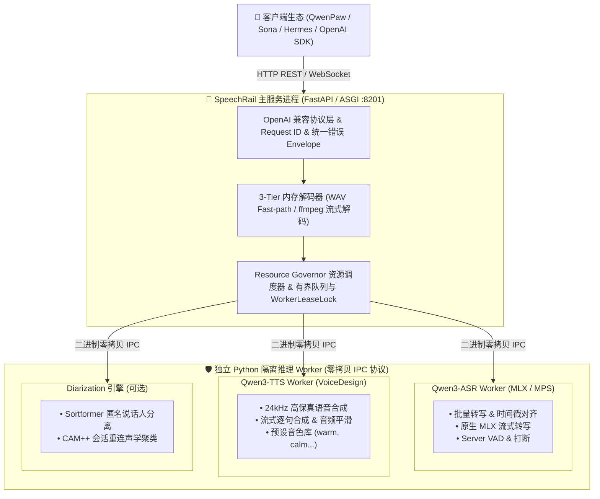

# 📚 SpeechRail 文档中心

  <strong>面向本地应用的高性能、隐私优先、OpenAI 契约兼容的语音识别 (ASR) 与合成 (TTS) 运行时服务</strong>

  
  
  
  

欢迎查阅 SpeechRail 官方技术文档。本文档中心根据不同读者角色与职责进行模块化组织，助您快速获取所需信息。

---

## 🧭 按角色快速进入

| 角色领域 | 关注重点 | 推荐入口文档 |
|:---|:---|:---|
| 🎯 **产品经理 / 业务方** | 业务价值、应用场景、功能矩阵、边界与规划 | [📖 产品白皮书与全景概述](product/overview.md)   [📋 产品边界与职责划分](architecture/product-scope.md) |
| 🏛️ **架构师 / 技术决策** | 架构拓扑、进程隔离、零拷贝 IPC、状态机、ADR | [🏛️ 总体架构设计](architecture/architecture.md)   [⚖️ OpenAI 兼容性审计](architecture/openai-conformance-audit.md)   [📜 架构决策记录 (ADR)](decisions/README.md) |
| 🔌 **API 用户 / 客户端集成** | REST / WebSocket 契约、SDK 接入、音色库、错误码 | [🔌 客户端与 SDK 接入指南](users/integrations.md)   [📡 公共 API 契约手册](users/api-contract.md)   [⚡ OpenAI Realtime 协议规范](../contracts/realtime-openai.md) |
| 🛠️ **核心开发者 / 贡献者** | 5分钟启动、代码分层、测试金字塔、Worker 扩展 | [🛠️ 开发者开发指南](developers/development-guide.md)   [🧪 测试与质量验收规范](developers/testing-acceptance.md) |
| 📦 **运维工程师 / SRE** | LaunchAgent 常驻、Wheel 发布、排障决策树、监控 | [📖 运维操作手册 (Runbook)](operations/operations-runbook.md)   [🚀 运行时部署方案](operations/runtime-deployment.md)   [🔒 安全与可观测性](operations/security-observability.md) |

---

## 🏗️ 全局系统拓扑

---

## 📊 当前能力矩阵与就绪状态

| 功能模块 | 运行状态 | 协议与入口 | 核心能力特征 | 验证证据 |
|---|---|---|---|---|
| **批量语音识别 (ASR)** | 🟢 生产就绪 | `POST /v1/audio/transcriptions` | OpenAI 格式全兼容，WAV 零开销 Fast-path 直读，支持 `verbose_json`、`srt`、`vtt` | 真实短音频与长音频基准测试通过 |
| **高保真语音合成 (TTS)** | 🟢 生产就绪 | `POST /v1/audio/speech` | 24 kHz PCM16 / WAV / MP3 输出，预设音色路由 (`default`, `warm`, `calm` 等) | 真实合成端到端验证通过 |
| **实时全双工流式 (Realtime)** | 🟢 生产就绪 | `WS /v1/realtime` | 纯净 ASR/TTS 子集，支持 Server VAD、打断 (Barge-in)、逐句流式 TTS | OpenAI SDK 与 Sona 接入实测完成 |
| **说话人分离 (Diarization)** | 🟡 可选就绪 | Realtime session 参数扩展 | Sortformer 在线匿名说话人分离，CAM++ 短期声学重连聚类 | 匿名状态机与有界内存测试通过 |
| **macOS 常驻运维服务** | 🟢 生产就绪 | `speechrail service` CLI | 用户级 LaunchAgent 管理，支持原子安装、状态感知与一键回滚 | 自动化测试与实机验证通过 |

---

## ⚖️ 事实来源层级 (Hierarchy of Truth)

在查阅或更新文档时，请严格遵守以下事实来源优先级：

1. **第 1 层级（最高事实）**：当前代码实现、自动化测试套件与实际运行验证结果。
2. **第 2 层级（接口规范）**：[`contracts/openapi.yaml`](../contracts/openapi.yaml) 与 [`contracts/realtime-openai.md`](../contracts/realtime-openai.md)。
3. **第 3 层级（正式文档）**：状态为 `active` 的架构、产品、开发、运维文档与 [ADR (架构决策记录)](decisions/README.md)。
4. **第 4 层级（历史材料）**：[`docs/archive/`](archive/README.md) 中的历史设计与过程计划，**仅作追溯参考，不代表当前功能承诺**。

> [!IMPORTANT]
> `/readyz` 返回 200 仅代表模型推理入口已完成配置与预检，真实业务上线前仍需执行对应角色的端到端 Smoke 验证。
