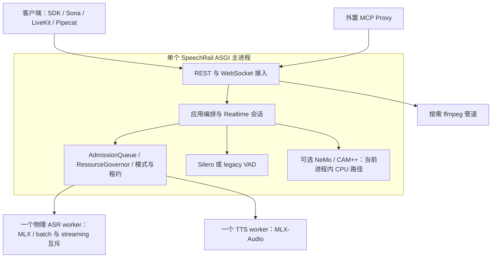

# SpeechRail 单机语音基座优化方案

## 1. 决策摘要

**建议保留现有分层、共享 ASR worker 与三档模型体系，先修复契约和生命周期，再优化重复计算与缓冲，最后以真实质量数据决定推理参数。** 当前最高收益的工作不是换模型、增加 worker 或重写服务，而是让现有能力准确、可测、可恢复地交付给客户端。

优先完成四件事：

1. **OpenAI 兼容从“路径与字段近似”提升为“版本明确、语义可验证”**：补齐当前 Realtime 的嵌套 session 配置、24 kHz 输入适配、事件名、配置增量更新和 item 关联。
2. **实时控制不被推理和慢客户端拖住**：控制事件与音频数据有界分流；取消先阻断旧音频，再完成推理清理；建立总 deadline。
3. **减少无效计算和复制**：按需保留 ASR 对齐音频、避免分人开启后正文等待二次识别、统一 TTS 分句与参考音频处理。
4. **把“更专业”落实为验收门**：独立真人语料、噪声与回声场景、连续会话、音色稳定性、同时间点物理内存；缺失数据保持 `unset`。

“单机语音基座”的责任是：**本地音频输入 → 可靠转写 / 合成 / 匿名分人 → 标准协议交付**。麦克风、播放、AEC、LLM、会议和应用打断决策继续由 Sona、LiveKit、Pipecat 等客户端承担。

### 六项目标的具体含义

| 目标 | 应优化的结果 | 避免的误判 |
|---|---|---|
| 更快 | 首个稳定转写、最后语音到终态、首个可播放音频、取消后下一次合成 | 单看模型 RTF 或首个 WebSocket 事件 |
| 更稳 | 每个 item 恰好一个终态；取消、断线、坏帧后可恢复；缓冲有界 | `/readyz=200` 等同全能力可用 |
| 更省 | 每秒有效音频所需计算、物理内存峰值、空闲驻留和重载次数 | 把低量化精度、频繁卸载当成默认最优 |
| 更专业 | CER/WER、数字与术语正确率、音色一致性、端点质量、分人质量 | 非空结果、固定 seed 或音频 hash 等同质量 |
| 更易用 | 一条明确接入路径；能力、错误和恢复方法可发现 | 暴露大量内部开关让用户自行组合 |
| 高度兼容 | 已承诺子集在真实 SDK 中请求、响应、流事件和错误均可消费 | 模型 alias 等同 OpenAI 模型能力、音色或完整 Realtime Agent |

## 2. 研究范围与证据边界

核验日期：**2026-09-08，Asia/Shanghai**。仓库基线为 `main` / `75e1357`，项目声明版本 `1.12.0`。研究同时使用当前源码、契约、针对性测试、无模型探针与外部一手资料。

开始时已有 `src/speechrail/domain/tts.py`、`tests/test_tts_voice_clone.py` 未提交改动；本方案不修改这两处，也不把其中尚未提交的克隆变化视作已发布保证。交付仅新增本文，不改代码、契约、服务配置或模型，不提交 Git。

收尾时另有并行任务修改 `AGENTS.md`、部署 / 发布 / benchmark 技能，以及开发者入口、开发指南和测试验收文档。这些改动均保留；已核对新增的纯文档验收规则。源码结论所依赖的核心实现未出现新的 Git 改动。

证据分为：

- **源码事实**：当前工作区的实现与调用路径。
- **本次探针 / 测试**：无真实模型的确定性验证，可证明对应分支行为，不能证明模型质量或线上延迟。
- **历史记录**：既有发布与 benchmark 摘要，仅供建立后续基线。
- **外部资料**：官方文档、SDK / 上游实现与原始论文；访问日期为本次核验日，`main` 分支内容可能变化。
- **方案 / 假设**：尚未实施或测量，收益没有被当作实测数字。

Codebase Memory 使用 Tier 2，初始 generation 为 `2026-09-07T13:25:03Z`，收尾的补充覆盖检查返回 generation `2026-09-08T02:11:06Z`。核心证据路径逐一检查覆盖，并直接读取关键源码；本任务未请求重建索引。检查返回无已记录缺口，但这不证明图谱穷尽；动态注入、闭包与 vendor 调用以源码补证。本次不是全仓库安全审计，也未复验本机部署、真实客户端、当前硬件或三档性能。

## 3. 专业领域调研：应采纳什么

### 3.1 ASR：区分模型能力、运行时能力和交付语义

Qwen 官方 ASR 实现的 streaming 路径注明 vLLM 限制，且该路径不支持 batch 或返回时间戳。SpeechRail 实际使用 `mlx_qwen3_asr.Session`，不能直接套用官方 vLLM 的实现能力与性能结论。上游 MLX 实现说明了滚动解码、有界上下文、KV-cache 复用、稳定前缀与 finalization 策略；这些能力需在项目固定版本中逐项探测。参见 [Qwen3-ASR 官方仓库](https://github.com/QwenLM/Qwen3-ASR)、[MLX ASR 上游](https://github.com/moona3k/mlx-qwen3-asr)。

适合本项目的实践：

- 一个物理 ASR 模型承载 batch / streaming 两种互斥工作模式；不为吞吐复制模型进程。
- batch 保持现有有界 PCM 窗口与 overlap 合并；补测窗口边缘的数字、术语、长停顿和语言切换。
- streaming 对外只交付可追加的稳定前缀；可修订尾部留在内部，最终正文通过 completed 校正。
- 文本、时间戳和说话人归属分层计算。纯字幕不付对齐成本；开启分人不能重写已交付正文。
- 用同一语料比较 chunk / context / finalization；同时观察准确率和单位音频计算量。减小 chunk 可能增加推理频率和总成本，并不保证更低尾延迟。

**建议保留 Qwen3-ASR 主线。** 本轮没有同机、同语料证据证明另一个模型同时更快、更准、更省；不建议立即迁移 Whisper、Parakeet、Voxtral 或另建运行时。

### 3.2 TTS：模型流式、协议流式与可播放流式分别验收

Qwen3-TTS 论文给出流式 tokenizer 与低首包延迟设计，但论文数字不等于 SpeechRail 在本机 MLX、量化权重和 VoiceDesign 下的可播放延迟。项目调用的 MLX-Audio 与 Qwen 官方 Python 包也是不同实现。参见 [Qwen3-TTS 技术报告](https://arxiv.org/abs/2601.15621)、[Qwen 官方实现与评测](https://github.com/QwenLM/Qwen3-TTS)、[MLX-Audio](https://github.com/Blaizzy/mlx-audio)。

应分别测量：提交文本到模型首 PCM、首 PCM 到网络首字节、网络首字节到客户端首个可播放帧。压缩容器的 header、编码器缓冲、静音首块都可能让“收到字节”早于“听到语音”。OpenAI 官方建议低延迟场景使用 WAV / PCM；默认 MP3 和其他格式仍应为兼容性保留。参见 [OpenAI TTS 格式说明](https://developers.openai.com/api/docs/guides/text-to-speech)。

适合本项目的实践：

- 统一一次文本规范化和分句，首句适度短，后续句保持韵律上下文；长句有硬上限。
- 停顿随标点与语音结果调整，不把每段固定插静音视作质量优化。
- 淡入淡出用于处理边界；只有保留相邻尾首样本并真正重叠混合才称 crossfade。不能仅凭函数名声称消除了拼接感。
- 常用固定 voice 使用已验证的确定性条件；质量评估仍覆盖重复生成、长段落、跨语言和不同内容。
- 克隆参考特征只有在 adapter 能明确管理生命周期时才缓存；缓存绑定权重指纹、voice 版本与采样配置，有容量上限，删除 voice 或切档时失效。

### 3.3 VAD、endpointing 与打断：拆开三个问题

Silero VAD 提供帧级语音概率，上游 ONNX wrapper 在 16 kHz 下使用 512 样本帧、64 样本上下文和每流递归状态；迟滞阈值也是上游已有实践。**SpeechRail 已实现这些关键机制，本轮不重复建设。** 参见 [Silero 官方 wrapper](https://github.com/snakers4/silero-vad/blob/master/src/silero_vad/utils_vad.py)。

VAD 回答“有没有人声”；endpointing 回答“是否到了语音段边界”；语义轮次检测与打断策略回答“此刻是否应该让应用说话 / 停止播放”。LiveKit 和 Pipecat 均将语音活动与更高层轮次处理组合使用，语义模型是可选成本与能力，不是 VAD 的免费替代。参见 [LiveKit turn handling](https://docs.livekit.io/agents/logic/turns/)、[Pipecat Smart Turn](https://docs.pipecat.ai/api-reference/server/utilities/turn-detection/smart-turn-overview)。

本项目建议：

- 保持 `auto → silero / legacy` 的明确解析与配置失败关闭；增加 resolved engine / readiness 的诊断可见性。
- 以安静、键盘、风扇、音乐、弱声、远场、播放回声和连续说话为标注场景，校准 threshold、起振持续时间、尾静音和 pre-roll。
- 250 ms cooldown 只抑制短时间重复取消，不能消除第一次回声触发；AEC 和播放缓冲清理仍需客户端完成。
- 服务提供 manual / server_vad 和确定的取消能力；语义 turn detector 优先由消费端选配。暂不在 SpeechRail 内常驻额外 LLM 或语义模型。
- 不将 Silero 的概率数值等同 OpenAI 内部评分器的校准结果；兼容字段与范围不意味着相同 threshold 在相同录音上触发一致。

### 3.4 实时语音与 OpenAI：兼容的是一组具体语义

当前官方转写示例使用 `session.type="transcription"`、`audio.input.format={type:"audio/pcm",rate:24000}` 与嵌套 transcription / turn_detection。官方也要求使用 item ID 关联多轮转写。参见 [OpenAI Realtime transcription](https://developers.openai.com/api/docs/guides/realtime-transcription)。

官方 `session.update` 定义为仅更新出现的字段；显式 `null` 才用于清除对应配置。当前 SDK 的 `ResponseAudioDeltaEvent` 类名虽然仍含 Audio，wire literal 已是 `response.output_audio.delta`。**必须读字段 literal，不能从类名推断事件名。** 参见 [SessionUpdateEventParam 源码](https://github.com/openai/openai-python/blob/main/src/openai/types/realtime/session_update_event_param.py)、[ResponseAudioDeltaEvent 源码](https://github.com/openai/openai-python/blob/main/src/openai/types/realtime/response_audio_delta_event.py)、[音频格式模型](https://github.com/openai/openai-python/blob/main/src/openai/types/realtime/realtime_audio_formats.py)。

同时，OpenAI 的 `create_response` / `interrupt_response` 属于 speech-to-speech conversation 语义；转写 session 中 VAD 只负责音频切段。SpeechRail 的显式 TTS 播报应被声明为语音子集行为，不把它伪装成带 LLM 的完整对话。参见 [OpenAI VAD](https://developers.openai.com/api/docs/guides/realtime-vad)。

### 3.5 Diarization：稳定归属比尽早给出标签更重要

Streaming Sortformer 通过流式缓存和到达顺序管理说话人输出；时延与稳定性存在权衡。论文或离线 checkpoint 的存在，不代表当前本地 adapter 已具备连续流实现。参见 [Streaming Sortformer 论文](https://arxiv.org/abs/2507.18446)。

保留项目已有 session sample 时钟、不可变正文、tentative / stable / unknown、revision、finalize 屏障及故障降级。验收使用 DER / JER、重叠说话、归属延迟和 unknown 比例；禁止为了看起来完整强行补 speaker。跨会话建议关联仍不能升级成实名身份系统。

## 4. 当前真实架构



### 4.1 已经合理、应保留的部分

| 结构 | 当前源码事实 | 判断 |
|---|---|---|
| 组合根 | `app.py:create_app` 使用 lifespan；`build_app_services` 组装 ports / adapters | 保留，易替换 fake backend；无需再次“迁移 lifespan” |
| 共享 ASR | batch 与 streaming facade 共享 `Qwen3SharedWorker`，模式门限制冲突 | 符合单机定位；不要拆成两个模型常驻进程 |
| TTS 交付 | worker chunk 顺序校验、PCM 格式校验、REST / WS 共用 validator | 是扩展取消与格式兼容的可靠基础 |
| 文件转写 | `decode_upload → transcribe_stream → PcmWindowBuffer → TranscriptMerger` | 已有有界流式解码和窗口合并；缺的是公共 SSE，不是内部完全不分块 |
| 调度 | 有界准入、实时预留、batch FIFO 与 aging | 适合单机；它是准入调度，并非 GPU 推理抢占 |
| 静音控制 | SpeechAdmission、prefix、迟滞、整数样本时间线与空终态 | 保留为回归不变量 |
| 部署模型 | 受管 release、profile、身份校验与回退流程已有文档和实现入口 | 本轮沿用，不引入容器编排或新常驻管理服务 |

仓库 runtime lock 声明 `mlx-qwen3-asr==0.3.5`、`mlx-audio==0.4.8`、`mlx==0.32.2`。这是**构建制品声明**，不是本次验证了已部署 vendor 环境。评估上游新功能时须以这组固定版本做 capability probe。

### 4.2 需要修正的架构认知

1. IPC 实际为长度前缀、JSON metadata 与 raw binary 的混合帧，`encode_frame` 有 bytes 拼接，decode 有切片；不是文档所写的 Magic / MsgPack 帧，也不是严格零拷贝。去掉 Base64 是收益，但不能宣称 CPU 为零或未测的 `<0.1ms`。
2. ASR/TTS 推理进程隔离成立；Silero 在主进程执行，当前 NeMo adapter 也在主进程中加载 CPU 模型。不能声称所有模型都在独立 worker。
3. 多 WebSocket 会话不等于多路模型并行计算；共享模型的服务时间与队首阻塞仍需测量。
4. `ResourceGovernor.reserve(deadline=...)` 仅对等待准入计时。REST ASR 后续 AdmissionQueue 重新使用一个相对 timeout，端到端预算可能相加；Realtime TTS 的 reserve 不约束整个生成过程。
5. `_heavy_overlap_policy` 用配置的 MLX limit 作为组件估计；未配置时为 unknown，启用 diarization 时其 footprint 也是 unknown，策略会保守串行。当前没有证据支持“根据实际负载动态自适应并行”。

以上是有证据的描述修正，不代表应立即把 IPC 改成共享内存，或把每个 CPU 模型再拆为进程。

## 5. 优化项与证据

优先级定义：P0 为承诺失真或正确性边界；P1 为直接影响体验和资源的改进；P2 为已有消费者需要时再扩大能力。并非所有 P0 都是崩溃故障。

| ID / 优先级 | 当前问题及证据 | 建议与验收重点 |
|---|---|---|
| C1 / P0 | 官方嵌套 24 kHz session 探针返回 `unsupported_audio_format`；去掉 format 后，嵌套语言 / VAD 被忽略。`compatibility/openai_realtime.py:602` | 标准配置归一化，明确采样率，24→16 kHz 有状态重采样；官方示例进入正确配置分支 |
| C2 / P0 | 本地发 `response.audio.delta`；当前官方 SDK literal 为 `response.output_audio.delta`。本地 renderer 约 L494 | 建立有版本的 wire profile；全套相关事件与 content / session schema 一起验证，不能只替换一个字符串 |
| C3 / P0 | `_update_session` 重建 config；未带 turn_detection 会清除 VAD，并可能清掉其他配置。`application/realtime_openai.py:248–377` | 实现字段缺失 / null / 显式值三态；先验证候选快照，再原子提交；回包返回完整有效配置 |
| C4 / P0 | 旧模式连续 commit 复用 `item_{session_id}_input`，探针确认；partial 也硬编码该 ID。`compatibility/openai_realtime.py:172–247` | 所有模式共用 TurnContext 与唯一 item ID、previous item 关系；partial、final、错误和分人扩展使用同一 ID |
| C5 / P0 | partial 修改前缀时发送 common-prefix 后缀，追加会残留旧字；模拟 `abc→adc` 后追加长度变为 5 而非 3。`application/realtime_openai.py:1178–1197` | 只发稳定前缀；完整修订结果在 completed 交付；需要修订事件的客户端另行显式协商扩展 |
| R1 / P1 | TTS 未完成流在 finally 调用 transport.abort，下一次合成可能重新加载模型。`backends/qwen3_tts.py:194–264` | 先测取消后冷启动；具备 vendor 安全检查点时加入协作取消，超时仍保留 abort 兜底 |
| R2 / P0 | receive_loop 中 `_decode` 位于错误 envelope 的捕获层之外；非法 JSON 走 task 异常路径。`http/routes/realtime_openai.py:117–195` | 在接收边界捕获协议错误，发送稳定 error；明确可恢复 / 关闭策略；错误路径也归还会话槽 |
| R3 / P1 | 512 个 client events 按数量限流；音频、commit、cancel 共用串行 handle_loop；send_json 无本层超时。`http/routes/realtime_openai.py:29–193` | 按字节 / 音频时长加预算，控制事件单独处理并保序；发送超时与慢消费者关闭；验证资源归还 |
| R4 / P1 | 多层相对 timeout；TTS reserve 只限制准入等待。`resource_governor.py:101–116`、`audio.py:891` | 单个绝对 deadline 贯穿排队、解码、锁、推理和交付；长流另设总时长与 idle timeout |
| A1 / P1 | 所有 streaming session 都创建并累积 `_align_buffers`，虽然只有 want_segments 时才使用。`qwen3_worker.py:995–1057` | 在 session.open 即声明 timing 需求；纯 ASR 不保留整段对齐 PCM；关闭、超时和 rollover 清理 |
| A2 / P1 | want_segments 时 `_handle_commit` 在 completed 前调用 `align_session_audio`；该方法重新执行带 timestamp 的 transcribe。`qwen3_worker.py:448–490,1032` | 普通转写尽快交付；有原生对齐能力时按 canonical text 对齐。二次解码保留为有界 fallback，不能替换正文 |
| T1 / P1 | WS 先用 StreamingSentenceSplitter 分句，worker 再 bounded_sentences；WS 每句间固定 80 ms 静音。`application/realtime_openai.py:1330`、`qwen3_tts_worker.py:350` | 一处负责语义分句，一处仅作安全上限；统一 REST / WS 韵律、末字保留和首包验收 |
| T2 / P1 | 克隆路径每次 `_generate` 加载参考音频并调用私有 `_generate_icl`，该分支未传入普通分支的 speed / token budget 等参数。`qwen3_tts_worker.py:386–416` | 逐参数明确支持 / 拒绝 / 适配；固定 vendor adapter 契约；参考缓存必须在音色并行改动合入后实施 |
| D1 / P0 文档；P2 实现 | 当前生产 `NemoSortformerEngine.supports_stream=False`，native stream factory 明确抛错；应用层扩展与 fake 路径存在 | 更新当前能力说明；若会议消费者需要连续分人，单独打通 native step 与真实 CPU gate 后再广播 |
| O1 / P1 | ASR `inference_duration` 实际含 governor 排队、解码等；TTFA 记录位置在发送前。`audio.py:888–906`、`metrics.py:260–299` | 保留旧指标并标注口径，新增阶段耗时；客户端另测 playable latency；不能把旧指标直接解释为模型时间 |
| U1 / P0 文档；P1 工具 | 文档中有过期默认会话数、VAD draft、完整兼容、独立分人 worker 等描述；`/readyz` 只要求 ASR/TTS 之一可用 | 生成能力矩阵与配置默认表；复用现有 CLI / MCP describe 提供能力诊断，不新增管理平台 |

### 5.1 音频入口预算的量化例子

按默认合法单帧上限 160,000 PCM bytes 计算，512 条满尺寸音频消息的 Base64 正文约为 **109 MB（约 104 MiB）/连接**，尚不含 JSON / Python 对象和其他缓冲。常见 32 ms 小帧不会达到该值，但“512 条”不能单独证明整个接入层内存足够小。

建议将预算统一表达为：连接总入站字节、已解码 PCM 时长、待处理音频时长、outbound 字节和在途控制事件数量。预算耗尽时明确报错 / 关闭，不丢弃用户音频并伪装成功。`cancel` 可以使旧 generation 音频失效；`commit` 仍须等待它之前的全部 append，不能简单优先级插队。

文件上传也应在 multipart 解析前设长度、接收超时和总并发预算。当前 UploadFile 进入 route 前已经历框架解析；本轮未实测临时文件行为，因此**不确认“所有上传绝不落盘”**。后续应明确验证 spooling 策略与长文件支持的权衡，而不是直接无限调大内存阈值。

## 6. 推荐实施设计

### 6.1 一套内部协议模型，受控兼容不同 wire profile

保持同一个 `/v1/realtime` 入口与一个内部状态机。接入层把已声明支持的 OpenAI 字段归一化为内部 SessionConfig / TurnContext / AudioFormat，事件 renderer 负责 wire 格式。

建议的迁移顺序：

1. 固定本次官方参考 schema / SDK 版本，并记录源码 revision；建立真实 SDK 消费端的离线 conformance 测试。
2. 先支持明确的新版 `session.update` 格式；新格式输入 24 kHz PCM 经状态化重采样后进入现有 16 kHz 内核，所有时间戳继续以内部整数 sample clock 计算。
3. legacy 16 kHz 客户端通过明确的兼容配置继续工作；不能通过 PCM 字节内容猜采样率，也不能在首次 audio 后改变格式。
4. 为 session.created、session.updated 和后续事件统一确定 wire profile。需要在握手前明确 profile 的客户端使用显式握手选择；标准 SDK 的默认接入策略必须经 Python / Node 消费测试后确定。**不通过双发新旧音频事件迁移**，避免重复播放。
5. 未协商客户端默认行为维持不变；新行为先 opt-in。旧 alias / wire profile 的移除需要公布废弃计划和消费者迁移证据。若最终需要破坏 `/v1` 行为，另走版本化公共变更决策，本轮不重建已退役 `/v2/realtime`。

重采样验收要覆盖随机分帧、奇数字节、尾部 flush、clear、重连和长会话：同一音频的结果不能依赖客户端如何切分网络帧，且累计时间漂移必须受控。

兼容矩阵应逐项标记 `supported / adapted / accepted-no-effect / unsupported`。REST ASR、REST TTS、Realtime transcription、显式 TTS 子集、diarization 扩展分别列出；模型 alias 只表示路由，不承诺 logprobs、云端音色、LLM、工具或对应云模型质量。

### 6.2 取消与背压：先建立完成条件，再优化 worker

取消分为三个可测时刻：**服务收到取消 → 不再发送该 response 音频 → worker 确认停止并释放资源**。客户端停止实际播放是第四个独立时刻。

推荐先修客户端事件队列与 generation 丢弃，保留现有 abort 作为可靠兜底，再验证模型流迭代器是否能在 chunk 边界安全停止。当前同步推理 worker 不能只增加一个 `cancel` 帧就变得可抢占：控制读取必须能在推理期间收到信号，推理仍保持单执行者；若 vendor 卡在一次不可中断 kernel 中，仍应在有界等待后终止该 worker。

采用 request ID + generation + cancel acknowledgment，确保旧音频不进入新响应，资源归还恰好一次。成功的正常取消尽量保留模型；协议损坏、无 ack 或进程失联继续 abort。回退开关恢复现有安全终止策略。

### 6.3 ASR：先修交付正确性，再调 chunk

将稳定前缀策略放在 adapter / transcript delivery 层，消费上游已验证的 stable text；固定版本没有该能力时，使用保守稳定前缀确认，并接受更高 partial latency。当前 `hold_back_words`、`stable_iterations` 等配置是否真正到达 vendor 并生效应做端到端参数探针，不从配置名推断能力。

对齐缓冲由会话开始时的需求控制，避免等 commit 时才知道是否需要时间戳。当前非扩展缓冲默认约 8 MiB，取消无用对齐副本的理论收益是每个活跃 item 少一份对应 PCM；实际 phys_footprint 降幅仍须测量。扩展模式 8 秒 item 则收益较小，不能夸大。

对齐与分人异步化优先用于已经协商 revision / finalize 的扩展：正文 completed 后，再在既有归属契约中完成修订。普通 OpenAI completed 若承诺同步 segments，必须维持其语义，不能悄悄将必需字段延后。

后续只对 chunk（例如 0.5 / 1 / 2 秒）、上下文与 finalization 做受控实验；先固定模型、语料与负载。采用满足 CER/WER 门的最低交互延迟组合，而非无条件缩短所有窗口。

### 6.4 TTS：统一分句，明确音色与参数能力

抽出共享 TtsTextPlanner / TtsDelivery 用例，让 REST、WS 与 preview 复用 text normalization、分句、voice 能力验证和输出计量。worker 保留对单段输入的安全上限，避免两个层次各自重新解释标点。

克隆缓存先从解码后的参考波形或 vendor 明确支持的条件特征开始，只有测到命中收益才保留。缓存键包含参考内容指纹、权重与处理参数；不默认缓存完整用户文本 / 成品音频，不跨用户音色删除保留旧引用。

VoiceDesign、CustomVoice 与当前项目私有 ICL 路径分别建立参数能力表。`speed`、`instruction`、`seed`、语言和最大输出必须在每个实际路径有定义，不能借助 SDK 接受参数来暗示它生效。尤其要在现有未提交克隆改动稳定后评审，避免并行改坏同一模块。

### 6.5 资源管理：预算覆盖整个服务，质量优先

保留当前三档只改变权重 / 量化组合的原则，不增加随请求自动切模型或降低音色质量的策略。

将服务预算细分为共享 ASR、TTS、可选分人、主进程 / decoder、PCM / event buffers 和安全余量。沿用 MLX 内存 / cache limit，但限额不能替代实际物理占用采样，也不能把两个独立进程各自设为系统上限当作总预算。

按固定 runtime 与 artifact 的实测峰值形成保守预算，unknown 继续串行。对实际内存压力和事件循环 lag 的响应优先为：拒绝新重任务、缩短无用等待、释放空闲可重建缓存；不在请求中换模型或下载权重。

短期继续使用已有 warm standby / idle eviction；用一段真实交互的空闲间隔分布调整参数。把“取消后的重载”和“空闲释放后的重载”分开计数。避免为节省空闲内存导致每轮交互都重新 warmup。

### 6.6 可维护性与易用性

重构只沿正在修复的职责进行，优先拆出 Realtime 的 SessionConfig、TurnContext、AudioIngress、AsrDelivery、TtsResponse；保留组合根和 ports。`OpenAIRealtimeSession` 目前约 1,400 行，拆分的目的应是隔离配置、时钟与生命周期不变量，不能以文件行数为唯一成功指标。

复用现有 CLI 与 MCP `describe` 形成诊断输出：配置有效、artifact 验证、能力可准入、权重已驻留、最近 smoke 时间、当前忙碌原因、恢复动作。区分 ASR / TTS / VAD / diarization；继续保留 `/readyz` 的既有语义，提供分能力检查结果供客户端选择。

面向用户保留三条接入路径：文件转写、文本播报、实时字幕。每条有最短示例、固定音频格式、支持的 SDK 版本和一个可执行的自检。LiveKit / Pipecat 使用 STT / TTS 组件接入 SpeechRail，不能默认套完整 Realtime LLM provider。

文档修正也是交付的一部分：当前能力页由契约与配置生成；设计提案标 draft；历史 benchmark 不滚动覆盖。让任何能力宣称都能追溯到源码、契约或有日期的验收。

## 7. 路线选择与实施批次

| 路线 | 收益 | 成本与判断 |
|---|---|---|
| **A：现有内核增量修复（推荐）** | 直接减少兼容失败、交互重载与重复计算；复用现有测试与部署 | 需要清理既有状态机边界；风险可按批次回退 |
| B：替换整个推理 runtime / 模型系列 | 可能获得特定硬件性能收益 | 尚无同口径质量与兼容证据；延期至 A 完成并有模型瓶颈证据 |
| C：改造成端到端语音 Agent 平台 | 集成 LLM、RTC 和会话 UI | 超出单机语音基座定位，维护面显著扩大；不采用 |

以下是工作量量级估计，不是交付日期承诺；按单人串行推进，质量语料准备可独立开展。

| 批次 | 范围与依赖 | 主要改动位置 | 退出条件 | 量级 / 回退 |
|---|---|---|---|---|
| S0 事实与基线 | 本文复核后开始；建立固定语料 manifest、能力矩阵、修正文档 | architecture / users / contracts 的说明与评测入口 | 现状、未知项、参考版本可追溯；不得把 draft 当 active 能力 | 小；文档独立回退 |
| S1 契约正确性 | C1–C5、R2；先失败回归，再实现；先内部统一，再 wire 适配 | compatibility、application/realtime、HTTP WS、契约和 SDK fixtures | 官方载荷、增量 update、唯一 item、稳定 partial、坏帧闭环通过；旧客户端继续工作 | 中到大；wire profile opt-in，保留旧 renderer |
| S2 生命周期与容量 | R1、R3、R4、O1；依赖 S1 的 ID / generation | runtime、WS transport、TTS adapter、metrics | 控制事件不被长 commit 阻塞；慢消费者和无 ack 释放资源；统一 deadline | 中到大；协作取消可退回 abort，保守预算可恢复 |
| S3 性能与听感 | A1、A2、T1、T2；先具备分阶段指标与稳定克隆基线 | ASR worker、TTS worker、共享 delivery、评测工具 | 同语料非劣质量，改善真实关键路径；缓存有界且能失效 | 中；逐优化开关 A/B，模型档位不变 |
| S4 专业能力与易用性 | D1 native 按消费者需求单列；U1 诊断与客户端示例 | diarization adapter、CLI / MCP、用户文档 | 真实 native probe / CPU smoke / DER 与集成验收后才广播；用户可完成三个接入流程 | 中；能力开关关闭，原转写继续可用 |

**建议第一个实施包**聚焦 C3、C4、C5 与 R2：不用换模型或操作运行态，就能修复配置、结果关联、文本追加与坏帧行为；同时启动 C1/C2 的 SDK conformance 设计，避免协议版本迁移与状态机修复混成一次不可审查的大改。

## 8. 验收设计

### 8.1 用阶段指标定位延迟

```text
ASR final latency = 最后语音样本到 endpoint + 排队 + 尾部解码 + 必需对齐 + 发送
TTS first playable = 准入等待 + 模型启动/条件构造 + 首 PCM + 容器缓冲 + 客户端缓冲
```

这些是测量拆分，不应简单把彼此重叠的流水线阶段相加当作精确总时间。统一用 monotonic clock，音频时间使用整数样本时钟。建议增加：queue wait、worker lease wait、decode、model first PCM、ASR stable delta、commit final、alignment、send stall、cancel acknowledgment、reload count、buffer bytes 和 event-loop lag。标签限定 operation / outcome / profile / engine，禁止把 request ID、转写或 voice 自由文本作为指标标签。

### 8.2 候选验收门

下列数值是**建议初始目标，尚非实测承诺**。S0 先建立可比基线；绝对目标若不适合当前 runtime，应记录原因并保留质量和相对改善门，不能通过更换测试文本制造达标。

| 维度 | 场景 | 建议门 |
|---|---|---|
| 契约 | 固定 Python / Node SDK；REST / Realtime 支持子集 | 所有承诺用例通过，未知能力明确失败；同一响应不双发音频 |
| 正确性 | 随机分帧、重复 clear / commit、partial 修订、配置部分更新 | 恰好一个终态、ID 关联正确、无串会话、无文本错误追加 |
| 实时 ASR | 真人短句 / 中英混合 / 数字术语 / 噪声 | 候选 last-speech→final p95 ≤1 s；首稳定 partial p95 ≤1 s；CER 相对基线不劣于约定容差 |
| TTS | 热启动短句与长段落；PCM 与压缩格式分别统计 | 候选 PCM 首可播放 p95 ≤300 ms；RTF <1；长段无持续 underrun；首末字保留 |
| 取消 | 生成中、排队中、慢发送中各 100 次 | 服务端取消到阻断旧音频候选 p95 ≤100 ms；正常协作取消无重载；无 ack 必须走有界 abort |
| VAD | 至少各 30 分钟静音 / 噪声，另有标注语音 | 无声不产生非空转写；漏检、首字裁剪、尾字截断与误打断率分别报告；不只报 frame accuracy |
| 容量 | 1 / 2 / 3 活跃会话，慢消费者，batch 与 streaming 冲突 | 预算内无非预期失败；超预算稳定拒绝；冲突保持 backend_busy |
| 长稳 | 先 30 分钟回归，再 2 小时连续场景 | 无句柄 / 任务 / session 槽泄漏，热身后内存无随时长单调增长；资源归还到基线 |
| 音色 | 多次生成、长段落、VoiceDesign / CustomVoice 各自评估 | 独立 ASR 复核内容 + 人工 ABX / MOS + speaker similarity；人工认为退化时不以 hash 覆盖结论 |
| 分人 | 1–4 人、重叠说话、短插话、噪声与 finalize | DER/JER、unknown 与稳定延迟一并达标；真实连续 adapter 不可用时 gate 保持 unset |
| 更省 | 相同语料、档位、负载与音质门 | 报告计算量 / 音频秒、同 tick phys_footprint 峰值、空闲驻留、重载次数；每项优化单独归因 |

短样本 N=5 可用于初筛与回归观察，不能证明 p95 / p99。时延分位数建议至少 100 次代表性交互，并给出样本量、分布与异常值。准确率门按语言与场景分层，建议先使用中文 CER 非劣容差 0.3 个百分点作为评审起点，不能让长文本平均分掩盖数字与术语错误。

语料应来自仓库外的授权真人录音和人工标注；固定 manifest、duration、hash、分组和归一化规则。不能只用 SpeechRail 自己生成的音频再让自己识别。TTS 文本、voice、seed、runtime、artifact 指纹与 cold / warm 条件均固定；人工评测可在本机进行，不上传私人音频。

性能操作遵循现有 [性能与质量基准 SOP](../../.agents/skills/speechrail-perf-benchmark/SKILL.md)；未来部署遵循 [发布 SOP](../../.agents/skills/speechrail-release/SKILL.md)。本次未执行真实模型 benchmark、加载 / 卸载或服务切换。

## 9. 本次验证与后续风险

### 本次完成的验证

- 运行了 6 个测试文件，共 **137 项通过**：Realtime、Silero VAD、ResourceGovernor、TTS adapter、共享 ASR worker 与分块文件转写。没有据此宣称全量 gate 或实际音质通过。
- 独立 probe 复现：官方嵌套 24 kHz 格式拒绝；嵌套配置静默丢弃；旧模式 item ID 复用；修订型 partial 无法正确追加。
- 读取并 probe 确认生产 Sortformer `supports_stream=False`；没有启动或加载其模型。
- 测试产生 Starlette TestClient / httpx 的弃用警告；本轮未升级依赖。

可复用的测试命令（开发环境已安装依赖时）：

```bash
env -u SPEECHRAIL_API_KEY uv run --no-sync pytest --no-cov \
  tests/test_realtime_openai.py tests/test_neural_vad.py \
  tests/test_resource_governor.py tests/test_qwen3_tts.py \
  tests/test_qwen3_shared.py tests/test_qwen3_chunked_transcription.py
```

### 历史证据如何使用

[v1.12.0 发布验收](../archive/performance/2026-09-07-v1.12.0-release-acceptance.md) 明确性能 / 质量 release gate 为 `unset`。[v1.11.0 基准](../archive/performance/2026-09-07-v1.11.0-performance-benchmark.md) 有 N=5 性能与物理内存记录，但真人 CER/WER、MOS/ABX 等仍为 `unset`，且指出 TTS 文本不同不能纵向比较。

因此本方案不引用早期“几十毫秒首包”作为当前质量档的验收承诺，也不把旧报告的本机硬件或峰值当作本次实测。S0 应复用其 measurement schema 和 fixture 身份，同时补足缺失质量与长稳证据。

### 仍需确认的关键事项

1. 固定 vendor 版本能否暴露稳定前缀、安全停止迭代器和 canonical-text 对齐；能力未知时使用保守 fallback，不升级依赖碰运气。
2. 真实 Sona / OpenAI SDK / LiveKit / Pipecat 的握手、采样率与事件消费需求；本轮没有读取或修改消费端工作区，也未进行 live 集成验收。
3. 当前受管 runtime 与仓库是否一致、真实 ASR/TTS 首包与取消重载成本；本轮未连接常驻服务。
4. 上传 multipart 临时文件、慢连接、坏 JSON 和发送堵塞的端到端影响；已定位代码风险，但未做大流量或运行态压力测试。
5. 克隆功能未提交改动的最终契约；T2 的缓存和参数修复应在其稳定后实施。

本次只新增方案文档，回退为移除该新增文档；已有代码、并行改动、模型和运行态保持不变。后续每批实施都应保留受管上一 release 和配置，按独立主题提交，并完成项目要求的全量代码 / 契约 gate；性能与运行态验收按对应 SOP 单独授权执行。

## 10. 核心源码导航

| 主题 | 证据入口 |
|---|---|
| 组合根、运行时组装 | [app.py](../../src/speechrail/app.py)、[services.py](../../src/speechrail/application/services.py) |
| 公共 Realtime 契约与格式 | [realtime-openai.md](../../contracts/realtime-openai.md)、[compatibility/openai_realtime.py](../../src/speechrail/compatibility/openai_realtime.py) |
| 会话配置、VAD、ASR/TTS 交付 | [application/realtime_openai.py](../../src/speechrail/application/realtime_openai.py) |
| WS 队列、接收与发送 | [HTTP Realtime route](../../src/speechrail/http/routes/realtime_openai.py) |
| REST 格式、上传与生成 | [audio.py](../../src/speechrail/http/routes/audio.py)、[audio_stream.py](../../src/speechrail/application/audio_stream.py) |
| 调度、预算与 IPC | [resource_governor.py](../../src/speechrail/runtime/resource_governor.py)、[model_budget.py](../../src/speechrail/runtime/model_budget.py)、[worker_protocol.py](../../src/speechrail/runtime/worker_protocol.py) |
| ASR 推理与对齐缓存 | [qwen3_worker.py](../../src/speechrail/backends/qwen3_worker.py)、[qwen3_streaming.py](../../src/speechrail/backends/qwen3_streaming.py)、[transcript_merge.py](../../src/speechrail/application/transcript_merge.py) |
| TTS 取消、参数与分句 | [qwen3_tts.py](../../src/speechrail/backends/qwen3_tts.py)、[qwen3_tts_worker.py](../../src/speechrail/backends/qwen3_tts_worker.py)、[tts_delivery.py](../../src/speechrail/application/tts_delivery.py) |
| VAD 与生产分人能力 | [neural_vad.py](../../src/speechrail/backends/neural_vad.py)、[nemo_sortformer.py](../../src/speechrail/backends/nemo_sortformer.py) |
| 配置与可观测性 | [Settings](../../src/speechrail/config/__init__.py)、[metrics.py](../../src/speechrail/observability/metrics.py)、[system.py](../../src/speechrail/http/routes/system.py) |
