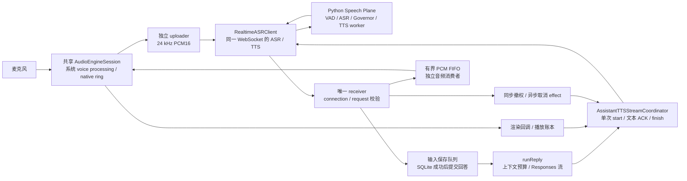

# 语音助手 STT → LLM → TTS 闭环：代码审查与优化方案

## 1. 结论与证据范围

**准确性优先于流畅性；流式仅是传输/处理手段，不是验收目标。**
现有系统已经具备流式识别、外部 LLM、单 utterance 增量 TTS、取消屏障、输入保存队列和播放账本。
先保证输入定稿、回答完整、朗读保义及生命周期正确，再优化不改变结果的等待和资源占用。
默认等待完整 LLM 回答成功结束并通过朗读校验后开口；不因收到首个字符、150ms 到期或队列上限而抢先朗读。
LLM 可继续以流接收和展示未定稿预览，已确认文本的音频也可流式传输；它们不授权提前播出未确认语义。
LLM、播放器和应用级插话策略仍归 App，Python 保持 Speech Plane 边界。

优先处理四个正确性问题：空识别快照误打断、设备重建绕过远端取消、停播被未退出的音频消费者阻塞、
渲染完成冒充设备播放完成；同时将强制切分、过早开嗓、朗读清洗保义及生成策略列入准确性门禁。
性能工作只在这些门禁通过后评估，输入完整性不能因固定新鲜度目标受损。

核验日期为 2026-10-05 UTC。业务源码审查基线为下列提交；首次审查通过 `git ls-remote` 核实它等于当时远端 `main`；
仓库为 `hrygo/SpeechRail`。文中链接固定到该提交，路径缩写 `APP` =
`macos/SpeechRailApp/SpeechRailApp`，`TEST` = `macos/SpeechRailApp/SpeechRailMacControlTests`。
公共边界见 [Realtime 契约](../../contracts/realtime-openai.md)与
[机器 schema](../../contracts/realtime-events.schema.json)，本方案不修改它们。

证据口径：

- **源码确认**：直接读到的调用、预算、状态或缺少生产引用，不等于运行复现。
- **契约声明**：`contracts/realtime-openai.md` 定义应有行为；实现不得擅自扩大该边界。
- **历史证据**：近期验收文档记录的 fake 回归结果，本轮没有重跑，不作为当前实测成绩。
- **风险推断**：由等待关系或生命周期推导的故障场景，必须通过后续 gate 测试复现。
- **外部语义**：本轮读取 Apple 官方 completion 文档，核实 rendered 与 played 的区别；没有测试设备。

本 PR 只新增方案与目录入口。没有执行模型加载、服务操作、App 构建、UI 自动化、真实音频、
性能或长稳测试；不声称已降低延迟或提高识别质量。

### 1.1 准确性的可执行边界

| 层次 | 优先保证什么 | 冲突时的选择 |
|---|---|---|
| STT 输入 | 用户完整意图，尤其否定、数字、单位、专名和修正 | 等 final；关键歧义请澄清，不从 partial 或上下文补造事实 |
| LLM 回答 | 条件、例外、推理结果和必要步骤完整，有依据且诚实表达未知 | 保留所需生成/推理时间；等完整成功终态，不把半句当答案 |
| 朗读文本 | 与确认回答语义一致，符号、数字、单位和否定不丢不改 | 整体解析后转换；无法可靠朗读则显示原文并说明，不硬切/乱清洗 |
| TTS 音频 | 无漏读、重复、错读，关键实体读法保真 | 用完整确认文本作质量基线；增量路径未证明不退化时不默认启用 |
| 生命周期 | 新旧轮归属、保存和设备交付状态真实 | 等真实屏障或明确失败，不能为接话速度假定已结束/已听完 |

LLM `response.completed` 只是生成成功终态，不证明事实正确；STT final 也不证明识别无误。
语义完整性、格式/实体保真可以作确定性门禁，事实正确性仍需任务证据和人工/专项评估。
不增加一个 LLM“自评置信度”来冒充验证，也不默认每轮二次 ASR/LLM 复核。

### 1.2 对上一版取舍的调整

- 撤销“首个有效 delta 即开嗓”作为默认；改为完整回答确认后朗读，提前分段开口须有独立的语义提交与质量证据。
- 撤销“保持 150ms/force 切分默认值”；超时负责报告等待/失败，不授权输出不完整内容。
- 撤销固定 300ms 输入等待作为丢弃依据；完整且有界的积压允许等待，丢块与过期意图分别处理。
- 撤销将缩短端点、关闭 reasoning、压缩必要解释或只看首音指标作为通用优化方向。
- 保留 receiver 解耦、背压、取消屏障、设备回收、正确 played 记账与非必要 IO 解耦。
  这些优化减少无谓等待，但不能越过输入保存、内容确认或远端 ownership 边界。

## 2. 当前闭环与应保留的设计



上图是基线调用链。目标链在 `runReply → TTS` 之间增加“完整回答终态 → 保义朗读计划 → 输出策略”门禁，
当前首个有效 delta 即进入朗读的行为不作为目标保留。

1. `openVoiceTransport` 先确认能力和 LLM 可达，再获取设备；共享引擎在双工模式启用输入、输出
   voice processing，已有 AEC 参考路径。[启动及设备边界][startup]、[音频实现][audio]。
2. 输入、接收任务分开；receiver 将 final 同步放入单消费者保存队列，保存成功后才进入正式上下文与回答。
   队列包括键盘/语音保序、重复 item、失败恢复及结束屏障。[接收与保存][receive]、[保存队列][savequeue]。
3. `runReply` 已调用 `AssistantContextPolicy.buildRequestContext`：历史按显式 user/reply 关系裁剪，
   当前问题单独保留，实际 provider 请求传入输出预算。[生成调用][generation]、[上下文策略][context]。
4. 每轮一次 `speechrail.tts.start`，文本分段在同一 utterance 内 append；`finish_text` 不越过 ACK。
   接收 PCM 只做有界准入，消费等待不占 receiver；服务端终态到达后还需等待本地排空。[TTS 协调器][tts]。
5. 取消在 Task 调度前同步登记 retired request，未知远端 ownership 拒绝下一 start。
   不响应取消的旧 outbound 仍有句柄；ACK 超时不重发正文。[中断编排][interrupt]、[退役与屏障][tts-cancel]。
6. Python 入站数据与 TTS cancel 有独立控制通道，控制器先回收 lane，再发布唯一终态。
   Resource Governor 管理重计算与独立 capability lane；不能用多 worker 或无条件 ASR/TTS 并发替代它。
   [WS 路由][wsroute]、[StreamController][controller]、[Governor][governor]。

[10 月 4 日方案](../plans/2026-10-04-assistant-e2e-followups-luna-guide.md) 的 B1/B2/B3、P1/P3、C1/C2/C3
已有后续实现，见[历史验收记录](../plans/2026-10-04-assistant-e2e-followups-acceptance.md)。
本方案承接该实现，不重新宣称 receiver 内的取消/保存/播放等待环仍然存在。

## 3. 剩余问题：源码位置、影响与复现条件

优先级含义：P1 为闭环正确性或失控资源风险；P2 为性能、可维护性与未完成观测。
以下复现条件均为**拟新增验收场景**，不是本轮运行结果。

| ID | 优先级 | 源码确认 | 影响与后续复现条件 |
|---|---|---|---|
| E1 | P1 | `handle(.partialSnapshot)` 无条件调用 `noteSpeechEvidence()`，忽略 revision；`.partial` 只判断 `isEmpty`。`AssistantTurnPolicy.isBargeInEvidence` 只被测试调用。[接收][receive]、[策略][turnpolicy] | 活跃生成/播放时注入空快照或纯空白 delta，也会撤销旧回答。纯策略 A08 不能证明生产接线安全。重复旧证据是否能影响新回答还需区分 Realtime 客户端过滤与 App 轮次边界。 |
| E2 | P1 | `onPlaybackInvalidated(recovered: true)` 直接 `ttsStream.invalidate()`，取消 LLM 并保存 interrupted，随后回 listening；没有发送 TTS cancel 或关闭连接。[设备通知][device] | 本地已忘记 request，但服务端仍可能合成并持有 lane。新问题可能收到 `tts_in_progress`。现有设备测试只断言保存/UI，未验证恢复后的第二轮远端准入。[设备测试][device-test] |
| E3 | P1 | `runCancellation` 先无限期 `await audioConsumerAtPreparation?.value`，再 `await stopPlayback()`；发送与终态有超时，但这两个前置等待没有共同 deadline。[取消实现][tts-cancel] | 若 `enqueuePlayback` 不响应 Task 取消，已排入设备的声音不能及时停止。可用挂起 enqueue 的 gate 验证，而非仅测试挂起网络 cancel。 |
| E4 | P1 | 两条播放器均用 `.dataRendered`；协调器按 terminal + FIFO/consumer/ledger 排空报 completed，进而把上下文播放状态投影为 completed。`markPlayed/isPlayedThrough` 未进入生产路径。[音频][audio]、[备用播放器][player]、[账本][ledger]、[完成判定][tts-completion] | 声音渲染后，设备尤其蓝牙仍可能有输出延迟；当前完成语义过强。拆开 rendered/played 回调，并验证 rendered 已到、played 未到时不宣布设备播放完成。 |
| E5 | P2 | `runReply` 收到 delta 后先 `await persistReplyPartial`；首个可朗读文本还会等待取消 effect、音色应用、`stream.begin` 与音色记录；LLM 结束后先等 `finishInput` 再保存生成终态。`didSaveInput` 在 submit 前等待自动标题。[生成][generation]、[持久化][reply-save]、[输入保存后投影][receive] | 首次回复 INSERT、标题 IO、TTS started 会暂停正文消费或回答启动，文本 ACK 还会延迟生成终态保存。实际耗时未知；用 gate 分别测出这些等待，不能宣称固定减少一个 RTT。 |
| E6 | P1 | `LLMProvider.stream` 使用默认无界 `AsyncThrowingStream`，忽略 yield 结果；decoder 的行/事件缓冲、非 2xx body 累加无读取上限；流式请求缺少独立首正文/正文停滞/整轮 deadline。[LLM stream][llm-stream]、[decoder][decoder]、[网络读取][llm-read] | provider 输出预算不是客户端内存保证；异常大行、慢 Store 或 started 等待可积压。平台 URLSession 默认超时也不能表达正文停滞，keep-alive 不应无限延长回答。 |
| E7 | P1 | 共享音频每 100ms drain，native ring 为 131,072 samples，输出流 `.bufferingNewest(64)`；ring 满时停止拷贝，yield 的 dropped 结果未计数；`AudioChunk.capturedAt` 已存在但这里未填，上行只显示电平/错误。[采集][audio]、[ring][ring]、[AudioChunk][chunk]、[上行][receive] | 名义 100ms 分包下可缓存约 6.4s 旧输入；满后丢块而无可关联的 discontinuity。连续发送残缺语音可能让用户得到错误但看似完整的转写。实际积压需测量。 |
| E8 | P2 | `AssistantObservability` 仅有测试与 target 登记引用，未挂到助手采集、Store、LLM、TTS、停播；A53/A54 只测试计数类型。[观测类型][observability]、[观测测试][observability-test] | 无法定位首音/误打断/欠载来源，也无法证明丢块可见。计数饱和实现还应拒绝负增量、正确处理整数溢出，不能只依赖当前小值测试。 |
| E9 | P2 | `AssistantSession` 基线 2,877 行，持有连接、音色、保存、reply、播放、记录与多个 task/身份集合；`turns/contextTurns` 和 request/reply 映射随会话累积，请求裁剪不回收场内状态。[会话状态][session-state]、[回复投影][reply-save] | 已有依赖 seam，但职责与长会话内存边界仍弱。必须按任务/latch/记录引用的存活条件回收，而非任意删掉 retired ownership 或未保存正文。 |
| E10 | P1 | `AssistantSpeechStartGate` 见首个非空白字符便 start；`safeCut(.deadline)` 可返回仍在增长的整段，`.forced` 无条件返回，`readyChunks/flush` 的 512 硬切不验证语言边界。[文本门闩与缓冲][textbuffer]、[现有分段测试][textbuffer-test] | 先给 `3`，停顿超过 150ms，再给 `.5kg`，前缀可能先被朗读；已输出的声音无法修订。当前 force/上限测试有意接受这种低延迟取舍，不能继续沿用其预期证明准确性。 |
| E11 | P1 | `VoicePrompt` 有“朗读优先”、短回答/一次一步及泛化上下文猜测表达；LLM Responses 请求统一要求 `reasoning.effort=none`（或模板禁用），context policy 统一 1024 输出预算。[提示词][voiceprompt]、[LLM 请求][llm-read]、[预算][context] | 复杂问题的必要条件、推理或后续步骤可能受限制。不能断言启用 reasoning 必然更准，也不能把关闭它作为全部任务的准确性基线；需按任务/实际模型评估并显式调整。 |
| E12 | P1 | `sendChunk` 对每段调用 `cleanForSpeech`，Session 将其绑定到无状态 `VoicePrompt.spokenText`；后者移除标记、行首符号/编号、emoji，并 trim 两端，未建立完整回答到朗读表示的保义映射。[接线][receive]、[清洗][voiceprompt]、[TTS][tts]、[清洗测试][voiceprompt-test] | `Hello ` / `world` 分别清洗后连接会丢词间空格；带空格的负号、数学比较或代码行首符号有被当排版删除的风险。须按完整结构转换，不能认为字符串去标记天然不改意义。 |

E4 的官方依据（2026-10-05 本轮读取）：Apple 对
[`dataRendered`](https://developer.apple.com/documentation/avfaudio/avaudioplayernodecompletioncallbacktype/datarendered)
明确说明不计 player 下游信号处理延迟；
[`dataPlayedBack`](https://developer.apple.com/documentation/avfaudio/avaudioplayernodecompletioncallbacktype/dataplayedback)
计入下游处理与播放设备延迟，适用于音频设备渲染。
这证明回调语义不同，不证明某台设备已经正确发出 played 回调，更不能证明用户听懂。

## 4. 目标边界：应用编排解耦，保留 Speech Plane

以下类型名为**拟新增内部组件**，不是当前 API 或已实现能力。先提取明确职责，再决定是否迁移 actor；
不把所有子组件都改成 actor 来增加无意义的跨域等待。

| 组件 | 拟承担职责 | 复用与限制 |
|---|---|---|
| `AssistantSession` facade | 用户命令、可观察 UI 投影、composition root | UI 仍从当前入口读取；设备/网络不由 View 直接操作 |
| `AssistantConversationReducer` | 同步归约事件、轮次所有权、状态转换、effect 命令 | 单一写者；归约不等待网络、磁盘、播放或清理 |
| `AssistantVoiceTransport` | connect/upload/receive/drain/close、连接与设备代次 | 包装现有 `AssistantRealtimeClient` 和 `AssistantAudioSession`，一条语音连接 |
| `AssistantReplyRunner` | LLM 请求、流预算、文本增量与生成终态 | 包装 `AssistantLLM`，保持冻结 route 和已接通的 context policy |
| `AssistantSpeechPlan` | 完整回答的结构解析、关键实体/词边界保真、可朗读内容与输出策略 | 拟新增纯值类型；不拥有网络、播放器或 LLM，不靠超时放宽正确性规则 |
| `AssistantReplyPersistence` | 固定 replyID 的创建、收尾、失败恢复 | 复用 `SessionCoordinator/SessionStore`；与输入保存队列分别保有权威身份 |
| `AssistantSpeechOutput` | 在请求前选择完整文本或已确认全文的增量 adapter，统一音频交付与取消结果 | 拟新增内部入口；不改公共协议，不在输出中途无提示换路 |
| `AssistantTTSStreamCoordinator` | 对已确认 speech plan 执行 start/append ACK/finish、音频准入、retired ownership | 增量路径仍是一轮一个 utterance；取消逐 delta 清洗与强制切分，不新增逐句 REST 回退 |
| Playback adapter | enqueue、同步撤销 epoch、stop barrier、rendered/played 事实 | 共享 AVAudioEngine 保留 AEC；旧设备/epoch 回调不得改新状态 |
| `AssistantPipelineTrace` | 有界阶段时间、计数、队列高水位、失败原因 | 不进入原始正文；低基数汇总，不记录 PCM、完整 prompt 或转写 |

事件/effect 使用内部值类型，例如：

```text
Ownership = recordID + connectionGeneration + replyID + replyGeneration
SpeechOwnership = Ownership + requestID + playbackEpoch + deviceGeneration
Effect = effectID + Ownership + immutable input + deadline + retained task handle
```

`recordID` 是本地 SQLite 记录，不能当作 wire `session_id`；`connectionGeneration` 是 App 代次，
不能与服务端 transcription epoch 混用。旧 effect 可以保存自己的记录，但只能更新匹配身份的当前投影。
Realtime 线上继续使用 current-only envelope 与 `speechrail.tts.*`；完整文本 adapter 使用现有 HTTP 契约。
不增加应用 replyID、LLM 或播放协议。

状态至少拆为四条轴：输入（active/draining/closed）、生成（idle/running/terminal）、
TTS ownership（idle/starting/active/retiring/unknown）、播放（idle/buffering/rendering/played/invalidated）。
主界面 `phase` 是这些事实的投影，不能靠 setting `.listening` 推断远端已空闲。

## 5. 正确性闭环设计（E1–E4）

### 5.1 有效输入证据才打断

- 在生产 `handle` 接入统一 policy：空/纯空白无副作用；hypothesis 仍整段替换，绝不拼接修订文本。
- revision 归属键至少为 `(connectionGeneration, itemID)`；不同 item 的同一 revision 不能互相去重。
  记录已用于打断的证据与生效时点，重复证据不能重新打断刚启动的新回复。
- 与 `RealtimeASRClient` 已有 revision/sequence 验证分别测试：客户端负责 wire 合法性，编排器负责
  当前活动轮的输入意图。不要依赖只测 policy 的 A08，必须通过真实 Session receiver 注入事件。
- final-only 保留统一接管路径；以合法且成功接纳的 final 建立中断意图，保存成功才回答。
  队列满、重复 final、旧连接 final 不发起新回答，不擅自改变输入保存失败语义。
- 第一阶段只修空值、重复与归属。最短人声时长、回声相关性、duck/相邻 final 聚合都是后续设备调优项；
  电平或文本非空都不能可靠识别说话对象。未经质量对照不增加硬阈值误伤轻声、短词或无障碍用户。

### 5.2 设备恢复仍需关闭旧远端 utterance

设备重建先由音频层使旧 playback generation 失效并丢弃缓冲，再向编排器报告。
编排器在丢掉 request 身份前登记取消 preparation：停止本地输出、取消 LLM、
保留生成正文与播放未完成事实，然后由**仍然存活的 receiver**接收匹配 TTS terminal。

- `recovered: true` 只证明音频图重建成功。远端终态确认后才允许新 start。
- terminal 超时或旧发送任务未退出：关闭该连接，保留本地记录与文字输入，进入显式重试；
  不把 recovered 映射成远端空闲，不自动重播旧 PCM。
- 第二次设备切换、主动结束或 retry 与取消竞态时，旧 effect 只清自己的资源。
  设备已自行停播应允许幂等 stop，不伪造 rendered/played 归还预算。

### 5.3 本地停播独立于清理等待

不能简单把当前 join 移到 stop 后：那会允许跨 await 的旧 enqueue 在 stop 后重新排音。
先加强 playback adapter 的 epoch 准入，再调整取消顺序：

1. 同步撤销当前输出 epoch，登记 retired request；音频层也撤销其物理 generation。
2. 立即请求音频队列执行 stop/reset；每个 queued enqueue 在**实际 schedule 前**复验设备与播放身份。
3. 取消文本泵与音频消费者，保留未退出任务；清理 join 在独立 effect 中有 deadline。
4. 保持 outbound-exit → cancel-send → matching-terminal 屏障。只有这些条件和本地 stop 都确认，
   才放行下一轮；无法确认则退役连接/音频实例，不释放未知 owner。

采用整次取消的绝对 deadline 与分阶段耗时，不能让每个 2s 阶段各自重置导致总等待超出产品预算。
CoreAudio 自身卡住时不能承诺硬实时停播；超时报告 stop 未确认，停止接纳新语音任务。
不靠 `Task.cancel()` 假定不合作的任务已经退出，也不让丢弃 task 句柄冒充释放资源。

### 5.4 渲染与设备播放分开确认

两条 adapter 增加带 `(epoch, chunkID, samples)` 的 rendered/played 事实；
`chunkID` 让重复回调只归还一次。接纳、渲染、设备完成、失效分别计量，旧代回调全部拒绝。

优先验证 player 回调选择 `.dataPlayedBack` 后，如何保守地归还预算并记 played。
AVAudioPlayerNode 单次 schedule 只选择一种 completion 类型，**不能假定同一块自动回调两次**。
首版可仅用 played 回调释放队列预算，同时记录“渲染时点未单独观测”；
若需更早释放 rendered 预算，则另建有依据的渲染水位，不能用 enqueue 或估算时长伪造回调。

完成判定必须是：生成/TTS 的对应状态已确定、合成成功与远端资源收尾已确认、FIFO 与在途 enqueue 为零、
该 epoch 的设备 played 水位覆盖所有成功提交音频。失败/取消/设备 invalidation 永远是 incomplete。
没有 played 证据或播放超时则为 unknown/incomplete，不能降为 rendered-completed。
生成全文与朗读交付状态继续分离；没有逐字对齐，不按采样比例截正文、不写“用户已听到第 N 字”。
Realtime 路径继续以匹配的 `speechrail.tts.completed` 确认合成；完整文本 HTTP adapter 须定义并验收
自身的响应完整性与资源收尾证据，不等待不存在的 Realtime terminal，也不把 2xx/连接 EOF 等同于成功。

## 6. 准确性优先的生成与朗读（E5、E6、E10–E12）

### 6.0 默认输出策略与内容门禁

默认链路为：**STT final → 保存成功 → LLM 完整成功终态 → 结构/保义校验 → 确认文本 TTS → 播放确认**。
partial/hypothesis 仅用于未定稿显示和经过验证的插话证据；不预先发正式 LLM 请求。
LLM 流正文只用于有界预览与保存，只有 `response.completed` 才能产生候选正式回答；
`response.incomplete/failed`、截断、EOF 或容量/超时失败均不自动朗读残缺答案。
当前 decoder 已拒绝 incomplete/failed 和无终态 EOF，应保留此行为，并把成功终态用于开口门禁。[LLM 终态][llm-terminal]。

| 模式 | 允许何时开口 | 启用条件 |
|---|---|---|
| 完整回答确认后朗读（默认） | 成功终态后，完整朗读计划通过校验 | 有界正文，结构完整，保义转换通过；关键歧义用澄清回答处理 |
| 独立语义单元逐段朗读（后续可选） | 每个明确提交、无需后续修正的单元通过同等校验后 | 调用协议和任务定义真实提供单元完成信号；完成质量对照，不能靠标点/时间/重复文本猜测 |
| 文本保留、暂停自动朗读 | 未成功定稿、复杂符号不宜可靠朗读或音色质量门未通过 | 明确说明等待/未完成/不适合朗读，原文保留；不会强行转换成短答案 |

当前 `AssistantLLM` 仅输出字符串增量，没有独立语义单元提交契约，故第二种模式首版关闭。
`response.output_text.done`、句号或稳定的 append-only 字符都不能证明后面没有否定、例外和自纠正；
文本不再改写也不等于内容已经适合提前朗读。完整终态后仍要检查必要条件、未知说明与关键实体。
“先开口再纠正”不能作为改善首音时间的策略。

朗读计划在完整原文上解析结构，再作可审查的确定性转换，保留原文并关联各转换 span。
数字/金额/日期/单位/否定/名称不得由 cleaner 猜测补全；编号与负号、排版与代码符号必须按结构区分。
对无法可靠转换的代码/公式提供原文和明确说明，不另调一个 LLM 随意重写数值。
如确需口语化生成，作为单独候选核对关键实体与条件后再接受，不能冒充已证明等价。
转换前后对照原文；可分块执行，但词间空白与语言单元必须保留，不能逐块 trim 后拼接。

TTS 以完整确认文本合成为质量基线；现有完整文本接口为 `/v1/audio/speech`，
App 已有 `ServiceAPIClient.synthesize`，但助手尚未接入该输出策略。[完整文本客户端][fulltext-client]、[HTTP 契约][fulltext-contract]。
增量 TTS 若需使用多次 append，只对已确认全文作保义分包，比较漏读/重复/关键实体和韵律，不默认声称等价。
增量策略的单个不可拆单元超过 512 或任一路径总文本超过 4096 时，不硬切、不静默截尾；保留全文并明确暂停朗读。
完整文本接口没有该 512 append 限制，不能把它误作两条路径通用的文本限制；预算度量仍按各自契约核对。
完整文本和增量策略在请求前明确选择，不在一半输出失败后静默换路径；完整文本接口也不被假设天然更准确。

首版推荐完整确认文本一次合成，并在有界接收、完整性校验成功后播放；当前 `synthesize/postAudio` 返回完整音频响应，
不是逐块 PCM 消费接口。[完整响应实现][fulltext-response]。
服务端完整文本接口也有 PCM 传输流；后续如需边接收边播，独立实现有界 adapter，
验证尾部失败/取消的 incomplete 投影和音频质量后再启用。[HTTP PCM 路径][fulltext-route]。
PCM 分包只是同一波形的样本传输，不能与“未确认文本提前合成”混为一谈。
引入完整文本 adapter 必须沿用固定 voice/revision、Governor 和有界字节预算，并纳入取消/设备/结束屏障。
HTTP 取消/EOF 不证明服务端 lane 已回收；若不能确认旧请求释放，禁止开新合成，明确失败并保留文字。
该路径的准入、取消和完整性验收是实施前提，不能仅替换一个 API 调用就宣称闭环完成。

完整文本 adapter 的拟实施边界：

1. 用已冻结的 voice/model revision 与 `SpeechRail-Purpose: interactive` 请求，显式协商 integrity receipt；
   不沿用默认 batch 准入，不附加迫使答案缩短的低 latency budget。[HTTP headers][fulltext-headers]。
2. 给音频接收加硬字节/时长和绝对 deadline，解码/样本格式校验通过后再提交 player；
   `postAudio` 返回完整响应不等于客户端已有这些有界接纳与 ownership 屏障。
3. 通过现有 `fetchReceipt` 关联本轮，核对成功交付/样本与 revision 证据。[回执客户端][fulltext-receipt]。
   正常 HTTP PCM 路径在 `audio_stream` 退出 Governor reservation 后记录 completed，
   但外层取消路径可能先记 cancelled 再执行 stream close；**cancelled receipt 本身不证明资源已释放**。[HTTP PCM 路径][fulltext-route]。
4. 本地先撤 playback epoch 并 stop；HTTP Task 退出、服务端收尾证据分别保留，异常/取消不能复用成功路径的结论。
   不能确认资源收尾时保持 unknown 并停止自动新合成；若现有边界不足以证明屏障，先完成实施评审，
   不默认启用该 adapter，也不把 job 轮询或擅加 wire 事件作为替代。

完整音频 receipt/校验只证明服务交付事实，不能证明每个字都读对或用户已听完；质量与 played 门仍各自存在。

### 6.1 用户保存边界与回复保存解耦

用户 final **保存成功后才请求 LLM**，沿用当前失败语义。保存成功后先完成正文投影和回答资格校验，
自动标题作为有身份的可等待 effect 处理；标题失败不得阻塞已经保存的问题。
结束会话仍要等标题/记录 effect 收尾，不覆盖人工标题。

首个 LLM delta 到达即进入有界正文预览与持久化状态，不再等待 assistant 首次 INSERT；不进入朗读入口。
`AssistantReplyPersistence` 每个 reply 只有一个创建任务；finalization 与创建共享句柄和固定行 ID。
结束、provider failure、用户打断都等待同一收尾命令，不重复 INSERT。
首次保存失败只记录未保存事实和恢复入口，不影响已接纳的用户输入；失败正文保持有界。
明确权衡：首次落库前进程崩溃，assistant 内存正文无法恢复；当前实现也不承诺每 token 落盘。

### 6.2 移除强制开嗓，保留无损的调度解耦

当前 150ms deadline、30ms tick、20 idle ticks force、512 硬切和 flush 的取舍应修正，不作为首版默认保留。
超时只触发等待提示、受界限的停止或失败；结构未闭合、数字/单位/英文词未完整时，等待或暂停朗读。
内存上限是接纳上限，不能以“缓冲满了”为理由把不完整前缀送出去。
现有接受 force 的测试应改为准确性预期，不能为了保持历史 green 保留错误取舍。

完成回答后，朗读计划、回复保存及所选音色能力校验可在明确身份下调度；
只有不改变内容和不提前占用重模型资源的准备工作才可与生成重叠。
不默认在 LLM 生成期发 TTS start/prefill，不假定它免费或不影响同时进行的 ASR。
增量策略只有在内容门禁通过、取消屏障解除和 started 确认后才能 append；finish 仍等最后 ACK。
不让音色记录/非必要标题 IO 阻塞正文消费，不改变用户保存成功后回答的语义。
LLM completed 到达即记录生成终态并提交正文收尾，TTS finish/ACK/播放交付异步继续；
它们的失败只改变朗读状态，不能反向把已完整生成的文本称为生成失败。结束屏障仍覆盖两侧任务。

### 6.2.1 生成质量与朗读样式分别配置

提示词优先级改为：用户任务与事实正确性 → 必要条件/例外/步骤完整 → 可听表达 → 简洁与速度。
删除泛化“意思不通就结合上下文猜”的授权，允许普通表达容错但关键事实歧义必须澄清；
语音问题不能因为语音模态而少回答必要条件。人设、两三句偏好、一次一步不覆盖用户明确任务。

不显示内部思考与不允许模型进行必要 reasoning 是两件事。
当前强制 `reasoning=none`/模板禁用及其 preflight 门需要评审，按实际模型支持和任务质量对照选择策略，
不以关闭 reasoning 作为助手可用性的统一必要条件，也不承诺加大 effort 必然提高准确率。
改动覆盖 `provider.check/runStream/makeRequest`、能力结果与测试；不伪造不支持的官方字段，
不将 provider 拒绝策略偷偷改成另一种策略。

1024 输出 tokens 与候选 60s deadline 只是资源初始值，不能逼模型省略重要信息或把 incomplete 当成功。
预算按任务评估；超限时保留未完成标记并请用户续问/调整，不静默截断后朗读。
上下文裁剪仍按完整轮次，但删掉相关历史事实后若问题已无法独立解释，应澄清，而非猜测省略条件。
自动摘要、检索或更大窗口如需引入，另评审证据与成本；本方案不默认额外加一轮 LLM。

### 6.3 LLM 流必须有端到端预算

为 assistant 调用增加内部、可注入的 `AssistantLLMStreamBudget`；共享 provider 的非助手调用保持显式策略，
不能因本方案把会议、纪要或后台作业套入语音短响应超时。

预算包含 delta 数/UTF-8 bytes、累计正文 scalar、SSE 单行 bytes、单事件 bytes、错误 body bytes，
以及 connect/header、首正文、正文无进展、总轮次 deadline。
可评审的首版候选：最多 128 条/256 KiB pending delta、256 KiB SSE line/event、8 KiB 错误正文；
累计回答候选 16,384 scalar，仍保留 TTS 4096 scalar 上限；在播放前检查整轮预算，超限暂停朗读并保留有界文本。
候选均不是实测最优值；按真实 provider 包形和 fake 边界复核后集中定义。

使用可异步背压的单消费者 channel，使 decoder 到消费者之间真正有容量约束。
若保留 AsyncThrowingStream，则必须检查 yield/drop 并显式失败，**不得静默丢 token**。
正文 deadline 仅由有效正文推进重置，SSE 注释、心跳、重复事件不延长它；总 deadline 不重置。
原候选首正文 10s、正文停滞 5s、总轮次 60s 不直接作为默认；
需要 reasoning 的模型在正文前可能有合法无正文阶段，应结合实际阶段/能力区分等待与故障。
心跳不能无限延长总 deadline，但也不能因 5s 没有正文就误杀正常推理；超时明确未完成，禁止强制完成/朗读。
取消统一区分 CancellationError/URLError.cancelled 与 transport failure，并将等待者恰好唤醒一次。

### 6.4 端点等待单独优化

当前助手 duplex 静音窗口 900ms，turnTaking 1200ms，服务端 SpeechAdmission 另有起音确认、pre-roll、
迟滞和尾音保护。[场景配置][vadprofile]、[服务端准入][admission]。
不能把 900ms 当作链路延迟全部，也不能假定通用 300ms 静音适用于中文思考停顿。

首版保留 900/1200ms 场景窗口；评估允许按停顿与修正需要延长，而非默认下调。
只有完成断句、关键实体、尾音与自纠正质量对照后，才比较更短窗口；质量未通过或证据不足就保留更保守窗口。
不要将服务端 final 自动视为用户意图绝对完整，关键歧义请确认。优先复用现有参数，不增加 LLM 语义端点网络调用；
相邻 final 聚合会改变问答次序，在明确质量收益前保持关闭。

## 7. 队列、输入新鲜度与内存闭环（E6、E7、E9）

| 位置 | 当前源码预算 | 方案要求 |
|---|---|---|
| native ring | 131,072 float samples；可用容量少一个 sample | 以 native sample rate 换算时间，记录 accepted/dropped；48 kHz 下约 2.73s 是容量推导，不是实测排队时间 |
| capture AsyncStream | newest 64 chunks，名义 100ms/chunk | 完整性与 bytes 优先；age 用于提示和意图失效判定，不因短延迟目标丢完整音频；记录被替换块 |
| WS 下行 | 256 events、4 MiB decoded PCM | 保留现有 overflow 失败出口；控制事件不得被应用等待阻塞，不改变 wire sequence |
| input persistence | 32 commands、64,000 scalar，失败命令计入 | 保留保存后回答、队列满可读提示、结束 drain 与恢复所有权 |
| LLM delta/SSE | 默认无界 delta；parser/body 无独立容量上限 | 应用候选预算、显式背压或超限失败、首正文/停滞/总 deadline |
| speech text | 512 单片、4096 整轮 raw scalar | 完整回答先形成 speech plan；安全边界与整轮预算在开口前核验，不能硬切换取空间 |
| PCM FIFO + player ledger | FIFO 48,000 bytes（取协商较小值）；player 24,000 samples | 区分内存拥有字节与逻辑 reservation，同一 in-flight enqueue 不重复计算 PCM；played 未确认仍在完成账本 |
| 长会话状态 | 请求已裁剪；场内 turns/context/maps 仍累积 | 正文记录保存在 SQLite；只保留有界可视窗口、请求上下文与活动/未保存/retired 项，引用释放后回收 |

4 MiB decoded PCM 在 24 kHz PCM16 下约 87.4s 是**字节容量换算**，不是当前存在 87s 延迟；
event-count 也可能先成为限制。客户端总 PCM 容量必须包含上游、FIFO、player 和 in-flight 的唯一实际 buffer；
Python/worker/kernel/AVAudioEngine 各自预算分别报告，不能只宣称“缓冲 1 秒”。
服务端 send/worker 消费不是客户端 played ACK；第一阶段不新增远端播放 credit 协议。

采集先填充已有 `AudioChunk.capturedAt`，并增加块序号、native/wire 样本跨度、丢块原因。
时间点应来自采集 tap/样本轴，不能把 drain 或 upload 时刻称为真实采样时刻；缺证据显示 unavailable。
ring 在实时回调中只更新无锁/原子计数，离开回调才换算、记录或通知 UI。

取消固定 300ms age 即失败/丢弃的候选：只要音频完整、仍在资源上限内且属于有效用户意图，允许保序等待，
显示积压而非丢掉样本来追赶“实时”。优先减轻非必要工作、反馈拥塞并在有界容量内缓冲。
若已丢块或不能接纳完整语音，则将受影响 utterance 标为不完整并请求重说；
age 本身不等于音频内容缺失。用户已取消/替换意图时旧积压按代次隔离，不再触发旧问题回答。
首版对不可恢复的缺口可关闭旧连接，保留已确认/未定稿文字并重试，避免 speculative clear 丢掉尾句。
如后续支持局部重置，必须通过原子停止上传、样本水位和输入屏障确认后再 clear；
原契约没有缺口事件，不静默追加新 wire 字段或伪造缺失音频。

重试范围区分 loopback Speech Plane、外部 LLM 和本地音频设备。
已开始输出的 LLM 不自动重新生成并拼接，ACK 未知的 TTS append 不重发，设备切换不自动续播旧音。
只有明确支持幂等的完成屏障/记录恢复才能重试；重连不重置本地会话记录和已保存上下文。

## 8. 抗干扰策略：在已有 AEC/VAD 上验证

已有系统 voice processing + 服务端 Silero SpeechAdmission，后者具备 onset debounce、双阈值迟滞、
pre-roll 与 hangover；当前不是“没有 AEC/VAD”。但函数存在/启用成功不能证明实用回声抑制或噪声鲁棒性。

确定性阶段先完成 E1/E2/E3，真实阶段分别覆盖：扬声器播报时用户沉默、播报时插话、键盘/风扇/咳嗽、
背景电视/他人说话、近讲/远讲/轻声、短词“停”、中文停顿/自纠正、耳机和蓝牙切换。
按设备和模式统计误打断、漏打断、尾音丢失与恢复时间；阈值不能只优化一个样本或一种设备。

ASR 文本非空是应用证据，不是噪声分类器。默认先排除空值/重复并验证证据归属；
不因“更早停播”就缩短证据窗口或用单帧电平作决定，误打断与漏打断共同作为质量门。
明确用户停止命令仍立即响应；不把自动声学判定与显式命令混为一谈。要提前于识别结果打断，应另行评审本地 voice-activity
事实与 output-active 联合策略，不在 Python 端擅自恢复已移除的 `speech_started` 事件。
背景人声无法只靠 VAD 区分；若产品需要明确说话对象，单独设计近讲/按键/唤醒入口，
不引入实名声纹或跨会话身份。无质量证据时不默认开启 duck 或自动聚合 final。

## 9. 观测与验收指标：先质量，后延迟（E8）

使用同一进程内 `ContinuousClock`，跨进程各自记单调耗时、用 request/item 关联，不直接相减两个进程
的 clock instant。墙钟只用于显示/审计。保存匿名摘要、有限 trace ring 和分布；ID 不作为指标 label。

验收采用顺序门禁：**输入/内容/朗读正确性 → 生命周期与资源稳定性 → 延迟/连贯度**。
确定性关键错误（否定丢失、数字/单位改写、未完成回答开口、正文丢片）任一出现都不得放行。
真机使用同一设备、voice/spec、provider、代表性任务和可控参数作对照，完整回答/完整文本合成为参考策略；
增量或更短端点必须证明各质量分组不退化，再比较速度。评审事先定义样本量、错误类别与容许界限；
样本不足或差异不明确时保持保守策略，不能用整体平均掩盖关键实体退化。
完整文本参考也必须经过质量验收，不将某条 API 路径天然标为“准确”。

| 质量门 | 衡量方法 | 放行规则 |
|---|---|---|
| STT 与端点 | CER/WER、关键实体错误、否定反转、漏尾音、误切句、自纠正是否保留 | 同场景对照，不只看平均 CER；更短窗口不得用吞尾/提前定稿换速度 |
| 回答完整与依据 | 任务答案、条件/例外/步骤覆盖、关键歧义处理、未知诚实表达 | 由预期答案/任务证据评估；completed 与模型自评分不是正确性证明 |
| 朗读保义 | 原文与 speech plan 的实体/条件/符号/词边界对照；不同时序/分包结果对照 | 确定性用例无保义错误；分包改变不得改变确认朗读表示 |
| 合成质量 | 漏读/重复/错读、关键实体可懂度、韵律与边界；人工听审，必要时定向复核 | 增量与完整文本分组对照，不以相同 bytes 或单次 ASR 分数替代听审 |
| 自动打断 | 误打断率、漏打断率、明确停止命令是否响应 | 证据不充分不启用更激进策略，噪声/双讲/短词分别统计 |

| 指标 | 起点 → 终点 | 必须区分 |
|---|---|---|
| 用户说完到首音 | 可证明的最后用户语音样本 → 首音输出估计/可测播放证据 | 服务端端点估计与人工/测试标注；没有声学测量时不能称实际可听首音 |
| final-to-first-output | App 收到 final → 首块入队、首 render、首 played 分别计时 | 它不包含端点等待；played 是缓冲完成，不是首采样出声时间 |
| 生成路径 | 输入保存完成 → provider request → 首正文/生成终态 | 标题、reply INSERT、started、ACK 的阻塞分别计时 |
| 打断链 | 有效输入证据 → revoke → stop-confirmed → remote-terminal | UI speaking=false 不是设备静音；晚回调与未知 owner 单独计数 |
| 流畅度 | 播放活动期内 queued=0 且未 terminal 的欠载 | 首次预缓冲、已完成和取消不能算断流；记录次数及最长持续时间 |
| 输入完整性 | native attempted/accepted/dropped，wire emitted/uploaded，max age | 静音/半双工主动抑制不是丢块；native 与 24 kHz wire 单位分开 |
| 稳定性 | 保存/输入回执/取消/恢复成功率，task/owner/queue 高水位 | 无样本 N/A；失败不能写成功；统计不保存正文或 PCM |

性能指标只在质量与稳定性通过后，按设备/模式/provider 统计 P50/P95。
撤销 final-to-first-enqueue P95 ≤1s 作为候选放行目标；等待完整回答/必要推理产生的时间是正确性成本，
不能据此倒逼提前朗读。分别报告生成时间、内容门禁等待和设备/调度额外等待，优化后两者的无谓开销。
对已确认的显式停止意图可评估本地 stop P95 ≤150ms；该值不是自动插话证据的等待上限，也不是已测成绩。
本地、远程 LLM 分组，冷加载单列；不把资源不足下的 fail-closed 作为性能回归误判。

## 10. 分阶段实施与可审查验收

每个阶段另开实施 PR；本方案 PR 不实施下表。需要真实运行态、UI 或 benchmark 时，再按专项授权执行。

| 阶段 | 范围与主要文件 | 出口条件 |
|---|---|---|
| M0 正确性与保义 | E1–E4/E10/E12：receiver/device、TurnPolicy、SpeechPlan、TTS coordinator、两条 playback adapter、Ledger | 完整终态前不开口；无 force/硬切语义；清洗保义；空值不取消、恢复后二轮准入、先撤权/停播、rendered 不冒充 played |
| M1 质量策略、边界与观测 | E8/E9/E11：生成/朗读策略、完整文本 adapter、reducer/transport/reply persistence、trace/task registry | 任务优先于朗读长度/禁推理；完整文本输出质量与取消闭环通过；effect 有身份/结束屏障，观测不干扰主流程 |
| M2 无损调度与流预算 | E5/E6/E11：ReplyRunner/LLMProvider/SSE decoder、回复保存与正文门禁 | INSERT/标题 IO 不挡正文；started 不触发未定稿开口；无静默丢 token；异常大 SSE/body 失败；合法推理不被短正文 timeout 误杀 |
| M3 输入和容量 | E7/E9：AudioEngineSession、AudioSampleRing、AudioChunk、uploader、场内记录窗口 | 每个丢样点可计数；断裂/已失效意图不发起伪完整问答，完整有界积压可等待；长会话活动内存有界且完整 SQLite 记录保留；无新增未评审协议 |
| M4 质量对照与可选流畅度优化 | 完整回答/文本参考、可选语义单元模式、端点、声学/设备、provider、长稳 | 先分组质量与稳定性门，再比延迟；未证明不退化的增量/激进端点保持关闭；不以 fake green 关闭真实验收项 |

建议 M0 按闭环正确性和内容门禁拆成独立修复，再逐步提取组件。新增 Swift 源码/测试须同步 SwiftPM 与 Xcode
两个 target；不得先大规模搬迁再失去行为证据。M2 改共享 LLMProvider 时必须覆盖其他调用方的默认行为。

### 必补的行为场景

| 验收 ID | 场景/注入 | 应有结果与已有入口 |
|---|---|---|
| V01 | 在真实活跃 request 上注入空/空白 hypothesis、空白 delta | cancel 计数不变；正文/队列不撤销；扩展 `AssistantCancelReceiveTests`，不能仅调用 TurnPolicy |
| V02 | 同 revision 跨 item、重复旧证据、新 final-only、旧连接 final | 独立归属、至多一次中断意图、合法新输入正常保存后回答 |
| V03 | 服务端 TTS 仍 active 时设备 recovered；随后第二问题 | 旧 request 收到取消并确认 terminal 后新 start；没有确认则关连接且重试，不是仅 UI listening |
| V04 | enqueue 不响应取消；已有音频在播；晚到 enqueue 返回 | 本地先撤 epoch/stop，晚 enqueue 无音；保留 task owner，下一轮不能越过未知清理屏障 |
| V05 | terminal 在 played 前到；rendered 已到；旧/重复 chunk 回调 | 不提前 completed；played 有唯一记账；invalidation 落 incomplete；扩展 Ledger/TTS 和 adapter 用例 |
| V06 | 首次 reply INSERT、自动标题、started 分别被 gate 挂起 | 首 delta 不被回复 INSERT 阻塞；标题不挡 LLM；完整回答确认前不开口，增量 append 仍在 started 后 |
| V07 | 正文消费慢、巨型 delta、无换行 SSE、多行事件、巨大错误响应、只有心跳 | 每个容量/deadline 显式失败并释放已知资源；完整前缀保留；EOF 不冒充模型成功 |
| V08 | native ring/stream overflow、上传阻塞、积压或旧意图失效 | 计数/样本跨度准确；完整有界音频保序等待，真实丢块需重说，旧意图不回答；合成样本不落盘 |
| V09 | 无响应 Store/stop/cancel、retry/结束交错、长会话 | receiver 控制可达，未知 owner 不放新轮，结束报告真实待保存；无无界 task/context 增长 |
| V10 | trace 写失败、负增量、整数上界、无样本 | 主流程不失败；计数饱和正确；N/A 不显示 0ms；覆盖实际生产通知而非仅纯类型 |
| V11 | LLM 先输出可误解前缀，再补否定/条件/更正；incomplete/EOF | 默认完整成功终态和 speech plan 通过前 TTS start/音频为零；失败只保留明确未完成的预览 |
| V12 | 数字/单位/英文词/未闭合结构跨 delta；间隔超过 150ms，或达到 512 上限 | 时间/容量不授权半句开口；完整朗读结果与 delta 分法/到达间隔无关，无安全切点暂停而非硬切 |
| V13 | 词间空格、带空格负号、比较符、代码行首、日期/金额/编号列表 | 整体解析区分格式和内容；保义转换不能丢实体、否定或空白，复杂表达无法可靠朗读时保留原文 |
| V14 | 用户长停顿后补否定/单位或自纠正；关键语音歧义 | 端点不因短延迟目标抢定稿；final 有歧义也澄清，不猜金额/日期/否定/专名 |
| V15 | 复杂任务需要 reasoning、长答案/必要条件、正文前合法推理阶段 | 提示词不为朗读省略必要内容；资源预算明确，模型能力真实；不把合法等待误杀或 incomplete 说成成功 |
| V16 | 同一确认全文以完整文本/增量 TTS 合成；不同 append 边界、设备/voice/spec | 关键实体、漏读/重复/边界韵律分组对照先过门再比首音；完整文本路径本身也验质量与取消 |
| V17 | 完整音频积压超过旧 300ms 候选，但资源有界且意图有效 | 保序处理并显示等待，不丢样本/断连追赶低延迟；取消后的旧积压不进入正式回答 |

现有关键回归应继续保留：
`testA03BargeInTerminalThroughReceiveLoop`、`testA04CancelTimeoutFailsClosed`、
`testCancelCannotConfirmOrRestartWhileCancelledAppendIsInFlight`、
`testAcknowledgementTimeoutDoesNotResendAppend`、
`testReceiverContinuesWhileAudioWaitsForPlaybackBudgetAndDrainsFIFO`、
`testAggregateAudioCapIncludesChunkAwaitingPlaybackEnqueue`、
`testActualProviderRequestUsesOutputBudgetAndCurrentQuestionOnce`。
这些测试在基线中存在，本轮未执行；新增用例先在基线证明可编译的行为失败，再验证修复。

现有 `testForcedUrgencyBreaksStuckMarkdownInsteadOfStallingTheTurn`、
`testDeadlineIsBoundedByTheInjectedClockNotRealTime` 与 `testNumberAndUnitAcrossDeltasStayTogether`
的部分预期需要按新原则重写：前两者不能以 force/到点输出证明准确性，第三个只覆盖单位到齐后到期，
还需加“数字已到期、单位随后才到”的 V12 情形。新测试不得只换命名或放宽断言来维持 green。

后续实施按阶段运行定向 fake 测试；公共 wire 如另行修改，需同时更新 schema、契约、Python/Swift 共享 fixture。
不能在 Linux 上用类型/语法检查替代 macOS 26 Apple Silicon 音频与设备验收。
M4 需记录 commit、设备、系统、ASR/TTS active spec、voice revision、provider 模式、样本数及未通过项；
只保存脱敏计时和汇总，原始音频、完整 prompt/转写和真实配置留在仓库外。

## 11. 取舍、兼容性与回退

- 保留服务端 ASR/TTS 子集、单服务/单 ASGI worker、Governor fail-closed 与显式 capability lane。
  不为延迟绕过资源准入，不引入分布式队列或持久 job 轮询到实时链路。
- 不通过缩短所有 timeout、放大 PCM 队列或未经证实的“省 RTT”来优化。
  服务端 delivered 只表示发送事实；App played 也不表示用户理解。
- 第一阶段不改数据库 schema。生成/播放细分状态重开记录后的恢复精度仍受现有 schema 限制；
  需要持久化时另写数据迁移与恢复方案，不能默默复用 `isInterrupted` 表达全部终态。
- 不采用 speculative LLM 对 partial 的正式回答，不自动追加未识别正文到上下文；
  不改变输入先保存再回答、冻结 provider route、当前 request 固定 voice/revision 的语义。
- 默认完整回答确认后朗读，不将文本传输流、PCM 传输流与语义提前提交绑定；
  用户允许等待准确答案时，取消低延迟强制切分与压缩必要内容，实际收益需按质量门证明。
- 实施发生的内部接口破坏须在对应 PR 同步全部调用方和测试，不保留无期限过渡层。
  回退按实施 commit 的精确文件范围执行，保持已保存用户记录；不删除数据库或清理未知任务来假装恢复。

本方案回退仅撤回新文档与架构目录入口。没有运行态或用户数据需要回滚。

## 12. 本方案 PR 的验证与后续决策

本轮验证范围是文档与证据一致性：核对相对链接、固定基线源码路径/行号、引用的现存测试名、
Markdown 表格列数、空白和仅 docs 变更面。未重跑业务测试，未取得性能、模型质量或设备结论。

2026-10-05 本轮静态核验：40 个固定提交源码引用、29 处行号范围、两份文档的 28 个相对链接、
方案 90 行表格的列数与 10 个现存测试符号均通过；源码结构检查核对强制分段、清洗接线、
LLM 成功/失败终态与 reasoning 策略。仓库 `ci_changed_scope.py` 将两份变更判定为 `meta`，
不选择 Python/Swift 业务门禁；`git diff --check` 通过。这些检查不作为缺陷复现或业务回归成绩。

评审先决定：完整回答默认和完整文本输出 adapter 的闭环、保义转换规则、任务/模型的生成预算与 reasoning 策略、
质量对照样本/门槛，再决定可选提前开口或端点缩短。默认沿用现有协议与资源边界，
不因方案列出候选数值就把它们写成已批准的产品默认或硬 SLA。

### 固定基线源码索引

[startup]: https://github.com/hrygo/SpeechRail/blob/d72535c7533855fa113018f3dddb78bb61e37fb4/macos/SpeechRailApp/SpeechRailApp/AssistantSession.swift#L1074-L1318
[device]: https://github.com/hrygo/SpeechRail/blob/d72535c7533855fa113018f3dddb78bb61e37fb4/macos/SpeechRailApp/SpeechRailApp/AssistantSession.swift#L1211-L1234
[receive]: https://github.com/hrygo/SpeechRail/blob/d72535c7533855fa113018f3dddb78bb61e37fb4/macos/SpeechRailApp/SpeechRailApp/AssistantSession.swift#L1788-L2198
[interrupt]: https://github.com/hrygo/SpeechRail/blob/d72535c7533855fa113018f3dddb78bb61e37fb4/macos/SpeechRailApp/SpeechRailApp/AssistantSession.swift#L932-L987
[generation]: https://github.com/hrygo/SpeechRail/blob/d72535c7533855fa113018f3dddb78bb61e37fb4/macos/SpeechRailApp/SpeechRailApp/AssistantSession.swift#L2473-L2683
[reply-save]: https://github.com/hrygo/SpeechRail/blob/d72535c7533855fa113018f3dddb78bb61e37fb4/macos/SpeechRailApp/SpeechRailApp/AssistantSession.swift#L2199-L2427
[session-state]: https://github.com/hrygo/SpeechRail/blob/d72535c7533855fa113018f3dddb78bb61e37fb4/macos/SpeechRailApp/SpeechRailApp/AssistantSession.swift#L280-L504
[audio]: https://github.com/hrygo/SpeechRail/blob/d72535c7533855fa113018f3dddb78bb61e37fb4/macos/SpeechRailApp/SpeechRailApp/AssistantAudioSession.swift#L46-L645
[player]: https://github.com/hrygo/SpeechRail/blob/d72535c7533855fa113018f3dddb78bb61e37fb4/macos/SpeechRailApp/SpeechRailApp/AssistantAudioPlayback.swift#L11-L133
[ring]: https://github.com/hrygo/SpeechRail/blob/d72535c7533855fa113018f3dddb78bb61e37fb4/macos/SpeechRailApp/SpeechRailApp/AudioSampleRing.swift
[chunk]: https://github.com/hrygo/SpeechRail/blob/d72535c7533855fa113018f3dddb78bb61e37fb4/macos/SpeechRailApp/SpeechRailApp/MicrophoneCapture.swift#L43-L61
[savequeue]: https://github.com/hrygo/SpeechRail/blob/d72535c7533855fa113018f3dddb78bb61e37fb4/macos/SpeechRailApp/SpeechRailApp/AssistantInputPersistenceQueue.swift
[context]: https://github.com/hrygo/SpeechRail/blob/d72535c7533855fa113018f3dddb78bb61e37fb4/macos/SpeechRailApp/SpeechRailApp/AssistantContextPolicy.swift
[tts]: https://github.com/hrygo/SpeechRail/blob/d72535c7533855fa113018f3dddb78bb61e37fb4/macos/SpeechRailApp/SpeechRailApp/AssistantTTSStreamCoordinator.swift
[tts-cancel]: https://github.com/hrygo/SpeechRail/blob/d72535c7533855fa113018f3dddb78bb61e37fb4/macos/SpeechRailApp/SpeechRailApp/AssistantTTSStreamCoordinator.swift#L321-L448
[tts-completion]: https://github.com/hrygo/SpeechRail/blob/d72535c7533855fa113018f3dddb78bb61e37fb4/macos/SpeechRailApp/SpeechRailApp/AssistantTTSStreamCoordinator.swift#L878-L923
[ledger]: https://github.com/hrygo/SpeechRail/blob/d72535c7533855fa113018f3dddb78bb61e37fb4/macos/SpeechRailApp/SpeechRailApp/AssistantPlaybackLedger.swift
[turnpolicy]: https://github.com/hrygo/SpeechRail/blob/d72535c7533855fa113018f3dddb78bb61e37fb4/macos/SpeechRailApp/SpeechRailApp/AssistantTurnPolicy.swift
[observability]: https://github.com/hrygo/SpeechRail/blob/d72535c7533855fa113018f3dddb78bb61e37fb4/macos/SpeechRailApp/SpeechRailApp/AssistantObservability.swift
[observability-test]: https://github.com/hrygo/SpeechRail/blob/d72535c7533855fa113018f3dddb78bb61e37fb4/macos/SpeechRailApp/SpeechRailMacControlTests/AssistantRecordObservabilityTests.swift#L64-L86
[device-test]: https://github.com/hrygo/SpeechRail/blob/d72535c7533855fa113018f3dddb78bb61e37fb4/macos/SpeechRailApp/SpeechRailMacControlTests/AssistantSessionTests.swift#L1757-L1791
[llm-stream]: https://github.com/hrygo/SpeechRail/blob/d72535c7533855fa113018f3dddb78bb61e37fb4/macos/SpeechRailApp/SpeechRailApp/LLMProvider.swift#L920-L945
[decoder]: https://github.com/hrygo/SpeechRail/blob/d72535c7533855fa113018f3dddb78bb61e37fb4/macos/SpeechRailApp/SpeechRailApp/LLMProvider.swift#L751-L822
[llm-read]: https://github.com/hrygo/SpeechRail/blob/d72535c7533855fa113018f3dddb78bb61e37fb4/macos/SpeechRailApp/SpeechRailApp/LLMProvider.swift#L1500-L1783
[vadprofile]: https://github.com/hrygo/SpeechRail/blob/d72535c7533855fa113018f3dddb78bb61e37fb4/macos/SpeechRailApp/SpeechRailApp/RealtimeASRClient.swift#L5-L25
[admission]: https://github.com/hrygo/SpeechRail/blob/d72535c7533855fa113018f3dddb78bb61e37fb4/src/speechrail/realtime/speech_admission.py
[wsroute]: https://github.com/hrygo/SpeechRail/blob/d72535c7533855fa113018f3dddb78bb61e37fb4/src/speechrail/http/routes/realtime_openai.py
[controller]: https://github.com/hrygo/SpeechRail/blob/d72535c7533855fa113018f3dddb78bb61e37fb4/src/speechrail/application/tts_stream.py
[governor]: https://github.com/hrygo/SpeechRail/blob/d72535c7533855fa113018f3dddb78bb61e37fb4/src/speechrail/runtime/resource_governor.py
[textbuffer]: https://github.com/hrygo/SpeechRail/blob/d72535c7533855fa113018f3dddb78bb61e37fb4/macos/SpeechRailApp/SpeechRailApp/AssistantSpeechTextBuffer.swift#L1-L325
[textbuffer-test]: https://github.com/hrygo/SpeechRail/blob/d72535c7533855fa113018f3dddb78bb61e37fb4/macos/SpeechRailApp/SpeechRailMacControlTests/AssistantSpeechTextBufferTests.swift#L1-L285
[voiceprompt]: https://github.com/hrygo/SpeechRail/blob/d72535c7533855fa113018f3dddb78bb61e37fb4/macos/SpeechRailApp/SpeechRailApp/VoicePrompt.swift#L1-L196
[voiceprompt-test]: https://github.com/hrygo/SpeechRail/blob/d72535c7533855fa113018f3dddb78bb61e37fb4/macos/SpeechRailApp/SpeechRailMacControlTests/VoicePromptTests.swift#L1-L87
[llm-terminal]: https://github.com/hrygo/SpeechRail/blob/d72535c7533855fa113018f3dddb78bb61e37fb4/macos/SpeechRailApp/SpeechRailApp/LLMProvider.swift#L715-L890
[fulltext-client]: https://github.com/hrygo/SpeechRail/blob/d72535c7533855fa113018f3dddb78bb61e37fb4/macos/SpeechRailApp/SpeechRailApp/ServiceAPIClient.swift#L198-L208
[fulltext-response]: https://github.com/hrygo/SpeechRail/blob/d72535c7533855fa113018f3dddb78bb61e37fb4/macos/SpeechRailApp/SpeechRailApp/ServiceAPIClient.swift#L943-L964
[fulltext-contract]: https://github.com/hrygo/SpeechRail/blob/d72535c7533855fa113018f3dddb78bb61e37fb4/contracts/openapi.yaml#L4177-L4230
[fulltext-route]: https://github.com/hrygo/SpeechRail/blob/d72535c7533855fa113018f3dddb78bb61e37fb4/src/speechrail/http/routes/audio.py#L2037-L2335
[fulltext-headers]: https://github.com/hrygo/SpeechRail/blob/d72535c7533855fa113018f3dddb78bb61e37fb4/contracts/openapi.yaml#L1144-L1223
[fulltext-receipt]: https://github.com/hrygo/SpeechRail/blob/d72535c7533855fa113018f3dddb78bb61e37fb4/macos/SpeechRailApp/SpeechRailApp/ServiceAPIClient.swift#L379-L394
