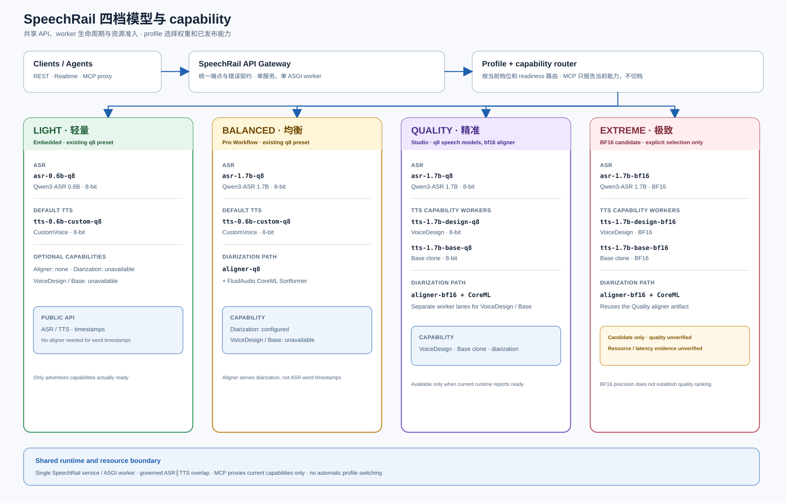
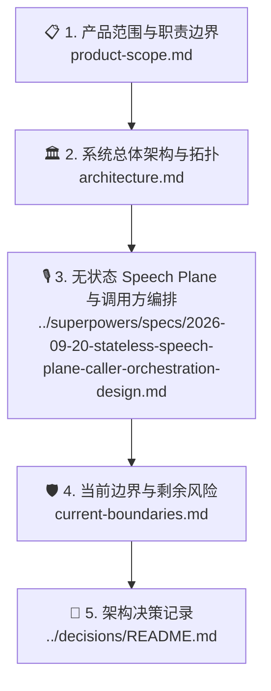

# 🏛️ SpeechRail 架构文档

本目录是面向系统架构评审、边界设计、协议设计与长期演进的正式技术参考。它详细规定了 SpeechRail 的系统分层、进程模型、状态机拓扑、资源调度机制及不可逆的架构决策 (ADR)。

## ASR + TTS 后续目标方案（已确认，待实施）

[ASR + TTS 目标架构定稿（无历史兼容）](2026-09-25-asr-tts-target-architecture-no-legacy.md) 是 PR #94 后续研发的目标依据；实施及验收由 [Issue #95](https://github.com/hrygo/SpeechRail/issues/95) 跟踪。

目标采用 `fast / quality / reference` 三种规格、独立 ASR/TTS 选择、Base/CustomVoice 运行、仅 BF16 VoiceDesign 设计、独立对齐/分人及统一执行计划；不做历史兼容，Q4 不进入支持集合。`accepted` 仅表示目标已确认，**不表示当前代码、模型或真实交互已经完成验收**。

下面的四档图及现有 W0–W11 文档保留为当前实现/阶段证据，不再作为后续目标约束；在实际代码与契约切换前，不把目标方案描述成已经生效的运行行为。

## 当前实现基线：四档模型关系总览

这张图是四档模型组合与共享入口的当前概览。`extreme` 仍是候选档，质量、资源与延迟尚未验证；它不代表质量排名或硬件门槛。`quality` 与 `extreme` 配置 `voice_design`/`voice_clone` 双 worker，实际可用性以服务快照为准。原三档图保留作历史基线。详细实现与约束见[总体架构与数据流](architecture.md)及 [Quality / Extreme 音色创造、克隆与稳定化能力](quality-voice-capabilities.md)。

---

## 📑 推荐阅读路径

1. **[📋 产品范围与职责划分 (product-scope.md)](product-scope.md)**：界定系统“拥有什么”与“不拥有什么”，明确应用侧与服务侧的契约划分。
2. **[🏛️ 总体架构与数据流 (architecture.md)](architecture.md)**：解析主进程与 Worker 拓扑、四档模型目录、Resource Governor、WorkerLeaseLock 与私有长度前缀 IPC 协议。
3. **[🎙️ 无状态 Speech Plane 与调用方编排](../superpowers/specs/2026-09-20-stateless-speech-plane-caller-orchestration-design.md)**：当前 `3.0.2` 的 Realtime 责任边界；服务端只提供语音事实与显式 TTS render，调用方拥有助手编排。
4. **[🛡️ 当前边界与剩余风险 (current-boundaries.md)](current-boundaries.md)**：明确当前已实测能力与发布前必须遵守的安全与容量红线。
5. **[📜 架构决策记录 (ADR)](../decisions/README.md)**：追溯重大技术选型的历史背景、权衡与替代方案。
6. **[⚖️ OpenAI 契约对标审查 (openai-conformance-audit.md)](openai-conformance-audit.md)**（`superseded`）：历史审计；不得作为当前 Realtime 事件或兼容策略依据。
7. **[🚀 ASR/TTS 深度优化规范 (asr-tts-best-practices-and-optimization-spec.md)](asr-tts-best-practices-and-optimization-spec.md)**（`superseded`）：历史优化方案；当前协议与责任边界以 Speech Plane 契约为准。
8. **[🎙️ Quality / Extreme 音色创造、克隆与稳定化能力 (quality-voice-capabilities.md)](quality-voice-capabilities.md)**：两档的 VoiceDesign + Base capability、双 worker 分 lane 并发、冷却驱逐、Sona 两条创建链路、VoiceRevision 收敛与分阶段质量路线；不把候选 `extreme` 当作质量已验收。
9. **[🎙️ 音色克隆架构设计与工程交接 (voice-cloning-design-and-handoff.md)](voice-cloning-design-and-handoff.md)**：reference clone 固定由 Base 承担，定义 API、worker、IPC、双 capability lane 与 Sona 工程边界。
10. **[讲话人分离整洁架构](../superpowers/specs/2026-09-08-diarization-clean-architecture-design.md)**（`accepted`，领域设计）：文件接口遵循 OpenAI 原生 `diarized_json`；Realtime wire 服从 current-only Speech Plane。运行时固定为 FluidAudio CoreML FP16 私有 worker，无 NeMo/CAM++ 回退；质量门以[能力与质量验收](../operations/capability-quality-acceptance.md)为准。旧 [SPK-E2E-1](speaker-diarization-e2e-design.md) 仅保留历史背景。
11. **[🎙️ SpeechRail MCP Proxy 工具与契约 (speechrail-mcp-proxy.md)](speechrail-mcp-proxy.md)**（`active`）：外置 `speechrail-mcp` 进程把 ASR/TTS/diarization 暴露为 MCP 工具，无状态；loopback 可 keyless，非 loopback 必须使用 Bearer，供 agent 精准调用本地语音能力。
12. **[单机语音基座优化交付审计](2026-09-08-single-machine-speech-foundation-delivery.md)**（`superseded`）：历史方案审计；不定义当前 Realtime wire。
13. **[实时 VAD 最佳实践与当前模式策略](realtime-vad-2026-best-practices.md)**（`active`）：Silero/legacy 解析、SpeechAdmission、Sona 的 400/900ms 调用策略与帧量化边界。
14. **[克隆音色质量门禁与自量保障契约](voice-clone-quality-gates-and-contract.md)**（`under_review`）：参考音频门禁、clone revalidate、固定 probe、VoiceQualityReport、低基数观测与 Sona 闭环边界。
15. **[克隆音色输出可懂度与 ASR 复核设计](voice-quality-intelligibility-validation.md)**（`active`）：实现 TTS probe 完成并释放模型槽后再批量 ASR 的阶段化验收，避免 Base TTS 与 ASR 形成未治理重模型重叠，并为随机噪声、错读/漏读提供独立文本证据。

---

## 生成式注册补充入口

[生成式音色注册](generated-voice-registration.md) 说明 `/v1/voice-designs` 的候选、确认、Base 复验、人工听审和原子发布；当前 API 不提供旧数据迁移层。

## 🔑 核心架构原则

> [!IMPORTANT]
> 1. **单机共享但有界并行**：专为本机单人多应用设计，通过队列与 Resource Governor 防范资源争抢，严禁引入多租户或分布式复杂性。
> 2. **分层进程边界**：ASR/TTS 模型运算封装在独立 Python Worker 进程中；VAD 位于 FastAPI 主进程，而分人模型位于专用 Swift/CoreML worker。主服务通过私有二进制 IPC 调度外部 Worker。
> 3. **请求路径本地化**：请求期间不下载模型、不读取远程音频 URL；音频与完整转写不写入普通日志或仓库。显式安装和模型准备命令可以联网供给本机制品。
