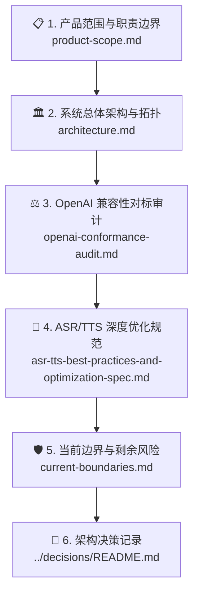

# 🏛️ SpeechRail 架构文档

本目录是面向系统架构评审、边界设计、协议设计与长期演进的正式技术参考。它详细规定了 SpeechRail 的系统分层、进程模型、状态机拓扑、资源调度机制及不可逆的架构决策 (ADR)。

---

## 📑 推荐阅读路径

1. **[📋 产品范围与职责划分 (product-scope.md)](product-scope.md)**：界定系统“拥有什么”与“不拥有什么”，明确应用侧与服务侧的契约划分。
2. **[🏛️ 总体架构与数据流 (architecture.md)](architecture.md)**：解析主进程与 Worker 拓扑、3-Tier 内存解码器、Resource Governor、WorkerLeaseLock 与零拷贝 IPC 协议。
3. **[⚖️ OpenAI 契约对标审查 (openai-conformance-audit.md)](openai-conformance-audit.md)**：逐项对标 OpenAI Audio/Realtime 标准，分析裁剪理由与兼容策略。
4. **[🚀 ASR/TTS 深度优化规范 (asr-tts-best-practices-and-optimization-spec.md)](asr-tts-best-practices-and-optimization-spec.md)**：Apple Silicon 统一内存优化、流式 VAD、音频平滑算法与长会话显存控制。
5. **[🛡️ 当前边界与剩余风险 (current-boundaries.md)](current-boundaries.md)**：明确当前已实测能力与发布前必须遵守的安全与容量红线。
6. **[📜 架构决策记录 (ADR)](../decisions/README.md)**：追溯重大技术选型的历史背景、权衡与替代方案。
7. **[🎙️ 音色克隆架构设计与工程交接 (voice-cloning-design-and-handoff.md)](voice-cloning-design-and-handoff.md)**：面向 Sona「声音工坊」的零样本克隆架构、Qwen3-TTS ICL 原生实测事实、公共 API 契约与 Worker IPC 实施方案。
8. **[SpeechRail × Sona 讲话人分离端到端设计](speaker-diarization-e2e-design.md)**（`active`）：样本时间线、连续分人、显式协议扩展、匿名关联、资源与质量门；SpeechRail 侧 R0–R4 已闭环验收，R5 评测工具代码就绪，配套[实施计划](../superpowers/plans/2026-09-05-speaker-diarization-e2e.md)进入消费端接线阶段。
9. **[🎙️ SpeechRail MCP Proxy 工具与契约 (speechrail-mcp-proxy.md)](speechrail-mcp-proxy.md)**（`active`）：外置 `speechrail-mcp` 进程把 ASR/TTS/diarization 暴露为 MCP 工具（`describe`/`transcribe`/`synthesize`/`preview_voice`/`create_job`/`get_job`/`cancel_job`），无状态 + 零配置 key，供 agent 更精准地调用本地语音能力。

---

## 🔑 核心架构原则

> [!IMPORTANT]
> 1. **单机共享但有界并行**：专为本机单人多应用设计，通过队列与 Resource Governor 防范资源争抢，严禁引入多租户或分布式复杂性。
> 2. **物理进程隔离**：主服务 (FastAPI) 仅负责协议接入与调度，所有模型运算严格封装在独立 Python Worker 进程中，经由私有二进制 IPC 通信。
> 3. **瞬态生命周期与零外呼**：请求期间严格离线加载外部 Snapshot，音频与转写文本内存瞬态处理，严禁持久化原始数据。
