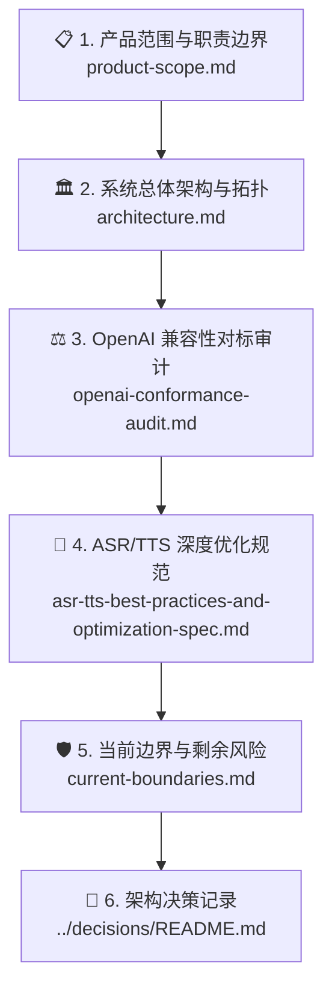

# 🏛️ SpeechRail 架构文档

本目录是面向系统架构评审、边界设计、协议设计与长期演进的正式技术参考。它详细规定了 SpeechRail 的系统分层、进程模型、状态机拓扑、资源调度机制及不可逆的架构决策 (ADR)。

---

## 📑 推荐阅读路径

1. **[📋 产品范围与职责划分 (product-scope.md)](product-scope.md)**：界定系统“拥有什么”与“不拥有什么”，明确应用侧与服务侧的契约划分。
2. **[🏛️ 总体架构与数据流 (architecture.md)](architecture.md)**：解析主进程与 Worker 拓扑、3-Tier 内存解码器、Resource Governor、WorkerLeaseLock 与私有长度前缀 IPC 协议。
3. **[⚖️ OpenAI 契约对标审查 (openai-conformance-audit.md)](openai-conformance-audit.md)**：逐项对标 OpenAI Audio/Realtime 标准，分析裁剪理由与兼容策略。
4. **[🚀 ASR/TTS 深度优化规范 (asr-tts-best-practices-and-optimization-spec.md)](asr-tts-best-practices-and-optimization-spec.md)**：Apple Silicon 统一内存优化、流式 VAD、音频平滑算法与长会话显存控制。
5. **[🛡️ 当前边界与剩余风险 (current-boundaries.md)](current-boundaries.md)**：明确当前已实测能力与发布前必须遵守的安全与容量红线。
6. **[📜 架构决策记录 (ADR)](../decisions/README.md)**：追溯重大技术选型的历史背景、权衡与替代方案。
7. **[🎙️ 音色克隆架构设计与工程交接 (voice-cloning-design-and-handoff.md)](voice-cloning-design-and-handoff.md)**：面向 Sona「声音工坊」的零样本克隆架构、Qwen3-TTS ICL 原生实测事实、公共 API 契约与 Worker IPC 实施方案。
8. **[讲话人分离整洁架构](../superpowers/specs/2026-09-08-diarization-clean-architecture-design.md)**（`accepted`）：文件接口遵循 OpenAI 原生 `diarized_json`；Realtime 使用单一 namespaced opt-in。运行时固定为 FluidAudio CoreML FP16 私有 worker，无 NeMo/CAM++ 回退；质量门以[能力与质量验收](../operations/capability-quality-acceptance.md)为准。旧 [SPK-E2E-1](speaker-diarization-e2e-design.md) 仅保留历史背景。
9. **[🎙️ SpeechRail MCP Proxy 工具与契约 (speechrail-mcp-proxy.md)](speechrail-mcp-proxy.md)**（`active`）：外置 `speechrail-mcp` 进程把 ASR/TTS/diarization 暴露为 MCP 工具（`describe`/`transcribe`/`synthesize`/`preview_voice`/`create_job`/`get_job`/`cancel_job`），无状态 + 零配置 key，供 agent 更精准地调用本地语音能力。
10. **[单机语音基座优化交付审计](2026-09-08-single-machine-speech-foundation-delivery.md)**（`active`）：方案 ID 与 Issue / PR / 回归证据的映射，以及尚待真实模型验证的质量门。
11. **[实时 VAD 最佳实践与当前模式策略](realtime-vad-2026-best-practices.md)**（`active`）：Silero/legacy 解析、SpeechAdmission、Sona 的 400/900ms 调用策略与帧量化边界。
12. **[音色克隆架构与稳定性](voice-cloning-design-and-handoff.md)**（`active`）：VoiceDesign ICL、确定性采样、响度控制、参考音频校验和 clone speed 能力边界。
13. **[克隆音色质量门禁与自量保障契约](voice-clone-quality-gates-and-contract.md)**（`under_review`）：参考音频门禁、clone revalidate、固定 probe、VoiceQualityReport、低基数观测与 Sona 闭环边界。

---

## 🔑 核心架构原则

> [!IMPORTANT]
> 1. **单机共享但有界并行**：专为本机单人多应用设计，通过队列与 Resource Governor 防范资源争抢，严禁引入多租户或分布式复杂性。
> 2. **分层进程边界**：ASR/TTS 模型运算封装在独立 Python Worker 进程中；VAD 位于 FastAPI 主进程，而分人模型位于专用 Swift/CoreML worker。主服务通过私有二进制 IPC 调度外部 Worker。
> 3. **瞬态生命周期与零外呼**：请求期间严格离线加载外部 Snapshot，音频与转写文本内存瞬态处理，严禁持久化原始数据。
