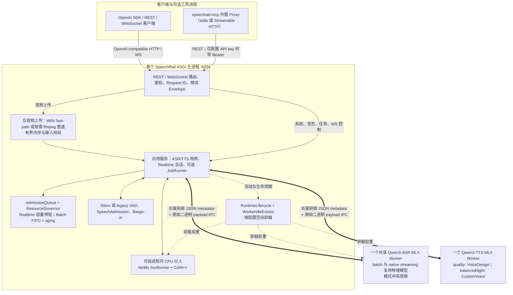
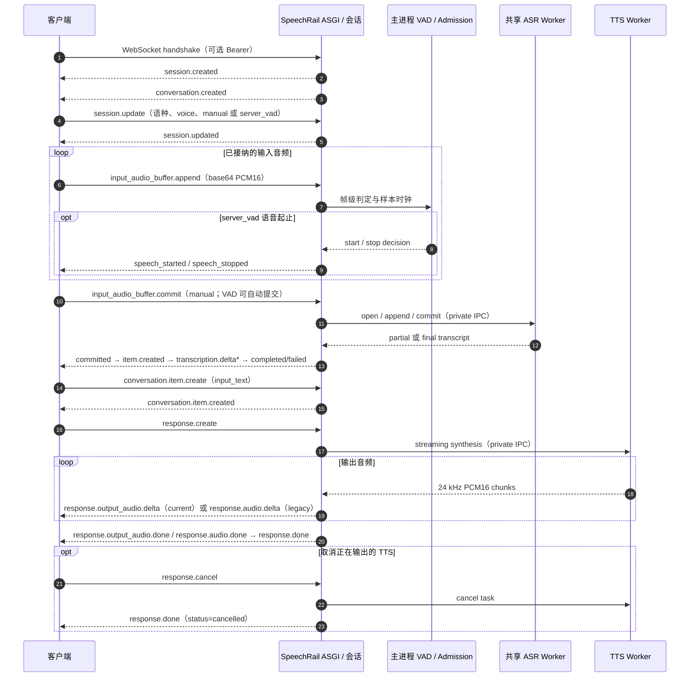

# 🏛️ SpeechRail 系统总体架构

> SpeechRail 是单机、单用户共享的 ASR/TTS 运行时。FastAPI 主进程负责公共契约、会话、输入边界、准入和生命周期；ASR 与 TTS 在独立 MLX 子进程中执行。调用方保留音频采集、播放、会议与 LLM 编排。

## 1. 系统分层与运行时拓扑

### 运行时事实

- `build_app_services` 组合 `Qwen3SharedWorker`、`Qwen3TtsWorker`、可选 `NemoSortformerEngine`、`AdmissionQueue`、`ResourceGovernor` 与生命周期组件。分人引擎在主进程中惰性加载，不是第三个 MLX 子进程。
- ASR 的 batch 与 native streaming facade 共享一个物理 owner；它们不是同机同时工作的产品场景，冲突稳定返回 `backend_busy`。
- `ResourceGovernor` 为 realtime 留出容量，并让 batch 按 FIFO/aging 准入；它不取消或抢占已经进入推理的 batch 工作。
- Worker IPC 使用长度前缀、JSON metadata 和可选 raw binary payload。它避免在主进程与 worker 间对 PCM 使用 Base64，但编码、拼接和读取仍会复制字节，不能称为 zero-copy。
- `WorkerIdleEvictor` 卸载模型权重；实际 idle footprint 与卸载时机由配置和基准决定，文档不把特定内存数值当作不变量。

## 2. 输入、调度与持久化边界

REST 音频上传才经过解码流水线。`/health`、`/v1/models`、`/v1/voices`、voice 管理、jobs 与 WebSocket 控制事件直接进入应用服务，不应被画成统一经过音频解码。

`/v1/jobs` 只有在本地 job repository 与 processor 被配置时才启用。它属于主进程的可选能力，不引入外部队列、控制面或第二个常驻服务。

音频、PCM 与转写在请求路径中保持瞬态。自定义 voice 的注册信息可以持久化，但请求不保留原始参考音频；客户端负责参考音频采集、同意与播放。

## 3. OpenAI Realtime ASR/TTS 子集

`/v1/realtime` 只承载 ASR/TTS，不承载 LLM response、工具调用、播放控制或会议策略。详细事件契约以 [realtime-openai.md](../../contracts/realtime-openai.md) 为准。

`server_vad` 的判定、SpeechAdmission 与 Barge-in 位于主进程会话层；它们决定何时把音频推进 ASR，而不是由 ASR worker 直接向客户端发送 VAD 事件。当前 nested `audio` session profile 使用 `response.output_audio.*`；legacy profile 保持 `response.audio.*`，同一 response 不会混用两组事件。

## 4. Diarization 边界

批量分人输出 session-scoped 匿名 label。Realtime 分人扩展只会在连续 adapter 经过验证后广告和协商；当前 adapter 未验证连续能力时，服务不会伪造该能力。实名映射、跨会议声纹库、会议数据库和最终播放仍属于调用方。

## 5. 目录职责映射

| 代码目录 | 责任 |
|---|---|
| `src/speechrail/app.py` | FastAPI 组合根、middleware、lifespan、路由注册 |
| `src/speechrail/application/` | 用例组装、Realtime 会话、音频流与分人协调 |
| `src/speechrail/domain/` | vendor-neutral types、ports、timeline 与 attribution ledger |
| `src/speechrail/backends/` | Qwen3 ASR/TTS、VAD、Sortformer/CAM++ adapters |
| `src/speechrail/runtime/` | queue、ResourceGovernor、worker lifecycle、IPC、jobs |
| `src/speechrail/http/` | REST/WebSocket 传输、鉴权、错误与 metrics middleware |
| `src/speechrail/compatibility/` | OpenAI model alias、Realtime event mapping 与稳定 envelope |
| `src/speechrail/mcp/` | 独立 `speechrail-mcp` 进程的 REST client 与工具组合根 |

## 6. 不变边界

- 默认 loopback；非 loopback 必须使用 API key 与明确 origin 策略。
- 请求路径不下载模型、不读取远程音频 URL、不持久化原始音频或完整转写。
- 一个 SpeechRail 服务、一个 ASGI worker；不得通过复制模型进程提高吞吐。
- 三档只替换权重与量化组合，公共 API、调度和 worker 协议保持一致。
- 客户端拥有麦克风、播放、会议、数据库和 LLM 编排；SpeechRail 提供本地推理、协议与资源边界。
