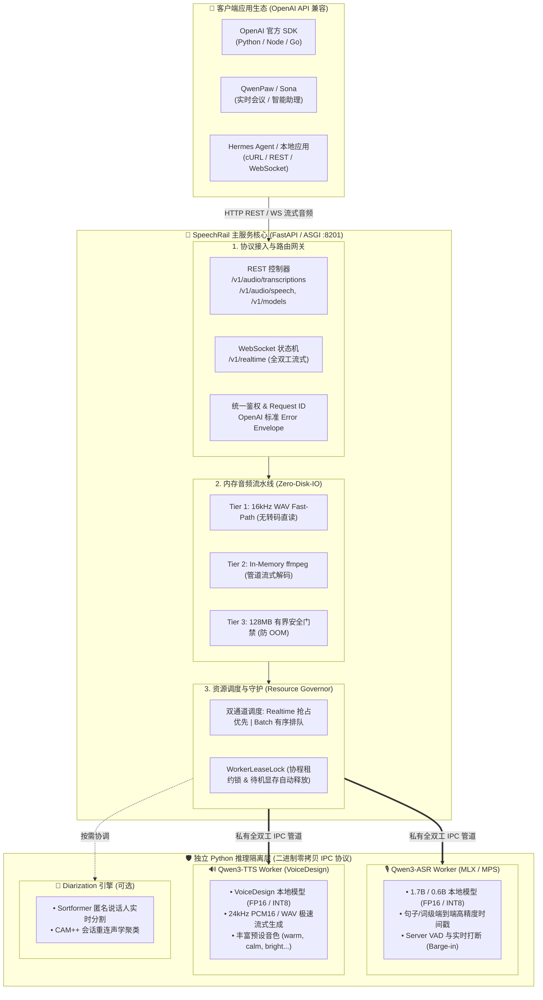
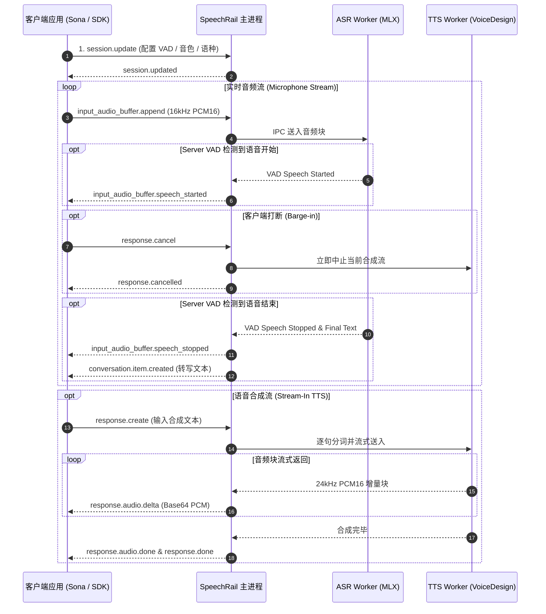

# 🏛️ SpeechRail 系统总体架构

> SpeechRail 采用**主控调度与推理运行时强隔离**的现代微内核设计理念。主服务负责协议接入、身份路由、有界缓冲与调度控制；推理后端作为独立子进程，通过私有二进制零拷贝 IPC 协议执行模型运算。

---

## 1. 系统分层与运行时拓扑

---

## 2. 核心架构组件与机制解析

### 2.1 3-Tier 内存音频解码流水线 (3-Tier In-Memory Audio Pipeline)
为了兼顾高吞吐与严苛的内存安全，REST 上传路径实现了三级防御机制：
1. **Tier 1 (WAV Fast-Path 直读)**：针对标准 16 kHz 单声道 16-bit PCM WAV 音频，直接解析 Header 并内存切片，绕过 `ffmpeg` 子进程调用，CPU 消耗归零。
2. **Tier 2 (In-Memory ffmpeg 流式解码)**：针对 MP3、FLAC、WebM、Opus 等压缩容器，通过 `stdin` 管道送入 `ffmpeg`，直接在内存输出标准 PCM 字节流，**全过程无任何磁盘临时文件落盘**。
3. **Tier 3 (128MB 安全硬截断)**：在读取与解码流中严格施加 128MB 有界安全门槛，杜绝超大恶意音频引发的宿主 OOM 崩溃。

### 2.2 资源守卫与租约锁 (Resource Governor & WorkerLeaseLock)
- **通道优先级**：系统划分 `Realtime` 与 `Batch` 两个独立资源通道。实时全双工会话享有优先调度权；批量任务在剩余配额中有序排队。
- **WorkerLeaseLock**：主进程通过租约锁协调 Worker 调用，保证多协程环境下单个 Worker 的顺序安全，防止并发指令串扰。
- **Two-Phase Standby Eviction（两阶段待机显存驱逐）**：长时间无请求时，Worker 自动进入待机模式并执行显存垃圾回收（释放 MPS 缓存），保护本机宿主系统的可用内存。

### 2.3 私有二进制零拷贝 IPC 协议 (Binary Zero-Copy IPC)
主进程与 Python Worker 之间通过标准输入输出建立全双工 IPC 通道：
- **协议帧结构**：`[Magic 2B] [MsgType 1B] [PayloadLen 4B] [Payload (MsgPack/Raw PCM)]`
- **零额外序列化**：音频 PCM 数据以原始二进制块追加传输，无需 Base64 编码，通信开销小于 0.1ms。

---

## 3. 全双工 Realtime 协议状态机

SpeechRail `/v1/realtime` 端点严格实现了 OpenAI Realtime 协议的语音交互状态流：

---

## 4. 目录职责分层映射

| 代码目录 | 职责范畴 | 设计模式与原则 |
|---|---|---|
| `src/speechrail/app.py` | FastAPI 组合根、生命周期 (Lifespan)、路由注册 | 组合根 (Composition Root) |
| `src/speechrail/application/` | 用例编排、Realtime 会话管理、Diarization 协调 | 应用服务层 (Application Service) |
| `src/speechrail/domain/` | Vendor-Neutral 结果、请求契约、端口协议 (Ports) | 纯净领域层 (Domain Ports / Models) |
| `src/speechrail/backends/` | Qwen3-ASR/TTS 适配器、Sortformer/CAM++ 引擎 | 适配器层 (Infrastructure Adapters) |
| `src/speechrail/runtime/` | 队列调度、Resource Governor、WorkerLeaseLock、IPC 协议 | 运行时内核 (Runtime Core) |
| `src/speechrail/http/routes/` | REST 端点与 `/v1/realtime` WebSocket 传输实现 | 接入控制器 (HTTP/WS Controllers) |
| `src/speechrail/compatibility/` | OpenAI 模型别名路由、标准 Error Envelope 封装 | 兼容适配层 (Compatibility Layer) |
| `src/speechrail/config/` | 环境变量解析与组合校验 | 配置管理器 (Settings Object) |

---

> [!TIP]
> 更多深入设计细节可参考 [ASR/TTS 最佳实践规范](asr-tts-best-practices-and-optimization-spec.md) 与 [OpenAI 兼容性审计](openai-conformance-audit.md)。
