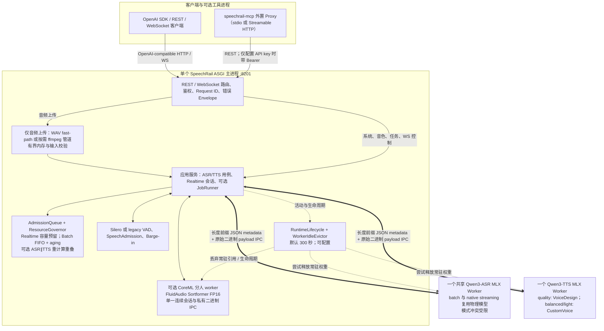
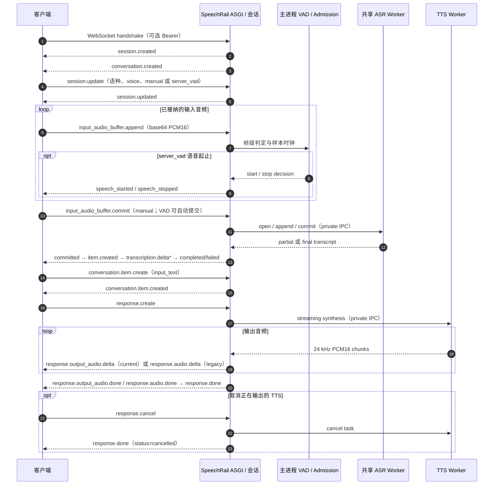

# 🏛️ SpeechRail 系统总体架构

> SpeechRail 是单机、单用户共享的 ASR/TTS 运行时。FastAPI 主进程负责公共契约、会话、输入边界、准入和生命周期；ASR 与 TTS 在独立 MLX 子进程中执行。调用方保留音频采集、播放、会议与 LLM 编排。

## 1. 系统分层与运行时拓扑

### 运行时事实

- `build_app_services` 组合 `Qwen3SharedWorker`、`Qwen3TtsWorker`、可选 `CoreMLSortformerEngine`、`AdmissionQueue`、`ResourceGovernor` 与生命周期组件。分人模型只由惰性启动的私有 Swift worker 持有，FastAPI 主进程不加载 NeMo 或 CAM++。
- 分人生产制品固定为 FluidAudio CoreML FP16 `v3/fp16/SortformerNvidiaLow_v2.1.mlmodelc`，使用 `computeUnits=.all` 直接加载已编译 bundle；没有 provider 自动选择、精度降级或 NeMo 回退。运行时选择证据见 D1 报告，质量、尾部和长期资源门仍须单独验收。
- ASR 的 batch 与 native streaming facade 共享一个物理 owner；它们不是同机同时工作的产品场景，冲突稳定返回 `backend_busy`。
- `ResourceGovernor` 为 realtime 留出容量，并让 batch 按 FIFO/aging 准入；它不取消或抢占已经进入推理的 batch 工作。
- ASR∥TTS 重计算重叠是可配置策略（ADR-0016），由声明常驻字节与物理内存预算判定：`SPEECHRAIL_ALLOW_HEAVY_OVERLAP=auto`（默认）在任一启用组件未声明非零峰、或声明的总量超过 `budget_for_hardware = max(4 GiB, host_memory // 2)` 时 fail-closed 串行，否则放行 ASR 与 TTS 并行；`true`/`false` 是运维与实验强制开关。重叠轴严格限定为 ASR∥TTS：TTS∥TTS 仍受单一 TTS worker 约束，ASR∥ASR（batch 与 native streaming）仍返回 `backend_busy`，且不复制任何 worker 进程。
- Worker IPC 使用长度前缀、JSON metadata 和可选 raw binary payload。它避免在主进程与 worker 间对 PCM 使用 Base64，但编码、拼接和读取仍会复制字节，不能称为 zero-copy。
- 分人 worker 在活跃会话结束时由 supervisor 定向取消并回收；IPC 是长度前缀 JSON header 加 PCM16 binary payload。不存在活跃分人会话时，普通 ASR/TTS 不创建或租用该 worker。

### 三档组成、模型目录与精度策略

模型目录（`src/speechrail/assets/model-catalog.json`）为 schema v2：`presets` 描述三档组成，顶层 `precision_policy` 取代旧的“全档 8-bit”约束。档位只选择权重与量化精度，以及是否供给分人制品。

| 档位 | 定位 | ASR | TTS | Aligner | 分人 |
|---|---|---|---|---|---|
| 🟢 `light` | Embedded（8GB 基础机） | `asr-0.6b-q8`（8-bit） | `tts-0.6b-custom-q8`（8-bit） | —（无） | ✗ |
| 🟡 `balanced` | Pro Workflow（16–24GB） | `asr-1.7b-q8`（8-bit） | `tts-0.6b-custom-q8`（8-bit） | `aligner-q8`（8-bit） | ✓ |
| 🟣 `quality` | Studio（32GB+） | `asr-1.7b-q8`（8-bit） | `tts-1.7b-design-q8`（8-bit） | `aligner-bf16`（bf16） | ✓ |

- **按档位精度策略**：三档均 8-bit 权重，`quality` 的 aligner 保持 bf16；曾评估的 4-bit `light`（`asr-0.6b-q4` / `tts-0.6b-custom-q4`）因验收门 E1 在公开真人语料上测得 0.6B ASR 相对 8-bit 基线劣化 1.38pp（>0.5pp 阈值）而未采纳，制品保留在 catalog 但不再被任何档位使用。
- **aligner 是分人专用制品**：aligner 是 catalog 一等制品，但**不进入 `PreparedModelSet` / `prepare_models`**，而由 `diarization_assets.prepare_diarization_assets` 按档位供给到 `app_home/diarization/<aligner-key>`，因此无 `prepared_id` / registry 迁移。词级时间戳来自 ASR 原生输出，不依赖 aligner。
- **选择与供给**：`config.selection.resolve_selection` 按档位覆盖 `qwen3_aligner_model_dir`，在 `light` 清空它并同时清空 `diarization_coreml_model_path`；aligner 快照缺失时 fail closed（清晰报错，不半启动）。`profile apply <tier>` 在切换时供给该档分人制品并写入/移除 CoreML 与 aligner 环境键。
- **契约与声明**：三档的公共 API 契约形状、worker 协议、调度与进程隔离保持一致；**对外声明的能力随档位不同**——`gpt-4o-transcribe-diarize` 仅在分人就绪（`balanced`/`quality`）时出现在 `/v1/models`，`light` 不声明。

## 2. 输入、调度与持久化边界

REST 音频上传才经过解码流水线。`/health`、`/v1/models`、`/v1/voices`、voice 管理、jobs 与 WebSocket 控制事件直接进入应用服务，不应被画成统一经过音频解码。

`/v1/jobs` 只有在本地 job repository 与 processor 被配置时才启用。它属于主进程的可选能力，不引入外部队列、控制面或第二个常驻服务。

音频、PCM 与转写在请求路径中保持瞬态。自定义 voice 的注册信息可以持久化，但请求不保留原始参考音频；客户端负责参考音频采集、同意与播放。

## 3. OpenAI Realtime ASR/TTS 子集

`/v1/realtime` 只承载 ASR/TTS，不承载 LLM response、工具调用、播放控制或会议策略。详细事件契约以 [realtime-openai.md](../../contracts/realtime-openai.md) 为准。

`server_vad` 的判定、SpeechAdmission 与 Barge-in 位于主进程会话层；它们决定何时把音频推进 ASR，而不是由 ASR worker 直接向客户端发送 VAD 事件。当前 nested `audio` session profile 使用 `response.output_audio.*`；legacy profile 保持 `response.audio.*`，同一 response 不会混用两组事件。

## 4. Diarization 边界

文件分人使用原生 `gpt-4o-transcribe-diarize` / `diarized_json`，每个 segment 的匿名标签为 A–D。文件与 Realtime 都把 PCM、固定文本单元和活动更新交给同一个 `application.diarization.DiarizationSession` actor：transport 只投影领域事件，正文一经 completed 不会被分人改写。Qwen3 `ForcedAligner` 从按档位供给到 `app_home/diarization/<aligner-key>` 的本地 snapshot（`balanced` 为 `aligner-q8`，`quality` 为 `aligner-bf16`）取得固定正文的时间边界；它复用私有 ASR worker，不执行第二次 `Session.transcribe`，且仅为分人路径服务——`light` 不供给 aligner/CoreML，未配置时分人能力不就绪。词级时间戳来自 ASR 原生输出，与 aligner 无关。Realtime 通过 `session.speechrail.diarization.enabled=true` opt-in；没有开启时不会创建 actor、启动 CoreML worker 或初始化对齐器。实名映射、跨会议声纹库、会议数据库和最终播放仍属于调用方。

## 5. 目录职责映射

| 代码目录 | 责任 |
|---|---|
| `src/speechrail/app.py` | FastAPI 组合根、middleware、lifespan、路由注册 |
| `src/speechrail/application/` | 用例组装、Realtime 会话、音频流与分人协调 |
| `src/speechrail/domain/` | vendor-neutral types、ports、timeline 与 attribution ledger |
| `src/speechrail/backends/` | Qwen3 ASR/TTS、VAD、唯一 CoreML Sortformer adapter |
| `src/speechrail/runtime/` | queue、ResourceGovernor、worker lifecycle、IPC、jobs |
| `src/speechrail/http/` | REST/WebSocket 传输、鉴权、错误与 metrics middleware |
| `src/speechrail/compatibility/` | OpenAI model alias、Realtime event mapping 与稳定 envelope |
| `src/speechrail/mcp/` | 独立 `speechrail-mcp` 进程的 REST client 与工具组合根 |

## 6. 不变边界

- 默认 loopback；非 loopback 必须使用 API key 与明确 origin 策略。
- 请求路径不下载模型、不读取远程音频 URL、不持久化原始音频或完整转写。
- 一个 SpeechRail 服务、一个 ASGI worker；不得通过复制模型进程提高吞吐（ASR∥TTS 重计算重叠是既有单 worker 进程内的准入策略，不复制进程）。
- 三档只替换权重与量化组合（含按档位精度策略与是否供给分人制品）；公共 API 契约形状、调度和 worker 协议保持一致，但对外声明能力随档位不同，必须如实声明。
- 客户端拥有麦克风、播放、会议、数据库和 LLM 编排；SpeechRail 提供本地推理、协议与资源边界。
