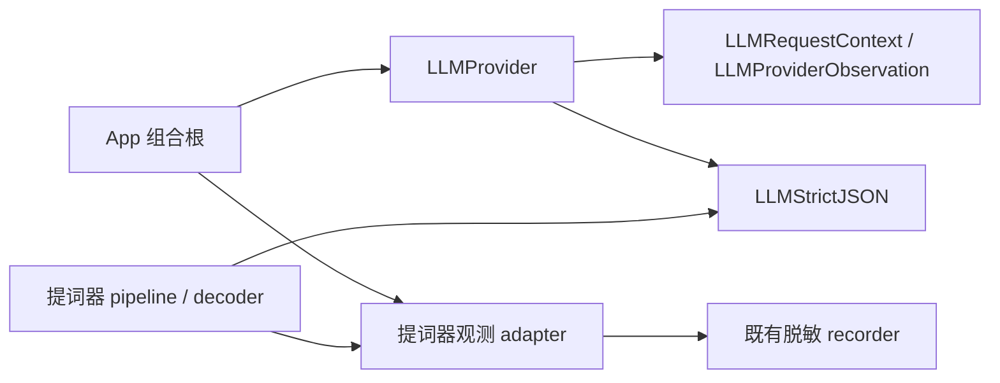

# LLM 响应校验与观测边界

App 的共享 LLM 支持由 `LLMProvider.swift` 中的独立类型提供，不依赖提词器 preparation/prompts、会议 Store 或 Session 类型。当前固定使用 MacPaw/OpenAI `0.5.1`；本次不调整依赖版本、模型、业务 JSON schema 或用户配置。SpeechRail 服务端的 ASR/TTS 契约不承载这些 App 侧 LLM 行为。

## 按用途校验响应

| 层次 | 拥有者 | 最低后置条件 |
|---|---|---|
| HTTP | Provider transport | 实际 operation 的 HTTP 状态合法；`/models` 仅是辅助信息 |
| 文本响应 | `LLMResponseValidation` | 单次完整、可用的文本响应，接口形状与所选 operation 一致 |
| 结构化输出 | Provider + `LLMStrictJSON` | Chat 最低合同、usage/预算、严格对象语法；拒绝重复键与尾随内容 |
| 业务提交 | 各 feature decoder/pipeline | schema、业务完整性、取消/版本与提交条件 |

探测、正式 Responses 文本解析及 Chat 结构化调用共享最低文本校验。普通探测允许普通文本，不要求业务 JSON、usage 或某个 feature schema。Responses 的 assistant message `output[].content[].output_text` 要求显式 `status=completed`；明确的顶层 `output_text` 兼容形状可以缺少 status，存在的 status 则必须为 `completed`。Chat 要求一个 assistant 文本 choice、`finish_reason=stop`，不接受 tool call。

HTTP 2xx 中的非 JSON、空体、重复键、错误 envelope、operation 错配、空正文均不确认可用。拒答、截断、失败和 queued/in_progress/cancelled 分别归为 `refused`、`incomplete`、`failed`、`notCompleted`。短探测截断只证明本次未完成，不证明模型不存在。探测把这些事实映射为 `responseUnconfirmed`；正式调用按其错误域映射，仍不能提交成功结果。该结论不证明流式、background、JSON Schema 或未来请求均可用。

## 依赖与观测



`LLMRequestContext` 只有 session/request correlation，不含 stage、item 或业务 retry。Provider 继续拥有 transport attempt、协商缓存、SSE 预算/UTF-8/首字与停滞时限及远端取消。feature 拥有业务 retry、map/reduce、版本、保存和人审。

Provider observer 由构造或单次调用注入；单次 observer 覆盖构造 observer，只投递一条路径。nil observer 和抛错 observer 均不改变结果、原错误或取消。每次 transport attempt 有一条 started 和一条 terminal 观测；结构化解析失败只记录 failed，不先记录成功 response 再重复记失败。poll 的 queued/in_progress 是该次 GET 的 received 结果，后续轮询仍拥有独立 request correlation。

组合根把 recorder 接入助手、纪要、InnerOS、跨会议知识问答与提词器的共享 Provider。`TeleprompterProviderObservationAdapter` 通过闭包补回 run/request/stage/item/业务 attempt，Provider 不持有这些业务信息。pipeline recorder 同样显式注入，已移除全局 recorder box。

继续使用既有 `teleprompter-ai` 目录、event kind、metrics 名称和 operation/mode/stage 低基数维度，不改写历史日志。事件增加可选 `providerContext`，供普通调用关联 request；读取旧记录不需要该字段。日志不记录 prompt、响应正文、密钥或业务输入。单次 sink 的磁盘失败继续由 recorder fail-open 处理。

## 验证与回退

独立编译依赖守卫：

```sh
python3 scripts/check_llm_support_boundary.py
```

它只构建 SDK 依赖，再独立 type-check `LLMProvider.swift`，不向编译器传入任何 feature 源文件。公共类型和唯一 scanner 暂集中在这个已登记 source 中，以避开 #245 在途 `.pbxproj` 注册改动；类型职责仍分离，未来可在协调后拆文件。

合成响应回归覆盖坏 2xx、普通文本、thinking/models、schema/重复键、observer 单路投递与失败、真实 AssistantSession 的音频准入及既有 SSE/background/cancel。测试不连接真实 LLM、不读写真实钥匙串、不取音频设备。回退本包 commit 可恢复接线与校验；不删除配置、密钥、作品或日志。
