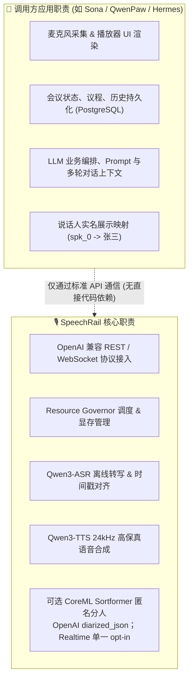

# 📋 SpeechRail 产品范围与职责边界

> **核心定位**：SpeechRail 是一项本地优先的共享 ASR/TTS 运行时服务，并按需提供匿名讲话人分离。它负责管理仓库外部模型运行时，向多个本机应用提供标准、稳定、高性能的语音识别与合成接口；分人能力仍受 profile readiness 与 Realtime native capability gate 约束。

---

## 1. 系统职责对照矩阵

| 模块类别 | ✅ SpeechRail 负责的职责 | ❌ 明确属于调用方应用的职责 |
|---|---|---|
| **音频输入与采集** | 内存流式解码、WAV Fast-Path 直读、16kHz PCM 归一化 | 麦克风硬件调用、系统录音权限请求、音频增益控制 |
| **音频输出与播放** | 24kHz PCM16 / WAV / MP3 极速合成与流式分块 | 扬声器硬件播放、播放队列管理、本地音频文件存档 |
| **语音识别 (ASR)** | 批量/流式转写、多语种识别、分段与时间戳对齐 | 会议转写持久化、实时会议笔记生成、敏感词过滤 |
| **语音合成 (TTS)** | VoiceDesign / CustomVoice 合成、预设音色路由；quality 档的 voice design、preview 与 clone API（不保留原始参考音频） | 参考音频采集与同意、调用方侧文件选择、扬声器播放与业务化音色管理 |
| **讲话人分离 (Diarization)** | profile 就绪后通过 OpenAI `gpt-4o-transcribe-diarize` / `diarized_json` 提供 A–D 匿名标签；Realtime 仅在 `session.speechrail.diarization.enabled=true` 时发送 session-scoped 归属更新。固定正文由本地 Qwen3 ForcedAligner 对齐，CoreML 只提供活动证据 | 说话人实名映射库、声纹库管理、跨会议身份关联、用户身份识别与认证 |
| **业务逻辑与编排** | Request ID 追踪、统一错误 Envelope、有界队列管理 | LLM 对话上下文、业务 Prompt 工程、多租户权限控制 |

---

## 2. 目标客户端适配现状

| 客户端应用 | 接入场景与模式 | 当前状态 | 验证证据 |
|---|---|---|---|
| **QwenPaw** | 桌面听写：通过 `whisper_api` 发送短音频录音 | 🟢 生产就绪 | 本机真实短音频 Smoke 验证通过 |
| **OpenAI 官方 SDK** | Python / Node.js SDK 直连 REST 与 Realtime | 🟢 生产就绪 | 单元测试、契约测试与真实推理完成 |
| **Sona 会议助理** | 实时全双工会议字幕与语音助手合成；可选分人扩展按服务端 capability 广播启用 | 🟡 契约就绪、能力依赖 | `/v1/realtime` 端点接入与协议回归测试通过；连续 native 分人另需独立 gate |
| **Hermes Agent** | 桌面智能体：专用 STT 接口接入 | 🟢 文档就绪 | 独立 STT 路由配置完成，待端到端验收 |
| **通用 WebSocket 客户端** | 自研客户端对接 `/v1/realtime` | 🟢 生产就绪 | 标准 WebSocket 协议测试通过 |

---

## 3. 不可打破的设计红线 (Inviolable Constraints)

> [!CAUTION]
> 1. **严禁网络静默外呼**：服务运行与请求处理路径严禁静默联网下载模型或拉取云端依赖。
> 2. **严禁业务职责外溢**：严禁在 SpeechRail 中引入 `sona` 的会议持久化、UI 模块或 LLM 编排代码。
> 3. **严禁持久化敏感音频**：源音频与转写文本仅在内存流水线中瞬态存在，禁止写入本地磁盘缓存或输出到调试日志。
