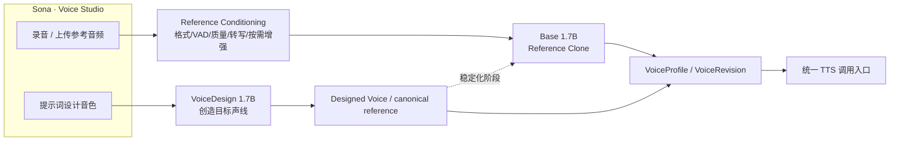

# Quality 档音色创造、克隆与稳定化能力架构

## 1. 决策摘要

SpeechRail 将 `quality` 定义为唯一具有**音色创造（voice design）**和**参考音色克隆（voice clone）**能力的 Studio 档。两类任务不再由同一个模型混用：

- **提示词设计音色**：Qwen3-TTS VoiceDesign 1.7B，职责是根据自然语言描述创造声线；
- **参考音频克隆**：Qwen3-TTS Base 1.7B，职责是根据参考音频 + 准确参考文本复现 speaker identity；
- **常规内置音色**：`quality` 继续由 VoiceDesign 提供，`balanced/light` 继续由 CustomVoice 0.6B 提供；
- **Base 按需加载**：Base 作为 `quality.tts_clone` capability artifact 安装，但不在服务启动时常驻；clone 请求到来时切换到 Base，下一次普通 VoiceDesign 请求再切回；两个大 TTS 模型不应被运行时有意同时常驻。

该设计修正了旧实现把参考克隆请求送入 VoiceDesign 私有 `_generate_icl()` 的职责混用。clone 现在只允许由 `base` variant 经 MLX-Audio **公开 `generate(...)` 接口**执行。

## 2. 两条 Sona 音色创建链路



### 2.1 提示词链路

目标语义是“创造一种声音”，而不是“复刻一个已有的人”。VoiceDesign 接收文本描述，例如年龄感、音高、口音、情绪和播报风格。

本 PR 的运行时边界：

1. prompt-created voice 继续由 VoiceDesign 合成；
2. VoiceDesign 不再被允许承接 reference clone；
3. catalog/runtime 已为后续 **VoiceDesign → canonical reference → Base stabilization** 提供 Base capability，但自动物化 canonical reference 与 VoiceRevision 迁移不在本次实现中静默完成，必须作为显式、可回滚的注册操作落地并单独验收。

长期目标是“VoiceDesign 负责创造，Base 负责稳定复现”：设计成功后生成一段经过质量门的 canonical reference，再由 Base 建立稳定 clone revision；后续目标文本不再每次重新进行开放式音色设计。

### 2.2 参考音频链路

目标语义是“像这个 speaker”。Reference clone 必须直接进入 Base：

```text
Sona capture/upload
  → decode + format verification
  → reference quality / VAD / segmentation
  → exact transcript verification
  → optional conservative enhancement
  → one canonical level-normalization boundary
  → Qwen3-TTS Base public clone path
  → cross-text quality acceptance
  → VoiceRevision
```

VoiceDesign、CustomVoice 均不得作为 reference clone fallback。Base 不可用时返回明确的 `voice_cloning_unsupported` / `voice_clone_base_model_unavailable`，不能降级到错误模型后继续返回 200。

## 3. Catalog 与能力建模

`ModelPreset` 将模型档位与 capability artifact 分离：

```yaml
quality:
  asr: asr-1.7b-q8
  tts: tts-1.7b-design-q8
  tts_clone: tts-1.7b-base-q8
  aligner: aligner-bf16
  diarization: true

balanced:
  tts: tts-0.6b-custom-q8
  tts_clone: null

light:
  tts: tts-0.6b-custom-q8
  tts_clone: null
```

`tts` 表示档位的默认 TTS；`tts_clone` 是可选的 clone capability，并不把 Base 伪装成默认 TTS。`/v1/models` 的 `supports_clone` 只有在运行时实际解析到 `base` capability 时才为 `true`。

Base artifact 使用不可变模型 revision 和逐文件 SHA-256，遵循与其他 managed artifacts 相同的离线、校验、原子发布和 fail-closed 规则。

## 4. 运行时模型槽：按 capability 互斥换模

Quality 不采用“VoiceDesign + Base 永久双常驻”。`Qwen3TtsCapabilityRouter` 维护一个逻辑 TTS 槽：

1. 服务启动仅 warm primary VoiceDesign；
2. clone 请求获取 capability lock；
3. 若 primary 仍 resident，先安全关闭 primary；
4. Base worker 首次请求时惰性启动并完成 clone；
5. Base 可继续保留到下一次 capability 切换/idle eviction；
6. 普通 TTS 请求到来时先关闭 Base，再按需恢复 primary；
7. capability lock 覆盖完整流式请求，避免换模过程和另一条 TTS 流交叉。

这样增加的是**安装体积与换模冷启动成本**，而不是强制把两个 1.7B TTS 权重同时计入常驻内存。TTS∥TTS 仍然不是当前产品并发模型。

## 5. VoiceProfile / VoiceRevision 收敛方向

上层不应该长期感知底层 checkpoint。建议统一记录：

```yaml
voice_id: example
origin: recorded | generated
revision: 3
canonical_reference:
  audio_sha256: ...
  transcript_sha256: ...
  preprocessing_version: ...
identity:
  backend: qwen3_tts_base
  model_revision: ...
quality:
  policy_version: voice_quality_v1
  run_id: ...
```

对于 prompt-created voice，`origin=generated`；对于 Sona 录音，`origin=recorded`。两者在完成 Base 稳定化后都可以成为同一种可复用 VoiceRevision。当前 `VoiceProfile` 数据结构尚未一次性引入上述全部字段，避免在没有迁移/回滚策略时破坏已有音色资产；这是后续 schema evolution 的目标模型。

## 6. Reference conditioning 最佳实践与 Sona 边界

### 6.1 录音端

Sona 应优先得到可诊断的、未经隐藏 DSP 反复改变的参考：

- 明确记录实际 input device / channel / sample rate；
- 浏览器请求的 constraint 与实际 track settings 分开记录；
- 优先支持 PCM/WAV 采集路径，WebM/Opus 仅作为兼容输入；
- 用户可录多段自然朗读，服务端选择合适主参考，不要求用户一次达到专业播音水平；
- 原始录音、规范参考和生成试听是三个不同对象，UI 不应混淆。

### 6.2 前处理端

SpeechRail 应成为 canonical reference 的权威处理边界：

- VAD/segmentation 只保留可靠 speaker 段；
- 参考文本必须与实际发音一致；
- 降噪仅在有证据时轻度启用，并以音色损伤为反向门；
- 只做一次基于有效语音的增益/响度处理，避免 Sona 与 vendor 重复归一；
- 严重削波、混响、多人重叠优先重录，不承诺靠增强模型恢复；
- 可评估 DeepFilterNet3，但它是条件式 enhancer，不是 clone 的必经路径。

当前 Sona 的整段 RMS 增益和 SpeechRail/vendor reference normalize 需要在独立质量 PR 中进一步统一；本 PR 的模型职责拆分不等价于参考音频链路已经完成全部声学整改。

## 7. “像本人”与“播得专业”必须解耦

Reference clone 的 speaker identity 和用户录音中的 prosody 并不是同一个目标。Quality 后续提供两种体验：

- **原声保真**：优先保留用户身份、口音与自然表达；
- **自然播报/专业表达**：保留身份，但语速、停顿、重音、情绪由独立表达控制承担。

不能用简单整体变速、压缩动态或更大音量冒充 prosody 解耦。Base speaker-only/x-vector-only 模式、VoxCPM2 或“专业 TTS prosody → voice conversion”都只能作为实验后端，经身份泄漏、自然度、延迟和资源门后才能进入正式 capability。

## 8. 质量验收

创建成功、输入参考合格、输出质量合格是三个状态，不得合并。

最低验收矩阵：

- 至少覆盖陈述、疑问、数字/单位、标点、短响应、长句/停顿等不同文本；
- 同一配置和 reference 做重复生成；
- 评价 speaker similarity 的跨文本分布，不只看同文本 hash；
- 检查静音、非语音、DC、削波、峰值、可懂度、漏字/复读；
- 同时记录首次可听延迟、统一定义 RTF、换模冷启动、内存与取消行为；
- 主观比较需响度匹配，避免“更响=更好”的偏差。

现有 `voice_quality_v1` 仍是公共报告壳，但之前审计发现 synthesis pass/deterministic 判定存在需要单独修复的缺口；在这些门禁修复并经过真实音频 A/B 前，绿色质量报告不能被解释为“跨文本身份与纯净度已证明”。

## 9. 分阶段演进

### Phase A — 本 PR：能力职责正确化

- catalog 增加 Base clone artifact；
- Quality preset 增加 `tts_clone`；
- Base 成为唯一 reference clone variant；
- clone 改走 vendor public `generate`；
- capability router 实现 Base lazy load 与互斥换模；
- managed install / profile / preflight / model capability 全链同步；
- README、架构与当前边界更新；
- 保持 Balanced/Light 与现有公共请求形状不变。

### Phase B — 参考音频质量流水线

- Sona PCM capture / 多段录音；
- canonical reference pipeline；
- speech-aware normalization 与条件降噪；
- 输入/输出质量门禁修复；
- 参考特征缓存。

### Phase C — Prompt voice 稳定化

- VoiceDesign 输出 canonical reference；
- Base 创建新 VoiceRevision；
- 显式迁移与回滚；
- 跨文本 speaker similarity 与 ABX 门。

### Phase D — 专业表达

- 身份/韵律解耦实验；
- Base conditioning 模式、VoxCPM2/VC 对照；
- 根据实时性和质量证据决定是否进入生产 capability。

## 10. 回滚

- catalog/preset 回滚到无 `tts_clone` 的版本即可恢复旧安装集合；
- runtime router 可以整体回滚，不修改已有 clone reference 文件格式；
- 本 PR 不自动重写已有 VoiceProfile，不做不可逆音色资产迁移；
- 不允许在回滚时把 clone 请求重新静默送给 VoiceDesign；若 Base 不存在，应显式把 clone capability 标记为不可用。
