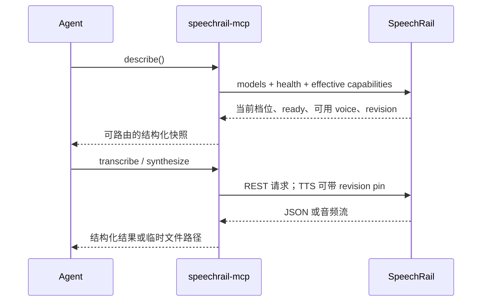

# SpeechRail MCP Proxy 架构与终态契约

本文档是当前 `speechrail-mcp` 的发布级架构与行为说明。它描述外置 MCP Proxy 如何把本机
SpeechRail REST 能力交给 Agent，以及如何通过 effective capability snapshot 与 revision pin
控制音色和模型身份的一致性。

本版将 `effective_capabilities_v1` 定为 MCP 的必需能力发现契约，移除旧服务的
`/v1/models` + `/v1/voices` discovery fallback，并从 `describe` 结果删除 legacy 诊断字段。

当前版本（2026-09-21）补充 Realtime caller-owned transcription 扩展的 MCP 边界：
MCP 不代理该 WebSocket 能力，直连客户端可协商 mutable snapshot partial 与会话级分块。
同时保留 durable speech job 的共享参数校验，并明确 output validation
必须绑定当前 runtime、前处理、generation recipe 与 policy；cold/unknown runtime 不得把历史
pass 投影为 `production_ready`。

事实来源按以下顺序解释冲突：

1. `src/speechrail/mcp/` 的当前实现与测试；
2. [`contracts/openapi.yaml`](../../contracts/openapi.yaml) 与
   [`contracts/realtime-openai.md`](../../contracts/realtime-openai.md)；
3. 本文档及其他 active 用户文档。

本文档不定义 MCP SDK 的通用协议，也不替代 REST/OpenAPI 或 Realtime wire contract。若代码、
OpenAPI 与本文档发生差异，应先修正契约与测试，再发布文档结论。

## 1. 定位与边界

### 1.1 定位

`speechrail-mcp` 是独立进程、无状态、REST-to-MCP 的适配层：


Proxy 负责：

- 将 MCP tool call 映射为 SpeechRail REST 请求；
- 在 Agent 进入推理前提供可操作的能力发现；
- 在本地文件边界处理音频引用，避免把音频字节放入 Agent context；
- 将 SpeechRail 的稳定错误 envelope 映射为带 retry/action hint 的 MCP tool error；
- 将二进制语音写入 Proxy 主机的临时文件，并返回文件路径而不是音频内容；
- 在支持新契约的服务上，把有效的 voice/model revision pin 转发到 TTS 请求。

Proxy 不负责：

- 加载模型、下载模型、创建 FastAPI 应用或直接管理 SpeechRail worker；
- 管理 LLM、conversation、memory、persona、tool orchestration、播放队列或 barge-in；
- 持有 Realtime WebSocket、创建 Realtime session handle 或代替调用方决定实时响应；
- 管理实名 speaker、跨会话声纹库、embedding、持久化 PCM 或完整转写历史。

### 1.2 Realtime 边界

Realtime 仍由调用方直连唯一的 `/v1/realtime`。MCP 只代理无状态 REST 的 ASR、TTS、音色和
job 工具；需要实时字幕、语音助手或会议能力的客户端自行拥有连接、会话状态、LLM 编排、播放
与打断策略。SpeechRail Realtime 只交付 ASR/VAD/匿名分人事实，并处理调用方显式发送的
`speechrail.tts.start` / `append_text` / `finish_text` / `cancel`。

对于提词器或实时字幕，调用方在首个 PCM 前用一次 `session.update` 声明
`session.type=transcription`、24 kHz mono PCM16 与
`session.speechrail.{task,alignment,diarization}`，等待 `session.updated` 回显后再开始采集。可修订
partial 是 `speechrail.transcription.hypothesis`：`text` 是同一 `utterance_id` 的最新全文，调用方
按严格递增 `revision` 替换文本，不得把它当作追加 delta；只有可证明的稳定前缀才映射到官方
append-only `delta`。首个 PCM 后不能修改配置，服务返回 `invalid_state`。这些字段和事件属于
Realtime wire contract，不是 MCP tool、resource 或 MCP session 状态；详见
[`contracts/realtime-openai.md`](../../contracts/realtime-openai.md)。

## 2. 进程、传输与安全

### 2.1 进程形态

Proxy 与主服务分离。Proxy 崩溃不应终止模型服务；主服务的升级、回滚和 worker 生命周期也不
依赖 Proxy 的进程状态。Proxy 使用一个共享的异步 REST client，并在 MCP lifespan 结束时关闭
连接池。

### 2.2 传输

| 模式 | 默认行为 | 适用范围 |
|---|---|---|
| `stdio` | 默认模式；不监听端口 | 本机 Claude Code、Codex、Cursor 等客户端 |
| `streamable-http` | 默认绑定 `127.0.0.1:8202` | 本机 HTTP MCP 客户端或受控网关 |

可通过命令行或环境变量覆盖 transport、host、port。相关配置为：

- `SPEECHRAIL_MCP_TRANSPORT`：`stdio` 或 `streamable-http`；
- `SPEECHRAIL_MCP_HOST` / `SPEECHRAIL_MCP_PORT`：仅 HTTP transport 生效；
- `SPEECHRAIL_BASE_URL`：默认 `http://127.0.0.1:8201/v1`，带或不带 `/v1` 均可；
- `SPEECHRAIL_MCP_TIMEOUT_SECONDS`：Proxy 到主服务的单次请求超时。

### 2.3 主服务认证

Proxy 的 API key 解析顺序为：

1. `SPEECHRAIL_API_KEY` 环境变量；
2. `SPEECHRAIL_APP_HOME` 下 managed `config/.env` 中的配置；
3. 无 key 时保持 keyless loopback 请求。

key 只进入 `Authorization: Bearer <key>`，不进入 URL query、日志、MCP 输出或错误上下文。
主服务暴露到非 loopback 地址时，必须同时配置 Bearer 鉴权和明确的 origin/网关策略；不能把
Proxy 的 HTTP 监听地址本身当作安全边界。

Proxy 不读取远程音频 URL。音频工具只接受本机路径或 `file://` URI；`http`、`https`、`ftp`、
`s3`、`gs` 等 scheme 和 inline base64 均在工具层拒绝。

## 3. Agent 的标准调用流程

对普通 ASR/TTS，Agent 按以下顺序工作：



调用规则：

1. 先调用 `describe()`，不要从静态 prompt、历史响应或模型 ID 猜测当前能力；
2. 只选择 `available=true` 的 voice，并根据 `mode`、`variant` 和 `availability_reason` 判断
   当前请求是否可用；不从模型 variant 推断 profile；
3. 跨句、跨请求或长对话需要稳定音色时，使用 effective snapshot 提供的 revision pin；
4. 收到 revision conflict 后重新 `describe()`，由业务决定继续使用旧 revision、回滚或切换；
5. 收到 `backend_busy` 或 `queue_full` 时采用有界退避，不进行无上限循环；
6. 同步请求因长度或超时不适用时，再使用 `create_job` / `get_job` / `cancel_job`；
7. MCP 永不触发或建议自动切换档位；它只读取并报告当前有效能力，缺失或互相矛盾时返回未知/不一致状态。

## 4. 能力发现与音色一致性

### 4.1 `describe()` 的数据来源

`describe()` 是 Agent 的主发现入口。它每次实时读取三类当前观察：

- `GET /v1/models`：兼容模型列表和服务声明的 TTS capabilities；
- `GET /health`：profile、worker readiness、Realtime/VAD 和 job 状态；
- `GET /v1/speechrail/capabilities`：必需的 `effective_capabilities_v1` 原子快照，提供
  当前安全 voice 目录、模型身份和操作参数。

MCP 只用 namespaced capability 中的安全 voice entries 填充结果中的 `voices`，并返回：

- `effective_capabilities`：原子快照原文；
- `voices`：原子快照的安全投影；不再混入另一次 `/v1/voices` 读取。

能力路径返回 `404`、`405`、未知 schema 或其他服务错误时，MCP 直接返回稳定错误，不拼接
`/v1/models`、`/v1/voices` 和 `/health` 来伪造能力快照，也不静默降级。
活动 profile 在 `/health`、`/v1/models` 与有效快照之间不一致时，`describe()` 报告一致性问题并抑制正向可用性投影；缺 profile 时报告 `unknown`。VoiceDesign variant 不用于猜测 profile。

### 4.2 effective snapshot 的语义

`effective_capabilities_v1` 是一次安全、可比较的当前能力观察，典型字段包括：

| 字段 | 语义 | 不是 |
|---|---|---|
| `service_instance_epoch` | 服务实例代次 | worker 权重内容 hash |
| `catalog_revision` | 目录与配置内容校验标识 | 推理 lease |
| `snapshot_id` | 覆盖当前 availability 的快照标识 | 永久 voice 身份 |
| `models.*.catalog_revision` | 配置中的模型 artifact revision | 已观测的 worker runtime identity |
| `voices[].voice_revision` | 有条件时的内容寻址 voice revision | 声学质量或 speaker similarity 分数 |

安全 voice entry 可以包含 `id`、`name`、`aliases`、`mode`、`available`、
`availability_reason`、`variant`、`voice_revision`、`voice_identity_assurance`、模型身份、
参数域、操作能力与受限质量摘要；不得包含 reference audio 路径、私有 instruction、原始参考
文本或完整质量调试对象。

`voice_revision=null` 且 `voice_identity_assurance=legacy` 表示服务能路由该 voice，但当前
契约没有可复制的不可变声学身份。`available=true` 也只表示当前配置允许按需服务，不代表
worker 已常驻、请求一定立即准入或音质已经验收。

`validation_state` 分开表达 `reference`、`synthesis/output` 和 `identity`；
`validated_for` 只列出当前独立验证证据覆盖的用途。输出验证记录存放在独立 bounded
repository，不写回 acoustic voice revision；旧的嵌入式记录只能显示为
unevaluated/stale，不能自动升级为通过。

正式 output evidence 还绑定到同一组运行时身份：`voice_revision`、model artifact 与
catalog revision、已观测的 `model_runtime_revision`、由其派生的
`runtime_fingerprint`、reference preprocessing version、Base generation recipe revision
和 validation policy version。只要当前 Base worker 处于 cold/unknown、或任一绑定维度变化，
旧的 pass 就不能被当前请求重用，`production_ready` 必须保持为 `false`。

### 4.3 revision pin 的执行语义

MCP `synthesize` 支持 revision pins 与显式 validation policy：

| MCP 参数 | REST Header | 格式 |
|---|---|---|
| `expected_voice_revision` | `SpeechRail-Expected-Voice-Revision` | `vr_` + 32 位小写 hex |
| `expected_model_revision` | `SpeechRail-Expected-Model-Revision` | 40 位小写 hex |
| `validation_policy` | REST JSON body | `allow_unverified` / `require_output_pass` |

当调用方没有显式传入 pin 时，MCP 从本次必需的 effective snapshot 自动选择：

- 请求 voice entry 的 `voice_revision`（仅在其格式有效时）；
- 该 voice entry 对应模型的 `catalog_revision`（仅在其格式有效时）。

显式 `expected_*` 优先于自动选择。MCP 不改变 OpenAI-compatible JSON body，而是把 pin 放进
`SpeechRail-*` headers。服务端在首个 PCM 之前完成比较与 admission：

- voice revision 过期时返回 `409 voice_revision_conflict`；
- voice revision 已撤销时返回 `409 voice_revoked`；
- model revision 未知或不匹配时返回 `409 model_revision_conflict`。

这些错误不可通过“换成最新版本”静默恢复。调用方应重新发现并作出显式版本选择。MCP 成功
结果回显 `voice_revision` 与 `model_revision`；值为 `null` 时不得宣称获得了不可变身份锁定。

revision pin 只保证请求绑定到同一个声明版本，不保证跨文本 speaker similarity、自然度、
发音、响度或长时稳定性。上述质量结论必须通过独立的真实 Base clone 质量基准和人工听感验收。

### 4.4 voice revision 管理边界

当前 MCP 工具集不暴露 revision 编辑、历史列表、rollback 或 revoke 工具。需要管理版本时，
调用方直接使用 REST namespaced 管理接口：

| REST 接口 | 作用 |
|---|---|
| `PATCH /v1/speechrail/voices/{voice_id}` | 带 `expected_revision` 的 CAS 更新，创建新 revision |
| `GET /v1/speechrail/voices/{voice_id}/revisions` | 查看不含私有配方和路径的历史元数据 |
| `POST /v1/speechrail/voices/{voice_id}/rollback` | CAS 指向未撤销的历史 revision |
| `POST /v1/speechrail/voices/{voice_id}/revisions/{revision}/revoke` | 撤销指定 revision；不杀已取得的 lease |

MCP `create_voice` / `delete_voice` 保持面向 Agent 的简单生命周期；创建后的 revision 以服务响应
为准，后续一致性控制通过 `describe()` 和 `synthesize` pin 完成。

## 5. MCP 工具契约

当前工具集为 18 个：既有的请求级语音/任务工具，加上音色详情、VoiceDesign 候选确认/复验/发布、
输出验收和 job 结果恢复。工具的公开 schema、标题、注解和结构化输出由
`src/speechrail/mcp` 注册；`ctx`、REST client 等内部参数不会出现在 MCP input schema。
工具集不包含 profile apply/setup/prepare 或同义档位变更能力。VoiceDesign/Base 候选与发布是音色资源操作，不改变活动档位；调用前先核对当前有效能力快照，能力缺失时在 REST mutation 前拒绝。

| 工具 | 作用 | 关键约束 | 注解 |
|---|---|---|---|
| `describe` | 当前能力发现 | 无参数；应作为第一调用 | read-only、idempotent |
| `transcribe` | 本地音频转写 | `audio_ref` 只接受本地 path / `file://` | read-only、idempotent |
| `synthesize` | 文本合成临时音频文件 | `text` ≤4096；可选 revision pin | 非 read-only、非 destructive |
| `preview_voice` | 试听 VoiceDesign 指令 | 当前快照声明 VoiceDesign 可用时；不持久化 voice | 非 read-only、非 destructive |
| `create_voice` | 创建持久 instruction voice | `instruction` ≤10000；可选 seed | 非 read-only、非 destructive |
| `get_voice` | 读取一个安全音色详情 | 返回验证/production 状态，不返回参考路径 | read-only、idempotent |
| `design_voice` | 创建私有 VoiceDesign 候选 | 新 ID、参考文本、幂等 key 可选；不注册生产音色 | 非 read-only |
| `confirm_voice_design` | 确认候选参考文本 | 编辑文本会生成新 revision 并清除旧验证 | 非 read-only、idempotent |
| `validate_voice_design` | Base 新文本复验或附加人工听审 | 机器验证不能替代身份/自然度听审；同一候选可保留多条证据 | 非 read-only |
| `publish_voice_design` | 原子发布已验证候选 | 必须具备当前 revision 的完整机器与人工通过记录；重复发布不产生第二个 revision | 非 read-only、idempotent |
| `clone_voice` | 从本地参考音频注册 Base clone | path/file URI；参考门禁通过不等于输出通过 | 非 read-only |
| `validate_voice` | 对已注册音色执行 synthesis quality-runs | 有计算成本；绑定当前 voice/model revision | 非 read-only |
| `delete_voice` | 删除持久 custom voice | 系统 voice 受保护 | destructive、idempotent |
| `create_job` | 创建 owner-scoped 长任务 | `kind` 为 `speech` 或 `transcription` | 非 read-only |
| `get_job` | 查询 job | 只返回服务状态，不伪造进度 | read-only、idempotent |
| `list_jobs` | 分页列出 owner-scoped jobs | 只返回元数据，不打印输入正文 | read-only、idempotent |
| `get_job_result` | 取回完成 job 的文件产物 | 在 MCP 主机落盘，返回路径与 media type | read-only、idempotent |
| `cancel_job` | 取消 job | 只操作指定 job | destructive、idempotent |

### 5.1 `transcribe`

输入：

- `audio_ref`：必填，本地路径或 `file://` URI；
- `language`：可选 ISO 639-1；
- `diarize`：可选，要求 `describe().diarization_ready=true`；
- `timestamps`：可选，返回 `verbose_json` 的 segments/words。

输出由请求形状决定：普通 JSON、verbose JSON 或 diarized JSON。分人只返回 session-scoped 的
匿名 label；MCP 不创建实名身份或 speaker database。

### 5.2 `synthesize`

输入：

- `text`：必填，去除首尾空白后不得为空，最多 4096 字符；
- `voice`：可选，默认为 `serena`；必须来自当前发现结果；
- `output_format`：`mp3`、`wav` 或 `pcm`，默认为 `mp3`；
- `speed`：`0.25..4.0`；clone voice 仍受服务端 `speed=1.0` 约束；
- `language`、`instruction`、`seed`：能力快照允许时才使用；Base clone 明确拒绝
  instruction/seed，服务端以稳定错误码拒绝不支持的组合，不静默忽略；
- `validation_policy`：`allow_unverified`（试听/诊断默认值）或
  `require_output_pass`（正式制作）；后者由服务端在当前绑定下再次检查；
- `expected_voice_revision` / `expected_model_revision`：可选，见 §4.3。

Proxy 将音频写入本地主机临时文件，返回：

```json
{
  "audio_path": "/tmp/speechrail-....mp3",
  "content_type": "audio/mpeg",
  "output_format": "mp3",
  "bytes": 12345,
  "host": "mcp_host",
  "request_id": "req_...",
  "validation_policy": "require_output_pass",
  "validation_state": {"reference": {"status": "pass"}, "synthesis": {"status": "pass"}},
  "voice_revision": "vr_...",
  "model_revision": "..."
}
```

`audio_path` 是一次性交付物，调用方播放、发送或导入后应删除。Proxy 不把音频回填到 MCP
structured content，不缓存音频，也不负责播放。

### 5.3 `preview_voice`、`create_voice` 与 `delete_voice`

`preview_voice` 接受 `instruction` 与 `text`，只在活动有效能力快照声明 TTS artifact 的
variant 为 `voice_design` 时可用。当前 catalog 只有 `reference` 档绑定 `voice_design`，且在快照就绪时声明该能力。试听是 ephemeral；它不创建持久 voice。指令应使用中英文描述声学特征，
不要模仿真实人物，不写互相矛盾或无信息量的形容词。

`create_voice` 通过 `POST /v1/voices` 创建 instruction voice。创建不限当前档位，但能力不可用时会在当前快照中报告 `available=false`；档位由 MCP 外部的操作者管理，MCP 不切换或建议自动切换。`seed` 只是服务契约允许的创建参数，
不应被当作跨模型或跨 revision 的通用声学身份。

`delete_voice` 通过 `DELETE /v1/voices/{voice_id}` 删除 custom voice。系统 preset 受保护；
删除或 voice store 故障均以稳定错误返回。

### 5.4 jobs

`create_job`、`get_job`、`list_jobs`、`get_job_result`、`cancel_job` 是 owner-scoped 的显式状态
句柄。同步工具仍是默认路径；只有请求过长、超时或服务明确建议时才切换 job。创建 job 的重试
应携带同一个 `Idempotency-Key`；相同 owner/key/payload 会重放原 job，不同 payload 返回
`idempotency_conflict`。Proxy 不把 job 当作 Realtime session，也不在客户端侧推断服务端未提供
的百分比进度。`input_ref` 必须是 worker allowlist 内的本地绝对路径或 `file://` URI；
transcription 读取音频，speech 读取 UTF-8 文本，不能把同步 `synthesize` 的正文直接塞进
`input_ref`，也不能传远程 URL。`get_job_result` 将完成的音频或 JSON 结果写到 MCP 主机临时文件
并返回路径。

### 5.5 VoiceDesign、Base 与 output gate

`preview_voice` / `create_voice` 是 VoiceDesign instruction voice 流程；它们描述并试听自然语言
音色，不产生 Base clone。`design_voice` 只创建私有候选；`confirm_voice_design` 固定参考与
transcript revision；`validate_voice_design` 用不同文本执行 Base 复验，并在用户实际听审后附加
identity/naturalness 结论；`publish_voice_design` 才原子创建生产音色。`clone_voice` 则从本地
参考音频直接进入同一 Base reference gate。

两条 gate 必须分开判断：

1. `reference` 通过只证明参考音频满足时长、信噪比、转写一致性等注册条件；
2. `validate_voice_design` 与 `validate_voice` 执行真实 Base synthesis probes，并把结果绑定到当前
   candidate/`voice_revision`、模型
   artifact/catalog revision、已观测 runtime identity、reference preprocessing、generation
   recipe 和 policy；
3. 普通 `synthesize` 默认允许未验证试听；正式成片必须传
   `validation_policy=require_output_pass`，并由服务端确认当前 runtime identity 已知、
   `production_ready=true` 且 synthesis output validation 为 `pass`。worker 被冷淘汰后，
   应重新执行验证，不应盲目重试旧记录。

Base clone 固定 `speed=1.0`，拒绝 `instruction` 与 `seed`。收到 `clone_speed_unsupported` 是
能力/参数组合错误，不应通过重试或强行改参数掩盖；应切换为 `speed=1.0` 或使用支持速度控制的
VoiceDesign/custom voice variant。

## 6. Resources、结构化输出与进度

### 6.1 只读 resources

| URI | 内容 | 读取语义 |
|---|---|---|
| `speechrail://capabilities` | `describe()` 的 JSON | 必含 effective snapshot 的安全路由信息 |
| `speechrail://voices` | `/v1/voices` allowlist projection | 独立的当前 voice 列表，不参与 `describe()` 原子路由 |
| `speechrail://models` | `/v1/models` JSON | 兼容模型列表 |

resource 内容随 profile、ready 状态和目录变化，不应长期缓存。MCP 只对静态的 `tools/list`、
`prompts/list`、`resources/list` 发布 `ttlMs=300000`、`cacheScope=public` 的 cache hint；
`resources/read` 不发布缓存提示。客户端仍应以实际返回的协议 era 和能力为准。

### 6.2 结构化输出

工具输出由 Pydantic result model 生成 MCP `outputSchema` 和 `structuredContent`：

| 工具 | 结果模型 | 主要字段 |
|---|---|---|
| `describe` | `DescribeResult` | tier、profile、readiness、models、voices、effective capabilities |
| `transcribe` | `TranscribeResult` | text、segments、words、language、duration |
| `synthesize` / `preview_voice` | `AudioArtifact` | host、audio_path、content_type、output_format、bytes；synthesize 另含 request/validation/revision |
| `create_voice` / `clone_voice` / `delete_voice` | `VoiceRecord` | id、name、mode、available、capabilities |
| `design_voice` / `confirm_voice_design` / `validate_voice_design` | `VoiceDesignCandidateRecord` | id、state、revision、reference、validations、publishable |
| `publish_voice_design` | `VoiceDesignPublishResult` | candidate、voice |
| job 工具 | `JobRecord` | id、kind、state、result_ref、params |

结果模型允许服务端扩展字段并对非关键字段使用安全默认值；这不改变 REST 错误和输入校验的
严格性。

### 6.3 Progress

`transcribe`、`synthesize`、`get_job` 使用 MCP `Context` 发送 `started` 与成功后的 `done`
progress notification。`get_job` 不把 `queue_position` 或 `eta_seconds` 推算为虚假的百分比。

## 7. 错误、重试与隐私

### 7.1 错误映射

REST 的统一错误 envelope 会被转为 MCP tool error，并保留 `code`、retryability、request ID
（若服务提供）和行动提示。

| 错误码 | 是否重试 | Agent 行为 |
|---|---:|---|
| `invalid_*`、`voice_not_found`、`model_not_found` | 否 | 修正输入或重新 `describe()` |
| `voice_not_available` | 否 | 选择 `available=true` 或切换 profile |
| `voice_revision_conflict`、`voice_revoked`、`model_revision_conflict` | 否 | 重新发现并显式选择 revision |
| `backend_busy`、`queue_full` | 是 | 从约 1 秒开始退避；禁止无上限循环 |
| `backend_not_ready` | 有条件 | 检查 readiness；不要在 Proxy 内启动/下载模型 |
| `audio_too_long`、`audio_too_large` | 否 | 缩短输入或改用 job / 本地引用 |
| `diarization_not_available` | 否 | 先确认安装与 readiness |
| `connection_error` | 是 | 检查主服务 listener，再以有界次数重试 |

### 7.2 隐私边界

- 输入音频、Base64、完整 prompt、完整转写和 embedding 不进入 Proxy 日志或 MCP 结构化输出；
- `/v1/voices` 的 legacy 原始来源内容经 client allowlist 过滤后才进入 discovery context；
- namespaced effective snapshot 不返回 reference path、私有 instruction、参考文本或完整质量对象；
- 临时音频文件只存于 Proxy 主机，由调用方在交付后删除；
- 连接错误会剥离 URL userinfo，API key 不写入错误、命令参数或交付文档；
- Proxy 不抓取远程音频，不访问未被用户通过本地路径明确提供的数据源。

## 8. 一致性能力的边界与验收

### 8.1 能保证什么

- Agent 可以从一个有效快照得到同一代目录中的 voice/model 选择；
- TTS 请求可以在首个 PCM 前拒绝 stale/revoked voice 或 model revision；
- MCP 成功输出会回显实际采用的 revision，便于调用方记录和审计；
- legacy daemon 仍可工作，但不会被包装成具有不可变声学身份。

### 8.2 不能保证什么

- `catalog_revision`、`snapshot_id` 或 `voice_revision` 不等价于人工 MOS、speaker embedding
  相似度、自然度、发音正确率或跨文本稳定性；
- `available=true` 不等价于 worker warm、队列空闲或质量合格；
- MCP 当前不请求 REST integrity receipt，也不向 Agent 暴露 receipt 查询句柄；需要完整渲染回执
  时应直接使用 REST `SpeechRail-Receipt-Mode: integrity` 契约；
- MCP 不会自动切换 profile、启动 worker、下载模型或替用户回滚 voice revision；
- Realtime 的连接内一致性由直连 WebSocket 的调用方维护，不由 MCP 代管。

正式的音色一致性质量结论必须使用仓库外的固定 fixture/manifest，在 managed runtime 上测量同一
voice 的多文本、多次生成、重启前后 PCM hash、跨文本 speaker similarity 与人工听感。健康端点、
单次 smoke 或 revision 字段存在都不能替代该验收。

## 9. 实现与验证入口

实现职责：

| 路径 | 职责 |
|---|---|
| `src/speechrail/mcp/client.py` | REST 请求、错误 envelope、safe discovery、revision headers |
| `src/speechrail/mcp/tools.py` | 输入校验、effective snapshot 路由、临时文件交付、错误提示 |
| `src/speechrail/mcp/server.py` | MCP tool/resource 注册、annotations、cache hints、lifespan |
| `src/speechrail/mcp/models.py` | 结构化输出模型与 MCP output schema |
| `contracts/openapi.yaml` | REST 的唯一机器可读公共契约 |

最小回归范围：

```bash
uv run --extra dev pytest --no-cov tests/mcp
uv run --extra dev ruff check src/speechrail/mcp tests/mcp
npx @redocly/cli lint contracts/openapi.yaml
```

这些检查验证代理契约、输入/输出形状和 OpenAPI 语法；它们不证明真实模型的音质、性能、长时
稳定性或跨文本说话人一致性。真实质量与性能测试必须遵循项目的 benchmark 和 managed-runtime
操作约束，原始音频、JSON、日志和模型制品不得进入仓库。
