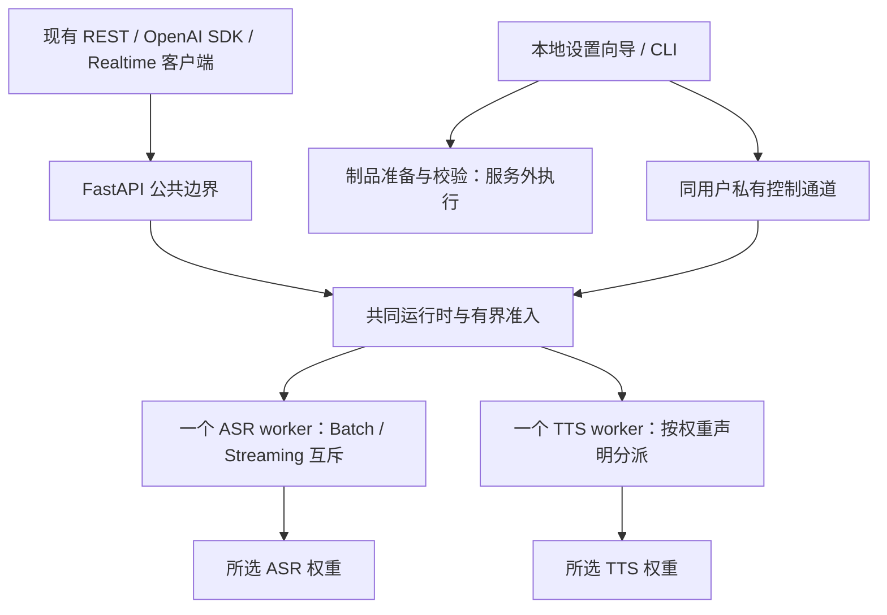

# SpeechRail 三档模型与统一运行时设计

日期：2026-09-05。状态：用户已采纳选型，尚未实施或在 M1 Air 8GB 验收。
本文件替代本轮前期“各档固定 VoiceDesign”“轻量档另用 Kokoro/ONNX”等候选建议。
实施入口：[详细实施计划](2026-09-05-three-tier-implementation-plan.md)；
决策记录：[ADR-0011](../../decisions/0011-unified-runtime-model-tiers.md)。

## 1. 已采纳组合

| ID | 名称 | ASR | TTS | 验收对象 |
|---|---|---|---|---|
| quality | 质量优先 | Qwen3-ASR-1.7B 8-bit | Qwen3-TTS-12Hz-1.7B-VoiceDesign 8-bit | 本机现有质量路径；资源充裕设备 |
| balanced | 均衡通用 | Qwen3-ASR-1.7B 8-bit | Qwen3-TTS-12Hz-0.6B-CustomVoice 8-bit | 12GB Apple Silicon |
| light | 轻量通用 | Qwen3-ASR-0.6B 8-bit | Qwen3-TTS-12Hz-0.6B-CustomVoice 8-bit | M1 Air 8GB，强制实机门 |

这些是主推荐组合，不是已测最优解。light 的 0.6B CustomVoice 4-bit 是同档对照候选，
只有通过相同音质门且改善资源或持续速度才可替换默认；不自动降级、不新增第四档。
本机已有自定义权重/配置先保留为 current selection，不因升级强制改写为目录中的同名制品。

## 2. 不可变约束

- 所有档位采用同一套 MLX 执行框架、worker 拓扑、依赖版本、协议、VAD、分段、上下文、
  缓存与调度算法；档位字段仅为 ASR/TTS 权重引用及其量化。
- 一个服务主进程、一个共享 ASR worker、一个 TTS worker。Batch ASR 与 Streaming ASR
  互斥，复用模型，不为这两种工作负载设计抢占、aging 或预留另一份模型。
- 既有多 Realtime 会话上限与会话隔离不能因分档被改写。M1 基础门先验收一个活动 ASR；
  多会话和 ASR/TTS 重叠工作另有资源准入与验收，不伪装已经支持任意并发。
- 本机质量优先优化持续交付，不能通过降低本机音色、时间戳、模型精度或可选能力换取低配达标。
- 各档使用同一硬件探测与预算计算规则；4GiB 是 M1 8GB 基础服务验收门，不是本机全局上限。
- Python >=3.12,<3.13；uv、PEP 621；主服务和 vendor runtime 隔离。禁止多 ASGI worker 复制模型。
- 请求路径不下载、不联网、不运行安装器、不读取远程音频。权重、私有配置、测试音频在仓库外。
- 不引入 Kokoro/SenseVoice/ONNX/GGUF 的档位专用路径；不引入云回退、LLM、播放器、
  会议数据库、租户平台或分布式调度。

## 3. 统一架构

ASR 只有一个 IPC reader。通过 request_id/session_id 路由结果，有界队列和进程 generation
避免取消或重启后的旧结果进入新请求。Batch 的租约跨越整次文件转写；Streaming 的租约跨越
未完成的后端会话，不能因片刻没有音频而释放。空闲公共 WebSocket 不占模型租约。

TTS 在同一 Qwen3/MLX 实现内识别 VoiceDesign 与 CustomVoice；共享归一化、句段限制、
生成参数、PCM 校验、编码、取消及超时逻辑。条件字段由模型能力决定，不由档位另造推理流程。

运行时只在非活动阶段回收空闲资源。维持活动对话的暖模型；既有独立用户超时设置保留，
切档不改写这些设置。ASR/TTS 是否可以重叠由共同资源准入判断，不按档位切换调度器。

## 4. 音色与兼容性

- quality 保留现有 default/warm/bright/calm 的 VoiceDesign 指令和 OpenAI voice aliases。
- balanced/light 共用一份 CustomVoice 映射：default→Serena、warm→Serena、
  bright→Vivian、calm→Uncle_Fu。该映射为初始候选，须逐 voice 真实验收；
  default/warm 可能落到同一个说话人，不能承诺原 VoiceDesign 的风格差异。
- 不给 0.6B CustomVoice 伪造指令式情绪控制、声音设计或克隆能力。
- 保留公共 voice ID 和客户端配置；进入会改变音色能力的方案时，向导展示明确的前后差异，
  用户同一次“下载并应用”操作包含对这份差异的确认。不是无提示地换音色。
- /v1/models 保留既有 alias，同时明确实际 resolves_to/后端权重身份；参数规模不得硬编码成 1.7B。
- /v1/voices 的描述与 available 根据活动模型及已通过的映射计算。新增能力信息只作兼容扩展，
  不伪称 OpenAI 官方能力；REST/Realtime 使用同一份映射。
- 本次实现保持当前 contracts/ 的音频格式、错误 envelope 和 Realtime 子集。
  不捆绑 16k→24k 输入迁移、完整 LLM Realtime 或 instructions 语义重定义。

## 5. 低成本安装与切换

普通用户入口是“SpeechRail 设置”：双击启动本地设置向导，看到推荐及三档，选择后一次应用。
同一向导提供命令行入口 speechrail setup；无需用户编辑 .env、填模型路径、安装 Python/MLX、
选择 runtime 或修改消费者配置。不新增独立 Web 管理站点。

安装器在用户目录准备固定版本的 Python/vendor 环境及 ffmpeg；首次准备可联网，服务请求不可联网。
按项目约定先核对 ModelScope 同版本/格式/全文件集，缺失才明确回退官方/转换维护者来源。
模型下载有进度、取消、恢复和哈希校验。runtime 属于统一发布清单，不属于档位字段。

切档只准备缺少的模型，共用已有 runtime。准备期间旧服务继续工作；应用期间停止接收新推理，
等待活动工作结束，释放旧模型，再串行加载新 ASR/TTS。通过真实短音频冒烟才提交活动记录。
失败恢复旧权重，不能把部分成功的 ASR/TTS 配对发布为活动方案。切换可能短暂不可用。

旧 .env 和未知配置不重写；选择记录存于仓库外的私有 sidecar。已有安装不自动重新选档。
自动推荐只用于新安装或用户主动请求；未知硬件标为未验收，不能用内存容量推导全部兼容性。
可选 diarization 等用户选择保留；若其资源超出基础 8GB 门，显示“该附加组合未验收”，不偷偷关闭。

## 6. 实机质量与资源门

M1 Air 8GB 是正式 light 支持的必要条件。本机限制内存或模拟 8GB 不能替代该设备。
基础服务包含主进程、ASR、TTS 和工作中的 ffmpeg；不包含调用方额外运行的 LLM。
附加模型和多会话单独列矩阵，不偷换基础组合。

- 同时物理峰值目标 <=4GiB，涵盖冷启动、推理、取消、切换和回退。报告采样精度与高水位界限，
  不把 RSS、权重磁盘大小或各进程非同时峰值之和冒充同时实测。
- TTS 热机后各测试桶 RTF p95 <1，目标 <=0.8；首包、块间隔和合成结束耗时分别测量。
- Streaming ASR 以 1x 实时输入，完成延迟 p95 <=2s；不得持续积压或通过跳过音频降耗。
- 连续 60 分钟无 OOM、崩溃、无界增长；后 20 分钟仍通过延迟门，系统 memory pressure
  不持续进入警戒，swap 不持续单调增长。
- 中文、英语、中英混读分别验收；ASR 含数字/专有词/噪声/静音，TTS 含多音字、数字、日期、
  缩写和长句。用独立参考与盲听，不用本模型自生成再自识别作为唯一质量证据。
- 本机同一权重前后执行非劣化回归；不同大小模型分别对齐其参考基线，明确报告差异。

旧草案的“暖驻留 2.5GiB/峰值 3.5GiB/TTS 1GiB”缺乏完整运行证据，已撤回，不能继续当作承诺。
4GiB 是用户采纳方案中的新验收目标，仍须实机证明。失败先记录实际瓶颈，不能临时放宽门槛宣称达标。

## 7. 证据与未验证项

2026-09-05 公开制品目录：ASR 1.7B/0.6B 8-bit 约 2.47/1.01GB；
VoiceDesign 1.7B 8-bit 约 3.08GB；CustomVoice 0.6B 8-bit/4-bit 约 1.97/1.69GB。
这些为磁盘制品，不是内存预测。8-bit 默认基于保真优先和 4-bit 完整制品节省有限的判断；
不声称所有任务 8-bit 一定优于 4-bit。

- [Qwen3-ASR 官方](https://github.com/QwenLM/Qwen3-ASR)
- [MLX ASR 量化对照与实现](https://github.com/moona3k/mlx-qwen3-asr)
- [Qwen3-TTS 官方能力表](https://github.com/QwenLM/Qwen3-TTS#released-models-description-and-download)
- [MLX TTS 实现](https://github.com/Blaizzy/mlx-audio/blob/main/mlx_audio/tts/models/qwen3_tts/README.md)
- [ASR 1.7B 制品](https://huggingface.co/mlx-community/Qwen3-ASR-1.7B-8bit/tree/main)
- [ASR 0.6B 制品](https://huggingface.co/mlx-community/Qwen3-ASR-0.6B-8bit/tree/89e96d92ba34aca20b3e29fb10cc284097d1219f)
- [VoiceDesign 1.7B 制品](https://huggingface.co/mlx-community/Qwen3-TTS-12Hz-1.7B-VoiceDesign-8bit/tree/main)
- [CustomVoice 0.6B 8-bit 制品](https://huggingface.co/mlx-community/Qwen3-TTS-12Hz-0.6B-CustomVoice-8bit/tree/main)
- [CustomVoice 0.6B 4-bit 制品](https://huggingface.co/mlx-community/Qwen3-TTS-12Hz-0.6B-CustomVoice-4bit/tree/main)

当前代码和历史基准只证明现有部署；第三档资源/质量/热机和统一运行时完整回归尚未完成。
实施计划的 G0 必须锁定实际制品 revision、哈希及统一依赖，再进行真实模型验证。
