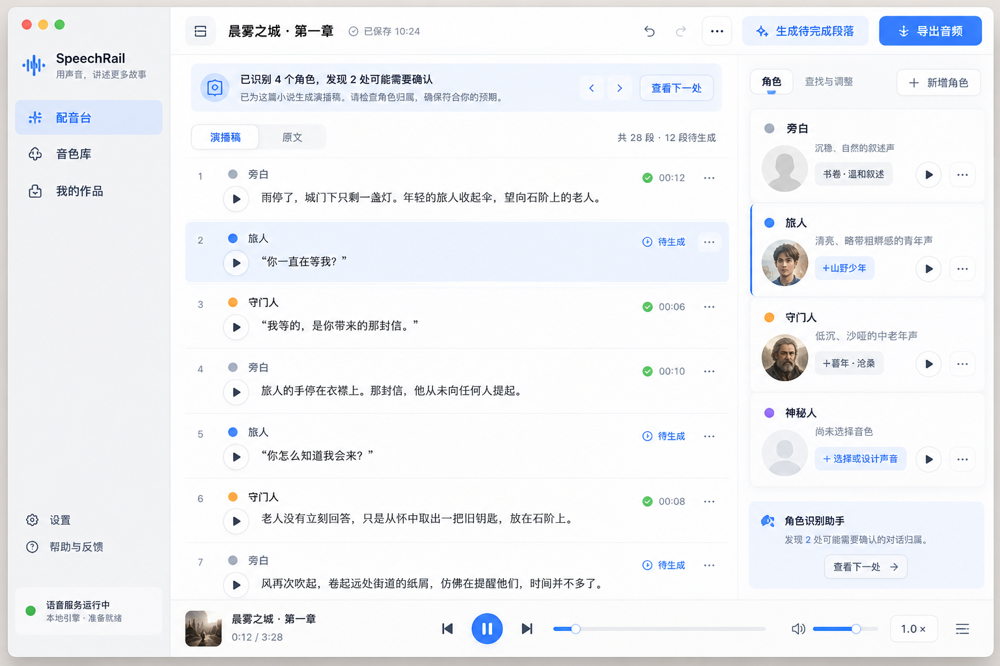
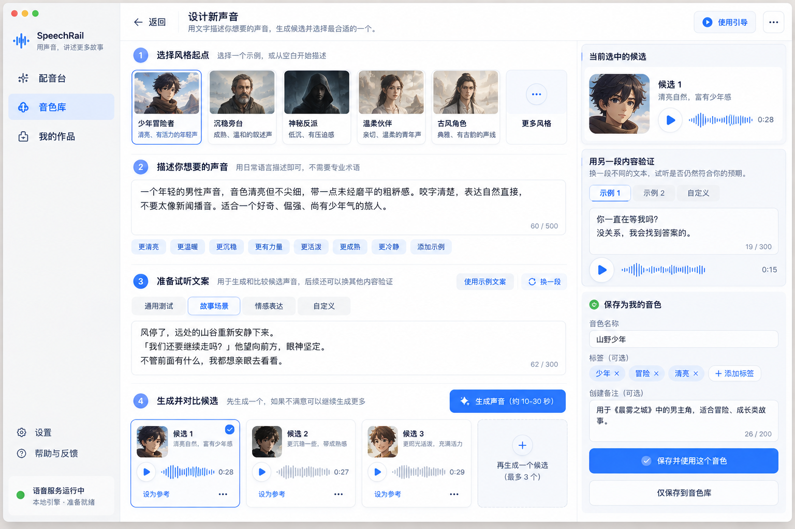
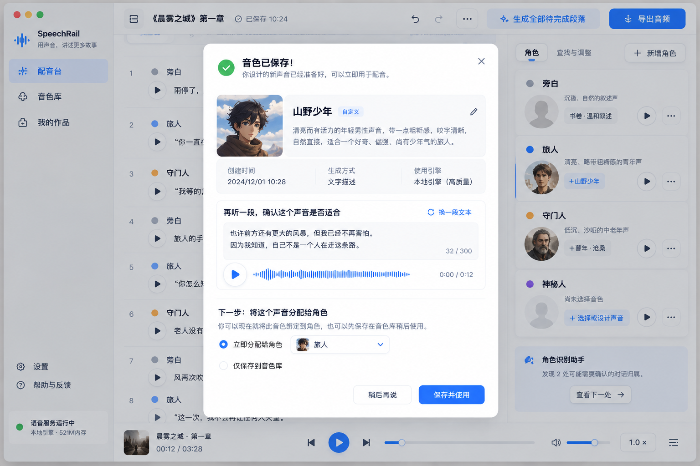
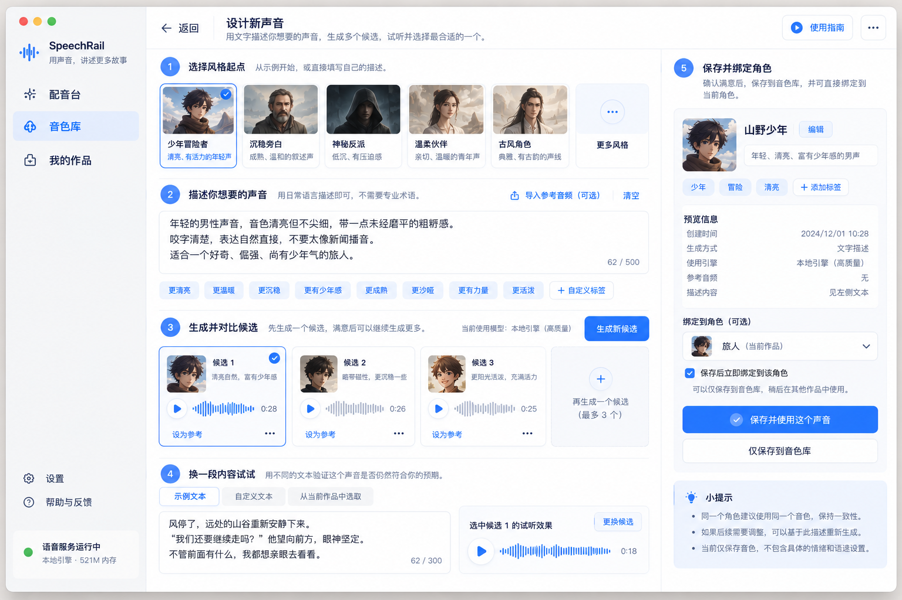
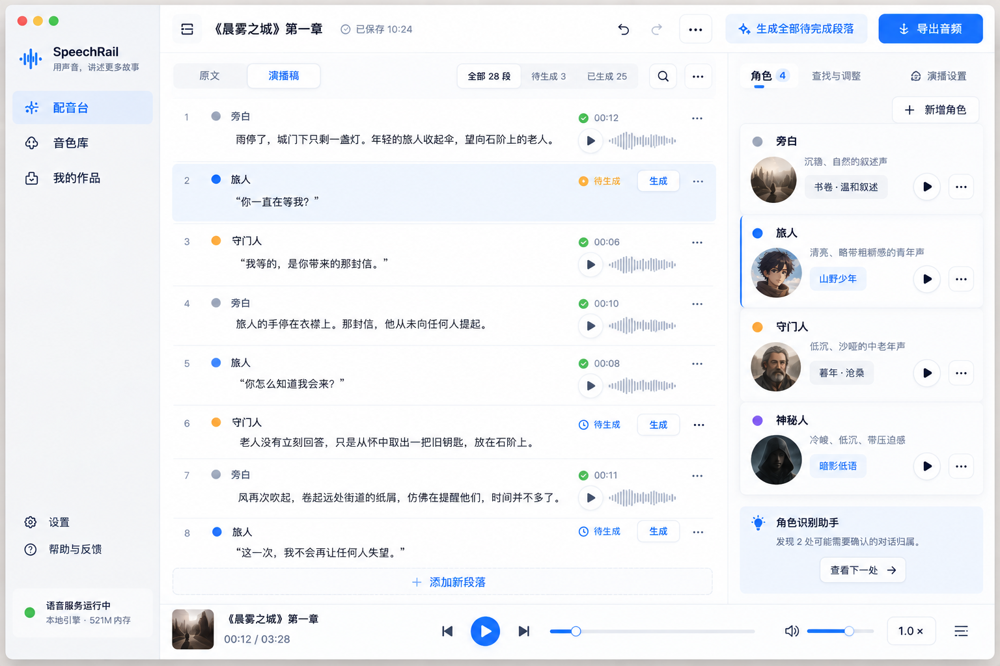
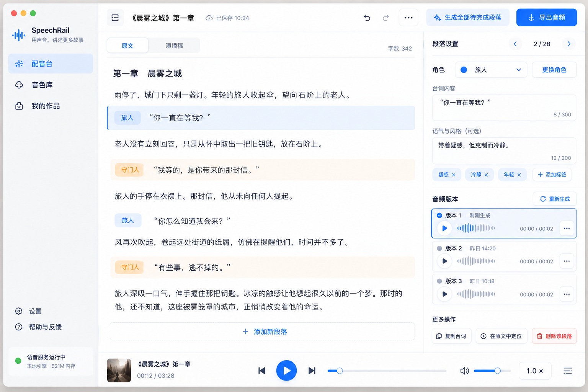
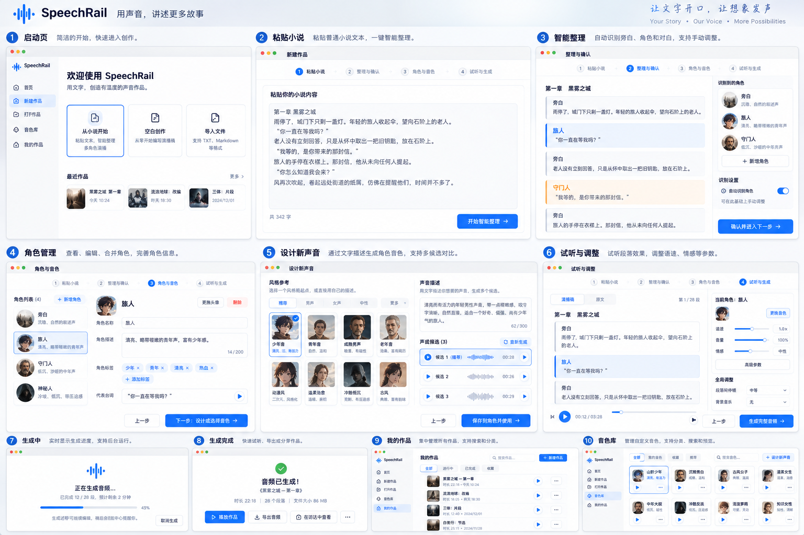
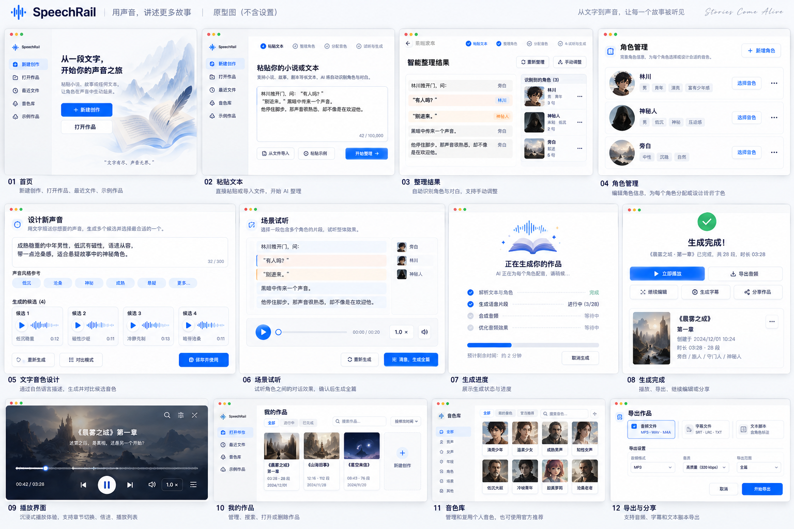
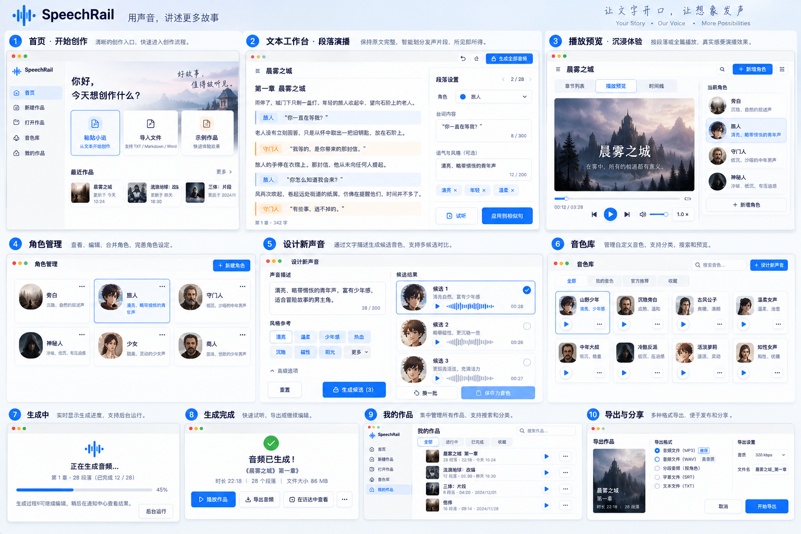
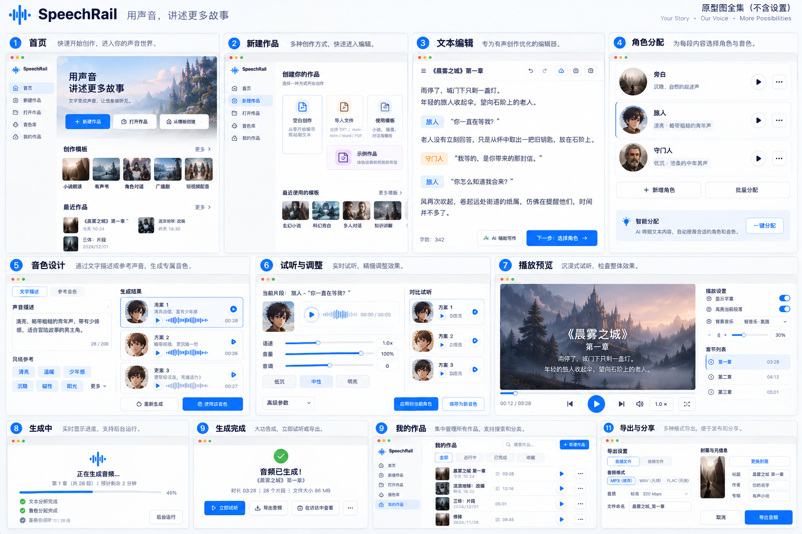

# SpeechRail macOS App 设计交付包

> 版本：Concept / UX Baseline · 2026-09-12  
> 范围：**不包含“设置 / 模型管理”页面**。待 SpeechRail 相关模型与 Voice 能力 PR 合并后，再基于最新代码和契约重新设计。

## 1. 产品一句话定位

**SpeechRail macOS App = 面向普通创作者的“本地语音引擎 + 音色创作 + 多角色故事配音”工作台。**

它不是 Sona 的替代品，也不是服务器监控面板，更不是完整 DAW / 视频剪辑器。

核心价值：

1. 用户无需终端即可使用本地 SpeechRail。
2. 通过自然语言描述设计角色音色。
3. 粘贴普通小说，自动整理为“旁白 + 多角色”演播稿。
4. 保留原文，不擅自改写；只解决“谁来读”。
5. 支持逐段试听、局部重生成、版本比较和整篇导出。
6. 所有核心推理和语音处理坚持本地优先、隐私优先。

## 2. 已确定的产品方向

| 维度 | 决策 |
|---|---|
| 产品方向 | B：引擎管理 + 音色创作工具 |
| 核心用户 | 普通创作者，不要求技术背景 |
| 视觉基调 | A：浅色、原生 macOS、文稿式 |
| 音色创建主入口 | 文字描述设计声音 |
| 主要内容 | 故事叙述 / 角色演绎 |
| 演播结构 | 旁白 + 多角色分段演绎 |
| 原稿形式 | 直接粘贴普通小说 |
| 原文处理原则 | 忠实保留原文，包括“他说”“她低声回答”等提示语 |
| 设置页 | 暂缓，等待 SpeechRail 模型/Voice PR 合并后重新分析 |

## 3. 主导航

主窗口只保留创作者需要的三个一级入口：

- **配音台**：故事文本、角色归属、逐段生成、试听和导出。
- **音色库**：预置音色、我的音色、文字描述设计新声音。
- **我的作品**：保存、恢复、继续编辑和导出作品。

引擎技术状态只在底部状态区 / 菜单栏中以用户语言呈现；模型、端口、Worker 等技术细节不占据创作主界面。

## 4. 核心创作流程

```text
新建作品
  ↓
粘贴普通小说
  ↓
智能整理：旁白 / 对白 / 角色候选
  ↓
人工确认角色归属
  ↓
为角色选择已有音色 or 文字描述设计新音色
  ↓
同场景连续试听
  ↓
逐段生成 / 局部重生成 / A-B 比较
  ↓
生成全部待完成段落
  ↓
整篇播放预览
  ↓
导出合并音频 / 分段音频
```

## 5. 关键 UX 原则

### 5.1 阅读单位、生成单位、交付单位分开

- **阅读单位：段落** —— 保持小说的连续阅读体验。
- **生成单位：发声片段** —— 一个段落内部可以在旁白和角色之间切换。
- **交付单位：整篇作品** —— 用户最终关注的是完整故事，而不是几十个离散请求。

### 5.2 自动整理不改写原文

SpeechRail 自动识别“旁白 / 台词 / 角色”，但默认不删减、不重写、不润色。

例如：

> “别动。”林川压低声音说，“门外有人。”

内部可以分为：

- 林川：“别动。”
- 旁白：林川压低声音说，
- 林川：“门外有人。”

但阅读界面仍应保持为一段连续原文。

### 5.3 音色、角色、演绎要求是三个不同层次

- **音色**：可跨作品复用的声音资产。
- **角色**：当前作品中的人物身份，绑定一个音色。
- **演绎要求**：只作用于某一句或某一段，例如“压低声音”“带迟疑”。

不能把三者混成一个大 Prompt。

### 5.4 保存成功 ≠ 音质已验证

音色创建至少区分：

- 候选生成成功
- 音色资产已保存
- 换文本后仍符合预期
- 实际配音质量验证完成 / 未完成

没有实际执行的质量检查显示“未验证”，不伪造综合分数。

### 5.5 修改只影响必要范围

- 改一句文字 → 仅该发声片段过期。
- 换某角色音色 → 仅该角色相关片段标记待重新生成。
- 调整段落顺序 → 尽量复用已有音频。
- 新生成结果 → 不直接覆盖旧结果，可 A/B 试听。

## 6. 原型图

### 01 主工作台



表现“旁白 + 多角色”的演播稿、右侧角色面板、生成状态和底部播放器。

### 02 文字音色设计工作台



从风格起点、声音描述、试听文案，到候选比较和保存。

### 03 音色保存与角色绑定



音色保存后，用另一段内容复核，并可立即绑定当前角色。

### 04 音色设计详细版



更完整的“描述 → 候选 → 换文本验证 → 保存并绑定”布局。

### 05 演播稿与角色工作台



强调按角色分段、待生成/已生成状态和角色音色管理。

### 06 单段编辑与音频版本



展示单段角色、台词、演绎备注以及多版本音频比较。

### 07-10 全流程概念板









这些总览图用于表达完整产品旅程与视觉语言，不等同于每个页面都已达到开发级规格。

## 7. 当前已覆盖页面

- 首页 / 新建作品
- 粘贴小说
- 小说 → 演播稿整理
- 旁白 / 多角色识别
- 角色管理与音色分配
- 文字描述设计音色
- 多候选音色比较
- 换文本验证音色
- 保存音色并绑定角色
- 原文 / 演播稿工作区
- 单段角色调整
- 单段多音频版本
- 全篇生成
- 生成进度
- 连续播放 / 作品预览
- 我的作品
- 音色库
- 导出音频

## 8. 尚需补齐的非设置页原型

这些属于下一轮“开发级 UX 收口”，目前尚未全部单独出图：

1. 说话人不确定 / 未命名角色 / 合并角色 / 拆分片段。
2. 人工确认后的角色归属锁定与重新整理冲突处理。
3. 更换角色音色后，受影响段落批量过期提示。
4. 删除角色 / 删除音色的影响范围确认。
5. 音色候选生成失败、验证失败、已保存但未验证。
6. 单段重生成、旧版本 A/B 对比、恢复旧版本。
7. 全篇生成部分失败、取消生成、断点继续。
8. 导出前完整性检查：缺失段、旧正文音频、未分配音色。
9. 首次使用 / 无作品 / 无自定义音色 / 本地引擎不可用等空状态。
10. 菜单栏状态：服务运行、生成任务、打开 App、停止服务。

## 9. 明确不在首版范围

- 完整多轨 DAW
- 背景音乐自动混音
- 视频时间线
- 复杂音效库
- 自动改写小说正文
- 将每一句情绪备注伪装成后端必然支持的精确声学控制
- Sona 已承担的会议、实时字幕、语音助手主工作流

## 10. 设置 / 模型页为什么暂缓

SpeechRail 的 VoiceDesign / Base、Quality Profile、模型加载与切换、能力暴露、生命周期和质量验证仍处在演进中。

因此本包**刻意不固化设置页、模型卡片和技术配置 UI**。相关 PR 合并后，应直接基于最新代码、接口契约、模型目录和资源生命周期重新设计，避免 UI 与后端架构脱节。

---

详细设计说明见：[`PRODUCT-DESIGN.md`](PRODUCT-DESIGN.md)  
原型图清单见：[`PROTOTYPE-INVENTORY.md`](PROTOTYPE-INVENTORY.md)
