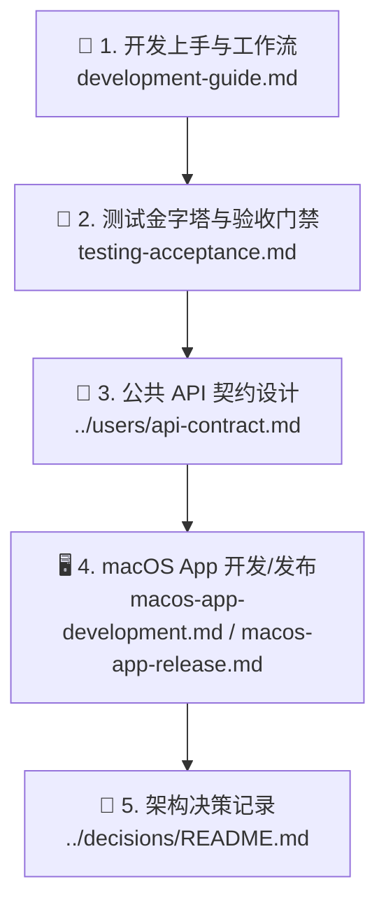

# 🛠️ SpeechRail 开发者文档

欢迎查阅 SpeechRail 开发者文档。本目录面向参与代码开发、架构重构、Worker 协议扩展以及测试门禁维护的工程师与贡献者。

---

## 📑 推荐阅读路径



1. **[🚀 开发者上手指南 (development-guide.md)](development-guide.md)**：开发环境搭建、5分钟本地启动、目录代码规范与 Worker 扩展流程。
2. **[🧪 测试与质量验收规范 (testing-acceptance.md)](testing-acceptance.md)**：确定性测试、Fake Backend 模式、真实模型 Smoke 与质量门禁。
3. **[📡 公共 API 契约手册](../users/api-contract.md)**：REST 端点定义、WebSocket 协议与 OpenAI 兼容层实现标准。
4. **[🖥️ macOS App 开发与测试](macos-app-development.md)**：SwiftUI 控制面、XPC helper、测试隔离与服务边界。
5. **[🎛️ macOS App 设计系统与 Token](macos-app-design-system.md)**：macOS 26 设计研究、Liquid Glass 分层、颜色/间距/字体/可访问性 token。
6. **[📦 macOS App 分发与签名](macos-app-release.md)**：Distribution archive、签名/公证、安装清理、控制链路验收与独立回滚。
7. **[📜 架构决策记录 (ADR)](../decisions/README.md)**：关键技术选型与设计原则约束。
8. **[🎙️ macOS App 录音通道与音频采集最佳实践](macos-app-audio-capture.md)**：音色克隆文件录音、会话级采集、
   助手共享播放引擎、系统 voice processing、权限/entitlement、设备与线程约束，以及一次「录不到声音」的实测排障记录。
9. **[🧩 macOS App 会话层技术方案](../design/2026-09-18-session-layer/TECHNICAL-DESIGN.md)**：语音助手、会议助手、实时字幕的
   资源边界、音频来源、记录存储、失败出口与尚未完成的真机验收。

---

## ⚡ 快速开发命令速查

```bash
# 1. 同步开发环境依赖
uv sync --extra dev

# 2. 本地前台启动服务（无模型时亦可启动进行契约测试）
uv run speechrail serve

# 3. 执行自动化测试套件
uv run --extra dev pytest tests/ -q --no-cov

# 4. 代码风格与类型检查门禁
uv run --extra dev ruff check src tests
uv run --extra dev mypy src
```

---

> [!TIP]
> 准备提交代码？请确保已阅读 [CONTRIBUTING.md](../../CONTRIBUTING.md) 并通过所有本地质量门禁。
