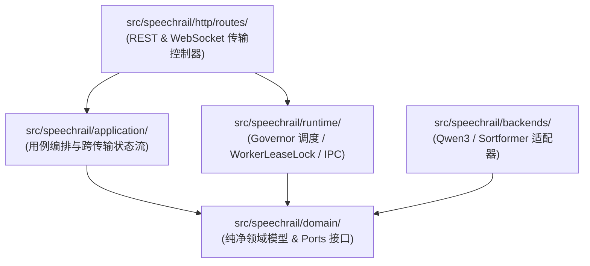

# 🛠️ SpeechRail 开发者实战指南

> 本指南将引导您在 5 分钟内搭建本地开发环境、理解代码架构分层、掌握 Worker 二进制 IPC 协议扩展流程，并遵循严苛的质量门禁。

---

## 1. 快速开始与环境搭建

SpeechRail 固定基于 **Python 3.12** 与现代包管理工具 **`uv`** 构建：

```bash
# 1. 克隆代码仓库
git clone https://github.com/hrygo/SpeechRail.git
cd SpeechRail

# 2. 一键同步主环境依赖（包含开发与测试依赖）
uv sync --extra dev

# 3. 准备未提交的本地配置文件
cp configs/speechrail.example.env .env
chmod 600 .env

# 4. 启动本地服务
uv run speechrail serve
```

> [!NOTE]
> 在未配置外部模型路径时，服务依然可以正常启动，并能通过所有 Fake Backend 的确定性契约测试。此时向推理接口发送请求将返回标准的 `503 backend_not_ready` 错误。

---

## 2. 代码分层与目录拓扑

SpeechRail 遵循清晰的**整洁架构 (Clean Architecture)** 与 **DRY / SOLID** 原则：



| 核心代码目录 | 职责与规范 | 重点约束 |
|---|---|---|
| `src/speechrail/domain/` | 纯净领域对象（如 `TranscriptionResult`、`SpeechSegment`、`ports.py`） | 严禁依赖 FastAPI、PyTorch 或外部模型 SDK |
| `src/speechrail/application/` | 业务用例（Realtime 会话管理、VAD 状态机编排） | 仅面向 Domain Ports 编程 |
| `src/speechrail/runtime/` | 有界队列、Resource Governor、Worker 进程生命周期 | 确保多协程并发下的绝对内存安全与顺序一致性 |
| `src/speechrail/backends/` | Qwen3-ASR/TTS 驱动、Sortformer 引擎、离线 Snapshot 预检 | 严格在隔离 Worker 子进程中运行 |
| `src/speechrail/http/routes/` | FastAPI 路由控制、OpenAI 协议序列化与反序列化 | 负责输入合法性校验与统一错误封送 |
| `src/speechrail/compatibility/` | OpenAI 模型别名映射（如 `whisper-1` → `canonical`） | 保持窄依赖，禁止污染核心领域模型 |

---

## 3. Worker 二进制 IPC 协议与扩展指南

主服务与推理 Worker 之间通过 `stdin`/`stdout` 进行二进制通信。新增推理后端时需遵循以下协议帧格式：

```text
+---------------+---------------+-------------------+------------------------------------+
| Magic (2B)    | MsgType (1B)  | PayloadLen (4B)   | Payload (MsgPack 结构 / Raw PCM)   |
| 0x53 0x52     | 0x01 (Req)    | Big-Endian uint32 | Binary Data                        |
+---------------+---------------+-------------------+------------------------------------+
```

### 扩展新 Worker 步骤：
1. **定义 Domain Port**：在 `domain/ports.py` 中声明抽象接口（继承 `Protocol`）。
2. **实现 Worker 适配器**：在 `backends/` 中创建对应的 Client 与独立运行的 Worker 脚本。
3. **注册至 Governor**：在 `runtime/` 中注册生命周期钩子，确保其受 `WorkerLeaseLock` 与待机驱逐管理。
4. **编写确定性测试**：在 `tests/` 中编写使用 Fake Worker 的单元测试，确保不依赖真实 GPU。

---

## 4. 质量门禁与提交前检查

在提交代码前，必须在本地依次执行并全部通过以下门禁：

```bash
# 1. 运行全部单元测试与契约测试
uv run --extra dev pytest tests/ -q --no-cov

# 2. 代码风格与规范检查
uv run --extra dev ruff check src tests

# 3. 静态强类型检查（Strict 模式）
uv run --extra dev mypy src

# 4. OpenAPI 契约格式验证
npx @redocly/cli lint contracts/openapi.yaml
```

> [!IMPORTANT]
> 自动化测试必须保持 **100% 确定性**：严禁在单元测试中联网下载权重、调用外部云端 API 或使用真实敏感音频。
