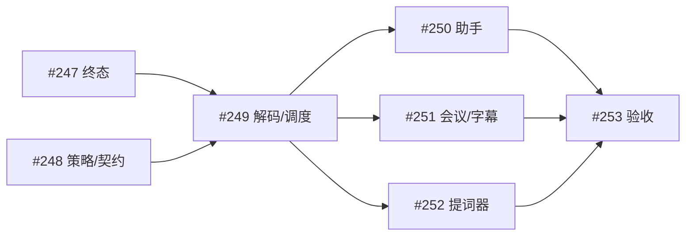
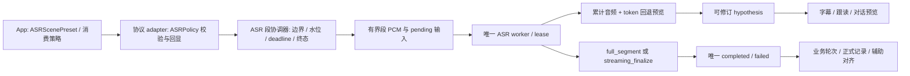

# 四场景共享 ASR：Luna 完整实施方案

本轮交付范围：方案文件、GitHub 总 Issue、子 Issues 及依赖关系；不实施业务代码、不提交或推送 Git、不构建安装、不改变服务配置、不运行真实模型或接管 UI。

实施基线：`codex/asr-diagnostic-capture`，`HEAD=4da9e3271ef6692042ece645e6a398b771ce93df`。工作区另有尚未提交的 ASR 诊断改动，涉及配置、CLI、观测、worker、流式桥接、Realtime 和测试；这些不等于本方案已经实现。实施前重新核对实际 base/head、已有 PR 与工作区，保留这些改动和用户数据。

本文出现的 **拟新增** 文件、类型、字段和错误码均是设计目标，不能当作现有接口调用。新增数值为调优起点与安全边界，不能当作已测性能。

<!-- issue-map:start -->
总跟踪：[Issue #245](https://github.com/hrygo/SpeechRail/issues/245)。2026-10-05 已通过 GitHub API 回读核验七个原生 Sub-issues 及十四条 blocked-by 关系；关系登记完成不代表实施完成。

| 工作包 | 原生子 Issue | 原生 blocked-by |
|---|---|---|
| WP1 空成功终态 | [#247](https://github.com/hrygo/SpeechRail/issues/247) | 无 |
| WP2 策略与边界契约 | [#248](https://github.com/hrygo/SpeechRail/issues/248) | 无 |
| WP3 解码与有界调度 | [#249](https://github.com/hrygo/SpeechRail/issues/249) | #247、#248 |
| WP4 App预设与助手轮次 | [#250](https://github.com/hrygo/SpeechRail/issues/250) | #248、#249 |
| WP5 会议/字幕消费 | [#251](https://github.com/hrygo/SpeechRail/issues/251) | #248、#249 |
| WP6 提词器跟随 | [#252](https://github.com/hrygo/SpeechRail/issues/252) | #248、#249 |
| WP7 四场景验收 | [#253](https://github.com/hrygo/SpeechRail/issues/253) | #247、#248、#249、#250、#251、#252 |

WP5/WP6 可以先实现消费与跟随逻辑，但最终接线使用 WP4 的唯一 App 预设。#231/#232 保存接口、#228 owner 和 #234 loader 为相邻协作，不新增其原生 parent 或硬阻塞；最终集成门仍须核对这些边界。



图只显示主依赖链；上表是全部十四条原生阻塞边的完整清单。WP1/WP2 可独立开始，其余任务可先准备反例和测试，blocked-by 表示交付需要前置成果。
<!-- issue-map:end -->

## 1. 问题结论

需要同时解决三类问题：

1. 流式识别按固定块追加结果，较早的错词和句末标点缺少重新解码的机会，最终文本容易保留碎句。
2. worker 成功识别得到空文本时只发 `finished`、不发 `completed`，上层可能报“缺少转写终态”。
3. 对话助手、会议助手、实时字幕、提词器只在部分静音窗口上区分，尚缺统一的识别策略、段预算和最终处理选择。直接把“全段复核”强制到所有应用会增加提词器跟随延迟。

推荐：一个共享 ASR 内核、一个模型 worker、应用侧场景预设、服务侧中立策略、可回退预览与两种明确的 finalization；每段使用同一套生命周期和终态规则。

本机复现证据：2026-10-05 19:15:12 的目标朗读最终输出为 41 字符，11 个完整模型块各新增一个句末标点；最后块、worker completed 和轻量 ITN 后的最终文本一致。该轮没有缺终态、队列积压或超时证据。诊断只采集限时正文、没有保存音频，因此尚不能把错词全部归因于算法，也不能排除采集、重采样和模型辨识能力。

本方案及公开 Issues 只保留上述聚合事实，不复制私人转写正文、音频、会话身份或私有运行配置。

## 2. 当前实现与根因

### 2.1 当前代码地图

行号以本次工作区为准，实施时优先按符号定位。

| 现有文件 / 符号 | 当前事实 | 本次影响 |
|---|---|---|
| `src/speechrail/backends/qwen3_worker.py::Qwen3Engine.open_session` | 调用 vendor `Session.init_streaming`，默认 1000ms / 12.64s context；`enable_tail_refine=False` | 迁入共享段状态及绑定本地组件的解码 adapter |
| 同文件 `append_audio` / `finish_streaming` | `feed_audio` 后读累计 text；finish 返回 vendor final | 保留完整段 PCM；预览可整体修订；按策略生成 final |
| 同文件 `_handle_commit`，约 538–578 行 | `if text:` 才发送 completed，随后无条件发送 finished | 成功空文本也发送 completed；finished 只表示内部处理结束 |
| `src/speechrail/backends/qwen3_streaming.py::Qwen3StreamingSession` / `NativeRealtimeFactory.create` | IPC 读循环、事件队列、mode lease；options 主要是 partial mode / chunk duration | 策略透传、快照修订、唯一终态与资源归还 |
| `src/speechrail/domain/ports.py::StreamingAsrEvent` / `RealtimeTranscriptionOptions` | 类型化 backend 事件；options 当前只有 `partial_mode`、`chunk_duration_ms` | 增加中立 ASR policy，不引入 App 功能名称 |
| `src/speechrail/application/realtime_openai.py::_ensure_asr_for_turn` | 组装 language / hotwords / options，持有 ASR reader 与 admission | 分离段上下文、策略解析、冻结边界与调度 |
| 同文件 `_handle_admission_decision` / `_append_audio` / `_commit_audio_once` | VAD、manual 两条 rollover 路径；commit 等待 reader；缺终态时报 backend_error | 两路切段语义一致；final deadline 和下一段缓冲有 owner |
| `src/speechrail/runtime/pcm_buffer.py::BoundedPcmBuffer` | 有界 append-only；overflow 抛错，不静默丢头；pin / clear | 复用为完整识别段的 PCM 所有者 |
| `src/speechrail/compatibility/openai_realtime.py::session_config` | 严格字段白名单、原子 session.update；已有 endpointing 与能力 opt-in | 增加 `session.speechrail.asr`，校验与回显 |
| `macos/SpeechRailApp/SpeechRailControlKit/RealtimeContractTypes.swift::SpeechRailSessionUpdate` | 当前 Swift wire 类型真源，有 task / endpointing / alignment 等 | 增加 typed ASR policy，不创建第二个 JSON builder |
| `macos/SpeechRailApp/SpeechRailApp/RealtimeASRClient.swift::RealtimeVADProfile` | 轮流助手1200ms；双工/会议900ms；字幕/提词器400ms | 收敛为场景预设；保留这些静音起点 |
| 同文件 `configurationEvent` / hypothesis decoder / drain collector | 已支持全文快照、revision、稳定前缀与排空 | 透传策略；解析段关闭事件；按 item 保留结果 |
| `AssistantSession.swift::handle` / `commitUserTurn` | completed 直接进入输入持久化；预览与 formal 分开 | 加业务轮次聚合，rollover 不触发多次 LLM |
| `MeetingSession.swift::handle` / `CaptionSession.swift::handle` | 两者支持 snapshot；completed 以接收时间推进 commitCursor | 按 item 与冻结音频边界消费，不把复核耗时当语音时间 |
| `TeleprompterSession.swift::realtimeConfiguration` / `TeleprompterFollowController.swift::receiveHypothesis` | 关键词来自固定活动稿件；预览参与局部定位；final 确认 | 保留及时跟随、手动接管及 generation；默认不用二遍完整复核 |

结构查询使用主仓库图谱 generation `2026-10-05T07:39:37Z` 作候选导航；当前 worktree 未独立索引。`RealtimeASRClient` 图谱解析不可用、多个 Swift session 部分解析，若干文件 freshness 已变化；关键结论已回到本 worktree 源码核对。图谱结果不是完整调用关系证明。

### 2.2 Vendor 算法与本地绑定

本机受管依赖是 `mlx-qwen3-asr==0.3.5`。以下是该版本源码事实，不要求 Luna 修改已安装的 site-packages：

- `streaming.py::_decode_chunk_incremental` 每块构造音频特征，复用 KV cache，解码至 EOS；`_append_chunk_text` 做重叠处理和文本拼接。因此不能描述为“完全没有上下文”。
- `unfixed_*` 主要控制展示文本的固定/非固定划分，不等价于 Qwen 官方的 token 回退重解码。
- `audio_accum` 受 context 窗口裁剪，不能作为完整段 final 的 PCM。
- 被关闭的 tail refine 路径曾用默认仓库解析 tokenizer，在本机离线条件下可能失败；它也只复核尾窗。不能简单打开此开关作为整句修复。
- `session.py::Session.transcribe` 经 `_transcribe_loaded_components` 显式传入 `self.model`、`self.tokenizer`、dtype，可复用同一已加载模型进行完整段复核。
- `TranscriptionResult` 提供 `finish_reason` / `truncated`。最终文本必须检查这些信息，不能把 token 耗尽的截断结果当成功 final。

Qwen 官方 `qwen_asr.py::streaming_transcribe` 每轮重新输入累计音频，初始几轮不固定 prefix，后续回退最后若干 token 后解码；final flush 使用类似策略。官方实现依赖 vLLM，不能直接安装为本机 MLX streaming 后端。独立完整段复核是本方案额外的质量策略，不是声称官方 finish 已经无前缀重识别。

### 2.3 现有契约与历史边界

`contracts/realtime-openai.md` 已声明：hypothesis 可全文修订；只有能保证稳定的文本才映射 append-only delta；每个有效 utterance 一个终态；展示过预览时不能因空 final 静默丢失内容。对齐、分人不能改写已冻结 canonical transcript。

> 🧠 **From Hindsight memory (SpeechRail 组件职责与权威边界)** — SpeechRail 提供语音事实；LLM、历史、记录、播放和 barge-in 由调用方持有。该边界已用当前 `docs/architecture/current-boundaries.md` 与公共契约交叉核对。

> 🧠 **From Hindsight memory (AI 提词器瘦身：删除逐句对照与审阅工作流)** — 跟读定位、关键词和确认读法是保留能力，语音辅助由用户主动开启。本方案保留此范围，不恢复逐句审阅或事实核对流程。

相邻 Issues：#228 负责更广的 Realtime owner 拆分；#231 / #232 负责应用消费排空和会议/字幕持久化；#234 负责 loader 身份规则；#84 研究语义断句；#95 跟踪总体真实验收。本方案不收编这些任务，不改其 parent，不复制数据库迁移或 TTS 改造。

## 3. 目标行为

### 3.1 四场景预设

以下为拟新增 `ASRScenePreset` 的初始确定值。preview interval 是最小推理间隔，不是延迟承诺；资源压力下可以变大。max segment 是准入音频总时长预算，包括前缀与尾音。

| App 预设 | task | preview interval | silence | 请求 max segment | finalization |
|---|---|---:|---:|---:|---|
| assistantTurnTaking | conversation | 800ms | 1200ms | 20000ms | full_segment |
| assistantDuplex | conversation | 600ms | 900ms | 20000ms | full_segment |
| meeting | transcription | 1000ms | 900ms | 20000ms | full_segment |
| caption | caption | 500ms | 400ms | 8000ms | full_segment |
| teleprompter | transcription | 400ms | 400ms | 8000ms | streaming_finalize |

所有预设先沿用 threshold=0.5、prefix_padding_ms=300；这些值不是噪声环境的最优值。language 沿用用户明确选择，未指定时保留自动识别；不要一律强制 Chinese。keywords 有界且只包含真实术语。

开启 diarization 时，当前准入路径约束为 `256000` bytes kernel PCM16（16kHz 下 8s），有效段预算必须取请求值、服务字节上限、分人上限及 decoder 上限的最小值。本方案保留该约束，不为会议20s预设扩大分人窗口。

### 3.2 共同不变量

- audio 分包方式不改变准入样本和顺序；32ms、不齐整与大包结果具有同一输入覆盖范围。
- 同一段预览可修订；只有最终结果用于正式保存和 LLM；提词器及字幕可消费预览。
- full_segment 以完整保留 PCM 独立解码，不带旧 hypothesis 强制前缀；成功后 ITN，再发唯一 completed。
- streaming_finalize 处理最后一个累计音频快照与尾音，完成其流式解码；不执行第二遍无前缀完整复核。final 的协议地位相同，质量策略在有效配置中明确。
- 空成功发 completed `transcript=""`；真实失败发 failed；finished / receipt / reader EOF 不是文字终态。
- 正常结束等待最后一个样本水位对应的全部 item 终态及应用消费；有保存职责的应用继续等待持久化 settle。
- 同一模型重计算串行；final 不调用外部 batch API、不切到 batch lease、不新增模型副本。
- 临时保留 PCM 仅在内存；关闭、失败、取消后按 owner 释放。debug 捕获沿用现有独立限时策略，不因场景预设自动开启。

### 3.3 应用可观察行为

助手：预算切段只产生识别段 final，不提前回答；一个业务轮次可汇总多个 item。轮次真正结束且相关 final 全部成功后只提交一次 LLM 输入。

会议：持续分段，不保留整场会议 PCM；final 是正文权威，对齐/匿名分人随后补充。复核期间继续有界接收，不因保存、说话人失败清除正文。

字幕：当前 item 内允许全文修订，final 后冻结；显示换行不是识别切段。迟到结果更新对应 item，不覆盖当前另一 item。

提词器：通过局部稿件匹配及时预览，final 确认；匹配弱时保持位置，手动接管立即废弃旧 generation。不会因低延迟预设伪造稳定文本或置信度。

## 4. 推荐解决方案

### 4.1 职责分层



拟新增的小型组件：

| 拟新增位置 / 类型 | 单一职责 / 最小依赖 |
|---|---|
| `src/speechrail/domain/asr_policy.py::ASRPolicy` | 不可变策略、数值与枚举约束；无 MLX、FastAPI 或 App 名称 |
| `src/speechrail/application/asr_turn_coordinator.py::AsrTurnCoordinator` | 每段身份、准入水位、关闭原因、推理调度、最终发送状态；复用现有 admission / ASR ports |
| `src/speechrail/backends/qwen3_stream_decoder.py::BoundQwen3Decoder` | 已加载 model/tokenizer/dtype 绑定、累计音频前缀解码、finish reason；所有 vendor 依赖留在 worker |
| 同模块 `StreamingDecodeState` | 原始解码 tokens、revision、最新已解码水位；不保存业务历史 |
| `macos/SpeechRailApp/SpeechRailApp/ASRScenePreset.swift` | App 场景 → typed policy 与 endpointing 的唯一映射 |
| `macos/SpeechRailApp/SpeechRailApp/AssistantInputTurnAssembler.swift` | 按段关闭原因与 item 终态聚合一轮输入；不依赖 LLM transport |
| `macos/SpeechRailApp/SpeechRailApp/TranscriptPreviewLedger.swift` | 会议/字幕的 item 身份、revision、预览、边界和冻结文本；不负责数据库 |

优先小型值对象、Protocol 和显式组合，避免万能 pipeline、service locator、mixin 共享全部 self。新 owner 与 #228 的方向一致，但只迁移本任务需要的 ASR 状态，不等待整类重构。

### 4.2 三层配置

1. App 仅定义场景预设和用户允许覆盖的选项，不把模型 chunk/token 参数呈现为主界面操作。
2. 服务只接收中立 `ASRPolicy`；不能依据 `task` 猜场景，不能因 task 自动打开分人、对齐或 TTS。
3. 服务预算给出硬上限，能力 opt-in 可以进一步收紧。超出请求显式拒绝，不把非法值静默夹到合法范围；合法请求的有效 capability 上限在回显中说明。

模型档位 fast/quality/reference 与场景策略正交；此任务不切换模型或增加自动下载。

### 4.3 取舍

单纯增加静音窗口不能修复每块解码固化错误；四套复制实现会导致终态与资源策略漂移。统一识别内核、少量配置、两种命名策略同时覆盖质量与及时跟随。

对话/会议/字幕使用第二遍复核，成本是额外推理；提词器默认 stream finalize，成本较低但不承诺与无前缀复核相同的错词率。量化真实延迟前不得把其中任何一种写成所有场景的“最优”。

## 5. 详细实施步骤

### WP1：修复空文本与唯一终态（P1，可独立开始）

修改 `qwen3_worker.py::_handle_commit`，先在 `tests/test_qwen3_worker.py` / `test_qwen3_streaming.py` / `test_realtime_openai.py` 加失败反例：

- 有效 session、finish 返回空字符串：必须依次得到 completed 空文本、finished；上层不报 missing_terminal。
- 非空、空白、真实异常、reader EOF、重复 commit、cancel/timeout 竞争分别核对。
- 移除 diagnostics 中 `bool(text)` 作为“收到终态”的判据；它是事件事实，不是正文是否非空。

随后使 worker completion 不依赖 text truthiness。已有 idempotency、reader 收尾与资源释放保障必须保留；不要将 finished 自动翻译成成功以遮蔽其他协议损坏。

完成条件：原始反例与生命周期矩阵通过；无矛盾第二终态；在途 worker 真正结束前不释放可重新利用的推理槽。

候选原子提交：`fix: emit an ASR terminal for successful empty recognition`。

### WP2：中立策略与段边界公共契约（P1）

修改 `domain/ports.py`，新增 `domain/asr_policy.py`；修改 `compatibility/openai_realtime.py`、`realtime_openai.py` 的初始配置与 `_ensure_asr_for_turn`；更新：

- `contracts/realtime-openai.md`
- `contracts/realtime-events.schema.json`
- `contracts/realtime-field-matrix.json`
- `docs/users/api-contract.md`
- `src/speechrail/assets/skills/speechrail/references/realtime.md`
- `macos/SpeechRailApp/SpeechRailControlKit/RealtimeContractTypes.swift`

先测试严格数值、未知字段、原子失败不改变旧配置；冻结 §6 的配置和边界事件。复用已有 Swift wire builder，不通过 feature 手写第二套 JSON。

策略在首个 PCM 前设置；段或 pending 输入非空时拒绝策略变更。无在途段的连接允许原子更新。不要支持半段 mutation 或隐式待生效配置。

完成条件：Python/JSON/Swift 的同组向量一致；`session.updated` 回显有效策略；VAD 和 manual rollover 均能表达 budget_rollover。

候选提交：`feat: define bounded ASR policies and segment boundary facts`。

### WP3：共享解码、完整段复核与有界调度（P1，依赖 WP1/WP2）

修改 `Qwen3Engine` / `WorkerEngine`、`qwen3_streaming.py` 与 `RealtimeTranscriptionOptions` 接线；新增前述 decoder 和段协调器。

1. 为每段保留全部 admitted kernel PCM16；按 sample watermarks 精确冻结。不能依赖仅为 alignment/diarization 打开的可选 buffer。
2. IPC audio frame 先进入有界段 owner；预览根据最新水位调度。一个 preview running + 一个 latest pending 水位，合并任务不丢音频。
3. 前几次预览 prefix 为空；随后从 raw decoded tokens 回退。给累计音频重新计算特征，使用新 cache，不把上轮旧音频特征对应 cache 与新完整特征叠加。
4. commit 冻结 PCM，停止此段预览；full_segment 回收预览 cache 后复用已加载 Session.transcribe；streaming_finalize 对最后累计快照解码。二者不并发。
5. 读取 finish reason / truncated，防止截断成功；ITN 仍在现有单一位置执行，辅助对齐只接收最终冻结文本。
6. final 期间有界接收下一段 PCM，不启动第二个同时推理的 ASR lease。不要在 WebSocket ingress 中同步等 GPU 完成而阻断 control/cancel；也不要借另一个 session 绕开 ASR∥ASR 限制。
7. backlog 与整连接 retained PCM 均有上限；控制事件有独立投递路径。模型长期追不上输入时明确失败/提示，不能删除已准入 PCM 继续假装成功。
8. 清理以实际 worker operation 已终止/确认回收为准；main coroutine timeout 不代表 MLX 已停止。已有 worker 生命周期机制承担关闭/回收，禁止模糊 kill 或新增常驻模型。

完成条件：fake model 的早期错词可在后续快照修订；final 收到完整包括尾部的段 PCM；模型/tokenizer 只加载一次；不同分包覆盖一致；lease、queue、PCM 在失败/close 后有明确归零证据。

候选提交拆为“累计音频解码与绑定测试”和“finalization + coordinator 接线”，每个提交必须包含其耦合测试，不能先合入不可用的半路径。

### WP4：App 预设与助手业务轮次（P1，依赖 WP2/WP3）

新增 `ASRScenePreset.swift` / `AssistantInputTurnAssembler.swift`；修改 `RealtimeASRClient` initializer、configurationEvent、Event、boundary decoder，以及 `AssistantSession::handle` / `commitUserTurn` 接线。

- `RealtimeVADProfile` 的值迁入一个预设真源，不保留两份数值。所有四场景 client 构造点（首次与重连/试读）统一通过该真源。
- completed 属于识别 item，业务轮次另有 App 内存身份；budget_rollover final 只汇总，不触发回复。
- boundary reason 为 vad 或 client_commit 时标记轮次结束；等待它之前所有 item final。空正式结果不得用 partial 冒充 formal。
- 持久化复用现有 `AssistantInputPersistenceQueue`，保留未确认文本恢复路径；取消/失败的聚合不能自动送 LLM。
- connection token 与 generation 必须包含在 assembler 身份中；旧连接结果不能补进新轮次。
- 双工打断继续由已有 AssistantTurnPolicy / 播放层负责，不因为 ASR preview 自动发服务端 TTS cancel。

完成条件：长输入切成多个段只产生一次语义完整 LLM 输入；输入停录等待 final；空/失败保持可恢复说明；首轮可见消息稳定性不回退。

候选提交：`feat: select ASR scene policies and assemble complete assistant input turns`。

### WP5：会议与字幕的 item 消费和准确时间归属（P1，依赖 WP2/WP3）

新增 `TranscriptPreviewLedger.swift`，修改 MeetingSession / CaptionSession 的首次连接、重连、partial/final 消费与临时 pendingItem 时间来源。

- ledger 按 connection + item_id 存边界/revision，不用一个全局 partialText 保存多个未完成 item 的所有权。
- final 只替换自己 item；收到重复、旧 revision、旧连接结果不重复保存、不覆盖新 item。
- 段关闭时即记录输入 sample span。start/end 由采集时钟映射；没有可靠映射时明确 unknown/近似输入区间，不把 final 到达时刻当声学时间戳。
- 字幕渲染可以保留“最新活动行”的投影；该投影不能承担所有未完成内容的存储。行宽、可读长度和显示时间由 App 决定，不迫使 ASR 按每行断句。
- 正文先冻结，alignment / diarization 后到仅补充归属；分人失败不删正文。
- 保存及 drain 复用/对接 #231、#232 的接口，不另造保存队列，不迁移会议数据库。若相邻任务尚未完成，单独列明集成阻塞。

完成条件：final 延迟改变不改变输入区间；交错 item 结果无串写；正常停录最后一段进入既有保存 owner，保存失败正文仍可恢复；有/无分人均覆盖。

候选提交：`fix: reconcile meeting and caption transcripts by item and input span`。

### WP6：提词器低延迟策略与定位保护（P1，依赖 WP2/WP3）

修改 TeleprompterSession 的正式跟随、试读和重连配置；复用 FollowController / Aligner / VoiceAssistLifecycle。

- 正式跟随默认 streaming_finalize；试读必须明确记录使用的策略。如比较 full_segment，用同一份已授权素材作独立评估，不静默改正式默认。
- 准备提示只包含局部真实术语与既有人类确认读法，不把整份稿件作为必定要输出的答案。
- 根据全文 revision 重算局部匹配；不能把重投相同 hypothesis 当新的独立语音证据。
- 优先用有声学输入进展的不同水位与连续局部匹配形成推进证据；低匹配保持，final 校正不触发无边界跨段跳跃。
- `stable_prefix_codepoints` 坐标检查、手动接管撤销 generation、空 final 保位提示、重复 final 幂等全部保持。
- 不能宣称 LocalAgreement 是正确性证明，不能把匹配分数包装为模型 ASR 置信度。

完成条件：preview 能推进而不等整段二遍复核；即兴、重读、重复词、修订、空 final、手动接管和迟到结果矩阵通过；默认手动开台不启动麦克风/ASR。

候选提交：`feat: apply streaming ASR policy to safe teleprompter following`。

### WP7：四场景质量、延迟、资源与交付验收（P1，依赖 WP1–WP6）

确定性验收与真实质量验收分开报告。补可重放的合成 event/PCM 测试；真实素材须另获当次授权并位于仓库外。按 §7 / §8 执行，产出实际 SHA、样本版本、有效策略、结果、未执行项和回退证据。

此工作包不自动获得服务操作、App 安装、UI 自动化、录音或 benchmark 授权。完整 gate 按用户授权/CI 执行，不能从计划中得到授权。

候选提交：`test: validate ASR policy parity and four-scene lifecycle regressions`；质量报告是其后独立交付，不用 fake 通过代替。

### 提交与并行约束

每个 WP 标明的是候选原子提交点。项目 AGENTS.md 明确“未被明确要求时不自动提交、推送或创建发布物”；本轮仅授权方案与 Issues，所以不执行 commit。Luna 之后取得提交授权时可按这些点频繁、小步提交，检查 staged diff、敏感字段和 `git diff --staged --check`；只提交本任务内容。push / PR / merge / 安装分别核对授权。

同一文件一个活动写入 owner；本轮不启动子代理。#228/#231/#232/#234 与本任务共享热点时先确认接口与文件归属，不覆盖并行改动。

## 6. 关键实现说明

### 6.1 拟新增会话策略

建议正式字段：

```json
{
  "session": {
    "speechrail": {
      "task": "transcription",
      "asr": {
        "preview_interval_ms": 1000,
        "max_segment_ms": 20000,
        "finalization": "full_segment",
        "final_deadline_ms": 10000
      }
    }
  }
}
```

这只是扩展片段，真实 session.update 仍需现有 type、model、audio format 和能力字段。`final_deadline_ms=10000` 是示例，不是全部场景的推荐值。

| 字段 | 验证 / 默认规则 |
|---|---|
| preview_interval_ms | 整数、非 bool，100–5000；缺省1000；实际运行可因计算耗时增大 |
| max_segment_ms | 整数、非 bool，1000–30000；缺省20000；不得小于 preview_interval_ms |
| finalization | 仅 full_segment / streaming_finalize；缺省 full_segment |
| final_deadline_ms | 正整数、非 bool；不得超过既有 request timeout 的毫秒上限；缺省沿用该 timeout，不自行延长 |

默认值与合法区间只在 ASRPolicy 定义；wire schema 校验向量与 Swift 结果对照，不能在 Swift/worker 各写另一组默认值。App 预设只有 App 一个映射点。

会话有效配置回显请求策略及 `effective_max_segment_ms`；有效值等于服务/能力预算的最小值。request timeout 的既有错误优先级不改变。保留旧部署 rollback，而不建设双协议 alias。

内部算法起点：initial_unfixed_updates=2、rollback_tokens=5、agreement_updates=2；统一在 decoder 策略定义，暂不公开。它们与旧 vendor 同名参数不可视为等效；验收后调整唯一配置点。

拟新增错误码 `asr_policy_invalid`（形状/范围）、`asr_policy_unsupported`（后端无能力）、`asr_buffer_overflow`（无法接纳更多音频）。继续沿用现有错误 envelope 和 request/event 关联；fallback 不静默把 full_segment 变成 streaming_finalize。

### 6.2 段关闭事实与业务轮次

拟新增 `speechrail.transcription.segment_closed`，在 PCM 冻结后、对应文字终态之前发送：

```json
{
  "type": "speechrail.transcription.segment_closed",
  "item_id": "item_example",
  "sample_span": {"start": 0, "end": 192000},
  "reason": "budget_rollover",
  "commit_event_id": "evt_commit_example"
}
```

仍包含契约统一的 event_id / session_id / sequence。sample_span 使用 **24kHz wire timeline、半开区间**；通过现有 kernel→wire 映射，不能分别四舍五入产生漂移。没有客户端 commit 的 VAD / rollover 不带 commit_event_id。reason 仅 `vad` / `client_commit` / `budget_rollover`。

completed 的已有形状保持，不塞入业务 turn_id；App 自己聚合。事件只报告冻结原因，不声称语义完整。empty commit 无准入语音沿用既有回执/空终态规则，不创建虚假的非空 sample span。cancel/clear 沿用现有 discard 语义，不发送 segment_closed 冒充成功关闭。

一个大包超出段预算时必须在 sample frame 边界拆分：前段冻结并入 final queue，余下样本属于下一段。同包余帧不能丢失、重复评分或重采样。预算不足以容纳前缀时在准入阶段失败，不靠截头解决。

### 6.3 解码伪代码与 vendor seam

```text
on_admitted_pcm(frame):
    buffer.append(frame)                    # 实际采样顺序，不丢头
    latest_requested_watermark = buffer.end
    schedule_preview_if_idle_and_due()       # 最多 running + latest pending

preview(snapshot):
    prefix = empty for initial updates
             else unicode_safe_token_rollback(raw_decoded, rollback_tokens)
    result = bound_decoder.decode(snapshot, prefix)
    raw_decoded = prefix + result.generated_raw
    emit_revisioned_hypothesis(parse(raw_decoded))

finalize(frozen_segment, policy):
    stop_segment_preview_and_wait_real_operation()
    if policy.finalization == full_segment:
        release_preview_cache()
        result = loaded_session.transcribe(all_segment_pcm, fixed_hints)
    else:
        result = bound_decoder.flush(all_segment_pcm, rollback_prefix)
    validate_finish_reason_and_not_truncated(result)
    emit_one_terminal(result)                # 成功空字符串也是 completed
    release_owned_pcm_and_lease_after_real_completion()
```

真正的 token 回退实现放在仓库 adapter；不修改受管 site-packages。已核验的 vendor seam 是 `Tokenizer.build_prompt_tokens` / `encode` / `decode`、`compute_features`、`model.audio_tower`、`generate` / `GenerationConfig` / `coerce_generation_result`：

- 构造与该版本 `transcribe.py` 一致的音频占位 prompt，再追加 rollback prefix tokens；全段音频特征与 prompt 对齐。
- 每次累计音频重馈创建独立 cache，position_ids 从该次实际 prompt 长度生成；不截取旧 KV 后假设新音频特征相同。
- forced language prompt 已包含的语言头不能在 prefix 中重复；auto language 保存 raw header，解析后再输出正文。
- 同一局部 helper 内处理 EOS、Unicode 不完整 token、generation token budget 与 finish reason；重用 vendor compute/generate，不重新实现采样器。
- 以 locked vendor 版本的 fake object/张量 seam 测试绑定和 prefix；接口不符合预期 fail closed。不得通过隐式下载、默认 tokenizer 或临时换包解决。

full_segment 使用公开 Session.transcribe，并检查 result.truncated / finish_reason；不得访问 HTTP batch 接口。final 碰到 length/repetition 等不完整终止不得假报成功；如设计一次增大 token budget 重试，必须在同一绝对 deadline 与硬 token 上限内，并有回归。默认先明确 failed，不引入无限重试。

### 6.4 稳定性与文本处理

LocalAgreement 仅说明多个不同音频水位的候选具有共同前缀，不能保证与 final 相同。full_segment 可改写任意前缀，因此默认不发不可撤回的官方 delta，`stable_prefix_codepoints` 省略或为0。跨 revision 的同一文本重投不增加 agreement 计数。

streaming_finalize 也不能仅凭“连续两次一致”宣称不可修订；没有通过 prefix 冻结不变量验证之前仍只发 hypothesis。App 可以通过自己的展示/匹配策略降低抖动，但不得篡改字段语义。

ITN 继续只做现有轻量规范化；数字、否定、专有名词与口语停顿不能通过 LLM 改写“修正”。显示标点与切行由 App 控制；不对正式识别文本做全局去句号或自动删填充词。

### 6.5 资源与取消

有效段 PCM16 bytes = floor(effective_max_segment_ms × 16000 / 1000) × 2。30s 约960000 bytes，float32 转换约1920000 bytes；模型、特征、KV、pending 与 pin copy 的峰值另算。

一个连接保留的 current + finalizing + pending PCM 总量必须受现有 max_realtime_buffer_bytes 和明确 backlog 上限共同限制，不因按段有界就允许无限段。pending 最多两个有效段预算；服务更小上限优先。snapshot copy 计入预算，避免重复 full copy 的二次增长。

同一 worker 串行执行 preview/final；取消控制路径应持续可接收。不能认为取消 Python await 就已取消 MLX；operation 未确认终止时保留推理占用，按现有 worker supervision 回收。旧 operation cleanup 必须 compare identity，不能 clear 新段。

## 7. 测试方案

所有下面的测试是**待实施执行**，使用 fake backend、合成 PCM、可控时钟/Gate；不下载模型、不调用云端、不使用用户真实语音。

| 测试文件（现有或拟新增） | 必须表达的行为 |
|---|---|
| 现有 `tests/test_qwen3_worker.py` / `test_qwen3_worker_isolation.py` | 空 completed；tail EOF；真实失败；本地 tokenizer 绑定；同模型复用；无外部解析 |
| 现有 `tests/test_qwen3_streaming.py` | revision 修订不追加旧词；队列满/reader EOF/close；terminal与finished分离；mode lease回收 |
| 拟新增 `tests/test_asr_policy.py` | 默认、bool/浮点/负数/未知枚举拒绝、capability收紧、无运行依赖 |
| 拟新增 `tests/test_qwen3_stream_decoder.py` | 累计音频水位、token rollback/Unicode、语言头、特征重算、新cache、EOS/length、不同水位agreement |
| 拟新增 `tests/test_asr_turn_coordinator.py` | preview任务合并但PCM完整；commit冻结；final/后续准入；取消/deadline；pending满；旧finally不清新owner |
| 现有 `tests/test_realtime_openai.py` / `test_realtime_admission_commits.py` | 双入口rollover、同包余帧、sample span连续、空成功、重复commit、辅助任务不改正文 |
| 现有 `tests/test_realtime_current_schema.py` / `test_realtime_caller_wire.py` | ASR字段/回显/段关闭事件、未知字段、原子更新拒绝、互斥终态 |
| 现有 `tests/test_pcm_buffer.py` / `test_pcm_windows.py` | 完整段保留、溢出不丢头、pin copy计量、tail覆盖、clear |
| 现有 `macos/SpeechRailApp/SpeechRailMacControlTests/RealtimeContractTests.swift` | typed policy与同组wire向量、item/revision/boundary解析、deadline排空 |
| 拟新增 `ASRScenePresetTests.swift` | 五个App预设、首次/重连/试读使用同一映射、task不隐式开启能力 |
| 现有 `AssistantSessionTests.swift` / `AssistantDrainTests.swift` + 拟新增 `AssistantInputTurnAssemblerTests.swift` | 多item一业务轮次、rollover不回复、最终只一次LLM、失败不formal、旧连接、尾句排空 |
| 拟新增 `TranscriptPreviewLedgerTests.swift` | 交错item、revision降序、final去重、时钟不依赖推理耗时、未确认内容保留 |
| 现有 `TeleprompterFollowControllerTests.swift` | 预览推进、修订/重读/即兴/空final、无伪稳定、generation撤销、manual-first |

新增 Swift 纯测试进入现有 SPM / Xcode 目标时，按 Package.swift 与项目工程当前引用方式接线。不要把 App 依赖图重新扩大到模型层，不创建或执行 UI test target。

必须使用 Gate 控制竞态，而非 sleep 等待“差不多完成”。成功检查不仅看退出码，还核对对应断言确实覆盖原始反例。

## 8. 验收标准

### 8.1 本轮已有证据

- [x] 目标复现日志确认分块标点与错误文本在 backend 输出出现，最终无修订。
- [x] 当前代码确认空文本 worker 缺 completed 的路径。
- [x] 读取本机 locked vendor 的 loaded model/tokenizer 复用与 generation 终止信息。
- [x] 核对四场景调用点、现有静音预设、hypothesis消费与提词器generation。
- [x] 查询相邻公开 Issues 并划定协作范围。
- [ ] 本方案业务实现、相关测试与真实质量验收尚未执行。

此前诊断任务的 fake 测试通过，仅证明诊断改动相应行为，不是本方案的新算法、四场景或性能证据。

### 8.2 实施阶段确定性检查

运行位置是实施 checkout 根目录。以下为原生命令，按实际修改范围选择；不是要求每个提交重复全部测试。

```bash
uv run --extra dev pytest tests/test_qwen3_worker.py tests/test_qwen3_streaming.py tests/test_qwen3_worker_isolation.py tests/test_realtime_openai.py tests/test_realtime_admission_commits.py tests/test_realtime_current_schema.py tests/test_realtime_caller_wire.py tests/test_pcm_buffer.py tests/test_pcm_windows.py
uv run --extra dev pytest tests/test_asr_policy.py tests/test_qwen3_stream_decoder.py tests/test_asr_turn_coordinator.py
uv run --extra dev ruff check src/speechrail/domain/asr_policy.py src/speechrail/backends/qwen3_worker.py src/speechrail/backends/qwen3_streaming.py src/speechrail/backends/qwen3_stream_decoder.py src/speechrail/application/asr_turn_coordinator.py src/speechrail/application/realtime_openai.py src/speechrail/compatibility/openai_realtime.py
uv run --extra dev mypy src/speechrail/domain/asr_policy.py src/speechrail/backends/qwen3_worker.py src/speechrail/backends/qwen3_streaming.py src/speechrail/backends/qwen3_stream_decoder.py src/speechrail/application/asr_turn_coordinator.py src/speechrail/application/realtime_openai.py src/speechrail/compatibility/openai_realtime.py
uv run python scripts/check_realtime_contract.py
uv run python scripts/check_user_doc_contract.py
swift test --package-path macos/SpeechRailApp --filter ASRScenePresetTests
swift test --package-path macos/SpeechRailApp --filter RealtimeContractTests
swift test --package-path macos/SpeechRailApp --filter AssistantInputTurnAssemblerTests
swift test --package-path macos/SpeechRailApp --filter TranscriptPreviewLedgerTests
swift test --package-path macos/SpeechRailApp --filter TeleprompterFollowControllerTests
git diff --check
```

包含拟新增文件的命令在文件实施后运行。Assistant 相关测试按修改范围追加，不以名字存在推断覆盖。上述检查预期为相关断言通过、契约向量一致、无引入 lint/type/空白错误；这里没有执行结果。

只有取得 App 构建授权时执行：

```bash
scripts/macos_app_build.sh --configuration Debug
```

本机 Xcode unit gate 如需执行使用既有 `--test-unit` 包装入口，需确认授权范围；禁止裸 xcodebuild 产出安装副本或顺带跑 UI 自动化。完整 pytest/Swift suite/发布 gate 由实际用户授权或 CI 规则决定。

### 8.3 真实质量与资源验收

取得专项授权后，使用仓库外、经人工确认参考文本/意图的同份音频，对照：当前实现、候选流式、full_segment、streaming_finalize。不得把完整诗文或参考答案注入 prompt；保留真实口语与即兴。

| 场景 | 质量指标 | 时序 / 资源指标 |
|---|---|---|
| 助手 | CER、数字/否定/专名、错误抢答、rollover后一次回复、漏词/截断 | 首hypothesis、last speech→final、final→LLM输入的p50/p95 |
| 会议 | CER、边界词丢失/重复、尾段覆盖、匿名归属质量另计 | 持续输入吞吐、backlog趋势、峰值内存、输入时间归属偏差 |
| 字幕 | CER、标点F1、改写次数/字符比例、重复/漏字幕 | 首屏文本、修订稳定时间、换行可读性、压力下输入无丢失 |
| 提词器 | 严重误推进、直读覆盖、重读/脱稿恢复、数字匹配 | 跟随与恢复p50/p95、manual接管旧事件失效、不同语速 |

比较条件固定模型/精度、麦克风/音频源、重采样链、noise/AEC选项与词表；记录有效策略而非只有预设名字。样本覆盖正常对话、思考停顿、连续长句、诗文、会议发言、即兴与重读、中英混合及噪声。

确定性硬标准：无样本丢失/重复；无无界增长；每有效item唯一终态；无提前LLM输入；无跨item覆盖；无未确认文本被悄悄当正式结果。质量门要求至少消除原样本的分块固化问题，候选CER/完整性不得劣于同口径基线；若存在显著场景退化，先暂停该预设发布。

性能绝对阈值不能在没有基线时虚构。先在首批代表性素材上记录质量/延迟Pareto结果，再锁定每个场景的门槛和预设；WP7 不因“均未测量”而关闭。真实样本不足时 Issue 保持未验收，不报告性能最优。

提词器必须同时有实际推进样本和即兴/恢复样本；零误跳但从未推进不算可用。会议短样本不能代替连续长时；readyz不能代替质量。

## 9. 风险与注意事项

1. **协议影响**：新增 namespaced policy / boundary 事件，Python与Swift同时更新；未知字段继续拒绝。不给官方 completed 增加业务字段，不冒充 semantic_vad。
2. **计算影响**：累计音频预览随段长变贵，再加最终复核。先用有界段、latest-wins预览和硬backlog控制；不能用第二worker提高吞吐。若离线完整段仍错，再定位采集与模型，另案讨论换精度。
3. **取消影响**：真实MLX operation未停止前不能释放槽位；失去终态时失败，不把旧partial升级成功。worker回收须按受管流程精确定位，不能pkill。
4. **跨场景串行**：支持四场景不等于四路ASR并行。保留现有会话/麦克风占用与backend_busy，不自动混合会议、字幕和助手的独立输入。
5. **数据影响**：本任务不改SQLite/稿件持久化格式、不清理用户数据；复用已有保存队列。需要新增持久化业务轮次字段时先另外评审迁移，本期先用内存组合。
6. **隐私影响**：PCM临时驻留内存是执行状态，不是持久化；普通日志只放水位、耗时、字符/标点计数和结果类型，不放正文、音频、词表或prompt。
7. **并行影响**：本工作区诊断改动、#228/#231/#232/#234为热点；先核对来源和实际head。相邻Issue完成后调整接线，不自行覆写。
8. **回退**：以各自原子变更普通revert恢复；协议有变时App与服务配套回退。部署需保留旧release及私有配置，按local-deploy/release skill执行；不删模型、用户记录或稿件。本轮未进行部署，不创建新的运行态快照。

一手研究依据（核验日期：2026-10-05）：

- [Qwen3-ASR 官方流式源码](https://github.com/QwenLM/Qwen3-ASR/blob/main/qwen_asr/inference/qwen3_asr.py)：累计音频、prefix rollback、vLLM范围。
- [MLX Qwen3-ASR 上游](https://github.com/moona3k/mlx-qwen3-asr)：本机采用0.3.5，本文算法判断另用已安装同版本源码核验，不把main分支当本机行为。
- [LocalAgreement 作者实现](https://github.com/ufal/whisper_streaming)：一致前缀、延迟与buffer策略；不是要求换Whisper，也不照搬其性能数字。
- [SimulStreaming 作者项目](https://github.com/ufal/SimulStreaming)：不同模型可有不同streaming策略；其Whisper attention专用策略不直接迁到Qwen。
- [OpenAI Realtime transcription](https://developers.openai.com/api/docs/guides/realtime-transcription)：item关联、最终完整文本与真实场景评估。
- [OpenAI VAD](https://developers.openai.com/api/docs/guides/realtime-vad)：声学停顿与语义结束的区别；不据此宣称本机支持semantic_vad。

## 10. Luna 执行清单

- [ ] 固定最新base/head，确认目标checkout、提交授权、已有诊断改动及相邻Issue owner；不覆盖他人变更。
- [ ] 按WP1先补空文本缺终态的失败回归，再修worker/bridge/application终态。
- [ ] 按WP2冻结策略、有效预算回显与段关闭事实；Python/schema/Swift向量一致，原子更新保障保留。
- [ ] 按WP3实现完整段PCM、绑定decoder、两种finalization、有界调度与实际operation生命周期；取消/超时不释放仍运行的槽位。
- [ ] 按WP4接入唯一App预设和助手业务轮次；rollover不回答，最终只一次LLM输入。
- [ ] 按WP5迁移会议/字幕item消费，接入#231/#232保存/drain接口；不迁数据库。
- [ ] 按WP6迁移提词器正式/试读配置，验证预览可用、修订安全、手动接管和空final保位。
- [ ] 按WP7运行最小充分fake门禁，明确命令、SHA、断言范围与实际结果；按授权执行额外构建。
- [ ] 有提交授权时按§5候选提交点小步提交，附相关Issue；push/PR/merge/运行态另核对授权。
- [ ] 真实音频、质量/性能和UI验收分别获得授权；有足够样本后冻结五个预设，记录未验收项。
- [ ] 每个子Issue更新实际证据与未完成项；实现完成和质量验收分开，不用文档PR关闭质量任务。
- [ ] 最终报告列实际文件、commit hash（如有）、测试结果、真实质量结论或未测量、运行态动作、回退入口。

总Issue关闭条件：WP1–WP7及其跨任务集成门全部完成；延期项须另有承接Issue和明确理由，不能勾选清单掩盖。本文落盘及Issue创建不代表问题已修复。
