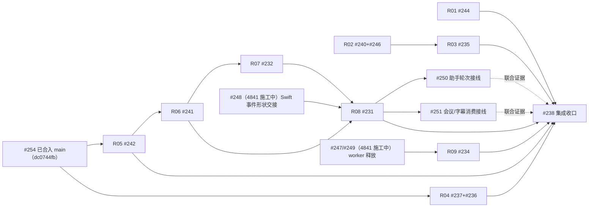

# Issue #238 DRY / SOLID 收敛 Loop Implementation Plan

> **For agentic workers:** 按现有 `executing-plans` 技能逐任务实施；使用本文的 checkbox 跟踪。默认由一个实施者串行写入，只有用户另行要求时才委派 `luna_worker`。本轮交付是分析与计划，不启动实施。

**Goal:** 将 #238 的十一项问题分成九个独立、可回退的 PR，先修完整性与生命周期，再收敛规则；通过明确文件 owner 和接口交接，避免与 #245（4841 worktree 施工中）、已合入的 #254 基线及助手保真工作冲突。

**Architecture:** 分别建立物理资源活动与回收、制品发布、转录保存、应用消费、会话封存、LLM 协议判定六个明确边界。复用现有队列、结果类型和业务规则，不建设万能 pipeline；#245 负责识别事实和场景消费，#238 负责已接纳内容的保存、排空与成功证明。

**Tech Stack:** Python `>=3.14,<3.15`、uv、asyncio、SQLite、Swift / SPM、macOS 26+；沿用现有 FastAPI、OpenAI SDK、worker 与契约。

**Spec:** [Epic #238](https://github.com/hrygo/SpeechRail/issues/238)、其十一项正文受管 issue，以及 [Epic #245](https://github.com/hrygo/SpeechRail/issues/245) 和原生子任务 #247–#253。#245 的完整方案已附在其 issue 正文；本 worktree 没有该方案的本地文件，不建立失效链接。

**核验日期：** 2026-10-06，Asia/Shanghai。§1.1／§1.4 于同日第二轮刷新：`origin/main` 已进到 `65df3aa6`，PR #254 已合并（`dc0744fb`），#245 在 4841 worktree 有未提交施工。本文中的接口草案、测试新增项和 PR 编号 R01–R09 均为计划，尚未实施。

## Global Constraints

- Python 固定为 `>=3.14,<3.15`；Native 目标为 Apple Silicon macOS 26.0，不新增旧平台兼容。
- 一次只运行一个 SpeechRail 服务和一个 ASGI worker；不复制模型进程，不改变 lane、内存预算或 batch/streaming 互斥。
- 本计划不改模型选择、vendor 版本、用户配置和 SQLite schema；实施基线若已升级 schema，保留其最新合法格式，不能降回旧版。
- 请求路径不下载模型、不读取远程音频；不记录正文、prompt、PCM、密钥或绝对模型路径。
- 同一文件同一时刻只有一个写入 owner；隔离 worktree 不等于可以同时修改同一逻辑。
- 本轮仅创建计划文件；实施、提交、push/PR、合并、构建、运行态和真实验收按下一阶段的明确授权执行。自动化 loop 不自行扩大授权。
- 验证使用 fake backend、合成数据、Gate 和可控时钟；本轮不执行项目测试、App 构建、模型、UI、性能或质量验收。
- 原文、已保存记录、候选音频、日志和完整制品保留；回退恢复代码接线，不能通过删用户数据“回到旧状态”。

## Review Focus

1. 协议 receipt 已到，但 final / attribution 尚未被应用消费：不得提前取消 receiver 或封存。归 R08。
2. INSERT 已提交，但返回结果失败：使用固定身份回读，不重建 lineID，不生成重复正文。归 R07。
3. 旧连接 / 旧 lease 的结束结果晚到：只能影响原记录，不能释放新占用。归 R06、R08。
4. 回收检查后恰好接纳新活动，或 shutdown 自身被取消：不能误关新活动，也不能跳过其他 owner。归 R02。
5. 字节写出、文件发布、数据库 completed 三个成功点不一致：不得报告残缺结果，不能误删已提交制品。归 R01。

---

## 1. 问题结论与当前事实

### 1.1 规划基线已经变化

| 证据 | 本轮读取结果 | 对计划的影响 |
|---|---|---|
| 本 worktree | clean、detached HEAD，`dab047b29654c1ee77e16cf7d931daa06f7fcd2f`；已落后 `origin/main` 5 个提交 | 只做分析快照；任何实施先重定基线到新 main 并建获授权的 `codex/` 分支，不在 detached HEAD 留交付提交。 |
| `origin/main` | `65df3aa6`（含 #255、CI fix、#254、#264、#269） | 不是 #238 原审查的 `45a39881`；每轮重新核实。 |
| #238 | OPEN；正文管理十一项 | 十一项都必须有交付归属；#239 是 duplicate，不加入计划。 |
| #245 | OPEN；#247–#253 都为 OPEN | 不重做该团队的策略、decoder、段关闭事件、预设和场景算法。 |
| PR #254 | **MERGED**（`dc0744fb`，2026-10-06T02:11:05Z） | 会议知识 schema／ledger／seal 已进 main；R05–R08 以新 main 为基线，不再等“PR 释放”。 |
| #245 实施 worktree | `4841/SpeechRail`，分支 `codex/multiscene-asr-245`，**有未提交改动**（13 跟踪文件＋13 未跟踪文件，见 §1.4） | 另一团队施工区；本 worktree 禁止写入其文件清单，先做零交集的 R01–R03。 |
| #231 | 2026-10-06T02:38:09Z 已换新基线 `dc0744fb`，确认未修复并发现更早丢弃点 | R08 必须覆盖两个反例（见 §1.2 #231 行）；不照抄旧评论结论。 |
| 开放 PR #270 | 完整文本 receipt 核对，只碰 FullTextReceiptCheck／pbxproj／测试 | 与 R01–R03 无交集；R06–R08 涉及 AssistantSession 时再核对其 head。 |
| 助手工作 | “STT-TTS 保真接线” active；在独立 worktree 改 `AssistantSession.swift` | R06–R08 与 #250 仍需避开该窗口。 |

以上是 GitHub/API、聊天记录和本地源码的读取结果；没有向其他聊天发送消息、修改 issue、创建实现 PR 或运行服务。

### 1.2 十一项不是同一种“代码重复”

| Issue | 当前根因 / 边界 | 本轮源码复核结论 | PR |
|---|---|---|---|
| #244 | 单次 `os.write` 不看返回长度，最终路径先被截断 | `_write_artifact` 仍是该形状；`JobRunner.run_once` 将返回 ref 交给 `complete` | R01 |
| #240 | aligner 未登记 lifespan；runner 异常可能截断 cleanup；partial-start 回滚不完整 | `RuntimeLifecycle` 仍只登记 asr/tts/streaming；组合根独立创建 aligner | R02 |
| #246 | 对齐 inflight 与 evictor 活动事实未接通；检查与 close 存在交接窗口 | `FixedTextAligner` 直接 await client；`_in_use` 仍只看 lease / ASR gate | R02 |
| #235 | HTTP 路由持有验证业务，跨路由导入私有规则；身份取证时机不同 | `voice_designs` 仍导入 `system` 私有业务符号 | R03 |
| #237 | HTTP 2xx 直接变成 connected，缺少 operation 成功证明 | `LLMProvider.check` 仍如此；PR #254 新增调用能力未替换此判定 | R04 |
| #236 | 共享 provider 依赖提词器 context、全局观测和 prompt 内 parser | 当前 provider 仍使用上述类型 | R04 |
| #242 | 名字 UPSERT 与修订 INSERT 分离；第二步失败后同名重试漏事件 | 当前 main 和读取的 PR #254 head 都仍是两次独立写入 | R05 |
| #241 | 设备释放与存储封存被当作同一个成功；部分 `try?` 路径仍发成功 ID | main 的 `finalize` / 部分 `endAssistant` 仍如此；PR #254 增加 meeting source seal，但通用 `finalize` 仍吞错 | R06 |
| #232 | consumer 失败后只撤销去重，未持有可恢复 save command | main 的 Meeting/Caption 仍如此；PR #254 换成 ledger.unmark，但仍未提供存储重试 owner | R07 |
| #231 | protocol receipt、应用消费、保存、封存完成混淆；**新发现 Meeting 正常收尾先 invalidate 代际** | `drainAndClear` 无应用 ACK；`releaseCapture(drain: true)` 先 `connectionGeneration.invalidate()` 再 drain，下行 receiver 随即拒收合法尾事件（#231 于 2026-10-06 换新基线 `dc0744fb` 后确认） | R08 |
| #234 | loader 声明提取、合并和校验在 ASR/TTS 分别维护 | 两个 worker 与 `model_identity` 仍有对应规则 | R09 |

这些是静态复核，不是本轮新执行的故障复现。#238 各 issue 中的 Linux / Swift / SQL 隔离探针是历史证据，不能计作本机目标平台的通过结果。

### 1.3 PR #254（已合入 `dc0744fb`）留下的设计约束

1. `SessionStore.swift` 会议知识 schema（含 v13 迁移）已随 #254 进入 main。R05/R06 以新 main 的真实 schema 为基线，不冻结旧版本，也不再把“等 PR 合并”当作前置条件。
2. `sealMeeting` 已增加来源快照封存：文字 archived 后，source seal 仍可失败。R06 不能删掉该步骤，也不能把 archived 单独当作 meeting 整体成功。
3. PR 新增 `TranscriptItemLedger`，负责 generation、item、partial/revision 和空 final 的恢复材料。#251 应扩展 / 收敛这一个账本，不能另建长期并存的 `TranscriptPreviewLedger`。R07 的保存队列是不同职责，可以独立存在。
4. PR 的 `releaseCapture(drain: true)` 进入时先 `connectionGeneration.invalidate()`，下行 pump 又检查 generation。**静态风险：**合法尾句可能在排空前就被判断过期。这需要 R08 用 Gate 验证；本轮未运行场景级反例，不声称已经实测。
5. main 的 queue `itemKey` 仅对 `.microphone` 返回键。Meeting 的 `.system/.mixed` 不能照搬这一判断；R07 必须将 ASR item 身份与 source 类型分开。
6. main 的 `MeetingSession.swift` 和 `CaptionSession.swift` 不在 SPM sources；PR #254 已将 Meeting 及依赖加入。R07/R08 若要声称 Caption 场景回归通过，必须把实际 Caption 编排和最小依赖纳入纯测试目标，不能只测试共享 helper。

> 🧠 **From Hindsight memory (SpeechRail 开发约定与验证方法；SpeechRail 组件职责与权威边界)** — 历史记录强调调用侧 `recordID` / lease 隔离、保存与封存分别证明，以及 REST/MCP/Realtime 的职责边界。本文采用这些约束，并以当前 `AssistantSession`、队列、协调器和正式契约复核；历史的测试通过记录没有计入本轮验收。

### 1.4 #245 实施 worktree（4841）的施工清单与本计划的禁写区

2026-10-06 同日读取 `/Users/hrygo/.codex/worktrees/4841/SpeechRail`（分支 `codex/multiscene-asr-245`，未提交）。以下是对方工作区的**当前施工事实**，不是 main 已合入内容；对方提交后需重新核对。

已跟踪修改（13 文件，`+1174/−264`）：

- `contracts/realtime-events.schema.json`、`contracts/realtime-field-matrix.json`
- `macos/SpeechRailApp/SpeechRailApp/RealtimeASRClient.swift`（删 `RealtimeVADProfile`、新增 `segmentClosed`／`segment_closed` 事件）
- `macos/SpeechRailApp/SpeechRailControlKit/RealtimeContractTypes.swift`
- `src/speechrail/application/realtime_openai.py`（约 567 行改动）
- `src/speechrail/backends/qwen3_streaming.py`、`src/speechrail/backends/qwen3_worker.py`（含 `_handle_commit` 空 completed 修复，对应 #247）
- `src/speechrail/compatibility/openai_realtime.py`、`src/speechrail/domain/ports.py`
- `tests/test_qwen3_streaming.py`、`tests/test_qwen3_worker.py`、`tests/test_realtime_caller_wire.py`、`tests/test_realtime_current_schema.py`、`tests/fixtures/realtime-current/manifest.json`

未跟踪新增：

- `docs/implementation/2026-10-05-multiscene-asr-luna-guide.md`
- `macos/SpeechRailApp/SpeechRailApp/AssistantInputTurnAssembler.swift`（294 行）
- `macos/SpeechRailApp/SpeechRailMacControlTests/ASRScenePresetTests.swift` 及 `MacControlTests/` 新目录
- `src/speechrail/application/asr_turn_coordinator.py`（286 行）、`src/speechrail/domain/asr_policy.py`（152 行）
- `tests/test_asr_policy.py`、`tests/test_asr_turn_coordinator.py`、`tests/test_realtime_multiscene_asr.py` 及 4 个 realtime fixture

对方尚未改动、且与本计划 R01–R03 零交集的确认（同日 `git diff HEAD..origin/main` 在本 worktree 核对，新 main 亦无改动）：

- `runtime/local_file_processor.py`、`runtime/job_runner.py`、`runtime/jobs.py`、`runtime/job_artifacts.py`
- `application/lifecycle.py`、`runtime/worker_lease.py`、`application/alignment.py`、`backends/qwen3_alignment.py`、`application/services.py`
- `http/routes/voice_designs.py`、`http/routes/system.py`

**禁写规则（在对方合入或明确释放前有效）：**

1. 本 worktree 不写 `qwen3_worker.py`／`qwen3_streaming.py`／`realtime_openai.py`／`compatibility/openai_realtime.py`／`domain/ports.py`／`RealtimeASRClient.swift`／`RealtimeContractTypes.swift`／上述契约 schema 与 fixture；R09 的 loader 迁移等对方 #247/#249 交付后再排期。
2. `AssistantSession.swift`／`MeetingSession.swift`／`CaptionSession.swift` 仍由对方 `scenePreset` 接线 touches（对方 worktree 当前仅 RealtimeASRClient 调用点已改，三个 Session 仍用旧 `RealtimeVADProfile`，预计后续会改）；R07/R08 的 Session 接线等对方合入后再基于新 main 做。
3. 允许先行的只有 R01（job 制品）、R02（runtime 生命周期）、R03（voice 验证用例）：文件零交集，可独立出 PR。

## 2. 最佳实施路径：九个 PR、按可用性选择下一轮

### 2.1 PR 分组

| 计划 PR | Issue 数 | 内聚交付目标 | 准入条件 | 主要交付顺序 |
|---|---:|---|---|---|
| R01 | 1：#244 | 完整制品发布与可信 job 完成 | job 文件空闲 | 当前可先做 |
| R02 | 2：#240/#246 | 同一物理 owner 的退出回收和运行中活动保护 | runtime 合同冻结；services 写入 owner 明确 | 紧接 R01；两项分别验收 |
| R03 | 1：#235 | 两个验证应用用例，共享同次执行证据 | R02 owner/activity 接口可用；#223/#224/#225 无冲突 | Swift 热点等待期间可做 |
| R04 | 2：#237/#236 | 一个协议判定源、中立解析和观测支持 | 新 main（#254 已合入）为基线；相关调用者写入窗口明确 | 先 false-ready，再提取 |
| R05 | 1：#242 | 显示名与修订事件的原子业务事务 | 新 main 为基线（含 #254 的 Store 扩展） | 优先于同文件大改 |
| R06 | 1：#241 | 一个真实封存结果，设备释放独立 | R05 合入；助手团队完成对应交接 | 冻结 seal seam |
| R07 | 1：#232 | 一个有界、可恢复的转录保存内核 | R06 seal seam；Meeting/Caption/Assistant 文件释放 | 冻结 save seam |
| R08 | 1：#231 | 输入截止→协议→应用消费→保存→封存闭环 | R06/R07；#248 Swift 事件形状交接；助手文件释放 | 必须先于 #250/#251 同文件接线 |
| R09 | 1：#234 | 一个纯 loader 身份归一化内核 | #247/#249 交付或明确释放 qwen3_worker；TTS bootstrap 空闲 | 不等待整个 #245 关闭 |

合计 **11 个 issue / 9 个 PR**。R01–R09 是工作包标识，不是已创建的 GitHub PR 编号，也不是僵硬的日历顺序。

推荐当前启动顺序为 **R01 → R02 → R03**：前两项是独立正确性修复，第三项可避开正在施工的 Swift 热点。一旦 Store 窗口释放，优先推进 **R05 → R06 → R07 → R08**，因为它们是 #245 App 接线的必要基础；R04/R09 按各自窗口补入。

### 2.2 为什么这样分

- #240/#246 在同一登记 / 活动 / close 边界变化，合一个 PR 可以避免两个实现同时改 `services.py` 和 `worker_lease.py`；仍保留 shutdown 与 idle 的独立结果。
- #237/#236 共用 LLM 响应与解析支持，合一个 PR 按小提交推进，可以避免先造一个临时 parser、后面再换一套。
- #242 与 #241 虽共用 Store，却可独立拒绝或回退；保留两个 PR，先把小事务修好，再改封存结果。
- #231/#232/#241 不打成巨型 PR：先提供 seal/save，再接 drain，每一轮都能被独立评审。三者最后联合验证。
- #234 与 decoder 无算法硬依赖，但同写 `qwen3_worker.py`；用写入窗口排序解决，不伪造成“必须 #245 全部关闭”的依赖。
- 不加入 #222–#230、#95/#118/#89 等外部 issue；只登记接口关系和验收归属，不改变它们的 parent。

### 2.3 不制造循环阻塞



图中的“交接”可以是相关变更已合入，或可独立合入的最小合同已经交付且 owner 明确。它不意味着要等待另一个 Epic 全部结束。

#250/#251 可以先开发自己的纯轮次 / 账本算法；**最终 consumer 接线**等 R08。R08 用 fake 事件证明既有终态和消费边界，不能反过来等 #251 的实现来证明自己的屏障。

## 3. 与 #245 和其他团队的文件边界

这是建议的协作合同，尚未向其他团队发送、也未获其确认。实施第一轮要核对实际文件清单，得到明确交接后才能写共享文件。

| 文件 / 责任 | 写入 owner | #238 的允许动作 | 交接规则 |
|---|---|---|---|
| `backends/qwen3_worker.py`、`qwen3_streaming.py`、新 decoder / turn coordinator | #245：#247/#249 | R09 仅在释放后迁移 loader helper | 不修改 commit/final/preview 算法；两个团队不可同时写整个 worker 文件 |
| `domain/asr_policy.py`、ASR options、Python Realtime 与 wire/schema、ASR 文档 | #245：#248/#249 | 只读取合同，不另写场景默认值 / 段关闭事件 | #248 拥有公共 ASR wire；#238 local marker 不新增 server 事件 |
| `application/services.py` | R02 在其窗口内 | owner 登记、activity 装配 | #245 只消费 shared owner；需要其组合根接线时，先交接 services，不能各自改后碰运气 |
| `runtime/worker_lease.py`、lifecycle、alignment | #238：R02 | 活动与回收合同、aligner 接线 | #249 保留自己的 operation owner；不得把取消 await 当真实计算停止 |
| `RealtimeContractTypes.swift` | 先 #248，后 R08 | local drain marker / result；不接管 ASRPolicy | 顺序：#248 事件形状 → R08 本地屏障 → #245 consumer 使用 |
| `RealtimeASRClient.swift` | 4841 施工中（删 VAD 预设、加 segment_closed）→ R08 交接 → #245 | R08 在其合入后添加应用消费边界 | 保留 `flushPendingUtterance` 暂停语义；pause 与 end 不同；不碰对方的 policy／segment 事件 |
| `SessionStore.swift`、`SessionCoordinator.swift` | #254 已合入 → R05 → R06 → R07 必要 seam | 业务事务、真实结果、窄保存端口 | 不搬动已合入的 schema / 会议知识；各轮串行 |
| `MeetingSession.swift` | #254 已合入 → R07/R08 → #251 | 保存队列、drain、封存调用 | #251 扩展现有 ledger 的 preview / span，不重建队列 |
| `CaptionSession.swift` | R07/R08 → #251 | 保存、drain 与测试 seam | 把实际生产编排纳入确定性测试；#251 接入 typed item/revision/span |
| `AssistantSession.swift`、其依赖 / 测试 | 保真团队 → R06/R07/R08 → #250 | 保存与 drain；不改 TTS/播放算法 | 先接纳旧团队成果，再基于新 head 作后续接线 |
| `LLMProvider.swift` | #254 已合入 → R04 | 中立协议、解析、观测 | 保留已合入的流式 Chat 能力；不换 SDK、prompt |
| 提词器 preparation/prompts / recorder | R04 对共享支持部分 | 迁移唯一 parser、观测 adapter | #252 拥有跟随 / session / 试读；交集文件顺序交接 |
| `Package.swift`、Xcode project、共享 fixture / docs | 当前正在接线的 PR owner | 只登记本 PR 必要源文件 / 测试 | 文件同样串行；不要用“只是测试/文档”绕过 owner |

**所有权拆分：** #245 负责 item/revision/span/segment-close 与业务 turn；R07 负责固定 save identity 与持久化结果；R08 负责消费到屏障；R06 负责 seal。一个“已完成”不能替代下一层的证明。

**共享 ledger 决定：** PR #254 的 `TranscriptItemLedger` 作为会议 item 事实起点，#251 补 connection identity、sample span、revision 和边界需要。旧的“取消去重后等待 completed 重发”注释应由 R07 删除；不能在新 ledger 内再实现第二个持久化 retry。

## 4. 每轮 loop 的执行规则

### 4.1 下一轮选择

```text
刷新 main / 当前 PR heads / 工作区变更 / 相关聊天进度
eligible = 尚未完成、接口前置已满足、全部写入文件已释放的工作包
选择 eligible 中：
  先 P1 内容或资源完整性，再 P2 结构收敛
  同优先级优先无共享热点且可独立发布的工作包
  不合并仅为凑足 3 个 issue 的独立主题
如果当前包遇到 owner 冲突：
  冻结该处写入，保留已完成内容
  转向另一个 eligible 包或只读准备反例 / 合同
  没有 eligible 包时记录精确待交接点，停止写入，不循环重试
```

### 4.2 一轮的九个动作

- [ ] **固定基线。** 记录 checkout、base/head、工作区改动、相关 PR head；只读核对同文件变更来源。不得 stash/覆盖别人的修改来获得“干净”。
- [ ] **领取边界。** 在本轮执行记录列出 issue、唯一写入者、精确文件、输入/输出接口及禁止修改项。共享接口先取得合同交接；用户未授权消息发送时，交付交接文本，由用户转交。
- [ ] **补反例。** 在下面指定测试位置补原缺陷的确定性 Gate / 故障注入；先确认旧行为使其失败。
- [ ] **实施内核。** 小步落实唯一规则与 owner；每个逻辑改动连同回归一起完成，不复制临时实现。
- [ ] **迁移消费者。** 保留业务差异；移除旧实现和双写，核对引用、SPM/Xcode 来源和 fixture。
- [ ] **最小验证。** 运行本包命令与涉及的契约检查；记录断言结果，不以退出码或测试数量代替行为证据。
- [ ] **形成 PR。** 仅在提交/push/PR 授权覆盖时操作；PR 只关联本包 1–3 个 issue。未完成的 issue 用 `Refs`，全部验收完成才使用 `Closes`；从不 `Closes #238`。
- [ ] **评审与交接。** 按 `code-review-and-quality` 做变更评审；获取合并授权后再合入。没有合并授权则交付 merge-ready PR，后继共享热点包等待真实交接。
- [ ] **更新账本。** 记录 merge SHA、实际命令/日期、失败与未验项、回退、释放文件。下一轮从最新已交付 head 重建判断。

分支候选名为 `codex/238-r01-artifact-publish` 等；名字不是已经创建的分支。不要维护长时间堆叠的九层 branch。默认从最新已合入 base 开下一包；若需 stack，仅限已明确接受的稳定 seam，并注明 PR base，不能把上游未评审改动藏在下游 diff。

## 5. 各 PR 的具体实施卡

文件清单使用以下根目录：Python 的 `application/`、`runtime/`、`backends/`、`domain/`、`http/` 均相对 `src/speechrail/`；Swift 单文件名相对 `macos/SpeechRailApp/SpeechRailApp/`，Swift 测试文件相对 `macos/SpeechRailApp/SpeechRailMacControlTests/`，`Package.swift` 位于 `macos/SpeechRailApp/`。显式写出的 `tests/` 和 `SpeechRailControlKit/` 路径相对仓库或前述 App 工程根。`拟新增` 标记不是现有文件。验证命令在实施 checkout 根执行，均为待执行。

### R01 — #244：完整制品发布与 job 状态

**文件：** 修改 `runtime/local_file_processor.py::_write_artifact`、`runtime/job_runner.py::run_once`、`runtime/job_artifacts.py`；必要时修改 `runtime/jobs.py::complete/recover_interrupted`。拟新增 `runtime/artifact_publisher.py`。测试复用 `tests/test_local_file_processor.py`、`tests/test_job_runner.py`，拟新增 `tests/test_artifact_publisher.py`。

**输入/输出：** 输入是本 job 的完整合法 bytes 和受控目标；输出拟用内部 `PublishedArtifact(ref: str, size_bytes: int)`。现有 `JobProcessor.process -> str` 和公开 job schema 保持，只有 publisher 满足后置条件才返回 ref。

- [ ] 先补一次短写 / 多次短写 / 0 写入 / 部分后异常反例；断言文件实际字节和 job 状态。
- [ ] 用 job 目录内独占 staging 完成写入；目录 `0700`、文件 `0600`，不先截断 final。选定 file fsync、原子发布、directory fsync 的顺序；它是耐久性设计，不宣称已测得掉电保障或零成本。
- [ ] 失败清理本次 staging，保留已有完整 final。复用相对 ref、job 归属与路径保护，不扩大本地 publisher 对 opaque 非文件 ref 的处理范围。
- [ ] 分离 processor failure 与 complete 的“写后回读失败”。`jobs.complete` 当前 UPDATE 提交后再 `_get_any`；异常时不能直接盲目 `fail` / 删除文件：能回读同 job 的 completed+同 ref 才确认成功；无法确认时保留待恢复状态和完整制品，不写假 completed。
- [ ] 重启沿用既有有界 `recover_interrupted`；扫描/恢复仅本 job 的 staging/final，先核对状态与引用。不得清除其他 job 或有效 completed 的制品；需要新持久化 journal 时另行评审，不能藏在纯重构中。

```text
publish:
  create staging exclusively in verified job directory
  while offset < len(content):
    n = write(content[offset:])
    if n <= 0 or n > remaining: fail
    offset += n
  set/verify permissions; fsync file; close checked
  atomically publish; fsync directory
  return ref only after successful postconditions
complete:
  attempt repository.complete
  if acknowledgement fails: reconcile exact job + ref
  unknown outcome retains evidence; never delete a possibly committed result
```

**验收：** bytes 完全相等；0/异常/fsync/close/rename 失败不产生可用半文件；状态与实际 final 一致；发布后 complete 失败与重启各有用例；TTL/cancel 现有清理不退化。

```bash
uv run --extra dev pytest tests/test_artifact_publisher.py tests/test_local_file_processor.py tests/test_job_runner.py
uv run --extra dev ruff check src/speechrail/runtime/artifact_publisher.py src/speechrail/runtime/local_file_processor.py src/speechrail/runtime/job_runner.py src/speechrail/runtime/job_artifacts.py src/speechrail/runtime/jobs.py
```

R01 只交付制品/状态；runner 异常后的全局回收由 R02 验收。

### R02 — #240 / #246：物理 owner 与活动/回收交接

**文件：** `application/lifecycle.py::RuntimeLifecycle`、`application/services.py::build_app_services`、`runtime/worker_lease.py::WorkerLeaseLock/WorkerIdleEvictor`、`application/alignment.py::FixedTextAligner`、`backends/qwen3_alignment.py::Qwen3AlignmentWorker`。拟新增 `runtime/worker_ownership.py` 放有限 owner 描述，不导入业务路由。测试 `test_application_composition.py`、`test_worker_lease.py`、`test_alignment_worker.py`。

**合同草案：** 每个物理实例登记 identity、owned/borrowed、启动策略、close、activity。ASR batch/streaming 是 alias；TTS router 拥有 child；aligner 独立 owned 且 lazy。Idle 只借用；shutdown 才终结 owner。

- [ ] 分别补“runner 已失败仍关闭所有 owner”“runner 已创建后 evictor.start 失败”“已预热 aligner 接近 TTL 后开始 exchange”的旧行为反例。
- [ ] 建立唯一 owned 集合；close 登记与 eager start 分开，未用 aligner 不因登记而加载。
- [ ] startup 撤销记录覆盖 component 和 task；异常回滚取消并等待 runner，然后释放已取得 owner。
- [ ] 将 idle/force-evict 的检查与关闭预约放进 activity 的同一个协调点；普通 lease 计数本身不够。
- [ ] align activity 从安全准入 / 启动握手覆盖 exchange、结果校验和必要失败清理；释放后更新 idle 起点。取消 await 未确认真实计算终止时继续保留占用或隔离旧 generation。
- [ ] cleanup 对每个 owner 都尝试执行；收集脱敏失败后统一报告。定义有界 shutdown deadline，继承现有配置预算；禁止发明新默认秒数或用无限 shield 掩盖超时。

```text
activity.acquire:
  under owner coordination:
    if closing: wait boundedly for completed close, or reject
    otherwise accept activity for this generation
idle.try_claim:
  under the same coordination:
    if active or closing: skip
    otherwise mark closing and capture generation
  close captured instance outside state lock
  settle close, update idle clock, wake bounded waiters
shutdown:
  close admission -> stop producers -> cancel/await active tasks
  close each distinct owned instance -> report all failed cleanup
```

保持 governor / ASR gate 的合法并发策略；activity 保护不等于将所有 lane 全局串行化。

**验收：** idle on/off 都关闭已使用 aligner；alias/router child 不重复释放；runner/evictor/worker cleanup 失败不跳过其他 owner；接纳与回收竞争只产生安全等待/拒绝/新实例；force_evict 不误关 active；shutdown 与 idle 分别断言。

```bash
uv run --extra dev pytest tests/test_application_composition.py tests/test_worker_lease.py tests/test_alignment_worker.py
uv run --extra dev mypy src/speechrail/application/lifecycle.py src/speechrail/application/services.py src/speechrail/application/alignment.py src/speechrail/runtime/worker_lease.py src/speechrail/runtime/worker_ownership.py src/speechrail/backends/qwen3_alignment.py
```

### R03 — #235：验证应用用例与同次执行证据

**文件：** `http/routes/voice_designs.py`、`http/routes/system.py`、组合根中的窄装配。拟新增 `application/voice_validation_execution.py`、`application/voice_design_validation.py`、`application/voice_quality_runs.py`；复用 `domain/voice_quality.py` 和既有 binding。测试复用 `test_voice_design_workflow.py`、`test_voice_design_concurrency.py`、`test_voice_quality_routes.py`、`test_voice_quality_evidence.py`，新增 `test_voice_validation_execution.py`。

**输出合同：** 同次 PCM 的长度/必要摘要、runtime revision、policy/probe/recipe 标识、结果与 deadline outcome。unknown 保持 unknown；不由稍后查询另一 runtime 补填。

- [ ] 列出两个 handler 的租约、身份捕获、驱逐、ASR、CAS、持久化顺序；先锁定现有 HTTP status/header/body。
- [ ] 在 R02 的 TTS 活动范围内捕获实际执行身份与 PCM，冻结结果后再释放；按原资源策略切到 ASR。
- [ ] 提取两个明确用例；candidate 保留自定义新文本/human review，quality-runs 保留固定 probe/repeat，不用巨型布尔参数合并。
- [ ] 先迁一个入口，再迁另一个；HTTP 保留鉴权/schema/request ID/envelope。应用层不依赖 Request/JSONResponse。
- [ ] 删除跨 route 私有业务导入；新增 import/架构回归，保留数字精确门禁、原阈值、expected_revision/CAS。

**核心 Gate：** 合成结束后、lease release 前冻结 runtime A；release 后将 fake runtime 改成 B/unknown；保存证据仍只对应 A 与那份 PCM。评分通过但保存失败不得产生 persisted/production-ready。

```bash
uv run --extra dev pytest tests/test_voice_validation_execution.py tests/test_voice_design_workflow.py tests/test_voice_design_concurrency.py tests/test_voice_quality_routes.py tests/test_voice_quality_evidence.py
uv run python scripts/check_openapi_contract.py
```

不要求 #223/#224/#225 整单先关闭；复用已交付的窄端口，未交付时保留明确 adapter，不创建第二 registry/aligner。R03 未修改公开协议时不顺手升契约版本。

### R04 — #237 / #236：可信探测与中立 LLM 支持

**文件：** `LLMProvider.swift`、`TeleprompterPreparationPipeline.swift`、`TeleprompterPreparationPrompts.swift`，实际 recorder 装配点；必要调用者只在文件窗口内接线。拟新增 `LLMResponseValidation.swift`、`LLMObservation.swift`、`StrictJSONObject.swift`。测试 `LLMProviderTests.swift`，拟新增 `LLMResponseValidationTests.swift`、`LLMObservationTests.swift`、`StrictJSONObjectTests.swift`；更新 Package/Xcode source 引用。

**内核合同：** operation-aware 基础结构 / 状态 / 正文分类，不强加业务 JSON schema。中立 observation 带 operation、request correlation、attempt、finish/outcome、token facts；提词器阶段由 feature adapter enrich。所有类型均拟新增，实施时统一定义后才迁移调用者。

- [ ] FakeTransport 补 HTML、204、`{}`、错误 envelope、operation 错配、refusal/incomplete/failed/queued 的反例；合法 Chat 普通正文和项目有意支持的 Responses 形状作为正向向量。
- [ ] 先让 check 与正式基础解析用同一结果分类，修 false-ready；保留 `/models` 非权威、thinking 控制和探测的小预算。
- [ ] 将现有严格 scanner 搬为唯一共享实现；固定重复键、尾随内容、顶层对象、truncation/refusal/tool-call 拒绝行为。不复制 parser。
- [ ] Provider 改为中立 observer；移除 Teleprompter context/global recorder 依赖。提词器 adapter 保留 stage/item/run 关联，组合根注入实际 sink。
- [ ] 保留 PR #254 新增的 Chat 流式实现；保留日志路径/格式/指标语义。attempt 只记一次；nil/失败 observer 不影响取消或原错误。
- [ ] 以 fake 检查无效 probe 不拿音频资源、不保存密钥草稿；既有配置保持。若需要 Settings 的文案调整，按设计规范完成最小接线，不顺带改界面布局。

```text
protocol classification -> reachable but unconfirmed / successful / refused /
                           incomplete / failed
check consumes classification
formal call consumes classification + task-specific requirements
structured call additionally applies strict object + business schema
```

**验收：** 共享支持层无 `Teleprompter*` 引用；一次 attempt 一组观测；坏 2xx 不 ready；合法非 JSON-mode Chat 不被误拒；端点/模型/operation 协商隔离不退化；独立支持层测试无需 preparation/prompts。

```bash
swift test --package-path macos/SpeechRailApp --filter LLMProviderTests
swift test --package-path macos/SpeechRailApp --filter LLMResponseValidationTests
swift test --package-path macos/SpeechRailApp --filter LLMObservationTests
swift test --package-path macos/SpeechRailApp --filter StrictJSONObjectTests
```

R04 不改 ASR 预设、助手轮次、TTS/播放；需要 `AssistantSession.swift` 的测试接线须等保真团队释放。

### R05 — #242：说话人显示名业务事务

**文件：** `SessionStore.swift::renameSpeaker`；测试复用 `MeetingMinutesVersioningTests.swift`，拟新增 `SessionStoreTransactionTests.swift`。只按需要新增 Store 内部事务 helper。

- [ ] 使用测试自有 SQLite 和第二次 INSERT 的失败注入，固定名字、事件、旧纪要正文、需复核状态。
- [ ] 将旧名查询、UPSERT、必要修订 INSERT 放入同一个 `BEGIN IMMEDIATE` / COMMIT 范围；不跨 await。
- [ ] 嵌套策略明确：本用例不嵌套；需要调用已在事务内的方法时使用既有 savepoint 或拒绝，不能悄悄再次 BEGIN。
- [ ] catch 中 rollback，保留首个错误；COMMIT 失败不能报告业务成功，按 SQLite autocommit / 回读证据区分结果。
- [ ] 保留实际现有首次命名语义：`previous=nil` 到名字会生成事件，现有 `testRenameMarksOldMinutesNeedsReview` 使用首次命名验证需复核。源码“首次命名不刷”注释与代码不一致，应修正注释，不能借事务修复改变业务。

```sql
BEGIN IMMEDIATE;
-- SELECT previous name; UPSERT name;
-- If previous != requested name, INSERT the same speaker revision event.
COMMIT;
-- On error, explicitly roll back the transaction when still active.
```

**验收：** 第二次写入失败后旧名/事件都不变；解除失败后同名目标重试恰好一次；成功同名重试不增事件；A→B→A 两次变化都记录；不存在会话/外键/只读失败不半提交；不同会话同 label 隔离。

```bash
swift test --package-path macos/SpeechRailApp --filter SessionStoreTransactionTests
swift test --package-path macos/SpeechRailApp --filter MeetingMinutesVersioningTests
```

不从当前名字重建历史漏记事件，不改 schema，不重写纪要正文。

### R06 — #241：真实封存结果与设备释放

**文件：** `SessionCoordinator.swift::finalize/sealMeeting/sealSession/sealSessionReporting/endAssistant`、`SessionStore.swift::finalizeSession`，Assistant/Meeting/Caption 的对应结果接线。测试复用 `AssistantEndRoutingTests.swift`、`AssistantDrainTests.swift`、`MeetingMinutesVersioningTests.swift`，拟新增 `SessionSealTests.swift`。

**复用接口：** 当前 `SessionSealResult` 的 sealed/failed/skipped，明确目标 recordID；需要更细事实时增加内部 seal report，不制造第二套同义结果。meeting 的“行 archived / 来源 snapshot sealed”分别保留。

- [ ] 注入 store failure、零行 UPDATE、更新后回读失败，与现有 reporting 入口对照。
- [ ] 统一明确 recordID 的封存内核；回读确认目标存在及结果。已 archived 的重复请求不改变原 endedAt/endReason，meeting source seal 未成功时继续恢复该阶段。
- [ ] 流程进入时冻结 kind/lease/record；每次 await 后复核 ownership。只在持久化成功时发布成功 ID/ended/纪要资格。
- [ ] 保存失败或 seal 失败仍释放本次设备，保留原记录的 pending seal；不把 occupancy 长留 recording。
- [ ] 消除通用 `try?` 假成功；保留文字目标不影响会议占用、无持久化场景只释放设备的合法分支。

```text
target = frozen(kind, leaseID, recordID)
stop own input using reporting stopper
if input is incomplete: retain pending save/seal; no success notification
else: run record seal, and meeting source seal when applicable
release only devices still owned by target
publish success only from a successful seal result for target
```

R06 提供 typed input-stop 结果 seam；R08 后续接入完整消费证明。不能在 R06 未接完整 drain 时宣称 #231 已解决。

**验收：** store throw/零行/unknown 无成功投影；设备已释放；迟到旧目标不清新 lease；重复成功只一次通知；来源快照失败不启动完整纪要。

```bash
swift test --package-path macos/SpeechRailApp --filter SessionSealTests
swift test --package-path macos/SpeechRailApp --filter AssistantEndRoutingTests
swift test --package-path macos/SpeechRailApp --filter AssistantDrainTests
swift test --package-path macos/SpeechRailApp --filter MeetingMinutesVersioningTests
```

### R07 — #232：有界保存命令与失败恢复

**文件：** `AssistantInputPersistenceQueue.swift`、Assistant/Meeting/Caption 保存接线、对应依赖 seam、Store 精确行读取 seam；拟将共享内核迁到 `TranscriptPersistenceQueue.swift`，移除旧队列实现，不让 Meeting import Assistant feature。测试保留原 queue 场景并迁到 `TranscriptPersistenceQueueTests.swift`；新增 `MeetingPersistenceTests.swift`、`CaptionPersistenceTests.swift`。

**命令合同草案：** 冻结 sessionID、connection、itemID/local acceptanceID、lineID、text、role、source、tStart/tEnd、formal/partial、observedAt、timingQuality、设备切换与必要 speaker 事实。精确字段采用交接后 `LineDraft`；不添加持久化 PCM 或另一 schema。

- [ ] 写入前失败、写后回读失败、同 ID 内容冲突、失败命令继续占容量四个反例先行。
- [ ] 从现有 queue 提取唯一内核；修正去重口径为“来自 ASR 的有身份输入”，不能因 `.system/.mixed` 不等于 microphone 就跳过去重；keyboard 使用独立 acceptanceID。
- [ ] receiver 只校验、冻结、入队，不 await Store I/O；同记录顺序处理，失败后同记录阻塞，其他记录按既有允许策略独立。
- [ ] save 错误按固定 lineID 精确回读：所有冻结字段匹配才认先前成功；不存在才用同命令重试；冲突明确失败，禁止 `INSERT OR IGNORE`。
- [ ] 正式正文成功保存后才更新 item→line/ordinal；先到 attribution 保留有界命令/缓存并在行就绪后附着。它也必须进入 R08 的保存完成范围，不能只等待正文。
- [ ] 将空 final 的恢复 partial 也交给同一保存 owner，失败不得丢材料；展示/业务 turn 决策留给原 feature 和 #251。
- [ ] 为 settled waiter 加取消注销 / deadline 可组合接口，避免 R08 timeout 后泄漏 continuation；清空 UI 错误不等于丢弃失败命令。
- [ ] 接入真实 Meeting/Caption fake consumer seam；根据交接后 Package.swift 加入实际生产源与最小依赖，核对 Xcode 测试 target，不创建 UI tests。

```text
admit immutable command -> capacity charged -> async serial save
save success -> publish saved projection
save failure -> read exact identity:
  matching row -> success
  no row -> retained retryable command
  conflicting/unknown row -> retained failure
normal stop -> report all required commands settled + no failures
```

**验收：** 不依赖 completed 重投；ordinal 只一次；长 Store Gate 不阻塞控制消费；容量满明确拒绝；旧 generation 保存只归旧 record；source/time/speaker/partial 信息不因抽取丢失。

```bash
swift test --package-path macos/SpeechRailApp --filter TranscriptPersistenceQueueTests
swift test --package-path macos/SpeechRailApp --filter MeetingPersistenceTests
swift test --package-path macos/SpeechRailApp --filter CaptionPersistenceTests
swift test --package-path macos/SpeechRailApp --filter AssistantSessionTests
python3 scripts/check_macos_test_target_coverage.py
```

### R08 — #231：应用消费与保存排空屏障

**文件：** `RealtimeASRClient.swift::drainAndClear`、`SpeechRailControlKit/RealtimeContractTypes.swift`、三类 Session 结束/暂停/切换、对应 client protocol。拟新增 `SessionDrainBarrier.swift`；测试修正 `AssistantDrainTests.swift`，新增 `SessionDrainBarrierTests.swift`、`MeetingDrainTests.swift`、`CaptionDrainTests.swift`，保留 `RealtimeContractTests.swift`。

**本地合同草案：** `DrainIdentity(recordID, connection, drainID)`、协议结果 / 有序本地 marker、消费 ACK、保存结果、seal 结果。marker 是 App 内事件，不发送到 server，不伪造 server event_id/sequence；保留 wire metadata 与本地 marker 身份的类型区别。

- [ ] 先补 receipt 到达、receiver Gate 未释放、save queue 此刻为空的真实反例；在该点 stop 必须未成功。
- [ ] 正常结束先截止新采集，排空已接纳上行；保留 draining generation，禁止新 LLM/TTS，只接纳 matching tail。上传排空也有水位，不能采集 stop 后假定所有样本已经上传。
- [ ] 沿原单网络 reader 完成 command receipt / negotiated attribution / clear；之后在同一有序下行通道放本地 marker。只有实际 receiver 处理到 marker 才 ACK；不能由网络 receipt handler 代 ACK。
- [ ] marker 接纳失败 / overflow / EOF 先到 / 连接失败不能给成功；空输入也必须能确认 marker。
- [ ] consumer ACK 后等待 R07 的保存和元数据结果，再调用 R06；整个流程共享一个绝对 deadline，各 stage 消费剩余预算。
- [ ] 等待者放在 receiver 之外；receiver 不等待依赖自己继续消费的 barrier。成功后自然退出并 await task；仅明确 cancel/failure/timeout 才取消。
- [ ] 修复正常 draining 过早 generation invalidate；保留切换/显式取消时旧事件作废。pause 的 `flushPendingUtterance` 不等同 end 的 drain+clear，按现有 pause 合同使用消费/保存水位。
- [ ] 原 A06 store gate / timeout 用例按实际作用重命名；新增真实 timeout，不通过提前 release Gate 伪造超时证据。

```text
freeze ending identity and absolute deadline
stop capture -> settle admitted uploads
protocol drain -> append ordered local marker
wait consumer acknowledgement of exact marker
wait all marker-preceding save + attribution commands
if all proofs complete: seal exact record
else: release own devices, retain recoverable inputs, report incomplete
```

**必须逐项断言：** final/attribution/marker/receipt 交错；Store Gate；empty success；timeout/断线/overflow；旧连接 marker；新 lease 在旧收尾时接管；drain 不启动回复；取消不伪装完整；Meeting 不以不完整正文启动纪要。

```bash
swift test --package-path macos/SpeechRailApp --filter SessionDrainBarrierTests
swift test --package-path macos/SpeechRailApp --filter AssistantDrainTests
swift test --package-path macos/SpeechRailApp --filter MeetingDrainTests
swift test --package-path macos/SpeechRailApp --filter CaptionDrainTests
swift test --package-path macos/SpeechRailApp --filter RealtimeContractTests
python3 scripts/check_macos_test_target_coverage.py
```

完成后将 R06/R07/R08 的合同和 Gate 向量交给 #250/#251；它们迁移轮次和 item/span 消费时必须继续运行这些向量。

### R09 — #234：纯身份声明内核

**文件：** `backends/model_identity.py`、`qwen3_worker.py::_loader_value/_loader_quantization`、`qwen3_tts_worker.py` 的同名逻辑；必要时拟新增 `backends/loader_identity.py`。测试复用 `test_model_identity.py`、`test_qwen3_worker.py`、`test_qwen3_tts_worker.py`，新增 `test_loader_identity.py`。

- [ ] 先对现有 ASR/TTS 运行同一声明向量，命名 snapshot 严格一致与 loaded 部分观测的合法差异。
- [ ] 内核负责 missing sentinel、字段提取、基础约束和命名合并规则；collector 保留 backend 的来源顺序和对象形状。
- [ ] 先迁 TTS 再迁 ASR；ASR 只在 #247/#249 文件释放后写入。保留该团队新增 decode/commit/terminal 逻辑。
- [ ] 保留 requested/load/observed dtype、codec、family、variant 和 sample rate 的独立校验；不把 unknown 解释为 unquantized，不扩大 catalog 支持集合。
- [ ] 移除旧重复规则；纯模块不导入 MLX/vendor，不读取模型目录，不带 Metal cleanup 副作用。

**向量：** Mapping/attribute；缺失/None；4/8 bits 的解析与 backend 支持分别检查；bool/float/非法值；group_size 配对；flat/nested 冲突；dtype/format 合并差异；unknown/unquantized/invalid 的正交结果。

```bash
uv run --extra dev pytest tests/test_loader_identity.py tests/test_model_identity.py tests/test_qwen3_worker.py tests/test_qwen3_tts_worker.py
uv run --extra dev ruff check src/speechrail/backends/model_identity.py src/speechrail/backends/loader_identity.py src/speechrail/backends/qwen3_worker.py src/speechrail/backends/qwen3_tts_worker.py
```

## 6. 验证、评审与关闭口径

### 6.1 每个 PR 的共同验收

- [ ] 原缺陷至少一个失败反例；测试控制的是相关 Gate / syscall / SQL / identity，不因无关拒绝而通过。
- [ ] 对相关修改文件做 Ruff/Mypy 或 Swift 编译与定向测试，执行 `git diff --check`。
- [ ] 文件/类型搬移核对所有引用和测试 target；共享模块无反向业务依赖；不残留第二 parser/queue/owner。
- [ ] 若公共行为意外需要变更，先暂停扩展并更新契约、回归与用户文档，不以“内部重构”掩盖变化。
- [ ] 记录实际命令、日期、SHA、关键断言、未运行项、运行态动作和回退。未实测质量/性能/长稳明确写 `not_run`。
- [ ] 评审前回读 PR/head 和并行文件变化；只 stage 本包改动，检查 staged diff、敏感字段和 `git diff --staged --check`。

定向命令中拟新增文件在实施后才存在；执行者选择实际创建的模块路径，不把“文件不存在”当测试通过。完整 suite / CI / App build 按授权和 CI 现行规则执行，不要求每个小提交反复跑全量。

### 6.2 两个跨包门

**内容门：** R06/R07/R08 联合证明“接纳上传 → 协议收口 → 应用归约 → 行/attribution 保存 → meeting source / record 封存”；再用 #250/#251 的多 item、revision、rollover 向量复验，不能仅有 helper 测试。

**资源门：** R02/R03 联合证明独立 aligner、shared ASR owner、TTS router/child 的活动、idle、shutdown、证据捕获一致；R09 身份重构不改变 readiness/精度与资源策略。已有 PR #243 cleanup 原语只在语义复核后复用，它没有自动解决 aligner 登记或 idle 安全。

### 6.3 Epic 关闭

#238 关闭需要十一项分别具备完整证据、两个跨包门通过、无双规则/双 owner、回退和未验范围明确。延期项用承接 issue 与理由明示移出；不能勾选掩盖未完成。

#245 的真实质量、延迟、资源验收归 #253；#238 不代替该任务关闭。#95/#118/#89 的设备、长稳和 UI/AX 验收继续独立。计划落盘、单元测试或 `/readyz=200` 均不是这些门的完成证明。

## 7. 风险、回退与证据限制

| 风险 | 控制 / 回退 |
|---|---|
| 4841 施工未合入／助手团队还在推进 | 所有共享文件用真实 head 交接；未交接先做 R01/R02/R03，不覆盖对方文件 |
| 以旧 schema / 源位置实施 | Store 卡基于交接后的 schema，不执行反向迁移；符号名作为定位锚点，本文行号不作长期合同 |
| #231/#251 相互等待 | 先交付本地 save/drain/seal seam；#251 只等待最终接线，算法可独立开发 |
| 观察 unknown 被提升为成功 | 每层使用实际结果；未确认封存、runtime、complete 都保留 unknown/pending |
| 文件与 SQLite 无共同事务 | R01 明确发布/提交/恢复三个阶段；不声称 rename 或 SQL transaction 覆盖两种资源 |
| 测试目标遗漏生产编排 | Caption/Meeting/新支持类型的 SPM/Xcode 引用逐包核对，不用 helper 绿灯冒充端到端 |
| 回退删除已产生用户数据 | 每 PR 用普通 revert 恢复接线；保留用户库和制品；App/服务安装回退需另行 release/local-deploy 流程 |

本轮代码图谱使用已存在的 `Users-hrygo-Documents-SpeechRail`，generation `2026-10-05T14:42:25Z`，索引 head 与本 worktree 一致。当前 worktree 没有独立索引，analysis profile 不提供索引重建；没有新建/重建索引。

已对 25 个相关源路径调用 `check_index_coverage`；Assistant/Meeting/Caption 有 partial，RealtimeASRClient 为 unusable，相关状态与 drain/receipt/terminal 范围直接读源码补证。六个关键源文件比对了图谱根目录与本地文件内容相同。图谱部分动态调用结果存在误解析，只作为定位线索，本文关键控制流以源码为准；不主张已经穷尽所有动态依赖。

## 8. 执行账本与交接清单

| 工作包 | 状态 | 真实 PR / merge SHA | 下一步 |
|---|---|---|---|
| R01 #244 | planned | 无 | 取得实施与定向验证授权后先做短写反例 |
| R02 #240/#246 | planned | 无 | 冻结 owned/borrowed/activity/eviction 合同 |
| R03 #235 | planned | 无 | 复用 R02，核对外部窄端口 owner |
| R04 #237/#236 | planned | 无 | 等 LLMProvider 交接；先准备坏 2xx 向量 |
| R05 #242 | planned | 无 | 新 main 已含 Store 扩展；开工前重定基线到新 main |
| R06 #241 | planned | 无 | R05 后冻结 reporting stopper / seal 合同 |
| R07 #232 | planned | 无 | 提取唯一保存内核；释放三类 consumer 文件 |
| R08 #231 | planned | 无 | 接 R06/R07 与 #248 形状；完成内容联合门 |
| R09 #234 | planned | 无 | 等 #247/#249 worker 释放；准备纯声明向量 |

实施者依次核对：

- [ ] 读取 #238/#245 及当前 PR heads，核实本计划的事实是否变化。
- [ ] 与 #245 对齐“识别事实 / 保存 / drain / seal”四个 owner，以及一个共享 ledger。
- [ ] 与 #254 合入后的新 main 对齐 Store/Meeting/LLMProvider/Package 基线。
- [ ] 与“STT-TTS 保真接线”对齐 AssistantSession 的写入释放点。
- [ ] 按 §4 选择第一个 eligible 工作包，每包 1–3 issue、一个 PR。
- [ ] 按 §5 实施和定向验证；每轮填写真实证据，不复用历史通过数。
- [ ] 达到跨包门后交付 #250/#251 的接口与回归，保持 #253 真实验收独立。
- [ ] 所有十一项与最终门具备证据后，才提出关闭 #238。

## 9. 来源

- [#238 及正文受管十一项](https://github.com/hrygo/SpeechRail/issues/238)、[#245 及 #247–#253](https://github.com/hrygo/SpeechRail/issues/245)：2026-10-06 经 `gh issue view` / 原生 sub-issues API 读取，评论为空；这是 issue 记录，不是修复完成证据。
- [PR #254](https://github.com/hrygo/SpeechRail/pull/254)：已于 2026-10-06T02:11:05Z 合并为 `dc0744fb`；本轮读取其合并状态与合入后的 `origin/main` (`65df3aa6`)，未完整审查其全部实现，也未采用其测试报告为本轮证据。
- 当前源码锚点：`RuntimeLifecycle`、`build_app_services`、`WorkerLeaseLock`、`WorkerIdleEvictor`、`FixedTextAligner`、`_write_artifact`、`JobRunner.run_once`、`JobRepository.complete`、`renameSpeaker`、`finalize`、`AssistantInputPersistenceQueue`、`drainAndClear`、`LLMProvider.check`。
- 正式入口：`docs/architecture/README.md`、`docs/developers/README.md`、`docs/developers/testing-acceptance.md`；公共期望由 `contracts/` 决定，文档中的测试/运行步骤不扩大授权。
- [OpenAI Realtime transcription](https://developers.openai.com/api/docs/guides/realtime-transcription)：2026-10-06 核实不同 speech turn 的 completed 顺序无保证，应按 item_id 关联。本文因此不把“最后收到一个 completed”当全局完成边界；本地扩展仍服从 SpeechRail 自身契约。
- [SQLite transaction 官方说明](https://system.data.sqlite.org/home/doc/914417fc18aae0fb/Doc/Extra/Core/lang_transaction.html)：2026-10-06 核实错误可能只撤销当前 statement，显式事务需明确 rollback；用于 R05 的事务/失败合同。
