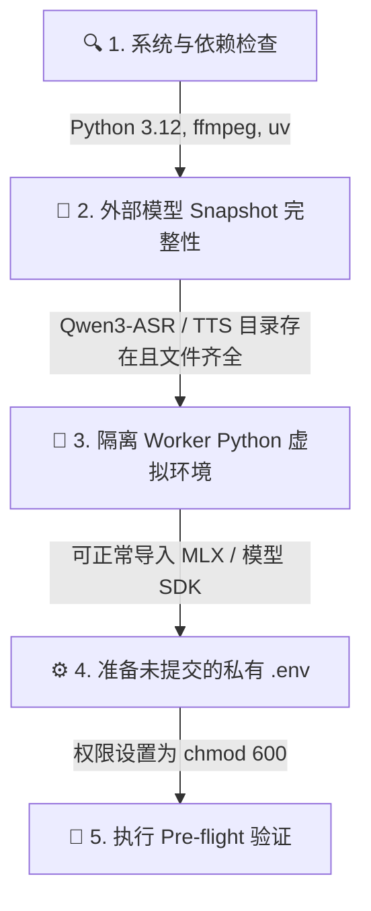
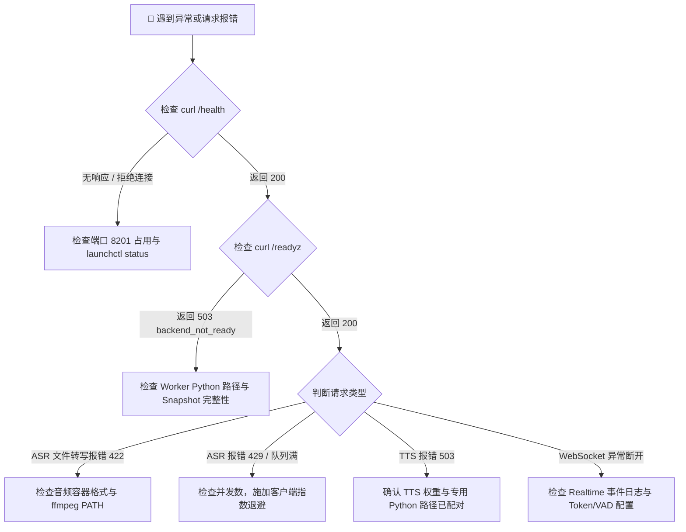
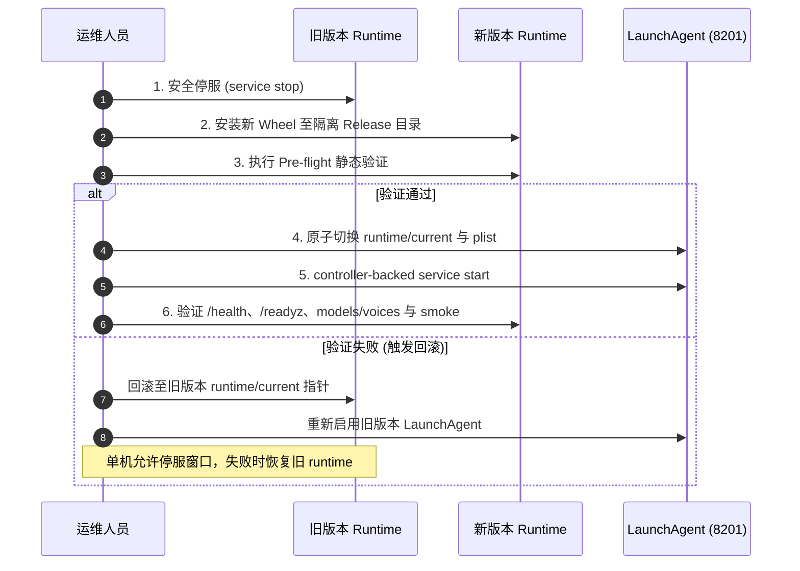

# 📖 SpeechRail 运维操作实战手册 (Runbook)

> 本 Runbook 规定了在 macOS 本机环境下部署、启动、维护、排障与回滚 SpeechRail 的标准化操作流程。

服务发布、安装、停启、切档和基准共同遵守 [本机 operator contract](../../.agents/skills/speechrail-local-deploy/references/operator-contract.md)。版本发布的 canonical 流程见 [SpeechRail 版本发布 SOP](../../.agents/skills/speechrail-release/SKILL.md)；App 的构建、签名、安装、清理和回滚见 [macOS App 分发与签名](../developers/macos-app-release.md)。本机允许完全停服和数分钟启动真空；生命周期 controller 在短等待无响应时只对已核验的精确 PID/进程组强杀。

服务与 App 是两个发布单元：`com.speechrail` LaunchAgent 负责登录常驻和 8201 服务，`SpeechRail.app` 按需打开，只通过 `com.speechrail.desktop.control` helper 控制现有服务。App 退出或升级不得影响服务；联合发布必须先服务、后 App。

---

## 1. 生产上线前就绪检查清单 (Pre-flight Checklist)



- [ ] **系统依赖**：`python3 --version` (3.12.x)、`ffmpeg -version` (在系统 `PATH` 中)、`uv --version`。
- [ ] **ASR 运行时**：外部绝对路径 `SPEECHRAIL_QWEN3_MODEL_DIR` 与专用 `SPEECHRAIL_QWEN3_PYTHON` 均存在且具备执行权限。
- [ ] **TTS 运行时 (可选)**：外部绝对路径 `SPEECHRAIL_QWEN3_TTS_MODEL_DIR` 与专用 `SPEECHRAIL_QWEN3_TTS_PYTHON` 配置完整；Quality reference clone 还需 `SPEECHRAIL_QWEN3_TTS_CLONE_MODEL_DIR` 指向 Base snapshot（managed profile 自动注入）。
- [ ] **安全边界**：`.env` 文件权限已设为 `chmod 600 .env`，且 `SPEECHRAIL_ALLOW_MODEL_DOWNLOADS=false`。

---

## 2. 生产运行与健康探针 (Health Probes)

服务启动后，通过以下探针确认系统就绪：

```bash
# 1. 进程存活检查 (Liveness Probe)
curl -s http://127.0.0.1:8201/health | jq .

# 2. 推理就绪检查 (Readiness Probe)
curl -s -i http://127.0.0.1:8201/readyz

# 3. 模型注册清单
curl -s http://127.0.0.1:8201/v1/models | jq .

# 4. 音色注册清单
curl -s http://127.0.0.1:8201/v1/voices | jq .

# 5. 运行指标 (Prometheus 文本; 加 -H 以 JSON 视图)
curl -s http://127.0.0.1:8201/metrics
curl -s -H "Accept: application/json" http://127.0.0.1:8201/metrics | jq .
```

> [!NOTE]
> `/readyz` 返回 HTTP 200 表示至少一个 ASR/TTS 模型 Worker 已完成 Snapshot 预检并准备好接收流量。发布和 profile 切换还必须检查候选 profile 所需的每个能力，以及 `/v1/models` 的 artifact/variant/quantization 身份。
> `/health` 中 `tts_ready` 表示 TTS 可按需服务，`tts_warm` 才表示权重当前已驻留；`tts_state=cold_evicted` 可以与 `tts_ready=true` 同时出现。排查单次请求时使用 access 记录的 `request_id`、`error_code`、`outcome` 和 `duration_ms`，不要依据响应体内容拼接日志。

---

## 3. macOS LaunchAgent 常驻服务管理

SpeechRail 内建了专为 macOS 设计的非 root 用户级服务管理工具：

```bash
APP_HOME="${SPEECHRAIL_APP_HOME:-$HOME/Library/Application Support/SpeechRail}"

# 1. 使用已安装 runtime 生成并安装 LaunchAgent 配置文件
SPEECHRAIL_CLI="$APP_HOME/runtime/current/.venv/bin/speechrail"
"$SPEECHRAIL_CLI" service install --app-home "$APP_HOME"

# 2. 校验 Plist 格式
plutil -lint ~/Library/LaunchAgents/com.speechrail.plist

# 3. 启动并启用常驻服务（controller-backed）
"$SPEECHRAIL_CLI" service start --app-home "$APP_HOME"

# 4. 查询服务运行状态与 PID
"$SPEECHRAIL_CLI" service status --app-home "$APP_HOME"

# 5. 安全重启服务（重新加载外部模型）
"$SPEECHRAIL_CLI" service restart --app-home "$APP_HOME"

# 6. 安全停用服务（保留配置文件）
"$SPEECHRAIL_CLI" service stop --app-home "$APP_HOME"

# 7. 完全卸载服务（删除 Plist 文件）
"$SPEECHRAIL_CLI" service uninstall --app-home "$APP_HOME"
```

---

## 4. 故障定位决策树 (Troubleshooting Decision Tree)



### 常见故障速查与处理办法

| 故障现象 | 根因定位 | 处理方案 |
|---|---|---|
| `/health` 连接拒绝 | 服务未启动或端口被占用 | 检查 `lsof -i :8201`，确保只有一个服务实例在运行 |
| `/readyz` 返回 503 | 外部 Snapshot 缺失关键权重文件或 Python 环境异常 | 校验 `validate_snapshot` 报错日志，补齐模型文件 |
| 转写请求返回 422 | 上传文件不是合法音频或系统缺失 `ffmpeg` | 确认系统 `ffmpeg` 存在，并尝试使用标准 WAV/MP3 重试 |
| 请求返回 429 `queue_full` | 并发请求超出 `MAX_QUEUE_SIZE` 配额 | 检查客户端是否发起了无界请求，按 `Retry-After` 指数退避 |
| TTS 提示 503 `backend_not_ready` | 未同时配置 TTS 模型目录与 Dedicated Python | 检查 `.env` 中 `SPEECHRAIL_QWEN3_TTS_*` 两项配置并重启服务 |
| TTS 返回 503 `backend_timeout` | 队列准入、worker 生成或流交付超过 `SPEECHRAIL_REQUEST_TIMEOUT_SECONDS` 总 deadline | 记录 `request_id`，缩短输入或分块；确认同机没有长期占用的 TTS 请求 |
| `/v1/voices` 或自定义 TTS 返回 503 `voice_store_unavailable` | `custom_voices.json` 损坏/不可读，或受控音频目录无法安全写入/清理 | 停止写入操作，先备份并逐字节保留 registry；修复 JSON 类型、`voices/` 权限或残留音频后重启并复核 `/v1/voices` |
| 删除音色返回 409 `voice_in_use` | 当前 TTS 请求仍持有该音色的读租约 | 等待请求完成或取消后再删除；不要手工删除受控 WAV |
| 删除音色返回 503 且 metadata 已消失 | JSON 提交已完成，受控音频 unlink 失败 | 保留 `custom_voices.json`，修复 `~/.speechrail/voices/` 权限/磁盘后按原 voice ID 检查并清理残留 WAV；不要回写过期 metadata |

---

## 5. 原子化升级与安全回滚 (Upgrade & Rollback)



### 标准服务发布升级步骤（managed）：
```bash
APP_HOME="${SPEECHRAIL_APP_HOME:-$HOME/Library/Application Support/SpeechRail}"

# 1. 先完成运行态快照和外部 realtime 客户端隔离
SPEECHRAIL_CLI="$APP_HOME/runtime/current/.venv/bin/speechrail"
"$SPEECHRAIL_CLI" service status --app-home "$APP_HOME"
"$SPEECHRAIL_CLI" profile status --app-home "$APP_HOME"
"$SPEECHRAIL_CLI" service preflight --app-home "$APP_HOME"

# 2. 安全停用当前旧服务，并确认 8201 lock 已释放
"$SPEECHRAIL_CLI" service stop --app-home "$APP_HOME"

# 3. 构建新版本 Wheel
uv build --no-sources --wheel

# 4. 通过 wheel 自带的唯一 managed installer 准备 active profile、preflight、plist 和 runtime/current
WHEEL="dist/speechrail-<version>-cp312-cp312-macosx_26_0_arm64.whl"
uvx --python 3.12 --from "$WHEEL" speechrail install --yes --enable

# 5. 安装器已通过 lifecycle controller 启动服务；验证端点与真实 TTS→ASR smoke
curl --fail http://127.0.0.1:8201/health
curl --fail http://127.0.0.1:8201/readyz
curl --fail http://127.0.0.1:8201/v1/models
curl --fail http://127.0.0.1:8201/v1/voices
```

安装入口只有 managed installer。它会在 staging 和切换前复用 per-port lock；服务未完全停下时不会替换
runtime/current。`--enable` 通过 lifecycle controller 注册并启动服务；若只需准备候选 runtime，省略
`--enable`，再用已安装 runtime 的 `service start` 单独启动。启动或 smoke 失败时停止候选、清理首次安装的
selection 并恢复旧指针。
发布完成后仍须核对 `/health`、`/readyz`、models/voices、PID/listener 和真实 TTS→ASR 结果。

### App 发布与联合发布

- App-only 或 Distribution 归档不执行服务停启；按 [macOS App 分发与签名](../developers/macos-app-release.md) 构建、测试、逐项签名、公证、安装和清理。
- App 安装前服务必须已经 ready；签名 Distribution App 通过 `SMAppService` 管理 `com.speechrail.desktop.control`，本机 Debug/Release 使用内嵌 `com.speechrail.desktop.local-control.xpc` 按需控制；两者都不直接调用 `launchctl`，不加载模型，不创建第二个 worker。
- 联合发布固定顺序为：服务 wheel gate → managed preflight/原子切换 → 服务 health/ready/smoke → App archive/verify/notarize → 唯一安装路径与 XPC `status`/`preflight` smoke → 退出 App 后再次确认服务仍 healthy。
- App/XPC 失败只回滚 App；服务失败按本 Runbook 的服务回滚处理。两套回退点、版本/build、签名/公证和 SHA-256 分开记录。

---

## 6. 日志与历史指标 (Logs & Rolling Metrics)

排障输入只有两类：随请求写下的日志，和每 60 秒落盘一行的历史指标。两者都由服务自己写入并轮转，
权限为目录 `0700`、文件 `0600`。

```bash
LOG_DIR="${SPEECHRAIL_LOG_DIR:-$HOME/Library/Logs/SpeechRail}"
APP_HOME="${SPEECHRAIL_APP_HOME:-$HOME/Library/Application Support/SpeechRail}"

# 1. 人读日志：时间戳 + 级别 + 模块 + 结构化字段
tail -f "$LOG_DIR/speechrail.log"

# 2. 结构化访问记录：每个请求一行 JSON（request_id / route / status / duration_ms / error_code）
tail -f "$LOG_DIR/access.jsonl"
jq -r 'select(.status >= 500) | [.timestamp, .route, .status, .error_code, .duration_ms] | @tsv' \
  "$LOG_DIR/access.jsonl"

# 3. 历史指标：按 UTC 日期分文件，默认保留 30 天
jq -c 'select(.requests.speech_total > 0) | {interval_end, requests, latency_ms}' \
  "$APP_HOME/state/metrics-rollup/"*.jsonl
```

| 文件 | 内容 | 轮转与保留 |
|---|---|---|
| `$LOG_DIR/speechrail.log` | 服务与 vendor 运行日志，含结构化字段的 `key=value` 追加 | 8 MiB × 5 份 |
| `$LOG_DIR/access.jsonl` | 结构化记录，每行一个 JSON 对象；HTTP 访问与结构化事件 | 8 MiB × 5 份 |
| `$LOG_DIR/stdout.log`、`stderr.log` | LaunchAgent 捕获的崩溃输出；正常运行时基本为空 | 由 launchd 持有，不轮转 |
| `$APP_HOME/state/metrics-rollup/YYYY-MM-DD.jsonl` | 每 60 秒一行的指标摘要（请求、音频秒数、时延分位、并发、内存、worker 状态） | 按天分文件，默认保留 30 天 |

`/metrics` 是进程内累计值，重启归零；时间跨度更长的结论只能从 `metrics-rollup` 读取。摘要行是**区间增量**
而不是累计值，`latency_ms` 的分位由直方图桶插值得到，桶宽决定精度上限；跨行求和即可得到任意跨度的
总量。相关配置键见 [运行时与部署](runtime-deployment.md#配置)。
