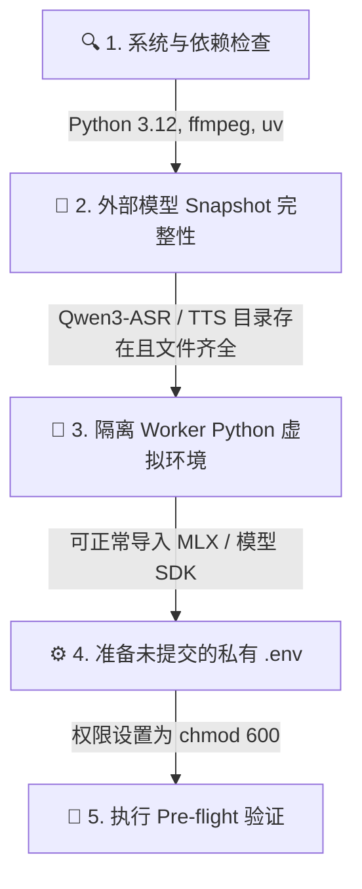
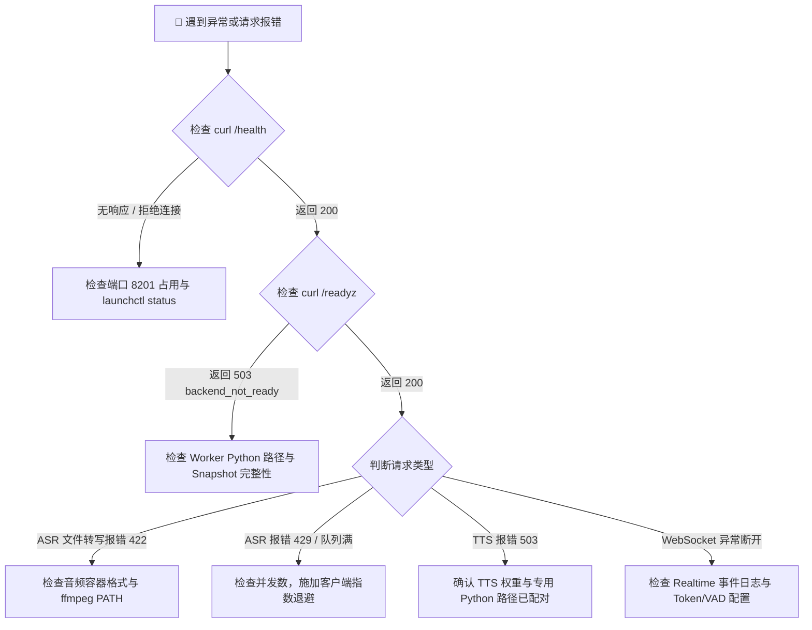
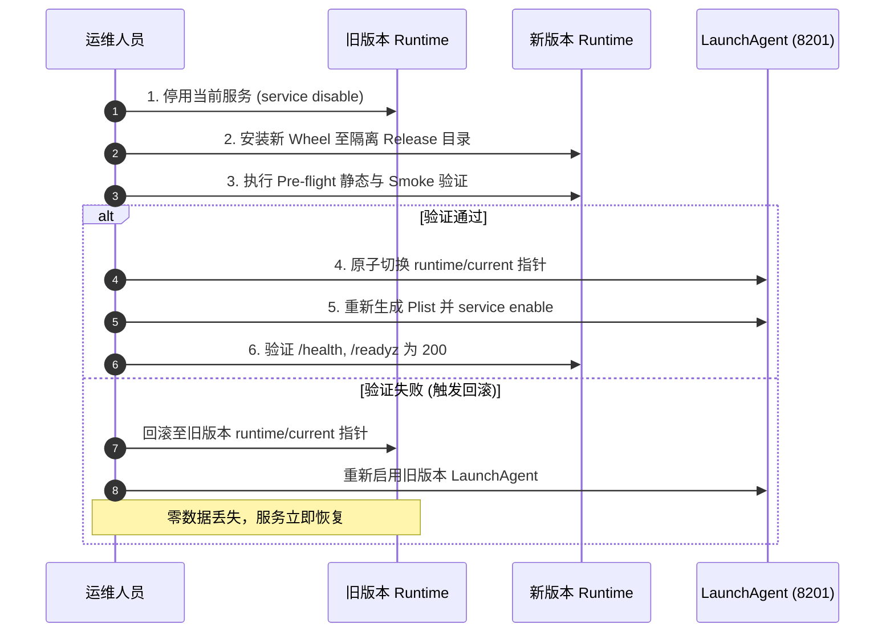

# 📖 SpeechRail 运维操作实战手册 (Runbook)

> 本 Runbook 规定了在 macOS 本机环境下部署、启动、维护、排障与回滚 SpeechRail 的标准化操作流程。

---

## 1. 生产上线前就绪检查清单 (Pre-flight Checklist)



- [ ] **系统依赖**：`python3 --version` (3.12.x)、`ffmpeg -version` (在系统 `PATH` 中)、`uv --version`。
- [ ] **ASR 运行时**：外部绝对路径 `SPEECHRAIL_QWEN3_MODEL_DIR` 与专用 `SPEECHRAIL_QWEN3_PYTHON` 均存在且具备执行权限。
- [ ] **TTS 运行时 (可选)**：外部绝对路径 `SPEECHRAIL_QWEN3_TTS_MODEL_DIR` 与专用 `SPEECHRAIL_QWEN3_TTS_PYTHON` 配置完整。
- [ ] **安全边界**：`.env` 文件权限已设为 `chmod 600 .env`，且 `SPEECHRAIL_ALLOW_MODEL_DOWNLOADS=false`。

---

## 2. 生产运行与健康探针 (Health Probes)

服务启动后，通过以下探针确认系统就绪：

```bash
# 1. 进程存活检查 (Liveness Probe)
curl -s http://127.0.0.1:8201/health | jq .

# 2. 推理就绪检查 (Readiness Probe)
curl -s -i http://127.0.0.1:8201/readyz

# 3. 模型注册清单
curl -s http://127.0.0.1:8201/v1/models | jq .

# 4. 音色注册清单
curl -s http://127.0.0.1:8201/v1/voices | jq .
```

> [!NOTE]
> `/readyz` 返回 HTTP 200 表示至少一个 ASR/TTS 模型 Worker 已完成 Snapshot 预检并准备好接收流量。

---

## 3. macOS LaunchAgent 常驻服务管理

SpeechRail 内建了专为 macOS 设计的非 root 用户级服务管理工具：

```bash
# 1. 生成并安装 LaunchAgent 配置文件 (~/Library/LaunchAgents/com.speechrail.plist)
uv run speechrail service install

# 2. 校验 Plist 格式
plutil -lint ~/Library/LaunchAgents/com.speechrail.plist

# 3. 启动并启用常驻服务
uv run speechrail service enable

# 4. 查询服务运行状态与 PID
uv run speechrail service status

# 5. 重启服务（重新加载外部模型）
uv run speechrail service restart

# 6. 停用服务（保留配置文件）
uv run speechrail service disable

# 7. 完全卸载服务（删除 Plist 文件）
uv run speechrail service uninstall
```

---

## 4. 故障定位决策树 (Troubleshooting Decision Tree)



### 常见故障速查与处理办法

| 故障现象 | 根因定位 | 处理方案 |
|---|---|---|
| `/health` 连接拒绝 | 服务未启动或端口被占用 | 检查 `lsof -i :8201`，确保只有一个服务实例在运行 |
| `/readyz` 返回 503 | 外部 Snapshot 缺失关键权重文件或 Python 环境异常 | 校验 `validate_snapshot` 报错日志，补齐模型文件 |
| 转写请求返回 422 | 上传文件不是合法音频或系统缺失 `ffmpeg` | 确认系统 `ffmpeg` 存在，并尝试使用标准 WAV/MP3 重试 |
| 请求返回 429 `queue_full` | 并发请求超出 `MAX_QUEUE_SIZE` 配额 | 检查客户端是否发起了无界请求，按 `Retry-After` 指数退避 |
| TTS 提示 503 `backend_not_ready` | 未同时配置 TTS 模型目录与 Dedicated Python | 检查 `.env` 中 `SPEECHRAIL_QWEN3_TTS_*` 两项配置并重启服务 |

---

## 5. 原子化升级与安全回滚 (Upgrade & Rollback)



### 标准发布升级步骤：
```bash
# 1. 停用当前旧服务
uv run speechrail service disable

# 2. 构建新版本 Wheel
uv build --no-sources --wheel

# 3. 执行本地安装器部署（指向专用 app-home）
python3 tools/install_macos.py \
  --wheel dist/speechrail-x.y.z-py3-none-any.whl \
  --env-file /path/to/private/.env \
  --app-home "$HOME/Library/Application Support/SpeechRail" \
  --enable

# 4. 验证新版本端点
curl http://127.0.0.1:8201/health
curl http://127.0.0.1:8201/readyz
```
