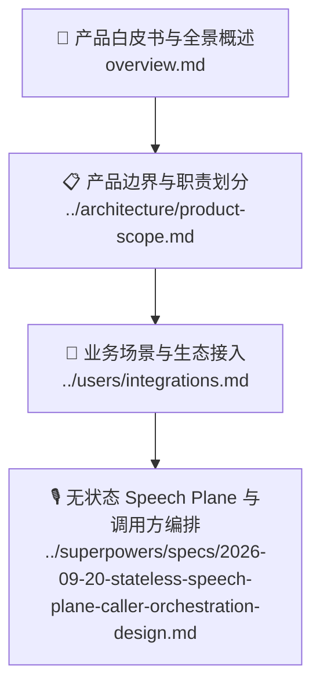

# 🎯 产品与业务文档中心

欢迎来到 SpeechRail 的产品与业务文档中心。本目录专为**产品经理 (PM)**、**技术决策者**及**业务规划方**设计，旨在帮助您全面理解 SpeechRail 的产品定位、核心价值、适用场景、能力边界与演进路线。

---

## 📑 推荐阅读路径

1. **[🌟 产品全景概述与白皮书](overview.md)**：深入了解产品愿景、电梯演讲、核心价值主张、用户角色旅程与典型落地场景。
2. **[📋 产品边界与职责划分](../architecture/product-scope.md)**：明确 SpeechRail “拥有什么”与“不拥有什么”，掌握系统协作与集成边界。
3. **[🔌 业务场景与生态接入](../users/integrations.md)**：探索 QwenPaw、Sona 会议助理、Hermes Agent 等生态应用的集成实践与价值转化。
4. **[🎙️ 无状态 Speech Plane 与调用方编排](../superpowers/specs/2026-09-20-stateless-speech-plane-caller-orchestration-design.md)**：定义当前 Realtime 责任边界、MCP 代理边界和 Native 端助手编排。

---

## 🧭 核心业务价值一览

| 核心维度 | 传统云端 API / 重型方案 | SpeechRail 本地优先方案 | 业务收益 |
|---|---|---|---|
| 🔒 **数据隐私与合规** | 音频上传云端，面临合规与数据外泄风险 | 服务默认本机处理且不持久化原始音频；App 会话文字、纪要、记忆和作品按本地数据契约保存 | 为本地部署和数据边界清晰的场景提供基础；具体合规仍由部署者验收 |
| ⚡ **推理与响应延迟** | 受限于公网网络波动与云端排队 | Apple Silicon 本地处理；交互延迟按 runtime、设备和对应验收报告核定 | 为低延迟交互提供可控基础，不承诺未经验收的固定指标 |
| 💰 **运营基础设施成本** | 按 Token / 调用时长持续计费，成本不可预测 | 服务本体不产生按量云端语音推理账单；App 若配置外部 LLM，费用由该端点决定 | 降低本地语音处理的边际成本，外部 LLM 成本单独核算 |
| 🔌 **生态集成与迁移** | 专有 SDK 绑定，改造成本高昂 | OpenAI REST 语音子集 + current-only Realtime Speech Plane | REST 可按契约接入；Realtime 调用方需实现 LLM、历史、播放和 barge-in 编排 |

---

> [!TIP]
> 如需进一步了解具体技术实现与架构设计，请参考 [🏛️ 架构设计文档](../architecture/README.md)；若需进行 API 调试与集成，请参阅 [🔌 用户与集成指南](../users/README.md)。
