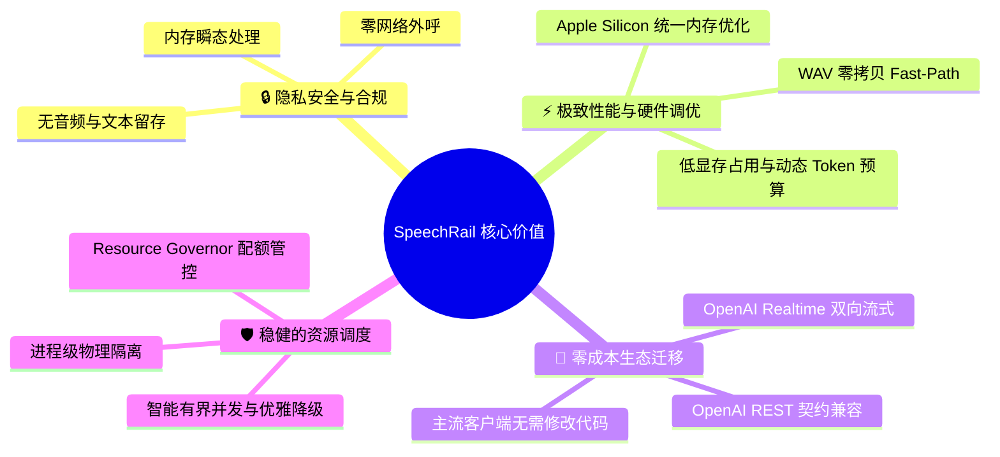
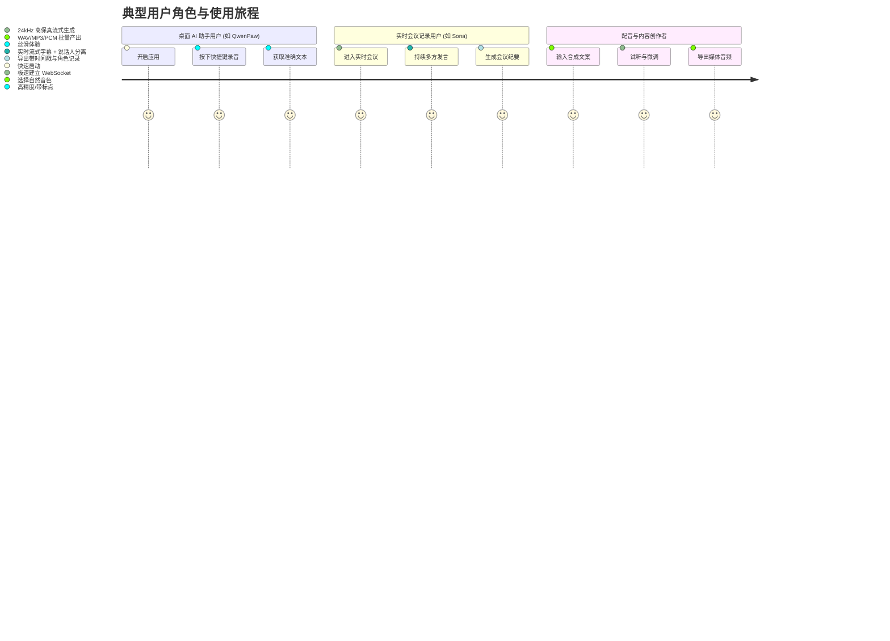
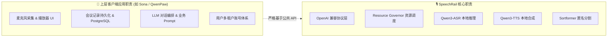
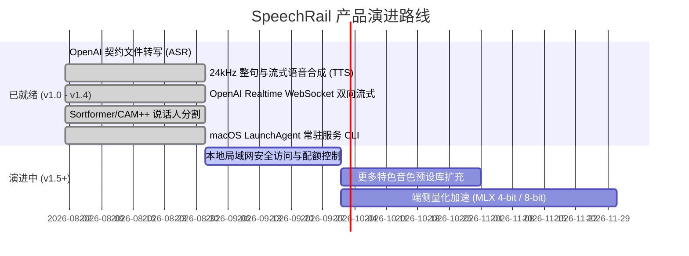

# 🌟 SpeechRail 产品全景白皮书

> **产品定位**：面向 macOS (Apple Silicon) 本机应用的高性能、隐私优先、OpenAI 契约全兼容的独立语音识别 (ASR) 与合成 (TTS) 运行时服务。
> **中文名称**：声轨 (SpeechRail) &nbsp;|&nbsp; **技术标识**：`speechrail`

---

## 🎯 1. 产品愿景与电梯演讲 (Elevator Pitch)

对于需要高质量语音识别与合成能力的**端侧 AI 应用**（如会议助理、桌面智能体、配音工具、无障碍辅助等），**SpeechRail** 是一个**轻量、高效、本地优先的共享语音引擎**。

与传统的“调用云端闭源语音 API”（产生昂贵账单且存在隐私泄露隐患）以及“各自应用内嵌臃肿模型运行时”（造成显存与内存重复争抢崩溃）不同，SpeechRail 提供了**统一的单机多应用共享运行时**，具备**零外网依赖的绝对隐私安全**、**针对 Apple Silicon 统一内存的硬件级极速推理**，以及**与 OpenAI Audio / Realtime 100% 兼容的标准接口**。

---

## 💎 2. 核心价值主张 (Value Propositions)

### 🔒 1. 绝对隐私与企业级合规 (Privacy-First & Offline)
- **零外部网络外呼**：模型快照完全本地加载，服务强制开启离线安全沙箱，杜绝数据出境。
- **瞬态数据生命周期**：音频仅在内存流水线中处理，推理完成即释放，不留存任何原始音频或中间 PCM。
- **最小化日志审计**：日志中仅记录 Request ID、时长与耗时指标，严禁打印原始音频与转写正文。

### ⚡ 2. Apple Silicon 硬件级性能 (Apple Silicon Accelerated)
- **统一内存深度优化**：ASR 与 TTS 原生适配 MLX 与 MPS（ASR 支持 `float16`/`int8`；TTS 默认 `float16`/`float32`，预量化 `-8bit` 快照自动解析为 `int8`），单模型显存占用低至 3GB。
- **全链路极速吞吐**：WAV 容器 Fast-Path 直读避免转码开销；端到端流式转写首字延迟低至百毫秒级。
- **整句高质量合成**：VoiceDesign 驱动 24 kHz 高保真自然语音生成，支持多语种与丰富预设音色。

### 🔌 3. 标准兼容与无缝接入 (Zero-Migration Cost)
- **Drop-in 替换**：全面兼容 OpenAI `/v1/audio/transcriptions`、`/v1/audio/speech` 及 `/v1/realtime`。
- **开箱即用**：标准 `openai` Python/Node SDK、QwenPaw、Sona、Dify、Open-WebUI 仅需配置 `base_url` 即可接入。

### 🛡️ 4. 稳健的单机多应用调度 (Multi-App Resource Governor)
- **物理进程隔离**：主 HTTP 服务与推理 Worker 物理分离，模型崩溃不波及服务 API。
- **流量调度与背压**：内置 Resource Governor，自动协调实时流式与批量任务，防止显存过载或系统卡死。

---

## 👥 3. 目标用户画像与角色旅程 (User Personas & Journeys)

### 画像一：桌面智能体与语音输入用户 (Desktop Agents)
- **典型应用**：QwenPaw、Hermes Agent、本地听写工具。
- **核心诉求**：随时按下快捷键说话，极速返回精准转写文本；绝不上传麦克风录音至云端。
- **SpeechRail 解法**：通过 `/v1/audio/transcriptions` 或 `whisper-1` 别名直连，秒级返回识别结果。

### 画像二：沉浸式会议与协同办公用户 (Meeting & Collaboration)
- **典型应用**：Sona 会议助理、团队协作套件。
- **核心诉求**：长时间连续会议流式字幕、说话人分离（Diarization）、低延迟无缝对齐。
- **SpeechRail 解法**：通过 `/v1/realtime` 提供全双工流式 ASR、Server VAD 及 Sortformer/CAM++ 匿名声纹分割。

### 画像三：内容创作者与自动化配音系统 (Content Creators)
- **典型应用**：播客生成器、小说朗读器、短视频配音脚本。
- **核心诉求**：多情感、多角色、高保真自然声音输出，支持长文案与流式断句播放。
- **SpeechRail 解法**：通过 `/v1/audio/speech` 输出 24 kHz 广播级音频，提供 `warm`、`calm`、`bright` 等预设音色。

---

## 📊 4. 业务场景与能力矩阵 (Capability Matrix)

| 业务场景 | 对应核心能力 | 接口入口 | 性能基准指标 | 适配客户端 / 工具 |
|---|---|---|---|---|
| **录音速记 / 播客转写** | 批量文件 ASR、分段与时间戳 | `POST /v1/audio/transcriptions` | RTF < 0.15 (10分钟音频约90秒完成) | QwenPaw, OpenAI SDK, cURL |
| **实时会议字幕与纪要** | 流式 ASR + 匿名声纹分离 | `WS /v1/realtime` (transcription) | 首字延迟 < 200ms，DER < 12% | Sona, Pipecat |
| **全双工语音助手** | Server VAD + 打断 + 流式 TTS | `WS /v1/realtime` (full-duplex) | 打断响应 < 50ms，TTS 流式平滑输出 | 智能桌面 Assistant, Sona |
| **高保真文案朗读** | 24kHz 整句/分段语音合成 | `POST /v1/audio/speech` | RTF < 0.35, 输出格式 PCM/WAV/MP3 | 听书工具, 配音工作流 |
| **长音频异步离线处理** | 任务队列与 Spool 调度 | `POST/GET/DELETE /v1/jobs` | 队列削峰填谷，防 OOM | 后台自动化任务, SRE 批处理 |

---

## 🚫 5. 产品边界与明确非目标 (Scope & Non-Goals)

为确保 SpeechRail 专注于做小、做强、做稳本地语音引擎，以下职责被明确划定在**产品范围之外**，由上层调用方应用自行负责：

- ❌ **不做麦克风录音与扬声器播放**：客户端自行采集音频并发送，SpeechRail 仅负责推理计算。
- ❌ **不做会议管理与关系数据库**：会议 ID、说话人实名映射（如将 `spk_0` 映射为“张三”）、历史存档均属于客户端应用资产。
- ❌ **不做多租户云端平台**：系统专为单人本机设计，不预留复杂的分布式服务网格或多租户账单系统。
- ❌ **不做 LLM 业务对话编排**：SpeechRail 是纯粹的语音基建，不混合 Prompt 工程或大语言模型聊天上下文。

---

## 🗺️ 6. 产品发展路线图 (Product Roadmap)

---

> [!NOTE]
> 了解更多技术细节？欢迎查阅 [🏛️ 系统架构设计](../architecture/architecture.md) 与 [🔌 开发者开发指南](../developers/development-guide.md)。
