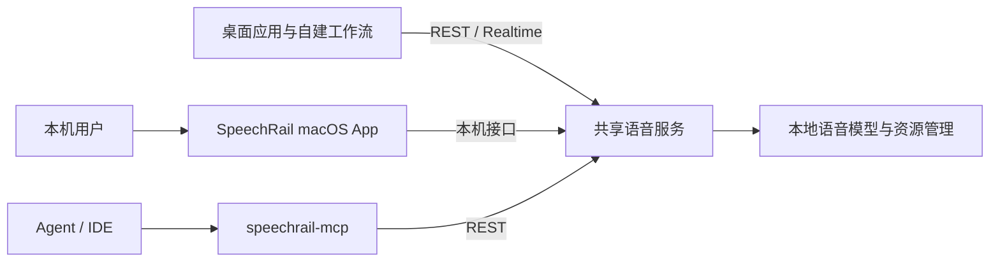

# SpeechRail 产品白皮书与全景概述

SpeechRail 面向单人 Apple Silicon Mac，提供原生语音创作与会话应用，以及供本机应用共享的语音识别、合成和音色服务。用户可以在 macOS App 中配音、管理音色、使用语音助手、记录会议、显示字幕和准备口播稿；开发者可以通过 REST、Realtime WebSocket 或 MCP 接入同一套语音能力。

产品由原生 App、共享语音服务和 MCP 代理组成。语音模型在本机服务中运行；App 和第三方客户端负责各自的界面、音频采集、播放、记录和 AI 业务编排。功能是否可用由已准备的模型、配置、权限及服务公布的有效能力共同决定。

## 1. 产品组成与价值

| 组成 | 面向谁 | 提供什么 | 职责边界 |
|---|---|---|---|
| macOS App | 内容创作者、本机语音用户 | 创作、会话与引擎管理界面 | 调用服务；负责功能内的采集、播放、本机记录和 LLM 编排，不加载语音模型 |
| 共享语音服务 | App、桌面工具和自建工作流 | 识别、合成、音色管理、可选对齐与匿名说话人分离 | 管理模型与资源、校验请求并交付结果，不保存助手对话上下文或代管业务流程 |
| `speechrail-mcp` | Agent、IDE 与 MCP 客户端 | 能力发现及请求级语音、音色和任务工具 | 无状态 REST 代理，不加载模型或持有 Realtime WebSocket |

共享服务将模型加载、资源准入、协议适配和故障诊断集中到一个本机运行边界，减少多个应用分别维护语音运行时的成本。App 为用户提供直接可操作的工作流程，接口则让其他工具复用相同的音色身份、能力发现和错误规则。

```mermaid
flowchart LR
    User[本机用户] --> App[SpeechRail macOS App]
    Client[桌面应用与自建工作流] -->|REST / Realtime| Service[共享语音服务]
    Agent[Agent / IDE] --> MCP[speechrail-mcp]
    App -->|本机接口| Service
    MCP -->|REST| Service
    Service --> Models[本地语音模型与资源管理]
```

## 2. 原生 App 的功能与使用场景

App 按用户任务分为“创作”“会话”“引擎”三组。入口名称与分组来自 [App 导航定义](../../macos/SpeechRailApp/SpeechRailApp/AppRoute.swift)；页面存在表示产品提供该工作流，执行所需能力仍以服务发现、权限和具体请求校验为准。

| 分组 | 功能 | 用户完成的任务 |
|---|---|---|
| 创作 | 配音台 | 输入文稿、选择音色、生成与试听音频 |
| 创作 | 音色创作、音色克隆 | 用描述设计候选音色，或用参考录音创建可复用音色；按对应流程确认、验证和保存 |
| 创作 | 音色库、我的作品 | 管理音色与生成作品，回听、导出或删除作品 |
| 会话 | 语音助手 | 通过语音与文字对话；App 将识别、LLM 回复与语音播放串成一条会话流程 |
| 会话 | 会议助手 | 采集选定来源、形成转写并保存本机会议记录；说话人信息按启用能力提供 |
| 会话 | 实时字幕 | 显示字幕带，并在本机记录库中回看、搜索与导出文字 |
| 会话 | AI 提词器 | 粘贴或导入稿件，在独立窗口中手动提词；按需使用 AI 整理与语音跟随 |
| 引擎 | 服务状态、运行监控 | 查看服务是否可用、请求耗时、失败情况和模型驻留状态 |
| 引擎 | 模型组合、诊断、开发者文档 | 准备和选择识别/配音模型，处理故障并获取接入信息 |

创作者可以从文稿和音色开始生成作品，再试听与导出；需要自己的声音时使用克隆流程。音色候选的参考验证、实际合成验证与人工听审各有独立作用，正式作品应使用通过相应质量要求的音色。

会议、字幕和助手共用服务的识别能力，但由 App 保持各自的会话与记录。麦克风、系统音频采集和播放设备按功能启用，停止后释放；字幕或转写结果不自动构成会议纪要、实名身份或助手回复。

提词器可以直接使用原稿并手动阅读。AI 整理与语音跟随由用户显式开启；整理稿由人阅稿确认，语音跟随不能取代手动控制。稿件处理和舞台能力见 [AI 提词器说明](../developers/macos-app-teleprompter.md)。

## 3. 共享语音能力与集成方式

| 能力 | 入口 | 使用条件与交付范围 |
|---|---|---|
| 文件转写 | `POST /v1/audio/transcriptions` | 接收契约允许的音频文件，返回所选格式的文字及可用时间戳；格式、长度和输出参数在请求边界校验 |
| 实时识别 | `WS /v1/realtime` | 接收音频缓冲，交付可修订识别结果、分段信息及转写终态；调用方维护采集与文本展示 |
| 语音合成 | `POST /v1/audio/speech` | 将稳定文本按所选音色合成为音频；格式、速度和其他参数以该音色对应的操作能力为准 |
| 增量合成 | Realtime 的 `speechrail.tts.*` 事件 | 调用方追加稳定文本并处理音频消费确认、取消和播放；服务提供有界生成与交付 |
| 音色设计、克隆与管理 | VoiceDesign、voice 与 namespaced 管理接口 | 设计、参考确认、验证、发布和 revision 管理遵循各自契约；候选不自动等同于可用于正式作品的音色 |
| 对齐与匿名说话人分离 | 对应文件输出及 Realtime 扩展 | 显式启用并具备所需制品和就绪条件；对齐与分人独立门控，只输出约定的时间信息和会话内匿名标签 |
| 异步任务 | `/v1/jobs` 与任务查询、结果、取消接口 | 用于符合任务契约的长请求；须具备相应队列、执行器与本地输入引用条件 |
| 能力与运行诊断 | 有效能力快照、健康与监控接口；MCP `describe()` | 返回能力、音色、参数和运行事实，帮助调用方决定请求方式；发现成功不预留推理资源 |

REST 采用契约声明的 OpenAI 语音接口子集；Realtime 使用声明的事件子集与 `speechrail.*` 扩展。兼容范围以 [OpenAPI](../../contracts/openapi.yaml) 和 [Realtime ASR/TTS 协议契约](../../contracts/realtime-openai.md)为准。第三方客户端需要遵循这些具体接口，客户端名称或上游 SDK 支持某项功能不构成 SpeechRail 的支持承诺。

Realtime 只承担语音处理。LLM、提示词、对话历史、工具调用、句子队列和打断播放策略由 App 或其他调用方负责。WebSocket 可以双向传输；实时对讲、回声处理、双讲与打断体验还取决于模型准入、设备、音频链路和客户端实现，须按有效能力与联合验收结论判断。

MCP 提供请求级工具。实时字幕或语音会话客户端直接建立 WebSocket，不通过 MCP 获得持续音频连接。接入方式见 [客户端指南](../users/integrations.md) 与 [MCP 集成指南](../users/mcp-agent-integration.md)。

## 4. 模型规格与能力选择

ASR 与 TTS 分别选择 `fast`、`quality`、`reference`，可以混搭。App 的预置组合是同时填写两项规格的快捷方式，规格不绑定某类用户或业务场景。

下表描述仓库 [model catalog](../../src/speechrail/assets/model-catalog.json) 中的模型组成；它不表示当前设备已下载、已加载或已通过质量验收。

| 规格 | ASR | TTS 系统声音与参考克隆 |
|---|---|---|
| `fast` | 0.6B，8-bit | 0.6B CustomVoice 与 Base，8-bit |
| `quality` | 1.7B，8-bit | 1.7B CustomVoice 与 Base，8-bit |
| `reference` | 1.7B，BF16 | 1.7B CustomVoice 与 Base，BF16 |

系统声音由 CustomVoice 处理，参考克隆由 Base 处理。VoiceDesign 使用独立的 1.7B BF16 设计制品，与 TTS 规格无关；任一 TTS 规格在该制品已供给且相应操作可用时都可进入音色设计流程。对齐和匿名分人按任务启用，不由规格名称自动开启。

模型大小、权重精度和规格名称用于描述运行组合，选择时需要结合目标语言、素材、可用资源及对应验收证据。BF16 不自动证明识别更准、声音更自然或延迟更低，`fast` 也不构成固定响应时间承诺。

服务由一个 ASGI worker 运行，重计算按资源预算准入。同一能力 lane 串行；跨 lane 并发须具备明确的独立能力与资源证据，预算不足或峰值缺失时按串行策略处理。文件 ASR 与流式 ASR 冲突返回 `backend_busy`。模型共享支持多应用接入，具体请求仍受资源和生命周期约束。

## 5. 部署、数据与隐私边界

服务与 App 的交付平台为 Apple Silicon `arm64`、macOS 26.0 及以上。服务和 App 分别安装：唯一的 `com.speechrail` 用户级 LaunchAgent 运行语音服务，App 通过受约束的控制接口管理它。退出 App 不会卸载或替换服务，安装 App 也不等于已安装模型和服务。

模型准备与推理请求是独立操作。安装和显式模型准备可联网获取锁定制品；识别与合成请求从本机模型加载，不在请求路径下载模型、读取远程音频 URL 或静默外呼。App 的语音助手与 AI 整稿使用用户配置的 LLM 端点，所提交的文字、联网行为和费用取决于该端点及调用设置。

服务默认绑定 loopback。非 loopback 暴露需要配置 Bearer 鉴权及明确的 origin 策略；网络开放和远程客户端的数据边界须单独确定。

数据保存按用途区分：

- 会话采集的 PCM 默认不落盘；文字与会话记录保存在本机，提词器稿件与作品按各自存储流程保存。
- 克隆参考素材、自定义音色制品和生成音频属于用户数据，可按对应流程持久化；临时克隆录音与 MCP 临时交付物按其生命周期清理。
- API key、原始音频、完整转写、完整 prompt 和 embedding 不进入普通日志。实名映射和跨会话身份不由服务端分人管理。
- 显式启用的 ASR 排障录音使用限时、有上限的诊断开关；默认关闭，复现后清理，不能作为常规会话存储。

这些边界用于说明实际的数据流和保存责任。第三方应用如何采集、转发、保存或分享结果由该应用的实现与用户设置决定；本机语音处理不构成企业合规认证。

## 6. 可用性与质量判断

功能声明、请求准入、结果交付和质量验收分别提供不同证据：

| 判断 | 依据 | 能得出的结论 |
|---|---|---|
| 某项操作是否可用 | `effective_capabilities_v1` 的对应操作、模型、音色和参数域 | 可以按声明条件请求该能力，资源准入仍在实际请求时发生 |
| 音色能否路由 | 音色的 `available` 与原因字段 | 音色在该快照下可按需服务，不证明声音质量 |
| 音色能否用于正式制作 | 当前绑定的输出验证、`production_ready` 与必要人工听审 | 证据覆盖对应音色、模型、运行时与验证策略，不自动覆盖所有文本和场景 |
| 音频是否交付或播放完成 | 对应协议回执，以及客户端自己的播放状态 | 服务端交付与客户端播放分别判断；连接结束或生成完成不能证明用户已听到全部内容 |
| 目标场景质量与稳定性是否满足要求 | 带日期、版本、设备、样本和负载条件的专项验收 | 在报告覆盖条件下评估识别、数字读法、声音自然度、分人、取消与长时运行表现 |

语音服务本体不按云端语音调用次数计费，但需要本机磁盘、内存与计算资源；外部 LLM 和其他外部服务的费用另计。实际性能取决于设备、运行组合、输入长度、冷/热状态和并发负载，本文不提供固定 SLA、统一内存数字或无条件质量评级。

能力语义见 [有效能力快照](../users/effective-capabilities.md)，专项验证范围见 [测试与验收](../developers/testing-acceptance.md)。产品路线与阶段进度以对应决策、计划和带日期的验收记录为准。

## 7. 进一步阅读

- [安装与首次使用](../users/installing-speechrail.md)：发布制品、模型准备、服务与 App 安装。
- [macOS App 开发与功能边界](../developers/macos-app-development.md)：创作、会话和引擎的职责与生命周期。
- [系统总体架构](../architecture/architecture.md)：服务分层、worker、资源管理与接口边界。
- [公共 API 契约手册](../users/api-contract.md)、[OpenAPI](../../contracts/openapi.yaml)、[Realtime 契约](../../contracts/realtime-openai.md)：接口、参数与错误规则。
- [MCP 架构与接口契约](../architecture/speechrail-mcp-proxy.md)：Agent 工具、能力发现和代理边界。
