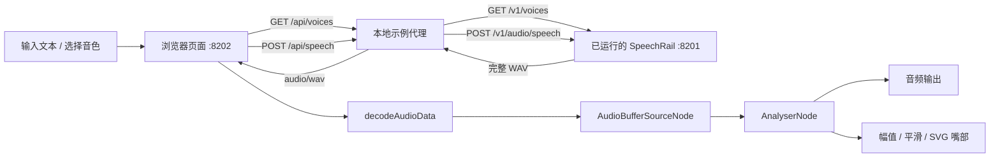

# 卡通数字人 Example 实施计划

> **For agentic workers:** 使用本会话可用的 `executing-plans` 技能逐任务执行；用下方复选框记录进度。默认单 Agent 串行，只有用户明确授权才启用子代理。

**Goal:** 新增可本地启动的 `examples/cartoon-avatar/`：用户输入文字、选择 SpeechRail 当前可用音色，由原创 2D 卡通人物配合音频完成播报。

**Architecture:** 浏览器负责人物、交互、播放和动画；独立 FastAPI 示例进程负责静态资源及两个固定 HTTP 代理端点，调用已运行的 SpeechRail。接收完整 WAV 后通过 Web Audio 播放，以播放节点的时域幅值驱动嘴部；所有音频仅驻留内存。

**Tech Stack:** Python `>=3.12,<3.13`、项目现有 FastAPI / httpx / uvicorn / Pydantic，原生 HTML / CSS / SVG / JavaScript ES modules，Web Audio API，pytest、Node 22+ 内置测试运行器。无前端构建步骤、CDN、第三方人物运行库或新增 Python 依赖。

**Spec:** 本文“已确认的设计与验收范围”记录本次对话已确认的设计，作为执行依据；本轮已按本文实施，状态与验收勾选以当前实测为准。

**Status:** implemented and verified; viewport-fit layout refined and verified · **Date:** 2026-09-06 · **Baseline:** `a4c62d7` / `main`，实施分支 `feature/cartoon-avatar`。

**Execution note:** 示例代理、前端、测试和 README 已完成；fake 上游与 Chromium、Safari 桌面/窄屏交互检查已通过。通过运行时 `.env` → `/Users/hrygo/.zshrc` 的单一来源桥接启动示例后，真实 TTS smoke 也已通过：Chromium `152.0.7977.82` 页面完成固定短句生成、播放、自然结束和停止检查；成功代理响应为 `200 audio/wav`、`134444` bytes，request ID 为 `req_05a79401aa9b4acc89c0ef8b8b2c18ba`。本次布局优化后，CDP 在 `1440×900`、`390×844`、`390×667`、`320×568` 均核验 `scrollWidth/clientWidth` 与 `scrollHeight/clientHeight` 相等，头像矩形未超出舞台，页面说明文字已移除。未保存原始音频或输出 API key。

**Product Roadmap:** [卡通数字人产品迭代路线图](../../../examples/cartoon-avatar/ROADMAP.md)。路线图描述首版之后的候选阶段，不扩大本文首版实施范围。

## Global Constraints

- Python 固定为 `>=3.12,<3.13`，使用 `uv` 和 PEP 621。
- 只新增示例及其测试，并更新本计划的实施状态。保留现有 `README.md`、`README.zh-CN.md` 和 `examples/autobiography-video/` 未提交改动。
- 不修改 `src/`、公共 `contracts/`、模型配置、LaunchAgent、已有 examples 或根目录依赖；不切换 profile、不下载/加载模型、不重启 SpeechRail。
- 示例只绑定 `127.0.0.1`，默认端口 `8202`；端口占用时清晰失败，用户可通过 `--port` 指定其他端口，不自动结束现有进程。
- 示例进程是 HTTP 客户端，不导入 SpeechRail 推理组件、不创建 worker、不承载第二个 SpeechRail 服务。
- 前端素材随示例提供；正文、音频和密钥不持久化，不输出到日志、测试报告或 URL，不使用 localStorage 存储输入。
- API key 从既有进程环境 `SPEECHRAIL_API_KEY` 读取，不写入文件，不传给浏览器；无 key 时不附加 Authorization。
- 本机启动和模型推理的实测记录与 fake 测试分开；运行态操作仅限示例与只读健康核验，不部署或切换 SpeechRail。
- 持久化命令均为原生命令；仓库根目录是下文命令的工作目录。

## 已确认的设计与验收范围

### 交互和视觉

1. 一个原创、亲和的半身卡通人物：圆润面部、清晰眼睛和嘴部、简洁服装；人物由内联 SVG 分组绘制，支持换色和后续替换形象。
2. 桌面采用人物舞台与控制面板双栏；窄屏采用人物在上、控制在下。配色为暖白底、深色文字、青绿色强调色；中文系统字体，不下载字体。
3. 控制面板提供文本框、字符计数、音色选择、“开始播报”“停止”“刷新音色”和状态提示。首次打开不发声、不请求麦克风。
4. 请求期间显示“正在生成语音”；真正调用音频播放节点后显示“正在播报”。失败显示可理解的中文说明和可复制 request ID；输入保留以便重试。
5. 待机时眨眼、轻微呼吸；播放时嘴部随实际声音幅值开合。静音、停止、结束及错误时嘴部闭合。支持 `prefers-reduced-motion`：关闭装饰性眨眼、呼吸及摆动，保留必要的状态显示与嘴部反馈。
6. 人物始终可见。SpeechRail 不可达或没有可用音色时，禁止开始播报，展示恢复提示及刷新入口；不伪造连接成功或可用音色。

### 首版边界和明确取舍

- 首版是文字驱动的卡通播报员；不接麦克风、ASR、LLM 对话、Realtime、视频导出、Live2D 或 3D 骨骼。
- 使用完整 WAV 播放；首音延迟包含整段 TTS 生成与下载时间。示例将文本限制为 **1–600 个 Unicode 码点**，小于公共 API 的 4096 上限，以控制首次体验和音频内存。
- 嘴部是声音幅值驱动的动画，不是音素识别或精确唇形同步，不生成逐字时间戳或伪造字幕对齐。
- “停止”立即停止本页面音频、取消浏览器 fetch 并忽略迟到结果；HTTP 断连不作为后端推理已取消的证据。旧请求仍在服务端处理时，新请求允许返回忙碌提示，不自动无限重试。
- 根 README 的示例入口可在后续明确授权且能够安全分离现有改动时补充；首版通过独立 README 交付。

### 数据流



## 调查依据与证据边界

2026-09-06 已读取以下当前仓库事实；执行前对有变化的文件重新核验：

- `pyproject.toml`：上述 Python 范围；已有 FastAPI、httpx、uvicorn、Pydantic 和 pytest，无需引入新的应用依赖。
- `contracts/openapi.yaml`：`GET /v1/voices` 返回 object 为 list、data 为音色数组的 JSON；音色具有 `id`、`name`、`is_default`、`available`。`POST /v1/audio/speech` 接受 `model/input/voice/response_format`，支持 `wav`。
- `src/speechrail/http/routes/audio.py::_SpeechHTTPBody`：正文 1–4096 字符，正文和 voice 去除首尾空白并拒绝空白值。
- `src/speechrail/http/routes/system.py::_voice_entry`：音色可用性取决于运行就绪及当前权重绑定，不能把登记过音色视为可用。
- `docs/developers/testing-acceptance.md`：确定性测试用 fake backend；代码交付需完整 gate，真实模型另做 smoke。
- 图索引对上述路径未记录覆盖缺口，相关结论同时核对了契约或源代码；这不是对全仓库完整性的声明。
- 已核验本机 SpeechRail 的 health、readyz 和可用音色数量；示例 fake 上游与 Chromium、Safari 交互已实测。未读取或输出任何真实 API key；真实 TTS 已通过安全环境桥接完成 smoke，见 Execution note。

浏览器接口依据（2026-09-06 查阅）：

- [MDN getFloatTimeDomainData](https://developer.mozilla.org/en-US/docs/Web/API/AnalyserNode/getFloatTimeDomainData)：读取当前音频时域采样，用于计算 RMS。
- [MDN AudioContext.resume](https://developer.mozilla.org/en-US/docs/Web/API/AudioContext/resume)：恢复暂停的音频上下文；在用户点击处理器中创建/恢复上下文。
- [MDN decodeAudioData](https://developer.mozilla.org/en-US/docs/Web/API/BaseAudioContext/decodeAudioData)：解码完整音频文件，不能将任意网络 chunk 当作完整文件解码。

## 文件划分

所有实施文件均为新增，除非执行前发现同名文件已经存在；若存在，先读取并重新确定可写范围。

| 文件 | 单一责任 |
|---|---|
| `examples/cartoon-avatar/server.py` | CLI、静态文件、有限代理、请求校验和资源生命周期 |
| `examples/cartoon-avatar/static/index.html` | 页面语义、表单和内联原创 SVG 人物 |
| `examples/cartoon-avatar/static/styles.css` | 布局、主题、待机动画、减少动态效果 |
| `examples/cartoon-avatar/static/app.mjs` | DOM 绑定、音色目录、状态/错误文案 |
| `examples/cartoon-avatar/static/player.mjs` | 音频播放、停止、异步结果失效、播放资源清理 |
| `examples/cartoon-avatar/static/avatar.mjs` | 幅值到嘴部的纯计算及 SVG 属性更新 |
| `examples/cartoon-avatar/tests/test_server.py` | 注入 MockTransport 的代理行为和输入边界测试 |
| `examples/cartoon-avatar/tests/player.test.mjs` | 假音频上下文及可控制 promise 验证播放竞态 |
| `examples/cartoon-avatar/tests/avatar.test.mjs` | 静音、响度、幅值钳制和帧率无关平滑测试 |
| `examples/cartoon-avatar/tests/layout.test.mjs` | 视口高度、溢出和头像容器布局约束测试 |
| `examples/cartoon-avatar/README.md` | 启动、使用、测试、限制、错误恢复和退出方法 |

## 接口冻结

### Python 示例代理

工厂签名（接口约定）：

```text
create_app(
    *,
    base_url: str = "http://127.0.0.1:8201/v1",
    api_key: str = "",
    port: int = 8202,
    transport: httpx.AsyncBaseTransport | None = None,
) -> FastAPI
```

由 lifespan 创建/关闭 AsyncClient，transport 仅供测试注入。以下任务给出实现步骤；不从 SpeechRail 内部模块引入 app 或模型。

- `main()` 用 argparse 解析 `--port`（1–65535，拒绝与解析后的上游端口冲突），读取 `SPEECHRAIL_BASE_URL` 和 `SPEECHRAIL_API_KEY`，运行 `uvicorn.run(app, host="127.0.0.1", port=port, workers=1, access_log=False)`。
- base URL 采用现有客户端的 `/v1` 语义，去除尾部 `/`；仅接受 `http`、loopback 字面主机 `127.0.0.1` / `localhost` / `::1`、无 userinfo/query/fragment、路径 `/v1`。配置错误启动失败，不打印密钥或完整配置。
- `GET /api/voices` → 上游 `/v1/voices`，只返回 `{data: [{id, name, available, is_default}]}`。不传输 instruction、ref_text 或其他人物描述。无缓存，刷新重新查询；目录最多接收 1 MiB，结构不合法返回 `502 upstream_invalid_response`。
- `POST /api/speech` 只接受 `application/json` 和 `{input, voice}`；`extra="forbid"`，trim 后 input 1–600 Unicode 码点、voice 1–200；原始请求体最多 8 KiB（按实际读取字节累计，不仅检查 Content-Length）。
- 固定转发 `{model: "speechrail/qwen3-tts", input, voice, response_format: "wav"}`。浏览器不能指定 URL、模型、格式或 Authorization。
- 单个代理进程最多一个未结束 speech 请求；忙时 `409 example_busy`，锁在所有退出分支释放。AsyncClient 使用 `trust_env=False`、`follow_redirects=False`，连接超时 5 秒、读取超时 120 秒，并用 `asyncio.timeout(120)` 限制总请求时间。
- WAV 按 chunk 读取到内存，上限 32 MiB；检查非空、WAV MIME、`RIFF`/`WAVE` 头。超限或不合法返回 `502 upstream_invalid_audio`；不将非音频错误体送入音频解码器。
- 请求错误返回精简 envelope：`{error: {code, message, request_id}}`。保留上游有效 `X-Request-ID` 或 `error.request_id`，否则生成示例自己的 UUID，并同步 `X-Request-ID` 响应头。上游 message 不原样透传，按错误码映射固定中文文案。
- 本地校验错误统一使用该 envelope：字段/JSON 错误 `400 invalid_request`、正文过大 `413 request_too_large`、错误 Content-Type `415 unsupported_media_type`、跨源/无 Origin `403 origin_forbidden`、错误 Host `400 invalid_host`。覆盖 FastAPI 默认 validation handler，避免将 input 原文放进 422 详情。
- 保留上游 400/401/403/409/429/503 状态和有界错误码；连接失败 `502 upstream_unreachable`，总超时 `504 upstream_timeout`，其他异常 `502 upstream_error`。不返回异常堆栈、请求正文或请求头。
- 静态资源限定在 `static/`，显式路由 `/` 和 `/static`，不挂载仓库根。所有 API 响应 `Cache-Control: no-store`。仅接受与本地示例端口匹配的 Host；POST 要求同源 Origin 和 JSON，拒绝外部 Origin，不开放 CORS。

### JavaScript 模块

| 导出接口 | 参数与返回 |
|---|---|
| `createPlayer({fetchAudio, makeContext, onState, onLevel, scheduleFrame, cancelFrame})` | 返回 `{speak, stop, dispose}` |
| `speak({input, voice})` | 两个 string 字段；返回 Promise<void>，操作异常通过 onState 通知 |
| `stop()` | 返回 void，可重复调用 |
| `dispose()` | 返回 Promise<void>，清理并关闭音频上下文 |
| `mouthLevel(samples, previous, deltaMs)` | Float32Array、number、number；返回 0–1 的 number |
| `renderMouth(mouthElement, level)` | SVG 椭圆元素、number；返回 void |

createPlayer 注入依赖的精确约定：fetchAudio 接收 `{input, voice}` 与 AbortSignal，返回 Promise<ArrayBuffer>；makeContext 无参数并返回 AudioContext；onState 接收 idle / generating / speaking / error 字符串及可选错误对象；onLevel 接收 Float32Array 与 number 类型 deltaMs；scheduleFrame/cancelFrame 分别兼容 requestAnimationFrame/cancelAnimationFrame。

- 一次播放链：`source → analyser → destination`。`analyser.fftSize = 1024`；每帧重用 Float32Array，禁止每帧新建上下文或 DOM 节点。
- `speak()` 在点击调用栈中创建/恢复 AudioContext；每次调用分配递增 generation，恢复上下文、fetch、decode 完成后都检查 generation，失效结果不得播放或修改当前状态。
- `stop()` 首先递增 generation，再 abort、停止并断开 source、取消动画帧、发送零幅值、进入 idle。自然结束、错误及 dispose 复用同一资源清理逻辑；旧 source 的 `onended` 不能结束新一次播放。
- `dispose()` 额外关闭 AudioContext；pagehide 调用 dispose，恢复页面时需要重新建立 player。上下文不是 running 时，不显示 speaking；提示再次点击播放。
- 错误对象统一为 `{code: string, message: string, request_id?: string}`；浏览器错误使用 `audio_unavailable`、`audio_decode_failed`、`request_failed`，客户端主动停止不作为 error。
- 页面目录状态独立为 loading / ready / error；只有 ready、有可用 voice、有效文本且不在 generating/speaking 时启用开始按钮。

## Task 1：建立可启动、可测试的本地示例代理

**Files:** 新增 `server.py`、`tests/test_server.py`，位于 `examples/cartoon-avatar/`。

**Consumes:** 已有 FastAPI/httpx 依赖，公共 `/v1/voices` 和 `/v1/audio/speech`。

**Produces:** 上述 `create_app()`、CLI 和两个 `/api` 端点；页面素材不存在时 `/` 可暂为 404，API 测试须独立通过。

- [x] 1. 在测试中通过 `importlib.util.spec_from_file_location` 加载 `server.py`，用 FastAPI TestClient 的 context manager 启动 lifespan；每项测试注入 `httpx.MockTransport`，禁止访问真实端口。
- [x] 2. 先写成功链路测试，使用 `io.BytesIO` 和标准库 `wave` 生成 24 kHz、16-bit、mono、240 个零采样 WAV；断言转发请求正文、鉴权及响应字节完全符合预期。

```python
def test_speech_uses_fixed_public_contract(make_app, wav_bytes):
    def upstream(request: httpx.Request) -> httpx.Response:
        assert request.url.path == "/v1/audio/speech"
        assert request.headers["authorization"] == "Bearer test-only-key"
        assert json.loads(request.content) == {
            "model": "speechrail/qwen3-tts", "input": "你好",
            "voice": "demo", "response_format": "wav",
        }
        return httpx.Response(200, content=wav_bytes,
                             headers={"Content-Type": "audio/wav"})

    app = make_app(transport=httpx.MockTransport(upstream), api_key="test-only-key")
    with TestClient(app, base_url="http://127.0.0.1:8202") as client:
        response = client.post("/api/speech", json={"input": "你好", "voice": "demo"},
                               headers={"Origin": "http://127.0.0.1:8202"})
    assert response.status_code == 200
    assert response.content == wav_bytes
```

`make_app` fixture 返回动态加载模块的 `create_app`；`wav_bytes` fixture 按步骤 2 创建。测试 key 是固定的非凭据字符串。

- [x] 3. 运行 `uv run --extra dev pytest examples/cartoon-avatar/tests/test_server.py --no-cov -v`，记录缺少目标模块/接口导致的预期失败。
- [x] 4. 实现 lifespan、Pydantic 请求模型、固定上游调用和 CLI。输入模型核心如下；严格字段校验在 FastAPI 路由解析前的 8 KiB body 限制之后执行。

```python
class SpeechInput(BaseModel):
    model_config = ConfigDict(extra="forbid", str_strip_whitespace=True, strict=True)
    input: str = Field(min_length=1, max_length=600)
    voice: str = Field(min_length=1, max_length=200)
```

- [x] 5. 新增参数化边界测试：空白、601 码点、额外 URL 字段、非 JSON、超过 8 KiB、跨源、无 Origin、错误 Host、无 key 时不附带鉴权、目录只保留四字段。每组先运行确认失败，再实现对应限制。
- [x] 6. 测试错误透传边界：401、429、503 的状态/code/request ID；连接失败、超时、重定向、非 JSON 错误、错误 MIME、空 WAV、超限 WAV；不得暴露上游测试用敏感 message。
- [x] 7. 用可阻塞的 MockTransport 验证第一请求未结束时第二请求得到 example_busy，第一请求成功/失败后均可再次提交。验证总超时释放锁，可给内部超时常量注入短值，不等待 120 秒。
- [x] 8. 重跑本任务 pytest，并运行 `uv run --extra dev ruff check examples/cartoon-avatar/server.py examples/cartoon-avatar/tests`、`uv run --extra dev mypy examples/cartoon-avatar/server.py`。交付点：API 行为与失败路径可由 fake 上游完整验证。

## Task 2：实现可中止、不会播放过期结果的音频控制器

**Files:** 新增 `static/player.mjs`、`tests/player.test.mjs`。

**Consumes:** `/api/speech` WAV ArrayBuffer；由 app 层提供 fetchAudio。

**Produces:** 接口冻结中定义的 `createPlayer()`，不依赖 DOM 和真实模型。

- [x] 1. 用 `node:test` 和 `node:assert/strict` 编写 fake AudioContext/source/analyser。fake source 记录 start/stop/disconnect 调用；fetch/decode 返回可手动 resolve 的 promise。先写“停止后晚到音频不得播放”的测试。

```javascript
test("stopped request cannot start a late audio response", async () => {
  const h = makeHarness();
  const pending = h.player.speak({ input: "你好", voice: "demo" });
  await h.fetchStarted;
  h.player.stop();
  h.resolveAudio(new ArrayBuffer(48));
  await pending;
  assert.equal(h.starts, 0);
  assert.equal(h.states.at(-1), "idle");
});
```

`makeHarness()` 是本测试文件的辅助函数：返回注入所有依赖的 player、fetchStarted promise、resolveAudio、source start 计数 starts 和 onState 收集数组 states。fake decode 返回 duration=0.01 的 AudioBuffer 替身。

- [x] 2. 运行 `node --test examples/cartoon-avatar/tests/player.test.mjs`，确认导入失败；随后按接口实现 generation、AbortController 和资源清理。
- [x] 3. 实现每个异步边界后的 token 检查；核心顺序如下，错误处理同样先检查 token。

```javascript
const token = ++generation;
await context.resume();
if (token !== generation) return;
const bytes = await fetchAudio(payload, controller.signal);
if (token !== generation) return;
const buffer = await context.decodeAudioData(bytes);
if (token !== generation) return;
```

- [x] 4. 增加测试后逐项实现：解码期间停止；旧请求错误不能覆盖新请求状态；旧 onended 不能停止新音频；自然结束后再次播报；连续 stop 幂等；dispose 关闭上下文；resume 被拒绝时无播放并进入 error。
- [x] 5. 添加播放与幅值时钟：仅 speaking 时采样，在 ended/stop/error 时立刻输出零幅值并取消帧。测试 source.connect 顺序、frame cancel 和 source.disconnect 均发生。
- [x] 6. 重跑 Node 测试。交付点：所有播放竞态在 fake 环境确定性通过，未依赖浏览器声卡或 SpeechRail 运行态。

## Task 3：绘制卡通人物并连接音量动画

**Files:** 新增 `static/index.html`、`static/styles.css`、`static/avatar.mjs`、`tests/avatar.test.mjs`。

**Consumes:** player 的时域样本和 deltaMs。

**Produces:** 原创 SVG 人物、响应式页面、`mouthLevel()` / `renderMouth()`。

- [x] 1. 为静音和音量钳制写失败测试，随后实现 RMS 与时间相关平滑。不要按随机数或文本长度开合嘴部。

```javascript
test("silence closes the mouth and loud input stays bounded", () => {
  assert.equal(mouthLevel(new Float32Array(1024), 0, 16), 0);
  const loud = mouthLevel(new Float32Array(1024).fill(2), 0, 1000);
  assert.ok(loud > 0.9 && loud <= 1);
});
```

- [x] 2. 实现计算：有限采样值的 RMS；`target = clamp((rms - 0.015) * 7, 0, 1)`；attack 45 ms、release 110 ms；`alpha = 1 - exp(-deltaMs / tau)`；结果小于 0.01 归零。空数组/非有限值安全归零，deltaMs 钳制到 0–1000。添加接近相同总时长的 30 fps / 60 fps 平滑结果测试。

```javascript
export function renderMouth(mouthElement, level) {
  const value = Number.isFinite(level) ? Math.max(0, Math.min(1, level)) : 0;
  mouthElement.setAttribute("ry", String(2 + 14 * value));
  mouthElement.setAttribute("rx", String(10 + 4 * value));
}
```

- [x] 3. HTML 使用 `lang="zh-CN"`，创建 `#avatar`、`#avatar-body`、眼睛分组、`#mouth` SVG ellipse；构建有 label 的 `#input`、`#voice`、`#speak`、`#stop`、`#refresh-voices`、`#status`。状态使用 `role="status"` 和 `aria-live="polite"`；人物使用标题说明，装饰元素不重复朗读。
- [x] 4. CSS 用 grid 实现双栏/单栏，人物 `viewBox` 保持等比。为身体分组添加 4 秒低幅呼吸，眼睛分组添加间歇眨眼；`prefers-reduced-motion: reduce` 时取消这些装饰动画。设置明显 focus-visible、disabled 和错误样式。
- [x] 5. 通过 Task 1 静态资源挂载提供页面，验证页面返回正确 MIME、目录之外文件不可访问；浏览器检查桌面 1440×900、窄屏 390×844 及短视口布局，确认无页面滚动条且 SVG 不超出舞台。截图只使用固定非敏感示例文本，存储于仓库外。
- [x] 6. 运行 `node --test examples/cartoon-avatar/tests/avatar.test.mjs`。交付点：人物有完整可辨认形象，静音嘴部闭合，缩放和减少动态效果行为可观察。

## Task 4：接通音色选择、错误反馈与端到端交互

**Files:** 新增 `static/app.mjs`；更新本示例 `index.html` 和必要测试。

**Consumes:** createPlayer、mouthLevel/renderMouth、`GET /api/voices` 和 `POST /api/speech`。

**Produces:** 用户从打开页面到选音色、播报、停止和重试的完整流程。

- [x] 1. app 加载目录，验证 data 是数组；只将 `available === true` 的项列为可选项。刷新后原 voice 仍可用则保留，否则优先可用 is_default，再取首个可用项。空目录显示“暂无可用音色，请检查 SpeechRail 后刷新”。
- [x] 2. 所有来自服务端的 name、code、request ID 和用户文本通过 textContent/option.textContent 写入，禁止 innerHTML 拼接。字符计数使用 `Array.from(text.trim()).length`，与 Python Unicode 码点限制一致。
- [x] 3. 实现 fetchAudio，限定相对路由，携带 signal；非 2xx 读取精简错误 envelope，检查 MIME，再读取 ArrayBuffer。UI 只显示固定友好错误与 request ID，不把响应正文当 HTML。

```javascript
const response = await fetch("/api/speech", {
  method: "POST",
  headers: { "Content-Type": "application/json" },
  body: JSON.stringify(payload),
  signal,
});
```

这里 payload 是 fetchAudio 的 `{input, voice}` 参数；点击时读取一次 DOM 并创建快照，异步回调不重新读取可能已改变的表单值。

- [x] 4. onState 更新开始/停止按钮和状态；onLevel 调用 mouthLevel 后 renderMouth；每次停止/结束将累计 mouth level 归零。刷新音色时禁止提交，旧刷新结果用单独 generation 防止覆盖新目录。
- [x] 5. 为以下浏览器场景使用测试时注入的 fake 上游验证：目录失败后刷新恢复；无可用音色；成功音频；401/503；正在生成时停止；播放时停止；再次播报；解码失败；文本显示安全。fake WAV 需要可听时，用 wave 生成 0.5 秒低音量 440 Hz 正弦采样，不落盘。
- [x] 6. 浏览器核验 AudioContext 必须由用户点击解锁；如果异步获取音频后仍处于 suspended/interrupted，显示“浏览器暂停了音频，请再次点击播报”，不让人物显示正在说话。后台页恢复不自动重放旧请求。
- [x] 7. 在可用的 Chromium 与 Safari 中分别验证；两者均已完成页面加载、固定 fake WAV 播放、`正在播报` 状态、播放中停止和恢复路径检查，不以 Node fake 测试代替浏览器兼容性结论。交付点：可从页面完成全过程且异常可恢复。

## Task 5：使用说明、完整门禁与真实服务 smoke

**Files:** 新增 `examples/cartoon-avatar/README.md`；其余只修复本示例验收暴露的问题。

**Consumes:** Task 1–4 完整示例及仓库验收规范。

**Produces:** 可复制的启动命令、测试命令和带证据边界的验收摘要。

- [x] 1. README 写清前置条件：Python 3.12、uv、已运行且存在可用 TTS 音色的 SpeechRail、支持 Web Audio 的浏览器。Node 22+ 仅用于 JS 测试，示例运行不依赖 Node。
- [x] 2. 给出仓库根目录启动方式；依赖首次同步可能联网，示例运行过程中不下载资源。

```bash
uv sync --extra dev
uv run python examples/cartoon-avatar/server.py
```

浏览器打开 `http://127.0.0.1:8202`；如需更换示例端口：

```bash
uv run python examples/cartoon-avatar/server.py --port 8203
```

默认上游 `http://127.0.0.1:8201/v1`。已有鉴权部署沿用进程环境的 `SPEECHRAIL_API_KEY`；README 不给出把实际 key 写进命令历史的示例，也不要求创建 `.env`。

- [x] 3. README 列出接口、600 字符上限、完整音频等待、非精确唇形、HTTP 停止边界、busy/未就绪/鉴权失败的恢复方法；退出用示例进程前台 `Ctrl+C`，不停止 SpeechRail。
- [x] 4. 在仓库根运行示例检查（顶层 pytest 的 testpaths 不会自动包含 example 测试，因此必须显式执行）。

```bash
uv run --extra dev pytest examples/cartoon-avatar/tests/test_server.py --no-cov
node --test examples/cartoon-avatar/tests/app.test.mjs examples/cartoon-avatar/tests/player.test.mjs examples/cartoon-avatar/tests/avatar.test.mjs examples/cartoon-avatar/tests/layout.test.mjs
uv run --extra dev ruff check examples/cartoon-avatar/server.py examples/cartoon-avatar/tests
uv run --extra dev mypy examples/cartoon-avatar/server.py
```

- [x] 5. 运行仓库完整 gate；失败先判断是否由本次变更引入，不顺手修复其他工作区内容。

```bash
uv run --extra dev pytest
uv run --extra dev ruff check src tests
uv run --extra dev mypy src
npx @redocly/cli lint contracts/openapi.yaml
git diff --check
```

- [x] 6. 执行阶段在授权范围内核验已运行服务的 health、readyz、voices；只记录状态码、可用音色数量和选用 voice ID，不把完整目录或人物描述落入报告。实测 `health=200`、`readyz=200`、可用音色 `9`，页面选用 `uncle_fu`；未部署或切换模型。
- [x] 7. 使用固定非敏感短句“你好，欢迎体验卡通数字人。”在浏览器触发一次真实 TTS；2026-09-06 使用 Chromium `152.0.7977.82` 完成页面点击路径，状态经历生成到播报再自然结束；播放中 `mouth ry` 最高约 `13.98`，自然结束和停止后均为 `2`，停止文案为“已停止，可以重新播报。”；代理成功响应为 `200 audio/wav`、`134444` bytes，request ID 为 `req_05a79401aa9b4acc89c0ef8b8b2c18ba`，未保存原始音频。
- [x] 8. 对照下表逐项填写验收结果；检查新增文件是否有密钥、私人内容、外部资源引用和绝对模型路径。git status/diff 重新确认原有未提交改动得到保留。

| 验收项 | 必须观察到的结果 | 本轮证据与状态 |
|---|---|---|
| 启动 | 示例绑定 loopback，独立端口，静态页面可访问 | fake 上游示例端口已启动并用 Chromium 访问；临时端口已关闭；通过 |
| 音色 | 只可选 available=true，空目录和刷新恢复可用 | MockTransport、fake 上游和真实目录只读核验；真实可用数量 9；通过 |
| TTS | 固定 model/format，WAV 正确播放 | 代理固定正文/WAV 与 Chromium fake/真实 WAV 通过；真实响应 `200 audio/wav`、`134444` bytes，request ID 已记录 |
| 动画 | 人物完整，呼吸/眨眼正常，音量驱动嘴部，静音闭合 | RMS/平滑测试及 Chromium 桌面/窄屏观察通过；真实 TTS 播放中 mouth `ry` 最高约 `13.98`，自然结束和停止后为 `2` |
| 停止 | 停止后无声音、嘴闭合，迟到结果不重新播放 | Node 竞态测试与 Chromium fake 播放/停止通过 |
| 失败恢复 | 鉴权/未就绪/超时/解码错误后能重新操作 | fake 上游错误矩阵及 Chromium 鉴权失败/刷新恢复通过 |
| 资源 | source/帧清理、context 关闭、超时/异常释放代理锁 | Node 与 Python 自动化断言通过 |
| 可访问性 | 键盘操作、焦点提示、状态播报、减少动态效果 | Chromium、Safari AX/焦点与响应式页面检查通过 |
| 仓库 | 示例测试与完整 gate 通过，既有工作区改动保留 | Python 31 passed、Node 19 passed、此前全仓库 1101 passed、ruff/mypy/Redocly/diff check 通过 |

## 提交、回退与执行顺序

- 顺序固定为 Task 1 → Task 2 → Task 3 → Task 4 → Task 5；本任务规模采用单 Agent 串行。
- 需要提交时，按“代理及测试”“人物与播放交互”“使用说明及验收修正”组织逻辑提交；只暂存具体示例路径和本计划，不使用 `git add .`。每次审查 staged diff、`git diff --staged --check` 和敏感字段。
- 本轮实施未提交、不改动核心服务或运行配置。若需要回退，优先仅移除本次新增的 `examples/cartoon-avatar/` 文件及本计划；不要清理其他 examples 或还原用户 README 改动。
- 运行态回退是对本示例前台进程执行 Ctrl+C 并关闭页面；没有 SpeechRail wheel、profile 或 LaunchAgent 变更需要回滚。
- 最终交付报告区分：完成的文件、fake 验证、浏览器验证、真实 TTS 实测、未验证项、运行态和既有并行改动。

## 计划自审

- [x] 已确认的播报、音色、停止、卡通形象、动画和启动说明均映射到任务。
- [x] 不新增核心公共 API，不耦合内部模型组件，不把旧文档状态作为当前服务证据。
- [x] 统一 Python factory、前端 player、嘴部函数签名及测试路径。
- [x] 明确完整 WAV 的延迟与内存边界、音量口型精度、停止的后端取消边界。
- [x] 区分 fake 测试、浏览器交互、真实 TTS 与视口布局实测证据，没有把计划测试或隐藏溢出误写成通过结果。
