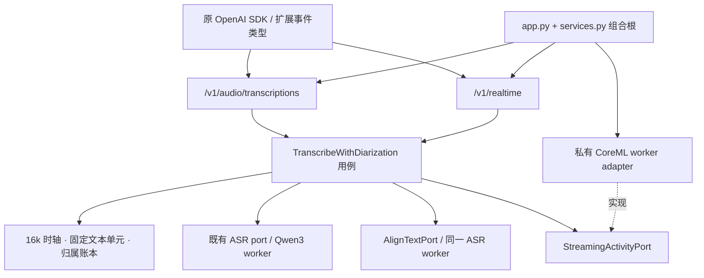

# Speaker Diarization：OpenAI 接口下的本机整洁架构

这是已确定实现方向、尚未实施或发布的目标设计。配套为[实施方案](../plans/2026-09-08-diarization-openai-implementation.md)、[D1 决策记录](../plans/2026-09-08-diarization-validation-cards.md)与[隔离 runtime smoke 报告](../../archive/performance/2026-09-08-d1-diarization-runtime-smoke.md)。真实中文质量验收尚未完成。

本版替代同日 0.1.0 方案：撤回独立 `/v2/transcription-sessions`、移除 OpenAI 模型别名及自定义公共音频协议的建议；撤回 V0–V5 六张验证卡。内部去除旧路径，对外遵循 OpenAI，二者可以同时成立。

## 1. 总体决定

采用 **OpenAI transport → 转写用例 → 单一连续声学流 + 固定正文对齐 + 归属账本**。

- 文件分人使用原生 `POST /v1/audio/transcriptions`、`model="gpt-4o-transcribe-diarize"`、`response_format="diarized_json"`，实现原生 SSE。
- 实时分人在现有 `/v1/realtime` 上通过一个可选配置启用，只向启用者发送命名空间内的扩展事件。
- 普通 ASR/TTS 客户端继续使用原 OpenAI SDK、模型参数和事件处理，不强制换 SDK、探测能力或处理分人事件。
- ASR 保留当前 Qwen3/MLX；对齐复用 Qwen3 ForcedAligner，对已经确定的正文直接对齐，禁止为分人再次识别并替换正文。
- 声学链路固定为 Streaming Sortformer v2.1 的 FluidAudio CoreML FP16 `v3/fp16/SortformerNvidiaLow_v2.1.mlmodelc`；一个私有 Swift worker 持有持续 speaker cache/FIFO，显式 `computeUnits=.all`。
- 文件与 Realtime 都使用同一个流式分人引擎。文件以背压允许的速度送入，不按真实时钟 sleep，不换离线聚类模型。
- 不引入 CAM++ 二次身份裁决、跨 session 声纹库、多模型投票、会末整场重跑或运行期模型回退。

首个质量承诺范围是本机 Apple Silicon、中文优先、每 session 1–4 人、单个实时分人会话，连续两小时作为发布验收目标。四个槽位限制的是整场不同说话人数；不是“同时最多四人、总人数不限”。无法可靠自动发现第五人，不能承诺自动纠正越界。更长录音与更多人数不属于此次质量保证。

这里的“最佳”是上述约束下的工程选型，不宣称所有语言、离线场景和设备上的最高 DER 排名。

## 2. 已确认的现状

源码基线为 2026-09-08 的 HEAD `84c74ca`，工作区有并行文档和配置改动。以下来自当日源码、调用关系及最小复现；Tier 2 图谱覆盖核对到 generation `2026-09-08T08:01:38Z`，相关代码路径没有已记录缺口，但这不等于全仓穷尽审计。

| 位置 | 当前事实 | 对目标的影响 |
|---|---|---|
| `src/speechrail/http/routes/audio.py`、`http/formatters.py` | 接受分人模型别名；`stream` 和任何 `chunking_strategy` 被拒绝；`diarized_json` 复用 `format_verbose` | 现有别名不等于标准契约已实现；需独立标准 serializer、multipart 和 SSE |
| `backends/nemo_sortformer.py` | `supports_stream=False`，native factory 未接通；legacy 按 item 调用 CPU `diarize` | 不能把 ready 状态称为连续实时分人已可用 |
| 同上 | native port 每帧只返回一个 `(speaker, confidence)` | 无法保留模型多 speaker 活动，必须替换 port |
| `domain/diarization_timeline.py` | 活动按区间追加，增长快照会重复计算；重复快照会增加稳定计数 | 同一单元 support 可达到 2.0；“重复读取”不能成为新证据 |
| `application/realtime_openai.py` | 活动主要在登记文字和结束时折叠；降级沿用普通 freeze | 更新延后；降级可能错误地把候选转为 stable |
| `backends/qwen3_worker.py` | `align_session_audio` 再次转写获取时间戳 | 与已经交付的正文可能不一致；需直接对齐固定文本 |
| `application/services.py`、`runtime/speaker_centroids.py` | 生产接线仍用旧质心 store；新 evidence index 主要在测试使用 | 不应继续增添一套跨 session 身份状态来补持续缓存缺失 |
| `application/services.py` | 资源策略会依据 diarization 配置参与重负载预算 | “装了分人但没用”的普通请求也可能受影响，必须改成按实际 lease 计费 |
| `tools/evaluate_diarization_e2e.py` | 缺失 RTTM、空参考、字符归属评分存在可信度缺口 | 当前分数不能直接作为模型选型或发布证据 |

当日已运行五个针对性测试文件，结果 72 passed；使用 `--no-cov` 进行子集诊断，未宣称完整 gate。纯逻辑复现确认 support 重复累计和重复快照提前稳定。未跑本机真实 DER、SDK 端到端或两小时 soak。

D1 隔离 runtime smoke 已在同一 M5 Max 上完成：固定 90 秒、同一 streaming preset、单一连续 session 下，A 的 CoreML FP16 处理为 7.077 s、RTFx 12.716、`/usr/bin/time -l` max RSS 564 MB；NeMo CPU 对照为 58.549 s、RTFx 1.537、1,862 MB。用户结合该实测与测试音频的实际判断，已选择 A。该输入没有 RTTM/UEM，A/B 尾部相差 2 帧（160 ms），所以不是 DER、尾部正确性、ASR 共存或长期稳定性的通过证明；这些仍是实施验收门。[D1 runtime smoke 报告](../../archive/performance/2026-09-08-d1-diarization-runtime-smoke.md)

本机当日只读实测为 M5 Max、128 GiB、18 核；在线 health 返回 SpeechRail 1.13.0 / quality，检查时有活跃 streaming 任务。部署 wheel 与工作区没有逐文件比对；开发 `.venv` 缺少 NeMo/OpenAI SDK，不证明部署 runtime 缺失这些依赖。本次未操作服务或加载模型。

## 3. OpenAI 原生标准与本地边界

2026-09-08 核实：文件转写支持 `gpt-4o-transcribe-diarize`、`diarized_json`、超过 30 秒的 chunking 和分人 SSE；官方明确说明 Realtime transcription 不支持 speaker labeling。因此文件用原生协议，Realtime 才需要扩展。[文件转写指南](https://developers.openai.com/api/docs/guides/speech-to-text)、[模型范围](https://developers.openai.com/api/docs/models/gpt-4o-transcribe-diarize)。

### 3.1 调用者不需要理解模型组合

以下是目标接口示例，要求实现完成后以真实 OpenAI SDK 对 fake 服务做回归；不是当前服务器已通过的示例。

```python
from openai import OpenAI

client = OpenAI(base_url="http://127.0.0.1:8201/v1", api_key="local")

# 普通转写：现有代码保持原状。
with open("audio.wav", "rb") as audio:
    plain = client.audio.transcriptions.create(
        model="whisper-1", file=audio
    )
print(plain.text)

# 文件分人：只使用 OpenAI 原生参数。
with open("meeting.wav", "rb") as audio:
    meeting = client.audio.transcriptions.create(
        model="gpt-4o-transcribe-diarize",
        file=audio,
        response_format="diarized_json",
        chunking_strategy="auto",
    )
for segment in meeting.segments:
    print(segment.speaker, segment.start, segment.end, segment.text)
```

`api_key="local"` 仅示意 loopback 未启用认证的环境；启用认证时由客户端原有凭据配置提供，不把真实 key 写入文档。模型 ID 是本地服务的 OpenAI 兼容能力标识，实际执行 Qwen3 + Sortformer，不表示调用云端 GPT 权重；`/v1/models` 与文档如实声明 SpeechRail 所有权和能力。

### 3.2 文件接口契约

| 请求/响应 | 目标行为 |
|---|---|
| `model=gpt-4o-transcribe-diarize` | 选择分人用例；模型组合、档位、设备均对调用者透明 |
| `response_format=diarized_json` | 独立标准 DTO；禁止复用 Whisper verbose JSON |
| `json` / `text` | 分人模型接受这两种原生输出格式；无需标签者继续使用普通模型，避免无谓推理 |
| `chunking_strategy=auto` | 文件级响度处理和 VAD 分块；所有片段映射到原始连续时轴 |
| `chunking_strategy[type]=server_vad` 等嵌套 multipart | 按 SDK 实际编码解析对象；不要求调用者手工 JSON.stringify |
| 分人文件超过 30 秒且缺少 chunking | 在推理前返回参数错误，`param=chunking_strategy` |
| `stream=true` | `text/event-stream`；原生 `transcript.text.delta`、`transcript.text.segment`、`transcript.text.done`；speaker 只在 segment 确定后输出 |
| `prompt`、logprobs、word timestamp 请求用于分人模型 | 按该模型原生限制拒绝；普通模型原有能力不受影响 |
| `known_speaker_names[]` / `known_speaker_references[]` | 官方可选的身份参考能力；此次匿名分人产品不实现。两种 SDK/form 编码都识别后明确返回 `unsupported_parameter`，不静默忽略，不把名字当匿名 ID |

官方响应要求 segment 的 `id` 为 string，`speaker` 为 string，无参考时用 A、B…；包含 `start/end/text/type="transcript.text.segment"`。顶层为 `task/text/duration/segments`，usage 可以使用真实 duration 统计，不伪造云端 token。字段细节以[Create transcription](https://developers.openai.com/api/reference/resources/audio/subresources/transcriptions/methods/create)为依据。

```json
{
  "task": "transcribe",
  "duration": 3.2,
  "text": "今天讨论接口。好的。",
  "segments": [
    {"id": "seg_0", "type": "transcript.text.segment", "start": 0.2, "end": 1.9, "speaker": "A", "text": "今天讨论接口。"},
    {"id": "seg_1", "type": "transcript.text.segment", "start": 2.0, "end": 2.8, "speaker": "B", "text": "好的。"}
  ]
}
```

标准接口只投影每个文本单元的主 speaker，不声称分离了重叠音频中的两条独立文字。主 speaker 是有效声学证据的最大支持者，不是准确率保证。`speaker:null` 或 `speaker:"unknown"` 不伪装成上述标准匿名标签。若正文无法对齐或没有任何有效 speaker 证据，文件分人请求明确失败 `diarization_unresolved`；全静音且正文为空则成功返回空 segments。不能填 A 掩盖失败，也不能丢弃未知文字后假称完整成功。

文件 SSE 只发送已经可确定标签的 segment；delta 允许按该 segment 的固定正文分片发送，不承诺模型 token 级增量。完成上传后的 SSE 与麦克风实时输入是两种交付方式。传输已开始后的错误使用固定的 SSE error envelope，并终止流，绝不发送成功 done；客户端须以 done 判断完整性。此错误扩展及 SDK 接收行为列入契约测试，不宣称与所有 OpenAI 错误事件完全一致。

### 3.3 Realtime 最小扩展

端点、连接认证、PCM 音频事件、VAD、转写 delta/completed 保持现有 OpenAI 调用方式。只增加一个 opt-in 配置，放在显式的 SpeechRail 命名空间：

```json
{
  "type": "session.update",
  "session": {
    "speechrail": {
      "diarization": {"enabled": true}
    }
  }
}
```

不需要 `enabled` 加 `extensions` 两次开关，也不要求客户端选择 provider、frame size、worker、revision policy。只允许首次音频前启用，session 生命周期内不可切换；重复相同配置幂等。服务器在 `session.updated` 的同一扩展对象回显 `enabled/version/max_speakers`，未启用会话不出现这组字段或事件。模型仍沿用该 Realtime 会话的 ASR 模型，不把仅支持文件转写的云端分人模型称为原生 Realtime 模型。

扩展开发者继续用 OpenAI SDK 的通用事件发送能力发送字典，扩展 payload 通过一个薄类型定义文件处理；可使用 SDK 底层连接的 JSON 收发。薄类型只定义扩展事件，不替换 SDK、不接管鉴权/重试/连接，也不暴露私有 IPC。各语言 SDK 对未知事件的解析不同，Python/TypeScript 的实际连接回归是实施门，不以“能发送 JSON”代替验证。

仅增加以下三个服务端事件和一个可选客户端结束事件：

| 事件 | 内容和语义 |
|---|---|
| `speechrail.diarization.updated` | `event_id/sequence/item_id/content_index/revision/units`；该 item 的完整归属快照，更新时替换，便于客户端简单 upsert |
| `speechrail.diarization.status` | `state=ready|degraded`、稳定 `reason`、request ID；只有状态变化时发送 |
| `speechrail.diarization.done` | `finish_id/status=ok|degraded/through_sample/last_sequence`；所有已接收正文和归属已有明确终态 |
| 客户端 `speechrail.diarization.finish` | `event_id` 同时作为 finish_id；内部提交剩余音频并排空 ASR、对齐、分人，不要求 commit→finalize→clear 三步 |

```json
{
  "type": "speechrail.diarization.updated",
  "event_id": "evt_d7",
  "sequence": 7,
  "item_id": "item_1",
  "content_index": 0,
  "revision": 2,
  "units": [
    {"id": "u_0", "text_start": 0, "text_end": 2,
     "start": 0.2, "end": 0.7,
     "speaker": "A", "active_speakers": ["A"],
     "state": "final", "reason": null}
  ]
}
```

`text_start/text_end` 是 completed 正文的 Unicode code point 半开范围，不是 UTF-8 字节或 JavaScript UTF-16 偏移；JS 示例使用 `Array.from(text)`。`start/end` 为 session 音频秒数。`active_speakers` 只说明该时段活动，不等于该文本由多个人同时说出。支持 `speaker=null`，`state=provisional|final`；final 表示不会再修订，不代表一定知道 speaker。对齐完全失败时发布一个覆盖正文的 final unknown unit，时间为 null，明确 reason。

正文 completed 先交付，首次 updated 随后提供固定单元；后续 revision 不改文字或单元时间边界。分人进度独立驱动更新，不等下一次 commit。有了足够音频上下文，普通 commit 对应的 item 会自动完成归属；finish 只用于结束输入并取得尾部完整性确认。相同 finish_id 重发返回同一结果；不同 ID 在 finishing 状态报冲突。finish 后该输入 session 不再接受 append。

`input_audio_buffer.clear` 保持清除未提交 ASR 输入的语义，不重置分人身份和已接收音频时钟；被清除正文不再产出归属。断线结束 session，重连创建新匿名作用域，服务不负责历史补传和跨连接身份继承。

### 3.4 “普通开发者无负面影响”的可验收定义

1. 未请求分人的 SDK 请求、响应类型、标准事件和错误语义不变化，不需要新 header 或能力探测。
2. 普通请求不创建分人 session、不调用对齐、不启动或租用分人 worker。仅安装或配置模型不会让普通请求的 ready/admission 依赖分人。
3. 分人不可用时普通 ASR/TTS 仍可用；只有分人请求报错。
4. 无分人活动时，对照现版的普通请求延迟和内存不得出现可重复的新增开销；预先固定 5% 的相对性能容差用于检测，低延迟样本同时公布绝对差值。
5. 同机实际启用分人会消耗资源，不能保证物理上零竞争。实施 ASR 优先、分人配额和背压，并以并发对照 P95 延迟退化不超过 10% 为发布目标；不能达标就不开放该组合。

## 4. 模型与运行时选型

| 方案 | 已有证据与适用性 | 决策 |
|---|---|---|
| NVIDIA Streaming Sortformer v2.1 | 持续状态、四 speaker 多标签活动；包含中文会议训练来源和中文评测；符合当前小型会议范围 | 选定算法族和首个权重版本 |
| FluidAudio CoreML FP16 | D1 同一 90 秒连续 session 成功；处理速度约为 NeMo CPU 的 8.3 倍、max RSS 约为其 30%；实际图与 AOSC/FIFO 输入可检查 | **唯一生产运行时**；质量和尾部仍由 T4/T9 验收 |
| NeMo CPU 原生 streaming | D1 连续 session 成功，提供算法语义和性能对照；处理时间 58.549 s、max RSS 1,862 MB | 不进入生产依赖、worker、配置或运行期回退路径；保留归档证据即可 |
| pyannote Community-1 | 成熟整段分人，可提供 exclusive diarization，适合离线质量参照 | 不用第二条批处理生产路径；不以不同数据集 DER 数字判胜负 |
| Diart | 滚动缓冲、重叠感知的在线聚类有研究依据 | 要增加 embedding/聚类状态，当前无证据值得替换持续 Sortformer |
| LS-EEND | 在线端到端，有不同 speaker 上限和领域模型 | 当前缺少本项目中文长会话优势证据，不再派挑战者实验 |
| CAM++ + 质心重映射 | 适合身份相似性证据，不能修复声学时钟、缓存断裂或文字对齐 | 从本次分人链路移除；不提供跨 session 身份服务 |

来源：[NVIDIA 模型卡](https://huggingface.co/nvidia/diar_streaming_sortformer_4spk-v2.1)、[FluidAudio Sortformer](https://github.com/FluidInference/FluidAudio/blob/main/Documentation/Diarization/Sortformer.md)、[Community-1](https://huggingface.co/pyannote/speaker-diarization-community-1)、[Diart](https://github.com/juanmc2005/diart)、[LS-EEND](https://github.com/FluidInference/FluidAudio/blob/main/Documentation/Diarization/LS-EEND.md)。这是架构适配判断，不是本机排名。

首选低延迟 preset：`chunk=6, left=1, right=7, fifo=188, spkcache=188, update_period=144`，输出帧约 80 ms；算法输入缓冲约 `(6+7)*80 ms=1.04 s`，不含计算、排队、后处理和文字对齐。依据[配置源码](https://github.com/FluidInference/FluidAudio/blob/main/Sources/FluidAudio/Diarizer/Sortformer/SortformerTypes.swift)，不能直接把库文档里的其他 preset 耗时抄成端到端 SLA。

CoreML 生产制品固定为 `FluidInference/diar-streaming-sortformer-coreml` 的 `v3/fp16/SortformerNvidiaLow_v2.1.mlmodelc`。D1 记录的模型 revision 是 `ae9a27ab45dc0aa3abede7d2d6bad2b7a69aa6d1`，FluidAudio source commit 是 `5c19d5e12320e22bbfb7a1877b089d2665a69add`；release 还必须固定完整 bundle hash 和 license/notice。`v3` 是转换制品代次，权重仍是 Sortformer v2.1。实际 head 输出为 `speaker_preds=[1,390,4]`，不是模型卡表格误写的 `[1,390,128]`；adapter 以实际 `MLModelDescription` 和 MIL/metadata preflight 为准。生产安装的是已编译 `.mlmodelc`，worker 直接加载，绝不再调用 `MLModel.compileModel`。D1 证明旧 CLI 对 `.mlmodelc` 无条件 compile 会因缺少 `Manifest.json` 失败，这条路径不得进入生产。静态 shape、name、dtype 或 `computeUnits=.all` 不符即 preflight 失败。128 GiB 本机固定 FP16，不设自动降精度或换模型。上游 license 表述不完全一致，实施前按实际权重、转换代码和制品分别锁定许可与 notice，不把第三方“无限制”描述当作授权结论。

固定正文对齐采用 Qwen3 ForcedAligner-0.6B，经当前 `mlx_qwen3_asr` 的直接 `align(audio, text, language)` 能力实现；固定本地模型路径，预先验明齐全。[Qwen3-ASR 官方仓库](https://github.com/QwenLM/Qwen3-ASR)、[现有 MLX 运行时的 aligner 源码](https://github.com/moona3k/mlx-qwen3-asr/blob/main/mlx_qwen3_asr/forced_aligner.py)。这里只确定架构和可用 API；中文实际边界质量在实施验收中检查，不额外派选型卡。

## 5. 整洁架构与唯一状态所有者



| 层 | 责任 | 不得依赖 |
|---|---|---|
| `domain/diarization/` | 不可变类型、帧证据、文本区间、归属算法和终态规则 | FastAPI、OpenAI DTO、NeMo、CoreML、IPC、配置路径 |
| `application/diarization/` | 会话 actor、ASR/对齐/活动编排、结束屏障、背压、领域事件 | 具体模型框架、Swift 类型、HTTP serializer |
| `http/`、Realtime compatibility | 标准与扩展 DTO、输入校验、领域事件投影 | 决定 speaker、管理模型缓存 |
| `backends/diarization/`、`runtime/` | vendor 校验、私有 IPC、进程和 lease | 改写正文、给用户命名、另设归属策略 |
| 组合根 | 注入已选唯一实现，管理生命周期 | 在路由中临时选模型或下载依赖 |
| 客户端 | 麦克风、UI、落库、人工命名、重连缺口 | 模型内部槽位及跨会话声纹推断 |

只新增两个模型 port：`StreamingActivityPort` 与 `AlignTextPort`；ASR、clock、logger 和进程监督复用现有设施，不为纯函数制造接口。公共 DTO 可用 Pydantic，领域对象使用 frozen dataclass/enum。

进程仍是一个 SpeechRail 服务、一个 ASGI worker、既有 ASR/TTS workers，加一个懒启动的私有分人 worker。这个子进程不是第二个 SpeechRail 服务、HTTP 端点或 LaunchAgent。CoreML 是固定单实现，初始化显式指定 `computeUnits=.all`，对安装的 `.mlmodelc` 用直接 loader；不依赖库自动下载、编译、改精度或改模型。

| 状态 | 唯一 owner / 生命周期 |
|---|---|
| 收样计数、item offset、已提交文本、pending units、revision | 应用 session actor；连接/文件请求结束即清理 |
| mel 左右上下文、FIFO、AOSC cache、silence profile | 分人 worker 内的 session；不被 ASR commit/clear 重置 |
| 对齐模型权重 | 既有 ASR worker；只有活跃分人 lease 才参与额外资源预算 |
| 活动帧与修订窗口 | 领域 ledger；已完成且无消费者依赖的帧及时淘汰 |
| SDK 返回 DTO / WS 发送缓冲 | transport；发送完成后释放，不形成服务器转写数据库 |

## 6. 时间、正文和归属算法

### 6.1 一条连续时轴

规范时轴为 16 kHz 单声道样本索引，区间统一 `[start,end)`。API 接收支持格式后，只做一次有状态重采样；24 kHz → 16 kHz 保留分数状态，不能每个网络包独立取整。分人接收所有有效音频，包括静音；VAD 只决定 ASR item，不能压缩分人时钟。

分人之前的文件响度归一化不改变样本数量；ASR 的 VAD padding/重叠上下文有独立 owned interval，公共文字只归属于 owned interval 一次。长讲话按有界 item 切分，在包内精确分割，不因一个大 append 超过上限。建议目标 item 上限 8 秒，仅对启用分人的用例启用；模型上下文音频可以重叠，正文不得重复。

80 ms 是输出帧跨度，不是可以独立调用模型的无状态 PCM 长度。worker 必须保留 25 ms 窗/10 ms 步长的前端边缘与模型完整左右上下文。结束补零只推进计算，不增加真实输入 duration；最后一帧裁到真实样本数。

### 6.2 正文先确定，对齐只提供边界

ASR 和既有 ITN 得到唯一展示正文，随后冻结。对齐请求显式携带这份正文、language 和对应 PCM。不能先交付正文 A、再将第二次识别 B 的时间戳套在 A 上。

归一化只用于建立匹配映射：NFKC 的 L/N/M 序列与原文 code point 范围建立可追溯映射；标点和空白归入相邻单元，首尾规则确定，所有原文字范围恰好覆盖一次。数字和英文按 aligner 实际 token 跨度处理，不把长词平均切成多个“精确字级时间”。对齐输出非有限值、倒序、越界、空匹配或文本不一致时返回明确失败。

Realtime 对齐失败不阻塞 completed 正文，输出 final unknown；标准文件分人返回失败。两者使用相同领域失败事实，只是传输契约的表达能力不同。

### 6.3 活动帧与修订

worker 输出四路独立 sigmoid 活动，不能 softmax 成“只能一个人说话”。每次更新包含：`session_epoch, step_id, replace_start, replace_end, frames, stable_through_sample, processed_through_sample`。

- step_id 单调，重复 step 幂等；同 step 不同 payload 是协议错误。
- 只允许替换尚未稳定的帧范围；稳定帧不可回改。应用按帧索引覆盖，而非不断追加增长区间。
- `0 <= stable <= processed <= accepted`，均以真实输入样本为界；processed 不自动等于 stable。
- 库的 right-context 和后处理 median boundary 均结束后才能推进 stable。
- speaker 匿名 ID 在 session 内固定为 A–D，按首次可靠出现的顺序分配；后续不因 VAD、长静音、commit 或 slot 重读重新编号。模型 slot 漂移是可测质量错误，不能靠给用户静默换 ID 隐藏。

设文本单元 `u` 时长为 `|u|`，speaker 活动区间并集为 `U_s`：

`support(u,s) = duration(u ∩ U_s) / duration(u)`。

每个 speaker 的 support 在 `[0,1]`，不同 speaker 因 overlap 可合计大于 1。它是时间支持比例，不命名为 confidence/probability。并列时用固定顺序确定主候选，但 Realtime 在支持不足或 margin 不足时返回 null。阈值集中在一个 policy，先固定开发默认，再只用 tune 集校准，eval 集不调参。

最终化由声学稳定水位覆盖 `unit.end` 决定，不由同一结果“连续读到两次”决定。final 可以是带 speaker 或 null。发生降级时，仅将未决单元终结为 unknown，保留已经 final 的有效结果；禁止调用“把当前候选当最终结果”的通用 freeze。

## 7. 背压、资源与失败语义

所有下面数值是目标初值与验收门，不是当前性能实测：

| 边界 | 初值/规则 |
|---|---|
| 活跃分人 session | 1；文件与实时互斥，复用现有 `backend_busy` |
| 分人未处理音频 | 常态目标 P95 ≤ 2 秒；硬上限 5 秒，超限明确降级，不丢包后继续假装连续 |
| 未完成对齐 | 最多 3 个 item，每个 owned interval ≤ 8 秒；ASR 解码优先，同一 worker 内有界排队 |
| ledger 未决窗口 | ≤ 30 秒且 ≤ 4096 单元；超过则终结旧未决单元为 unknown 并报告状态 |
| 模型状态 | FIFO/cache 固定 shape；禁止 upstream timeline、`total_preds` 累积整场历史 |
| WS 发送队列 | 复用现有配额，扩展快照可合并为同 item 最新 revision；不得丢 standard completed 或 final 结果 |
| 结束屏障 | 30 秒上限；正常完成目标 commit → final P95 ≤ 4 秒；超时可见降级/失败 |
| worker 退出 | 发 cancel，超时后定向终止精确子 PID 并确认退出；确认前不释放 lease、不启动替代权重 |

PCM、embedding 和模型原始输出不落盘。Realtime 音频只保留在有界 ring 直到对齐和分人消费结束；文件上传遵循现有请求大小/时长上限，生命周期内的临时缓冲在结束或取消时释放。非流式完整文件响应自然与输出长度成比例，但不能把它误当作无界实时 session 的保存策略。

| 失败 | 普通会话 | 分人请求/会话 |
|---|---|---|
| 分人模型缺失或 preflight 失败 | 正常工作，不改变 ready | HTTP 503；Realtime opt-in 拒绝，稳定错误码与 request ID |
| 分人 worker 崩溃、非法输出、持续积压 | 正常工作 | Realtime 未决归属 final unknown + degraded，正文继续；文件失败 |
| 对齐失败 | 不调用对齐 | Realtime 当前 item unknown；文件分人失败，不改写文字 |
| ASR 失败、音频顺序/完整性错误 | 现有失败语义 | 终止相关转写；分人不能伪造正文补齐 |
| 客户端断开 | 释放本会话资源 | 取消关联推理；迟到 epoch 结果丢弃，不继承身份 |
| 活跃 lease 遇 idle eviction | 不误驱逐正在服务的模型 | 同样受 lease 保护；只有确认 idle 后才释放 |

降级是一种公开失败状态，不是第二套模型或静默回退。已经降级的 session 不在后台重建身份后继续编号；新 session 才能重新初始化。文件 JSON 失败维持 OpenAI 风格 error envelope，扩展事件使用同一 error code/param/request ID 词汇。

## 8. 删除旧路径与切换方式

实施时完成定向调用审计后移除：legacy 按 item 分人 session、旧 native 单 speaker port、`supports_stream` 伪能力分支、双开关 extensions 路径、旧 remap/质心接线、未接入的 evidence index、group_id/跨 session link 契约、按 hint 截断输出、二次 ASR 对齐、旧分人 serializer 和冗余配置。

保留：OpenAI 路由与模型能力别名、普通 ASR/TTS/Realtime 消费方式、既有错误 envelope/调度/worker 框架。解析 SDK 不同合法 multipart 编码属于协议 adapter 的职责，不是两条业务兼容路径。

按当前用户明确要求，不并存旧分人扩展、不新增 `/v2` 服务端入口；这项要求优先于项目默认“破坏变更进入 /v2”。旧扩展调用者在一次发布中迁移到 `session.speechrail.diarization`。产品版本使用 major 变更，迁移文档精确列出受影响分人字段；普通 SDK 消费者不迁移。

回退方式是部署层回到上一套 release，并在需要时回退使用旧分人扩展的客户端。它不意味着新实现保留旧模型分支。当前没有执行切换；活动配置、模型、README 和并行文档保持原状。

## 9. 实施验收与唯一未决事项

### 必须由实施工作完成

- 官方 SDK：普通转写、文件分人、嵌套 multipart、SSE、Realtime 普通事件、扩展 opt-in、错误和断线。Python/TypeScript 以锁定实际 SDK 版本执行，不依赖自造 HTTP 请求证明 SDK 兼容。
- 领域反例：增长区间、重复 step、稳定水位、两人 overlap、空音频、24→16k 分包、ITN 映射、边界单词、降级和 finish 竞争。
- 评测修复：缺失 RTTM 失败；空参考单列 FA；统一 UEM、collar、overlap；匿名映射每场只做一次。正文不同必须计算字符编辑距离，不能按位置直接比较 speaker 后称为 speaker-attributed CER。
- 指标分开：CER；DER/JER；在正文已匹配字符上的条件归属错误；unknown 比例；端到端按 speaker 归并文本、全场最优置换后的 cpCER，计插入/删除/替换，unknown 作为未匹配标签。不要混称。
- 真实公共接口：正文不因分人丢失/重复/改写；连续两小时检查晚加入、长静音后返回、相似音色和 overlap；缓存不随时长线性增长。
- 初始质量目标：清晰中文 DER ≤ 15%、困难集 ≤ 25%，collar=0 且计 overlap；清晰集条件归属错误 ≤ 10%、unknown ≤ 5%。这些是拟定验收阈值，失败需报告，不声称调研已证明能达到。
- 性能目标：分人热态 RTF P95 ≤ 0.5（固定 10 秒窗）；commit→final P95 ≤ 4 秒，同时报告词尾→final，目标 ≤ 12 秒；热身后两小时 footprint 稳定段增长 ≤ 10%。与普通请求对照检查第 3.4 节回归门。

### 已完成的 D1 运行时决定与剩余门槛

用户已基于 D1 runtime smoke 和对测试音频的实际判断选择 CoreML FP16 A。该决定解除 T4 对运行时选型的等待：目标代码只实现和打包 A，不生成 NeMo adapter 或 Python 分人 worker，也不保留 `provider=auto`、try-CoreML-then-NeMo 或运行期回退。

该决定不免除质量验收。D1 缺少 RTTM/UEM，且 A 的 1,123 帧与 B 的 1,125 帧存在 160 ms 尾部差异；T4 必须以末尾含人工已知活动的 fixture 验证 flush 后 `through_sample` 覆盖真实输入，T8/T9 必须完成中文 DER/JER、分包不变性、ASR 共存、两小时 soak 和 `phys_footprint` 测量。不能将本次 `/usr/bin/time -l` 的单次 max RSS 当作 P95 或长期内存门。

## 10. 证据与交付边界

外部来源核实日期为 2026-09-08；模型与库链接中的 main 会变化，实施必须固定 commit/model revision、权重 hash、前端与 preset 指纹。NVIDIA GPU、FluidAudio 其他 Mac 和不同评测集的数字都不能作为本机结果。

本次设计已纳入用户确认的 A 运行时决定与既有 D1 归档证据。未修改源代码或公共契约，未发布或重启服务；测试报告中的模型运行发生在独立、仓库外的 D1 runtime smoke 环境。
