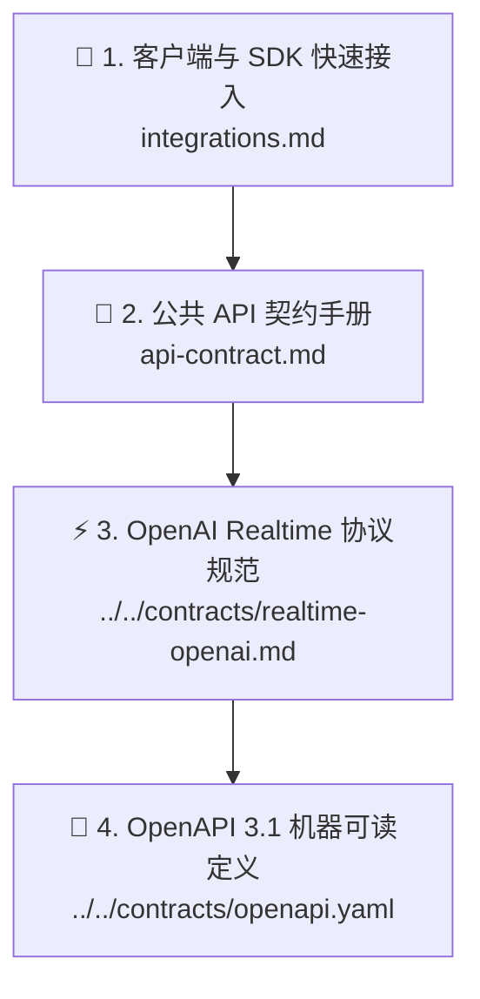

# 🔌 SpeechRail 用户与集成指南

欢迎查阅 SpeechRail 用户与集成文档。本目录面向将 SpeechRail 接入到自身应用（如桌面智能体、实时会议转写系统、内容配音工具等）的开发者与产品集成方。

---

## 📑 推荐阅读路径



1. **[🔌 客户端与 SDK 快速接入 (integrations.md)](integrations.md)**：包含 QwenPaw、Sona 会议助理、Hermes Agent、官方 OpenAI Python SDK 与 cURL 的实战示例。
2. **[📡 公共 API 契约手册 (api-contract.md)](api-contract.md)**：包含 ASR 文件转写、TTS 语音合成、异步 Jobs、音色目录及标准错误 Envelope 的详细规范。
3. **[⚡ OpenAI Realtime 协议规范](../../contracts/realtime-openai.md)**：包含 `/v1/realtime` WebSocket 全双工流式 ASR/TTS、Server VAD 与打断机制规范。
4. **[📑 OpenAPI 3.1 规范文档](../../contracts/openapi.yaml)**：提供标准 OpenAPI 3.1 Schema，支持直接导入 Postman、Apifox 或生成客户端 SDK。

---

## ⚡ 1分钟极速接入示例 (Python SDK)

由于 SpeechRail 完全兼容 OpenAI 协议规范，只需配置 `base_url` 即可无缝调用：

```python
from openai import OpenAI

# 1. 初始化客户端（指定 SpeechRail 本地地址）
client = OpenAI(
    base_url="http://127.0.0.1:8201/v1",
    api_key="not-needed-for-loopback",
)

# 2. 语音识别 (ASR)
with open("meeting.wav", "rb") as audio:
    transcript = client.audio.transcriptions.create(
        model="whisper-1",  # 自动路由到本地 Qwen3-ASR
        file=audio,
        response_format="verbose_json",
    )
    print("识别文本:", transcript.text)

# 3. 语音合成 (TTS)
response = client.audio.speech.create(
    model="tts-1",  # 自动路由到本地 Qwen3-TTS
    voice="warm",  # 预设音色：default, warm, calm, bright
    input="欢迎使用 SpeechRail 本地语音运行时服务。",
)
response.stream_to_file("output.mp3")
```

---

> [!TIP]
> 遇到接口调用问题？请先查阅 [API 契约手册中的错误码定义](api-contract.md#6-统一错误-envelope-与状态码) 或查看 [故障排查 Runbook](../operations/operations-runbook.md)。
