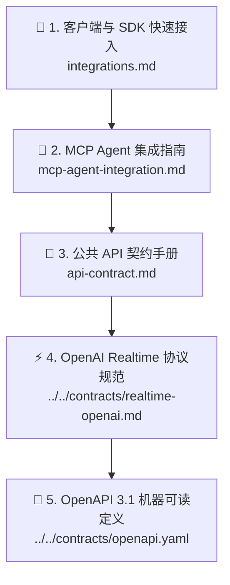

# 🔌 SpeechRail 用户与集成指南

本目录面向将 SpeechRail 接入桌面智能体、实时会议转写系统或本地内容工作流的开发者。所有能力以当前运行时发现结果和公共契约为准；本文档不扩展 OpenAI 未在 SpeechRail 契约中实现的能力。

> [!TIP]
> 还没在本机装好服务？先看 **[📦 SpeechRail 安装与首次使用](installing-speechrail.md)**：它说明 GitHub Release 上
> wheel、DMG 和校验文件分别是什么、安装顺序、装完如何确认服务可用，以及升级与卸载的安全顺序。

---

## 📑 推荐阅读路径



1. **[🔌 客户端与 SDK 快速接入 (integrations.md)](integrations.md)**：包含 [Sona](https://github.com/hrygo/sona) 会议助理、Open-WebUI、LiveKit / Pipecat 实时智能体、OpenClaw、官方 OpenAI Python SDK 与 cURL 的实战示例。
2. **[🤖 MCP 主流 Agent 集成指南 (mcp-agent-integration.md)](mcp-agent-integration.md)**：Codex 本机 `stdio` 安装、ChatGPT Web 远程 MCP App 连接，以及 Claude Code、Cursor、WorkBuddy、Qoder、ZCode、Google Antigravity 的配置示例、传输选择与故障排查。
3. **[📡 公共 API 契约手册 (api-contract.md)](api-contract.md)**：包含原生 OpenAI `diarized_json` 文件分人、TTS 语音合成、异步 Jobs、音色目录及标准错误 Envelope 的详细规范。
4. **[⚡ OpenAI Realtime 协议规范](../../contracts/realtime-openai.md)**：包含 `/v1/realtime` current-only WebSocket ASR/TTS、Server VAD 事实、调用方显式 TTS cancel 与 namespaced diarization opt-in。
5. **[📑 OpenAPI 3.1 规范文档](../../contracts/openapi.yaml)**：提供标准 OpenAPI 3.1 Schema，支持直接导入 Postman、Apifox 或生成客户端 SDK。
6. **[🧭 有效能力快照与安全音色目录](effective-capabilities.md)**：说明 `effective_capabilities_v1`、同代一致性、ETag 与安全 voice 列表投影。

---

## ⚡ 1分钟极速接入示例 (Python SDK)

对已承诺的 OpenAI REST 子集，只需配置 `base_url` 即可调用；Realtime 与扩展能力以对应契约为准：

```python
from openai import OpenAI

# 1. 初始化客户端（指定 SpeechRail 本地地址）
client = OpenAI(
    base_url="http://127.0.0.1:8201/v1",
    api_key="not-needed-for-loopback",
)

# 2. 语音识别 (ASR)
with open("meeting.wav", "rb") as audio:
    transcript = client.audio.transcriptions.create(
        model="whisper-1",  # 自动路由到本地 Qwen3-ASR
        file=audio,
        response_format="verbose_json",
    )
    print("识别文本:", transcript.text)

# 3. 语音合成 (TTS)
response = client.audio.speech.create(
    model="tts-1",  # 自动路由到本地 Qwen3-TTS
    voice="serena",  # 九个 canonical 角色之一；也接受 OpenAI 标准 voice alias
    input="欢迎使用 SpeechRail 本地语音运行时服务。",
)
response.stream_to_file("output.mp3")
```

---

## 调用前诊断

HTTP 客户端可读取 `GET /health`；需要跨模型、音色和操作参数保持同代一致时，读取
`GET /v1/speechrail/capabilities`（`effective_capabilities_v1`）。MCP 客户端可调用
`describe()`：它返回当前 models/readiness 观察，并且必须附带有效能力快照及其安全 voice 投影；能力
契约缺失、未知 schema、鉴权或存储故障都会直接失败，不会被静默降级。
这些入口都不会返回模型绝对路径、音频或转写内容。

`/readyz` 只表示至少一个 ASR/TTS 能力可按需接受推理；成功响应中的 `realtime_vad` 仍是独立诊断。需要某项能力时，先读取对应字段和 `GET /v1/speechrail/capabilities`，再发起推理请求。readiness、`available` 和质量验收不是同一语义。

## macOS App 控制面

SpeechRail macOS App 面向本机用户提供三类入口：

- **创作**：配音台、音色创作、音色克隆、音色库和我的作品。音色创作保留 VoiceDesign 的描述、试听和保存主线；音色克隆让你照服务端下发的提词稿读一段、录下自己的声音，注册成可复用的音色（只在按下录制到停止之间采集麦克风，录音收下即删）。
- **会话**：语音助手、会议助手和实时字幕。只有功能真正开始时才启用麦克风、进程音频 tap 或播放引擎；PCM 不落盘，结束后释放设备，文字与记录保存在本机。
- **服务**：本机服务总览、运行监控、模型管理、预检与诊断，以及给接入方的开发者文档。普通用户先看“现在能不能用”和“下一步做什么”；开发者可展开技术详情核对档位、worker、metrics、revision 和校验文件数；开发者文档在应用内给出服务地址、鉴权、运行档位、已发布能力和最小示例，完整版仍在 `docs/users/`。

在“模型管理”中，选择 `quality`、`balanced` 或 `light` 后可以单独执行“下载并校验”。该操作只使用 SpeechRail 锁定的模型目录，逐文件校验大小和 SHA-256，并原子发布到本机；它不会自动应用 profile、启动/重启服务、删除已有模型，也不会上传音频或作品。确认“应用此档位”才会触发 profile 切换和现有服务验收。

“运行监控”回答的是「服务最近在做什么、快不快、占多少内存」，不是语音质量评分：首屏只报正在处理、语音合成次数与音频时长、语音识别次数与音频时长、每次合成/识别的耗时、失败请求次数，以及哪些模型现在留在内存里。次数与时长只统计语音接口，App 自己每 5 秒的轮询不算请求。服务未运行或指标暂时不可读时，页面会保留「不可用/读不到」的事实，不把缺失数据显示成正常的 0；分辨率更高的指标（每秒请求速率、直方图累计值与各音色类型的耗时）在页面底部的「更多细节」与开发者详情里。

### Capability 路由提示

客户端只调用公共 REST/WebSocket endpoint，不需要感知模型 worker 的加载、卸载或切换。选定的 profile 与请求 capability 会由服务端自动路由；`quality` 的 `voice_design` 与 `voice_clone` 使用独立 TTS worker，不同 lane 可以并发，同一 lane 的请求会按 worker lock 排队。空闲冷却导致 worker 回收时，服务会在下一次对应请求中惰性恢复，不改变客户端契约。

---

> [!TIP]
> 遇到接口调用问题？请先查阅 [API 契约手册中的错误码定义](api-contract.md#7-统一错误-envelope-与状态码) 或查看 [故障排查 Runbook](../operations/operations-runbook.md)。
