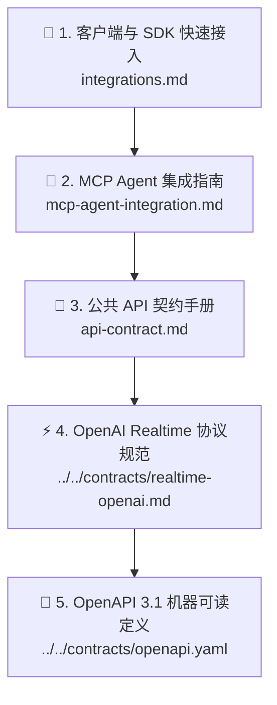

# 🔌 SpeechRail 用户与集成指南

欢迎查阅 SpeechRail 用户与集成文档。本目录面向将 SpeechRail 接入到自身应用（如桌面智能体、实时会议转写系统、内容配音工具等）的开发者与产品集成方。

---

## 📑 推荐阅读路径



1. **[🔌 客户端与 SDK 快速接入 (integrations.md)](integrations.md)**：包含 [Sona](https://github.com/hrygo/sona) 会议助理、Open-WebUI、LiveKit / Pipecat 实时智能体、OpenClaw、官方 OpenAI Python SDK 与 cURL 的实战示例。
2. **[🤖 MCP 主流 Agent 集成指南 (mcp-agent-integration.md)](mcp-agent-integration.md)**：六个主流客户端（Codex、Claude Code、Cursor、WorkBuddy、Qoder、ZCode）的 `speechrail-mcp` 配置示例、传输选择与故障排查。
3. **[📡 公共 API 契约手册 (api-contract.md)](api-contract.md)**：包含原生 OpenAI `diarized_json` 文件分人、TTS 语音合成、异步 Jobs、音色目录及标准错误 Envelope 的详细规范。
4. **[⚡ OpenAI Realtime 协议规范](../../contracts/realtime-openai.md)**：包含 `/v1/realtime` WebSocket 全双工流式 ASR/TTS、Server VAD、打断机制与一个 namespaced diarization opt-in。
5. **[📑 OpenAPI 3.1 规范文档](../../contracts/openapi.yaml)**：提供标准 OpenAPI 3.1 Schema，支持直接导入 Postman、Apifox 或生成客户端 SDK。

---

## ⚡ 1分钟极速接入示例 (Python SDK)

对已承诺的 OpenAI REST 子集，只需配置 `base_url` 即可调用；Realtime 与扩展能力以对应契约为准：

```python
from openai import OpenAI

# 1. 初始化客户端（指定 SpeechRail 本地地址）
client = OpenAI(
    base_url="http://127.0.0.1:8201/v1",
    api_key="not-needed-for-loopback",
)

# 2. 语音识别 (ASR)
with open("meeting.wav", "rb") as audio:
    transcript = client.audio.transcriptions.create(
        model="whisper-1",  # 自动路由到本地 Qwen3-ASR
        file=audio,
        response_format="verbose_json",
    )
    print("识别文本:", transcript.text)

# 3. 语音合成 (TTS)
response = client.audio.speech.create(
    model="tts-1",  # 自动路由到本地 Qwen3-TTS
    voice="serena",  # 九个 canonical 角色之一；也接受 OpenAI 标准 voice alias
    input="欢迎使用 SpeechRail 本地语音运行时服务。",
)
response.stream_to_file("output.mp3")
```

---

## 调用前诊断

HTTP 客户端可读取 `GET /health`，MCP 客户端可调用 `describe()`。两者都会给出 ASR、TTS、diarization 的可用状态，以及 realtime worker 状态和 VAD 的 `ready/code/message`；不包含模型绝对路径、音频或转写内容。

`/readyz` 只表示 ASR 或 TTS 至少一个可用；成功响应也包含独立的 `realtime_vad` 诊断。需要某项能力时，应检查对应的 readiness 字段后再发起推理请求。

### Capability 路由提示

客户端只调用公共 REST/WebSocket endpoint，不需要感知模型 worker 的加载、卸载或切换。选定的 profile 与请求 capability 会由服务端自动路由；`quality` 的 `voice_design` 与 `voice_clone` 使用独立 TTS worker，不同 lane 可以并发，同一 lane 的请求会按 worker lock 排队。空闲冷却导致 worker 回收时，服务会在下一次对应请求中惰性恢复，不改变客户端契约。

---

> [!TIP]
> 遇到接口调用问题？请先查阅 [API 契约手册中的错误码定义](api-contract.md#7-统一错误-envelope-与状态码) 或查看 [故障排查 Runbook](../operations/operations-runbook.md)。
