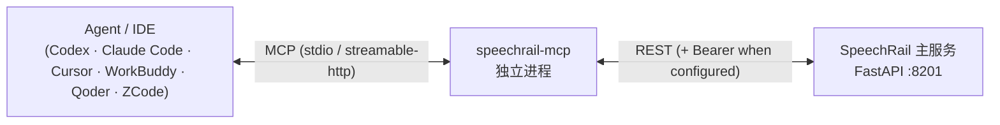

# 🔌 SpeechRail MCP 主流 Agent 集成指南

> 本文档面向希望把本机 SpeechRail 的 ASR/TTS/diarization 能力接入主流 Agent/IDE 的集成方。
> 事实来源：`src/speechrail/mcp/`（proxy 实现）、[SpeechRail MCP Proxy 工具与契约](../architecture/speechrail-mcp-proxy.md)（工具语义）、
> 以及各客户端官方 MCP 文档（配置格式随客户端版本演进，若与本文不符以客户端官方文档为准）。
>
> **v1.3.0 变更**（2026-09-13）：补充 Codex 当前 `codex mcp add` / `config.toml` 指引，以及 ChatGPT Web 自定义 MCP App 的远程连接边界。ChatGPT Web 不能直接启动本机 `stdio` 或访问 `127.0.0.1`；本机 SpeechRail 必须通过 `streamable-http` 和受信任的 HTTPS 隧道/网关连接。
> ChatGPT 的套餐、界面和权限会持续变化，请同时参考 [OpenAI 官方 Developer mode and MCP apps in ChatGPT](https://help.openai.com/en/articles/12584461)。

---

## 1. SpeechRail MCP 是什么

SpeechRail 本体是 OpenAI-compatible 的 REST + WebSocket 服务（`:8201`）。`speechrail-mcp` 是一个
**独立的外置进程**，把该服务包装成 MCP 工具，让 Agent 能用自然语言选能力、转写、合成、管理音色：



- **不内建进主服务**：proxy 崩溃不影响推理服务；主服务升级/回滚不受 MCP 影响。
- **不接收 base64**：音频一律用本地路径或 `file://` URI（避免音频进入模型 context）。
- **不做 Realtime 全双工**：`/v1/realtime` WebSocket 仍由客户端直连，不在 MCP 工具集内。

### 1.1 工具集（9 个）

| 工具 | 作用 | 关键点 |
|---|---|---|
| `describe()` | 能力快照 | **应先调用**：拿档位、readiness、可用音色 |
| `transcribe` | 转写本地音频 | 支持 `language` / `diarize` / `timestamps` |
| `synthesize` | 文本合成到文件 | 返回 `audio_path`；默认音色 `serena` |
| `preview_voice` | 试听 VoiceDesign 指令 | **仅 `quality` 档** |
| `create_voice` / `delete_voice` | 注册/删除持久音色 | `delete_voice` 是破坏性操作 |
| `create_job` / `get_job` / `cancel_job` | 长任务句柄 | 同步调用超时/过长时改用 |

只读资源：`speechrail://capabilities`、`speechrail://voices`、`speechrail://models`。

---

## 2. 前置条件

| 条件 | 说明 |
|---|---|
| **主服务已运行** | `curl http://127.0.0.1:8201/readyz` 返回 200；MCP 只是代理，主服务停了工具会连接失败 |
| **Python 3.12** | 与 SpeechRail 一致（`>=3.12,<3.13`） |
| **`mcp` 依赖** | proxy 依赖 `mcp>=2.1,<3`。**受管安装已随 release 提供**；仅源码模式需自行同步 |
| **音频与 proxy 同机** | `audio_ref` 由 proxy 直读本机文件系统；远程 URL 被拒绝 |
| **ChatGPT Web（可选）** | ChatGPT 只能连接远程 MCP；本机 SpeechRail 需用 `streamable-http` 接入 Secure MCP Tunnel 或受信任的 HTTPS 网关，不能使用本机 `stdio` |

### 2.1 定位 `speechrail-mcp` 可执行文件

| 安装方式 | 可执行文件路径 |
|---|---|
| **受管安装（推荐）** | `~/Library/Application Support/SpeechRail/runtime/current/.venv/bin/speechrail-mcp` |
| **源码开发** | `<SpeechRail 源码目录>/.venv/bin/speechrail-mcp`（先在该目录执行 `uv sync --extra mcp`） |

验证：

```bash
"$HOME/Library/Application Support/SpeechRail/runtime/current/.venv/bin/speechrail-mcp" --help
```

> 下文统一用 `/ABSOLUTE/PATH/TO/speechrail-mcp` 代指上表中的绝对路径。客户端配置里的 `command`
> 必须是**绝对路径**且不能用 `~`，请把 `~` 展开后再填入。
>
> 受管可执行文件属于**已安装的 release**，其命令行参数与行为随该 release 版本而定；例如
> `--host` / `--port` 需要包含该特性的 release。

---

## 3. 传输方式选择

| 传输 | 何时用 | 是否监听端口 |
|---|---|---|
| **`stdio`（默认）** | 单机、单客户端本地接入（绝大多数桌面 Agent/IDE） | **不监听任何端口** |
| **`streamable-http`** | 多个客户端共享一个 proxy 进程；或客户端只支持 HTTP | 默认 `127.0.0.1:8202` |

> ChatGPT Web 是例外：它不能使用本机 `stdio`，也不能直接访问 `http://127.0.0.1:8202/mcp`。该地址只适合同机 Codex 或其他本地 MCP 客户端；ChatGPT 需要远程 HTTPS MCP URL，参见 §4.2。

### 3.1 启动 streamable-http

```bash
SPEECHRAIL_MCP_TRANSPORT=streamable-http /ABSOLUTE/PATH/TO/speechrail-mcp
# 或显式指定
/ABSOLUTE/PATH/TO/speechrail-mcp --transport streamable-http --host 127.0.0.1 --port 8202
```

- 默认绑定 **`127.0.0.1:8202`**（刻意避开常见的 8000 端口占用），端点路径为 `/mcp`。
- 可用 `SPEECHRAIL_MCP_HOST` / `SPEECHRAIL_MCP_PORT` 或 `--host` / `--port` 覆盖。

### 3.2 环境变量总览

| 变量 | 默认 | 作用 |
|---|---|---|
| `SPEECHRAIL_BASE_URL` | `http://127.0.0.1:8201/v1` | 上游主服务地址（也接受不带 `/v1` 的形式） |
| `SPEECHRAIL_API_KEY` | 自动发现 | Bearer key；未设时自动读主服务 `config/.env`，keyless loopback 可为空 |
| `SPEECHRAIL_MCP_TRANSPORT` | `stdio` | `stdio` 或 `streamable-http` |
| `SPEECHRAIL_MCP_HOST` | `127.0.0.1` | streamable-http 绑定地址 |
| `SPEECHRAIL_MCP_PORT` | `8202` | streamable-http 绑定端口 |
| `SPEECHRAIL_MCP_TIMEOUT_SECONDS` | `120` | 单请求超时（秒） |

---

## 4. 客户端配置

> 以下客户端均支持 **stdio**（默认）：把 `/ABSOLUTE/PATH/TO/speechrail-mcp` 替换为 §2.1 的绝对路径。
> 需要 HTTP 模式时参见 §3.1。

#### 4.1 OpenAI Codex（本机 CLI / 桌面）

```bash
# 推荐：stdio，本机 Codex 会按需启动 speechrail-mcp
codex mcp add speechrail -- \
  "/ABSOLUTE/PATH/TO/speechrail-mcp"

# 检查生效配置
codex mcp get speechrail
codex mcp list
```

或编辑 `~/.codex/config.toml`：

```toml
[mcp_servers.speechrail]
command = "/ABSOLUTE/PATH/TO/speechrail-mcp"
env = { SPEECHRAIL_BASE_URL = "http://127.0.0.1:8201/v1" }
```

- 用 `codex mcp list` 验证；TUI 内 `/mcp` 查看。
- streamable-http 用 `codex mcp add speechrail --url http://127.0.0.1:8202/mcp`。
- `codex mcp` 管理的是接入 Codex 的外部 MCP；不要误用 `codex mcp-server`，后者是把 Codex 自身作为 MCP server 启动。

#### 4.2 ChatGPT Web（自定义 MCP App）

ChatGPT Web 不会在你的 Mac 上启动 `speechrail-mcp`，也不能直接访问 `127.0.0.1`。这里不是把本地命令“安装”到 ChatGPT，而是把本机 proxy 通过受信任的远程 HTTPS MCP 端点连接到 ChatGPT。

1. 在本机启动 Streamable HTTP proxy：

   ```bash
   /ABSOLUTE/PATH/TO/speechrail-mcp \
     --transport streamable-http \
     --host 127.0.0.1 \
     --port 8202
   ```

2. 使用 OpenAI 支持的 **Secure MCP Tunnel**，或组织批准的 HTTPS MCP 网关，把本机
   `http://127.0.0.1:8202/mcp` 提供为 ChatGPT 可访问的 HTTPS URL。不要直接把 `8202` 端口暴露到公网，也不要把 `http://127.0.0.1:8202/mcp` 填入 ChatGPT。
3. 在 ChatGPT Web 中打开 **Settings → Apps → Advanced Settings → Developer mode**，再进入
   **Settings → Apps → Create**（工作区用户也可能需要由管理员在 Workspace settings → Apps → Create）。
4. 填写 tunnel/gateway 提供的 HTTPS MCP endpoint 和所需 metadata，按网关实际情况选择认证方式，点击 **Scan Tools**，确认工具后点击 **Create**。当前 `speechrail-mcp` 自身不是 OAuth server；若 ChatGPT 要求 OAuth，应在 proxy 前配置组织批准的 OAuth 网关，不要把 SpeechRail API key 填入 ChatGPT。
5. 新建 ChatGPT 对话，在工具菜单选择带 **Dev** 标记的 app，先请求“调用 `describe()`”，确认返回当前 profile、readiness 和可用音色。工作区发布后，管理员还需按权限审批写入/破坏性工具。

当前能力边界：

- ChatGPT 自定义 MCP App 仅在 Web 可用，具体套餐、Developer mode 和写入权限以 [OpenAI 官方说明](https://help.openai.com/en/articles/12584461) 为准；当前完整 MCP 正向 Business、Enterprise/Edu 推出，Pro 的自定义 MCP 仍受读/取权限限制。
- `speechrail-mcp` 返回的 `audio_path` 是 proxy 所在 Mac 的本地文件路径，不是 ChatGPT 对话中的音频附件。ChatGPT 不能自动发现或播放 Mac 本地音频；需要本地播放、试听或处理本地音频文件时，优先使用 Codex/桌面本地 MCP 客户端。
- `SPEECHRAIL_API_KEY` 属于本机 proxy 到 SpeechRail 主服务的凭据，应放在 proxy 的受保护运行环境中；不要放进 ChatGPT app metadata、URL 或对话内容。

#### 4.3 Claude Code

```bash
claude mcp add --scope user speechrail \
  -- /ABSOLUTE/PATH/TO/speechrail-mcp
```

- 选项（`-s/--scope`、`-e/--env`、`-t/--transport`）可置于 server 名之前或之后；`--` 之后是启动命令。
- 项目级可写 `.mcp.json`；用户级存于 `~/.claude.json`。用 `claude mcp list` / `/mcp` 检查。

#### 4.4 Cursor

`~/.cursor/mcp.json`（全局）或 `.cursor/mcp.json`（项目）：

```json
{
  "mcpServers": {
    "speechrail": {
      "command": "/ABSOLUTE/PATH/TO/speechrail-mcp",
      "args": [],
      "env": { "SPEECHRAIL_BASE_URL": "http://127.0.0.1:8201/v1" }
    }
  }
}
```

#### 4.5 WorkBuddy（腾讯云）

用户级配置 `~/.workbuddy/mcp.json`（项目级为 `<项目目录>/.workbuddy/mcp.json`），或在
**插件 → MCP 服务器 → 配置 MCP** 中粘贴：

```json
{
  "mcpServers": {
    "speechrail": {
      "command": "/ABSOLUTE/PATH/TO/speechrail-mcp",
      "args": [],
      "env": {}
    }
  }
}
```

- 提供可视化 MCP 配置，保存后可在界面查看连接状态（绿/红）。
- 用户级配置一次多项目复用；项目级仅当前项目生效。

#### 4.6 Qoder（阿里巴巴）

`~/.qoder/settings.json`（用户级）：

```json
{
  "mcpServers": {
    "speechrail": {
      "command": "/ABSOLUTE/PATH/TO/speechrail-mcp",
      "args": [],
      "env": {}
    }
  }
}
```

或 CLI：`qoder mcp add speechrail -- /ABSOLUTE/PATH/TO/speechrail-mcp`。也可用
`<project>/.mcp.json`（顶层 `mcpServers`）或 `<project>/.qoder/settings.json`。项目级 MCP 默认需要审批。

#### 4.7 ZCode（z.ai / 智谱 GLM）

`~/.zcode/cli/config.json`（用户级；键为 `mcp.servers`）：

```json
{
  "mcp": {
    "servers": {
      "speechrail": {
        "command": "/ABSOLUTE/PATH/TO/speechrail-mcp",
        "args": [],
        "env": {}
      }
    }
  }
}
```

- 项目级为 `<project root>/.zcode/config.json`（同为 `mcp.servers`）。
- ZCode 也接受标准 `~/.agents/mcp.json`（键为 `mcpServers`），并可在 **设置 → MCP** 里从
  Claude Code / Codex / OpenCode 配置一键导入。

---

#### 4.8 Google Antigravity

用户全局配置 `~/.gemini/config/mcp_config.json`：

```json
{
  "mcpServers": {
    "speechrail": {
      "command": "/Users/hrygo/.local/bin/speechrail-mcp",
      "args": []
    }
  }
}
```

- **架构适配**：Antigravity 支持标准 Stdio 协议与 Lazy MCP 按需加载机制。
- **Schema 缓存**：工具 Schema 位于 `~/.gemini/antigravity-ide/mcp/speechrail/`（包含 9 个工具的 JSON 契约与 `instructions.md`）。
- **全局调用准则**：在 `~/.gemini/config/rules/speechrail.md` 中约束统一调用契约（统一使用 `call_mcp_tool(ServerName="speechrail", ...)` 调用；音频一律传本地绝对路径，严禁传 base64）。

---

## 5. 客户端能力与传输对照

| 客户端 | stdio | streamable-http | 配置载体 |
|---|---|---|---|
| OpenAI Codex | ✅ | ✅ | `~/.codex/config.toml` / `codex mcp add` |
| ChatGPT Web | ❌ | ✅* | 自定义 MCP App；远程 HTTPS endpoint / Secure MCP Tunnel |
| Claude Code | ✅ | ✅ | `claude mcp add` / `~/.claude.json` / `.mcp.json` |
| Cursor | ✅ | ✅ | `~/.cursor/mcp.json` / `.cursor/mcp.json` |
| WorkBuddy | ✅ | ✅ | `~/.workbuddy/mcp.json` / 界面配置 |
| Qoder | ✅ | ✅ | `~/.qoder/settings.json` / `qoder mcp add` |
| ZCode | ✅ | ✅ | `~/.zcode/cli/config.json` / `.agents/mcp.json` |
| Google Antigravity | ✅ | ✅ | `~/.gemini/config/mcp_config.json` |

> `*` ChatGPT Web 的 `streamable-http` 必须是远程 HTTPS endpoint；不能直接使用本机 `127.0.0.1`。它也不支持启动本机 `stdio`。

---

## 6. 使用要点与边界

1. **先 `describe()`**：确认 `tier`、`readiness`、`available=true` 的音色，再调用其它工具。
2. **音频用 `audio_ref`**：本地路径或 `file://`。传 `http(s)`/`s3` 等 URL 会被拒（`remote_audio_unsupported`），
   base64 会被拒（`base64_not_supported`）。
3. **档位能力差异**：`diarize` 需 `diarization_ready=true`（仅 `balanced`/`quality`）；
   `preview_voice` 与音色克隆仅 `quality`。
4. **忙时退避**：遇 `backend_busy` / `queue_full`（`retryable=true`）按 `retry_after` 退避重试，勿死循环。
5. **长任务**：同步 `transcribe`/`synthesize` 超时或报 `audio_too_long` 时，改用 `create_job` + `get_job`。
6. **自定义音色跨档**：在非 `quality` 档创建的音色 `available=false`，切回 `quality` 自动恢复。
7. **ChatGPT 远程模式**：先确认 tunnel/gateway 可访问 `/mcp`，再调用 `describe()`；不要把本地路径当作 ChatGPT 可直接读取的文件或把 `audio_path` 当作对话附件。

---

## 7. 故障排查

| 症状 | 可能原因 | 处理 |
|---|---|---|
| 客户端启动 proxy 报 `ModuleNotFoundError: mcp` | 源码模式未装 `mcp` extra | 在源码目录 `uv sync --extra mcp`；或改用受管安装的 `speechrail-mcp` |
| 连接被拒绝 / 工具全部报错 | 主服务未运行 | `curl http://127.0.0.1:8201/readyz`，必要时重启服务 |
| 工具返回 `backend_busy` / `queue_full` | 单机共享 worker 忙 | 退避重试，勿并发轰炸 |
| `audio_ref` 被拒 | 传了远程 URL 或 base64 | 改传本机路径 / `file://` |
| HTTP 模式端口占用 | 默认端口被其它服务占用 | 用 `--port` / `SPEECHRAIL_MCP_PORT` 改端口 |
| 项目级配置不生效 | 多数客户端对项目级 MCP 需审批 | 在客户端内批准该 server |
| ChatGPT 提示无法连接 localhost | ChatGPT 是远程客户端 | 使用 Secure MCP Tunnel/受信任 HTTPS 网关；不要填 `127.0.0.1` |
| ChatGPT 看不到新增工具 | 已发布 MCP App 使用冻结的工具快照 | 在工作区 Apps 中 Refresh / review actions 后再发布；必要时重建草稿 |
| ChatGPT 只收到 `audio_path` | 当前 proxy 返回本地文件引用，不上传音频 | 用同机 Codex/桌面客户端播放或处理 |
| 看不到 cache hints | 客户端走 2025-11-25 era | 预期行为，不影响功能 |

---

## 8. 安全建议

- **默认保持 loopback**：`stdio` 不监听端口；HTTP 模式默认仅 `127.0.0.1`。对外暴露需自行加网络与鉴权边界。
- **ChatGPT 连接必须走 HTTPS 隧道或网关**：不要把本机 `8202` 直接端口转发到公网；MCP endpoint 的认证由 tunnel/gateway 负责，SpeechRail API key 只留在本机 proxy 环境。
- **主服务 LAN 化时**：主服务已要求 `SPEECHRAIL_API_KEY`；proxy 会自动从 `config/.env` 读取并携带 Bearer。
- **谨慎暴露破坏性工具**：`delete_voice` 标记为 destructive，建议在客户端侧限制其自动执行。
- **`preview_voice` 有成本**：`quality` 档合成较贵，Agent 侧建议加节流。

---

## 9. 相关文档

- [SpeechRail MCP Proxy 工具与契约](../architecture/speechrail-mcp-proxy.md)：工具语义、错误映射、传输与隐私契约。
- [客户端与 SDK 接入指南](integrations.md)：OpenAI REST / Realtime WebSocket 直连接入。
- [OpenAI：ChatGPT Developer mode and MCP apps](https://help.openai.com/en/articles/12584461)：ChatGPT 自定义 MCP App 的套餐、Developer mode、远程连接和工作区发布规则。
- [公共 API 契约手册](api-contract.md)：端点、schema、错误 envelope。
- `contracts/realtime-openai.md`：实时全双工协议（不走 MCP）。
