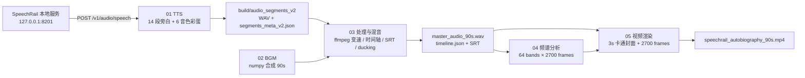

# 自传视频端到端示例

这个示例把 SpeechRail 的本地 TTS 能力接入一条完整的视频制作流水线：生成 14 段旁白与 6 个尾部音色片段、合成 90 秒赛博氛围 BGM、完成时间轴与 ducking 混音、提取 64-band 频谱，最后渲染 2700 帧 1080p 视频并用 `ffmpeg` 编码。视频开场使用保留真人神韵的高级卡通形象，以可视化的本地语音运行时讲述 SpeechRail 的自传。

## 流水线架构



## 前置条件

- macOS（渲染脚本使用系统中文字体路径），建议 Apple Silicon 环境。
- SpeechRail 已启动并监听 `http://127.0.0.1:8201`，且已配置 `uncle_fu`、`vivian`、`ryan` 等 TTS voice。
- 已安装 `ffmpeg`，并且 `ffmpeg`、`ffprobe` 都在 `PATH` 中。
- 已安装 `uv`；Makefile 会按步骤临时提供 `numpy`、`Pillow` 与 `qrcode`。
- 若 SpeechRail 启用了鉴权，请在运行前设置环境变量；脚本不会读取固定 `.env` 文件：

  ```bash
  export SPEECHRAIL_API_KEY="<your-api-key>"
  ```

## 运行

在 SpeechRail 仓库根目录执行：

```bash
cd examples/autobiography-video
make all
```

也可以逐步执行，以便检查每一步产物：

```bash
uv run --with pillow --with numpy python 01_generate_voiceover.py
uv run --with numpy python 02_generate_bgm.py
python3 03_process_audio_and_mix.py
uv run --with numpy python 04_analyze_waveform.py
uv run --with pillow --with numpy --with qrcode python 05_render_video.py
```

所有脚本都以自身所在目录为基准，将运行产物写入 `build/`；重新运行时会按音色与口播文本校验旁白缓存，只有内容未变时才复用 WAV 文件。

## 封面与动效设计

前 3 秒封面由代码精确绘制以下定稿文案：

```text
SPEECHRAIL / AUTOBIOGRAPHY
我叫 SpeechRail
生于本地，常驻你的 Mac
一条本地语音轨道
ASR · TTS · DIARIZATION
```

封面人物缩小至右侧，背景使用青色与琥珀色主环、两条信号轨道和克制的 36 个粒子节点；离子速度与亮度跟随 64-band 频谱变化，但粒子只承担空间层次，不抢正文信息。封面结束后通过约 1.2 秒的 signal-rail crossfade 进入正文，避免画面硬切；正式旁白结束后在约 81.2 秒通过 1 秒的单向 signal-rail wipe 进入两列式 GitHub 二维码页，并依次播放正文未使用的 `serena`、`dylan`、`eric`、`aiden`、`ono_anna`、`sohee` 六种音色，左侧实时高亮当前 voice 名称，右侧二维码保持可扫。

## 混音设计

旁白是全片主角：BGM 基准音量降到约 `0.14`，先用 `highpass=f=140` 与 `lowpass=f=7500` 收窄合成音的轰鸣和刺耳高频，再用 `sidechaincompress` 按旁白动态 ducking（`ratio=10`、快速 attack）。进入 Act 5 的音色展示段时，BGM 进一步降到约 `0.04`，让每次音色变化和 SpeechRail 的空间感更清楚。正式旁白只做有上限的轻微电平匹配，尾部短音色做较完整的电平匹配，避免不同 TTS 音色切换时突然变大或变小；母带按两遍 `loudnorm` 处理到约 `-16 LUFS`、`-1.5 dBTP`、`LRA 7 LU`，保留人的重音和停顿，不把正常表达压平。

## 产物清单

| 阶段 | 主要产物 | 说明 |
| --- | --- | --- |
| 01 | `build/audio_segments_v2/*.wav` | 14 段 SpeechRail TTS 旁白 |
| 01 | `build/segments_meta_v2.json` | 旁白文本、voice、路径与时长 |
| 01 | `build/audio_showcase_v1/*.wav`、`build/voice_showcase_meta_v1.json` | 尾部 6 种未在正文出现的音色片段 |
| 02 | `build/bgm_90s.wav` | 90 秒 numpy 合成 BGM |
| 03 | `build/audio_processed_v2/*.wav` | 变速后的旁白片段 |
| 03 | `build/timeline.json`、`build/speechrail_autobiography.srt` | 时间轴与字幕 |
| 03 | `build/voice_showcase_timeline.json` | 尾部音色彩蛋的实时展示时间轴 |
| 03 | `build/voiceover_90s.wav`、`build/master_audio_90s.wav` | 旁白、音色彩蛋总轨与 ducking 主混音 |
| 04 | `build/spectrum.npy` | 2700 帧 × 64 频谱数据 |
| 05 | `build/speechrail_autobiography_90s.mp4` | 1080p、90 秒最终视频，尾部含 GitHub 二维码页 |

封面阶段独立于正文 HUD：前 3 秒只绘制正式标题、卡通人物与科技光轨，不调用正文顶部居中 HUD、字幕或频谱层，因此不会把内部草稿/“内心 OS”泄露到画面顶部。封面文字由 `05_render_video.py` 精确绘制，`cover_art.jpg` 只提供卡通人物与电离子科技背景。

`build/` 及其中的音频、视频、频谱和 JSON 运行产物均不会提交到 Git；封面图 `cover_art.jpg` 是本示例唯一保留的二进制资源。

## 清理

```bash
make clean
```

`make clean` 只删除本示例的 `build/` 运行目录.
