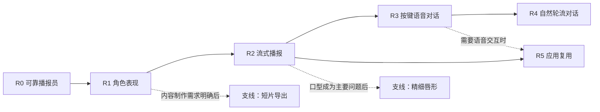

# 卡通数字人产品迭代路线图

让开发者从一个能说话的卡通角色开始，逐步学会把本地语音能力接入真实交互产品。

本示例面向本机使用者、语音应用开发者和产品演示者。核心体验依次是：**播报可靠、角色自然、响应及时、可以对话、方便复用**。SpeechRail 提供 ASR/TTS，示例承担人物、播放、麦克风和应用编排。

当前状态：**R0 首版示例代码已实现；本路线图不替代当前代码、README 和实际验收记录。** R1–R5 是后续候选迭代，不代表已经排期或授权实施。阶段编号是本示例的产品里程碑，与 SpeechRail 服务版本无关。

首版执行依据：[卡通数字人 Example 实施计划](../../docs/superpowers/plans/2026-09-06-cartoon-avatar.md)。本路线图描述后续演进；不扩大首版实施范围。

## 1. 路线总览

| 阶段 | 用户要完成的事 | 核心交付 | 进入下一阶段的门槛 |
|---|---|---|---|
| **R0 可靠播报员** | 输入一段话，让卡通人物说出来 | 原创 SVG 人物、音色选择、完整 WAV 播放、音量口型、停止和错误恢复 | 首版计划验收通过，建立真实体验基线 |
| **R1 有辨识度的角色** | 让人物符合自己的演示场景 | 少量角色外观预设、角色与音色绑定、表情和动作、朗读进度 | 形象稳定，用户能独立完成换角与播报，动作不干扰阅读 |
| **R2 及时响应的播报** | 少等一会儿，长一点的内容也能顺畅听 | 流式 TTS、连续 PCM 播放、有界缓冲、明确取消和断线恢复 | 相比 R0 首音等待显著降低，音频连续且停止可靠 |
| **R3 按键语音对话** | 按住说话，角色听懂后回答 | 麦克风输入、ASR、可编辑转写、外部 LLM 编排、TTS 回复 | 端到端回合可持续完成，识别错误可纠正，失败可回退 |
| **R4 自然轮流对话** | 无需每次按键，能打断角色继续说 | VAD、听说状态、用户插话、回声场景验证、回合取消 | 不自问自答，打断后无旧音频复活，失败时可回到按键模式 |
| **R5 可复用的数字人界面** | 把角色接入自己的应用 | 小型嵌入接口、宿主事件、角色资源规范、一个实际接入示例 | 第二个页面能复用同一核心，宿主卸载后资源全部释放 |

建议先完成 **R0 → R1 → R2**，形成一个完整、可展示、可复用的播报产品。随后根据真实用途选择 R3/R4 对话路线或 R5 接入路线；R5 不以完成自然对话为前提。

## 2. R0：可靠播报员——首版

**用户价值：** 本地输入文字即可看到人物发声，并能明确知道等待、播放、失败和停止分别意味着什么。

**必须交付：**

- 一个原创半身 SVG 角色，眨眼、轻微呼吸、随实际播放音量变化的嘴部动画。
- 文本输入、600 Unicode 码点限制、只选择当前 `available=true` 的音色。
- 完整 WAV 解码后播放；生成和播放状态分开，停止立即作用于本页面。
- 无可用音色、鉴权失败、服务未就绪和解码错误的恢复入口。
- 本地启动、中文 README、fake 测试、浏览器检查与真实服务 smoke。

**验收门槛：** 以首版详细计划为准；特别检查迟到响应不得重新播放、停止和结束时嘴部闭合、密钥不进入浏览器、音频不落盘。

**这一阶段要学到：** 用户是否能顺利完成首次播报；首先影响体验的是形象、等待时间、音质，还是操作流程。只记录问题类别和耗时摘要，不默认收集正文或音频。

## 3. R1：有辨识度的角色

**用户场景：** 产品介绍、开场欢迎、知识朗读，需要一个外观和声音保持一致的角色。

**本阶段范围：**

- 提供 2–3 个原创外观预设，通过 SVG 颜色、服装、发型和装饰形成区别，避免引入复杂资源编辑器。
- 角色选择同时选择一个期望 voice ID；每次加载都重新检查可用性。失效时让用户选择替代音色，不静默换声。
- 添加欢迎、微笑、强调、思考等有限动作；这里的“思考”只表示等待状态，不声称系统已有推理或情绪识别能力。
- 增加音频播放进度和全文展示。没有对齐数据时只显示音频时间进度，不做逐字高亮。
- 表情与声音控制分别呈现。视觉表情不等于模型支持情绪合成，不用 SpeechRail 忽略的 `instructions` 字段承诺声线或情绪控制。

**暂缓：** 任意图片上传、自动人物生成、声音克隆工作流、角色商店和角色账号。配置先随代码提供；保存个人偏好需要另行设计，并限制为非敏感字段。

**验收门槛：**

- 同一角色跨连续播报保持外观与 voice ID 一致；不可用音色有可见提示。
- 至少两位未参与实现的试用者按 README 独立完成选角和播报；若无法组织试用，则该项保持未验证。
- 桌面/窄屏、键盘操作和减少动态效果均可用，动作不会遮挡正文或造成布局跳动。

**投入判断：** 若用户认为首要问题是等待，R1 达到基本辨识度后即转向 R2，不持续扩充角色数量。

## 4. R2：及时响应的流式播报

**用户场景：** 朗读一段介绍或解释，用户希望角色更快开口，同时能随时停下。

**本阶段范围：**

- 接入现有 `/v1/realtime` TTS：创建文本 item，再触发 response，接收音频块。仍保留 R0 完整 WAV 模式作为可显式选择的回退路径。
- 用浏览器音频线程消费 PCM 队列，以采样时钟驱动播放和嘴部；设置队列上限、欠载状态和超时，不无限缓存。
- 停止同时清空本地音频队列并发送 `response.cancel`；把“本地已停”和“服务端取消已确认”分开处理。
- 用 response ID 和本地 generation 丢弃旧音频。断线后创建新 session，不自动恢复或重播中断内容。
- 先沿用首版 600 码点限制验证流式链路，达到门槛后再依据实测考虑扩展文本长度；不同时引入批量任务系统。

**技术依据与尚待验证：** 当前仓库契约声明输出为 24 kHz PCM16，支持 `response.audio.delta` 和取消终态；它们是协议依据，不是本示例已获得的低延迟保证。客户端不能把文本回显事件当作词级时间戳。浏览器可使用 AudioWorklet 执行独立音频线程处理，兼容性与安全上下文仍需在目标环境验证。[Realtime 契约](../../contracts/realtime-openai.md)、[MDN AudioWorklet](https://developer.mozilla.org/en-US/docs/Web/API/AudioWorklet)。

**验收门槛（提议目标，非当前实测）：**

- 同机、同档位、同 voice、同一组 100–300 码点文本，热态各做至少 30 次，首个可听输出延迟中位数较 R0 降低至少 30%；同时报告 P95、失败次数及测量方法。
- 30 次生成中停止/播放中停止/重新播报组合测试，无旧 response 重播、串音或无法结束的播放状态。
- 本地停止至静音的 P95 目标不超过 200 ms；实际扬声器输出与软件队列时间分别记录，不能仅凭清空数组声称达标。
- 完成 10 分钟连续交互压力场景，音频缓冲保持有界，无重复节点累积、可察觉爆音或持续卡顿；欠载次数和恢复行为另行记录。

**不达标时：** 保留 WAV 模式，先定位生成、传输、缓冲或浏览器播放的瓶颈；不通过增加模型进程追求吞吐。

## 5. R3：按键语音对话

**用户场景：** 用户按键说一句，确认识别内容后，人物用语音回答。先建立可靠的单回合和多回合交互。

**本阶段范围：**

- 用户主动开启麦克风；显示录音状态和结束入口。采用按住说话或点击开始/结束，播放期间默认关闭采集。
- ASR 转写显示在页面，可编辑后提交；只用终态转写触发一次回答，partial 不重复触发 LLM。
- 通过用户明确配置的外部 LLM 接口生成回答，由示例代理/宿主应用维护会话上下文，再交给 SpeechRail TTS。
- 提供停止回答、清空本次会话、改用文字输入；会话默认仅驻留内存。
- LLM 未配置时仍可使用播报，并提供明确标记的“识别后复述”测试模式；复述不作为智能对话能力宣传。

**关键边界：** SpeechRail 不提供 LLM 推理或对话历史，不能直接向其 `/v1/realtime` 发送用户问题并期待语义回答。ASR 输入按契约转换为 16 kHz mono PCM16；不得仅把音频采样率字段改成 16000。具体采用单会话切换还是受控分工会话，在本阶段设计时验证，遵守共享 worker 的模式和资源约束。[Realtime 契约](../../contracts/realtime-openai.md)。

外部 LLM 在本阶段才引入；默认本地优先，连接远端需要明确配置与数据流说明，不能把密钥下发前端或默认发送聊天历史。麦克风权限与安全上下文属于浏览器的真实前置条件，拒绝权限后应保留文字模式。[MDN getUserMedia](https://developer.mozilla.org/en-US/docs/Web/API/MediaDevices/getUserMedia)。

**验收门槛：**

- 使用固定非敏感测试脚本完成 20 个连续回合，正确关联“这一轮输入—这一轮回答—这一轮音频”；无重复回复或上一轮音频混入。
- 覆盖识别失败、空转写、LLM 超时、TTS 不可用、拒绝麦克风权限；都可以恢复或回到文字模式。
- 停止会话后麦克风 track 已停止、页面录音指示熄灭，上下文已清空；不自动持久化聊天内容。
- 分别记录 ASR 终态等待、LLM 首个可用回复片段、TTS 首音和整轮等待；先建立基线，再为本机所选 LLM 设定体验目标，不把模型延迟全归因于 SpeechRail。

**进入 R4 的条件：** 真实使用反馈证明按键是主要交互障碍，且 R3 在短句、长停顿及错误恢复场景已经稳定。

## 6. R4：自然轮流对话与打断

**用户场景：** 用户与数字人自然轮流讲话，发现答非所问时能直接插话。

**本阶段范围：**

- 从按键升级到可选 VAD 模式，展示倾听、识别、准备回答、播报四个可理解状态。
- 侦测到用户插话后先停止本地播放，再终止旧回合的 LLM/TTS 交付；晚到文本和音频不得进入新回合。
- 基于耳机和扬声器两类场景验证回声处理、误触发、背景噪声、短促应答和长停顿。
- 页面切到后台、设备断开、网络中断时暂停交互并提示恢复；持续保留按键模式。

**关键依赖：** 当前契约的 `server_vad` 可发出 speech_started/speech_stopped，并在同一会话内触发 TTS 打断；它不替客户端停止扬声器，也不取消外部 LLM。若 ASR/TTS 分属不同会话，必须由应用协调跨会话取消，不能假设服务自动完成。[Realtime 契约](../../contracts/realtime-openai.md)。

**验收门槛（提议目标）：**

- 每类设备场景分别验证至少 20 次插话：收到有效 speech_started 或本地确认的插话信号后，本地停止声音 P95 不超过 200 ms；语音起点到检测事件的延迟另行报告。
- 在至少 10 分钟扬声器正常播报场景中，没有由角色自身声音持续触发的自问自答；记录误触发和漏检次数，不能只展示一次成功打断。
- 一次用户发言最多触发一个有效回答；取消确认超时、旧任务继续计算时也不能把过期结果交付给用户。
- 耳机场景与扬声器场景分别给出通过/未通过结论。扬声器未达标时，不将自然对话设为默认，继续提供耳机或按键模式。

**投入判断：** R4 属于高风险体验迭代。若回声、误触发或资源冲突仍是主要问题，暂停添加更多对话功能，优先保证 R3 可用。

## 7. R5：可复用的数字人界面

**用户场景：** 开发者把同一个角色接到产品介绍页、知识问答页或既有 Agent 的输出中。

**本阶段范围：**

- 在已有模块基础上整理小型接口，例如挂载/销毁、播报/停止、切换角色和状态事件；只抽取真实复用点。
- 人物渲染、音频控制和传输适配分离，宿主可以提供现有 TTS 或 LLM 流程。
- 定义受控角色资源格式及降级行为：缺少某动作仍能显示静态人物并正常播报。优先可信、随包提供的资源，不直接执行任意上传 SVG 或脚本。
- 提供一个独立宿主页接入样例；文档说明职责、取消语义、资源释放和浏览器限制。

**验收门槛：** 第二个页面无需复制播放器和人物核心即可接入；重复挂载/销毁 20 次后没有残留音频节点、事件监听或麦克风占用；宿主已有服务与语音流程可继续使用。

**产品边界：** 保持为可读、可运行的示例。只有出现至少两个实际复用场景、明确维护者和兼容性需求后，再决定是否拆出独立组件包；不默认发布 npm 包、搭建托管平台或改造 SpeechRail 服务架构。

## 8. 按需求选择的支线

| 支线 | 何时值得做 | 最小验证 | 进入产品前的条件 |
|---|---|---|---|
| 短片导出 | 用户主要制作介绍片、课程开场等内容 | 用固定短句导出 30 秒人物与语音片段 | 音画同步、取消与失败清理可验证；用户主动选择导出，产物写仓库外；单独批准文件持久化范围 |
| 更精细的唇形 | R2 已流畅，用户仍明确指出嘴型不自然 | 对相同 10 条短句比较音量口型与对齐驱动口型 | 对齐时间戳和音频时基可靠；新增模型/依赖的成本可接受，不把文本长度推算伪装成音素对齐 |
| Live2D / 3D 形象 | 用户需要转头、复杂肢体或已有可用角色资产 | 单角色完成待机、播报、停止三状态 | 素材与运行库来源/使用范围明确，目标设备性能与回退方案通过验证；立项时再选运行库 |
| 场景脚本 | 演示必须控制多段内容和动作顺序 | 三段文本顺序播报，中途停止可恢复到明确位置 | 重用现有播放/取消机制；不演变成通用时间轴编辑器 |

支线不阻塞主线，不能在首版顺手加入。新增文件存储、模型下载或外部服务连接，均在对应支线立项时确定范围。

## 9. 统一衡量方式

以下是研发验收与小规模试用指标，不建设遥测平台、不默认上传数据。

| 维度 | 定义 | 使用阶段 |
|---|---|---|
| 首次播报完成 | 已具备服务前置条件的试用者按 README 完成选音色和一次可听播报 | R0–R1 |
| 首音等待 | 用户提交到首个可听音频；软件调度时间只作代理指标，注明测量方式 | R0、R2、R3 |
| 停止生效 | 用户点击停止/有效插话事件到输出静音；与后端取消确认耗时分开 | 全阶段 |
| 回合完成率 | 固定测试集中完成有效输入、回答、播报闭环的回合数 / 总尝试数 | R3–R4 |
| 音频连续性 | 欠载次数、爆音/卡顿观察、最大队列占用、连续运行后资源变化 | R2 以后 |
| 恢复能力 | 指定错误发生后能否继续使用，无需刷新或重启服务 | 全阶段 |
| 接入成本 | 第二个页面接入所需步骤、复制代码量及无法复用的原因 | R5 |

每次比较记录测试日期、示例提交、SpeechRail 版本、浏览器版本、所选档位/voice ID、冷态或热态、样本数及失败数。冷启动与热态分开，队列等待与推理时间能区分时分别记录；不能跨设备或跨档位直接宣称性能提升。30 次样本仅用于阶段决策，不是生产可靠性保证。

## 10. 范围与推进规则

- 每一阶段先复盘前一阶段的真实反馈，再写该阶段详细实施计划；用户确认范围后执行，不把路线图当作所有未来写操作的授权。
- R0 的服务无改动、正文和音频不持久化等约束继续有效。R2 新增 WebSocket 代理，R3 新增麦克风/LLM，导出支线新增文件产物，都应在阶段设计中明确新增边界。
- 档位与权重能力对调用方透明，角色不硬编码本机模型路径；不通过增加 SpeechRail 实例或 worker 解决交互问题。
- 用户数据、原始音频、完整转写与密钥不进入日志或验收报告；运行态结论以当次实测为准。
- 不给尚未验证的阶段承诺日期。R0 验收后才估算 R1/R2 工作量；R3/R4 必须计入外部 LLM、音频设备和浏览器验证成本。
- 每阶段保留上一个可用交互模式：R2 可回到 WAV，R3 可回到文字，R4 可回到按键，R5 宿主卸载可回到独立页面。

## 11. 依据与当前待验证项

仓库依据核对时间为 2026-09-06：[首版计划](../../docs/superpowers/plans/2026-09-06-cartoon-avatar.md)、[公共 REST 契约](../../contracts/openapi.yaml)、[Realtime 契约](../../contracts/realtime-openai.md)、[项目边界](../../AGENTS.md)。旧文档中的客户端“就绪”标记不能代替本示例验收；本路线图不据此承诺当前运行状态。

当前待验证：首版形象与真实播报体验、可用音色、浏览器兼容性、流式收益、ASR/LLM/TTS 端到端延迟、扬声器回声场景、实际嵌入需求。上述阶段门槛均为拟定验收条件，尚无通过结果。
